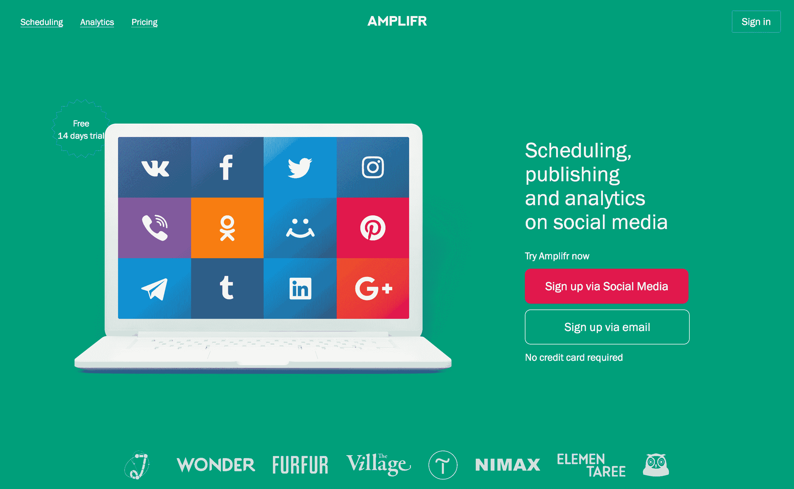
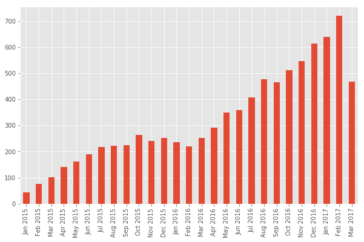
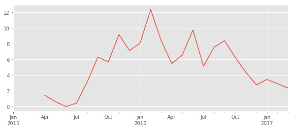
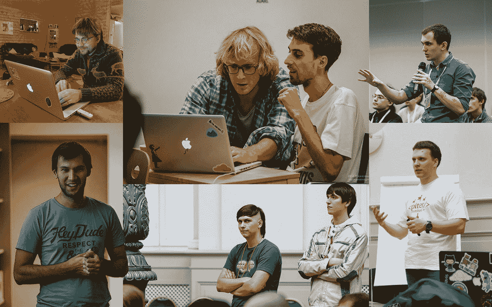

# 将我的咨询收入转化为每月 16，000 美元的产品

> 原文：<https://www.indiehackers.com/interview/turning-my-consulting-revenue-into-a-16-000-mo-product-b802261cda>

## 你好！你的背景是什么，你在做什么？

嘿，我是内特。我大约 14 岁的时候开始编写代码，当时有一个小型的 3D 建模项目:一个教育套件，教孩子们几何和 3D 思维。我后来成为了一名 web 开发人员，并在 20 岁左右开始深入研究产品。

现在我在做 [Amplifr](https://amplifr.com) ，我帮助网站开发店[邪恶火星人](https://evl.ms)。

Amplifr 是一个面向初创公司、广告/数字机构、小公司和媒体项目的发布和分析平台。它帮助公司计划和衡量他们的社会媒体工作的投资回报率(每次发布的转换和流量分析)。

Amplifr 由来自 4 个城市和 3 个不同时区的 5 名远程工作人员运营，客户来自超过 41 个国家。我们每月从 688 个客户那里获得 16.5 万美元的经常性收入(MRR)，每个用户的平均收入约为 24 美元(ARPU)。

这不仅仅是一个人的兼职项目，更像是一家公司尝试新角色和新定位的兼职项目:推出我们自己的产品，而不是帮助其他公司推出他们的产品。

 

## 是什么促使你开始使用 Amplifr？

六年前的 2 月 28 日，我 23 岁生日那天，我加入了[邪恶火星人](https://evl.ms)。我们为初创公司和成熟公司做网络和移动产品开发，比如 OnboardIQ (YC15)、易贝、GETT、Groupon Russia 等。

每个开发店都想打造自己的产品。否则，你的收入来源会被你的客户数量和你的时薪所限制。真扫兴。

所以我们同意由我负责产品部门和总体业务开发。从 2012 年到 2016 年，我们尝试了 4 个不同的项目。Amplifr 是我的第三个项目，它成功了。

到 2014 年底，我们有了一个 Shopify+Mailchimp+CRM 工具的混合体，我们无法为其建立销售流程。我们当时称之为 Amplifr，但现在我们称之为 Amplifr-Legacy。

我逐字注释掉(隐藏)了 95%的侧边栏菜单项，只留下了“社交媒体”项。然后我为它组装了一个简单的登陆页面，一周后它就起飞了。

如果他们付钱，建立功能。如果没有，就不要构建这个特性。没用的。

TweetShare

当我们看到它起作用时，我们就把其他事情都抛开，重新专注于自己。我们修改了用户界面，改进了试用漏斗，并开始测试社交媒体自动化工具的营销。

## 是什么让这款产品准备上市的？

关于我们的发布，有许多事情从一开始就非常重要:

1.  **我们不是风险投资，而是一家生活方式企业。也许几年后我们会卖掉它，但我不认为我们想要那样。我们不能进行收购(火星人不是那样出售的)，作为一个团队，我作为一名首席执行官，有太多的事情需要学习和做。**

2.  我们邪恶的火星人+ [Amplifr](https://amplifr.com) 的设置意味着我们没有常规的创业跑道，但我们有一条现成的跑道:来自我们咨询业务的几乎无限的时间和金钱。这种差异是我们试图保持意识的，所以我们不会[陷入沉没成本谬论](http://www.vanschneider.com/victims-of-the-sunk-cost-fallacy/)。

3.  在我们从事 Amplifr 的工作期间，我们的核心团队拥有稳定的薪水。我们稍微调整了一下我们的生活方式，但这并不要求我们完全承受风险。如果我们失败了，也没关系。我们总是可以尝试别的事情，或者和邪恶的火星人一起做一个客户项目。

就同时为火星人和 [Amplifr](https://amplifr.com) 工作而言，事情相当简单:我刚刚从火星人业务发展部休了半年假。我想你可以说我是一名常驻的研发/企业家。火星人也帮助了发展。

因为我们是从一个不同的(失败的)产品开始的，我们从第一天开始就在生产。但是，我们确实移除了传统部件，并改进了新产品的试用漏斗。我们还添加了一些零件。我得说最初的开发阶段花了大约半年时间。

## 你的技术是什么？

在我们的第一个版本中，它只是一个裸机服务器上的 Rails + Postgres。我认为，前端是 backbone.js 和一个俄罗斯支付处理平台(我们位于俄罗斯莫斯科)。

后来，我们用 React 重写了前端(抱歉， [Pieter](https://twitter.com/levelsio) )。后端仍然是 Rails 和 Postgres，但现在它有一个用于数据存储的 Cassandra 集群，3 台机器上有一个 Kubernetes 集群，天知道有多少容器在运行。

## 你用了什么策略来吸引用户和增加 Amplifr？

我认为最初的用户来自我用信用卡支付的脸书广告。这是一项实验，当时在俄罗斯相当便宜。

我们[于 2016 年 4 月推出产品搜索](https://blog.amplifr.com/en/amplifr-on-producthunt/)。(我们正在为 3 月或 4 月的 2.0 发布做准备！如果你想知道进展如何，请在 Twitter 上关注我们。)两天之内，我们有大约 8000 人访问了我们的网站，大约 600 人注册，还有一些付费用户。有很多人和我们谈过:风投，其他想要 API 的公司，等等。

一定要进行产品搜索，但要做对。看看[我们写了什么关于我们的经历](https://blog.amplifr.com/en/amplifr-on-producthunt/)。

我们目前正在不同的市场开发不同的用户获取渠道。我们做内容营销(博客、时事通讯、客座博文)、社交和搜索上的付费广告、实验项目、赠品、投稿等等。

早期关注收入和营销，将产品质量作为营销工具来获得收入。

TweetShare

两个不同的语言市场表现非常不同，因此我们测试了三个市场:俄罗斯、欧洲(英语不太饱和)和美国。就营销而言，欧洲比美国便宜得多，在我们所处的位置，美国相当拥挤。考虑一下这个:

俄语/欧洲版本:

*   在所有获取渠道中，试用到付费的转化率约为 3%。
*   Adwords 搜索广告和网络广告效果很好——我们花 1 美元就能注册。
*   脸书广告在 2015 年末变得过于昂贵，但我认为我们也可以让它们发挥作用。
*   我们的博客每月有大约 28k 次会话。每篇文章的注册率约为 2%。
*   时事通讯有大约 2 万人，点击率 3%。转换还可以。
*   Quora 广告的注册费用为 3-4 美元。

美国版本:

*   从试用到支付的比例约为 5%,改进工作要少得多。我们还可以做很多事情来克服这一点。
*   Adwords:每次注册 5 美元。
*   脸书广告:太贵了。
*   博客:嗯，上周我们有大约 135 人在:D
*   简讯:约 1500 人，又名不存在。
*   Quora 广告:每次注册 8 美元。
*   客座博文:比俄罗斯更有潜力。

总体而言，我们 90%的收入仍来自俄罗斯和东欧国家。但我们看到我们的客户来自付费广告，这很好。

客户数量在 2016 年大幅增长。

客户增长与较低的流失率相一致。

我认为，美国市场上各种各样的 SaaS 已经超饱和了。要获得用户，获得发表客座博文的机会，以及做其他任何事情，你必须有一个故事。美国市场和旧金山湾区渴望故事，并且已经厌倦了另一个 Twitter-Bootstrap-SaaS。

我感到自豪的一点是，我们的内容营销团队是盈利的，即使你只统计我们在文章发表后的第一个月从文章中获得的注册人数，而不包括 SEO 流量等。

付费广告速度快，所以我们首先在美国市场进行测试。然后我们会发布客座博文，然后我们会为我们的博客和时事通讯增加吸引力。

我绝对相信这些广告会起作用。是的，我们在一个超级拥挤的市场。但是我们有自己的观点和声音。营销应该是可量化的。你不测量的一切都不存在。真实的社交媒体营销(SMM)是可能的，而 [Amplifr](https://amplifr.com) 将向你展示如何做到这一点。

如果我们从上面剥离一切，一个建议是:快速构建和发布，然后使用快速付费获取渠道来测试你的产品转换，并决定从那里做什么。这要烧 500 美元，但是会给你数据。

即使浪费一周时间做错事也比 500 美元要昂贵得多。

## 你的商业模式是如何运作的？你的营收背后有什么故事？

我们是 SaaS，订阅 ARPU 24 美元。我认为这不是很好，我们正在努力增加它。

我们按连接的社交媒体账户收费，越大的代理/媒体价格越高。我们为大公司增加了按席位定价(5 个以上席位:每个额外经理 5 美元)和导入频道(每 RSS /秒后导入 feed 美元)。

这里有一些从一开始就给任何人的简单建议:*加倍。的。价格。*

我们还有一个代理高级包——一个 500 美元/月的仪表板，为广告代理及其客户量身定制，按年计费。几个月后我会告诉你这是否可行。

我们必须使用至少两个支付处理网关(Stripe 和 Cloudpayments.ru ),因为我们在两个市场上运行。俄罗斯处理有时无法收取美国发行的信用卡。(此外，在₽向人收费似乎有点奇怪。考虑在你的银行对账单上看到`1200 ₽ AMPLIFR.COM`。

建立一家透明公司的决定很难做出。

TweetShare

我们 2 月份的收入为 16，500 美元，使我们过去 30 天的收入达到约 17，800 美元。我不能说它长得很快。没有曲棍球棒:

| 月 | 收入 |
| --- | --- |
| 一月 | 2876 |
| 二月（February 的缩写） | 3574 |
| 瑕疵 | 3730 |
| 四月 | 4242 |
| 五月 | 4440 |
| 六月 | 5158 |
| 七月 | 5649 |
| 八月 | 6251 |
| 九月 | 6657 |
| 十月 | 7042 |
| 十一月 | 6890 |
| 十二月 | 7383 |
| 一月 | 7372 |
| 二月（February 的缩写） | 7167 |
| 瑕疵 | 7747 |
| 四月 | 8344 |
| 五月 | 9590 |
| 六月 | 9566 |
| 七月 | 10130 |
| 八月 | 10853 |
| 九月 | 10847 |
| 十月 | 11559 |
| 十一月 | 12048 |
| 十二月 | 13554 |
| 一月 | 13967 |
| 二月（February 的缩写） | 16501 |
| (三月) | 18698 |

就 MRR 而言，哪些对我们有用，哪些没用:

1.  没有预先的研究和售前，新功能几乎永远不会起作用。分析、起草(勾画特征)、细分可能从中受益的用户或潜在客户，并要求预付款。如果他们付钱，建立功能。如果没有，就不要构建这个特性。没用的。
2.  针对博客读者和付费用户的单独时事通讯非常有效。

## 你未来的目标是什么？

以下是我们的 3 个月目标:

*   击中了两万四千美元的 MRR。
*   对于我们在美国的扩张，我们希望从美国获得 100 个客户，在我们能够做到的任何地方推出 2.0 版，并且每周增加 300 个注册。
*   对于我们在俄罗斯的扩张，我们想雇用一名销售人员向机构和企业销售，并雇用另一名客户支持者；-)

我认为许多创始人都存在的另一个问题是招聘和授权太慢。

TweetShare

以下是我们的 6 个月目标:

*   计算出一个产品能产生 500 美元的 ARPU，而不是 25 美元。它可能是我们正在开发的广告代理模式，但我们现在只是在测试它。
*   部署我们基于 ML 的预测引擎，并通过订阅模式单独销售。

## 你面临的最大挑战是什么？

在很长一段时间里，Amplifr 的增长一直相当缓慢。其他人创办风投支持的公司，其他人吹嘘他们在脸书的成功，而我们却行动迟缓，这种感觉让我抓狂。

你知道，那种“哦，我们做得很好”的创业行为掩盖了一个简单的事实，即大多数创业公司都悲惨地失败了，但没有谈论它，也没有谈论它对创始人、他们的健康、情绪状况、计划等的影响。

建立一家透明公司的决定很难做出。

我认为许多创始人都存在的另一个问题是招聘和授权太慢，当事情不正常时解雇又太慢。

这些挑战迫使我承诺在公司内部和公众面前彻底透明化。我们承诺，我们的工资将接受整个团队、我们的目标和关键结果(OKRs)等的月度审查。

[

邪恶火星人队。](https://evl.ms) 

## 你最大的优势是什么？有什么特别有用的吗？

我们最大的优势是我们的公司结构、我们的组建方式和我们的工作方式。我们是邪恶的火星人家庭。我们是公司内部的企业家学校。我们是研发部门。这有好有坏，但由于我们没有进入风投的梦想，我们对此感觉很好。

我们不得不采取一些对策，不要陷入沉没成本谬论，不要仅仅因为我们拥有“无限”的开发资源就超支。

我认为大多数开发公司作为产品公司是失败的，因为他们认为，“嘿，我这个月有 3 个可用的开发产品卖不出去。我们来打造一个产品吧！”他们把它们扔给一些他们不知道如何营销或销售的产品创意。然后他们花了几个月的时间，它失败了。

没有人愿意为该公司所谓的“产品”付费，但实际上这是 3 个没有良好产品管理或营销的开发者的爱好。

## 对于刚刚起步的独立黑客，你有什么建议？

有了想法后，立即推出收费的东西(即使那只是一个连接到 Stripe 的字体),并开始营销。

通过花费 500 美元并跟踪每次点击成本(CPC)、转换百分比、客户获取成本(CAC)和收入来测试营销渠道。你会从你做的每个测试中获得产品和营销改进的想法。500 美元很便宜。比再花一周时间开发一个没人会用的产品便宜多了。:D

我犯了一个错误，没有接受这个建议，我花了超过 15 万美元。

一个很好的思维练习是，想象你花了一年时间打造了一个好产品，一年后你将开始营销。如果你在一年中只做“免费”营销，比如博客或客座博文，一年的开发成本是多少？

现在想象一下，如果你在第二个月花 3000 美元做广告会发生什么——那时你的产品是一个粗略的 MVP。是的，你会在广告上赔钱，而且你只有几个付费客户。你还会了解到你的产品到底吸引了什么，转换方式，你可以专注于这些领域。

我想说的是，为开发而不是为广告付费，远比早期为广告付费并节省开发成本更浪费。我不是说制造低质量的产品并销售出去。我的意思是尽早关注收入和营销，并把产品质量作为一种营销工具来获得收入。

## 有哪些事情启发了你？

我推荐三本书:

1.  一定要去读蒂姆·费里斯的《泰坦的工具》。这是对蒂姆的播客嘉宾的一系列简短采访，这些嘉宾是有创造力的人或企业主等。它让你从一个章节中抓住动机和建议，并立即应用到你的情况中。我已经根据这本书的建议改变了我的晨间作息，这影响了我同一周的表现。< 3
2.  读一读英特尔的安迪·格罗夫的《T2》和本·霍洛维茨的《关于难的事情的难的事情》。第一本教你如何以一种非常简单的方式经营一家任何规模的公司，第二本与第一本紧密相连——这是我见过的关于商业和创业的最新颖的书。我绝对喜欢它，当你想放弃的时候，它让你留在那里，在循环中，为你的公司而战。
3.  当呼吸变成空气时，保罗·卡兰尼蒂:去读吧。这是一部短小、优美、意味深长、感人至深的小说。它改变了我对一切的看法。我的家庭，我的公司，还有我自己。

## 我们可以去哪里了解更多？

*   [twitter.com/amplifr](https://twitter.com/amplifr)
*   [facebook.com/amplifr](https://facebook.com/amplifr)
*   [blog.amplifr.com/en/](https://blog.amplifr.com/en/)——我们将在博客时事通讯上分享更多类似的文章，欢迎加入。
*   [amplifr.com](https://amplifr.com)——如果你的公司有社交媒体简介，请一定要试试 Amplifr。这是唯一一个平台，它能准确地告诉你，你计划在你的社交媒体账户上发布的内容在每篇帖子的基础上有多少转换。

我个人在[twitter.com/xnutsive](https://twitter.com/xnutsive)。关于 Amplifr，你可以随意提问——我很乐意在 Twitter 或另一篇文章中回答和阐述。

—[<picture id="ember8045455" class="user-avatar ember-view user-link__avatar"></picture>xnut sive](/xnutsive?id=fEW36RubvuMBsCG1co4eg7oQnNp1)，Amplifr 的创建者

## 想像 Amplifr 一样建立自己的事业？

你应该加入[独立黑客社区](/)！🤗

我们是几千名创始人，互相帮助建立有利可图的业务和副业。来分享你正在做的事情，并从你的同事那里获得反馈。

还没准备好开始使用你的产品吗？没问题。这个社区是一个认识人、学习和实践的好地方。随便去[随便浏览](/)！

——[<picture id="ember8045460" class="user-avatar ember-view user-link__avatar"></picture>考特兰艾伦](/csallen?id=ibTLPyjwVebnZjMGKvz6ztarnuV2)，独立黑客创始人

4votes