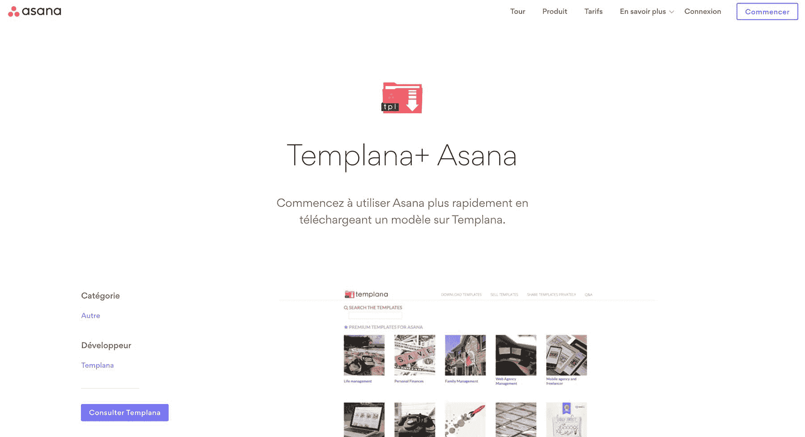
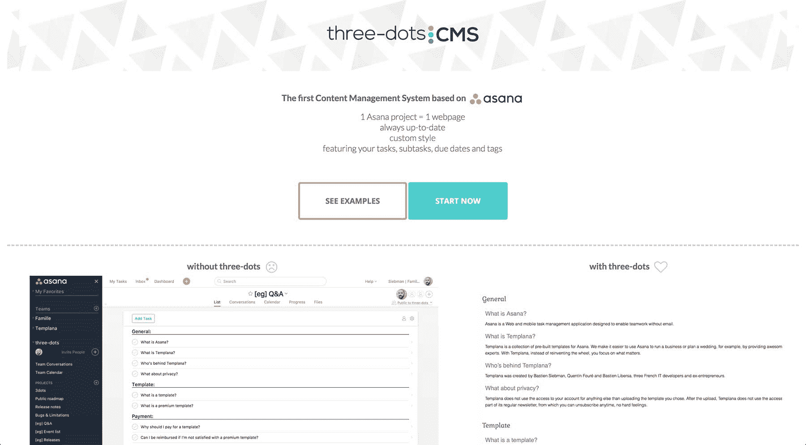

# 将我在 Asana 方面的专业知识转化为有利可图的副业

> 原文：<https://www.indiehackers.com/interview/turning-my-expertise-with-asana-into-a-profitable-side-business-2d81c0cedf>

## 你好！你的背景是什么，你在做什么？

我叫巴斯汀·西伯曼。我住在法国靠近瑞士的山区。我已婚，是两个孩子的父亲。在计算机科学的工程学校毕业后，我创建了我的第一个创业公司，最终失败了，并转向了网络和移动代理。在被新老板录用并为其工作后，我加入了一个由 20 人组成的团队，我们共同创建了一个新的 SaaS，名为 [Whoz](https://whoz.com) 。

四年前，我发现了管理我日常工作的软件 [Asana](https://asana.com) 。一个副业项目引发了另一个副业项目，然后写了一本电子书，第二本，成立了一个微型孵化器，一些咨询和培训……然后 [Asana 超级英雄](http://asana-superheroes.com)诞生了，一个将我所有围绕 Asana 的活动集中在一起的品牌。

如今，Asana Superheroes 代表着 1500 多种数字产品和 200 本售出的书籍，100 万的页面浏览量，日益增长的声誉，以及每月约 800 美元的收入。

 

## 是什么促使你开始接触 Asana 超级英雄？

当我第一次创业时，我深深地沉浸在创业的世界中，阅读大量的书籍和博客，追随有影响力的人。我充满了希望和动力。我还需要提到的是，作为一名 web 开发人员，将任何网站拼凑起来，将一个想法变成现实是相当容易的。这就是我如何结束我的第一个项目的原型: [Templana](https://templana.com/) 。

我们的小型创业公司/机构使用 Asana 来管理客户、账单、想法…我们最终有了一个相当不错的工作流程。我想，“为什么不和其他 Asana 用户分享这个呢？”所以我创建了一个原型，Asana 用户可以使用他们的帐户登录，我会将我的“工作流”加载到他们的工作区。我们谁也不相信有人会为这样的服务付钱。“什么鬼东西！让我们试一试。”我们全职工作，但也花了几个小时在这个项目上。

偶尔做些事情，不要只是阅读关于做事情的文章。

TweetShare

我不断迭代，改进网站，增加其他工作流程(我们称之为模板)。用户开始进来。有一些人在推特上写道，“爱，爱，爱你正在做的事情，”然后 Asana 的联合创始人之一达斯汀·莫斯科维茨(他也是脸书的联合创始人)在推特上写了我们。很快我就和一位 Asana 的员工通过 Skype 电话讨论了这个项目，然后是另一个…

这一切都始于第一个项目。我试图用教练模板创建一个衍生产品，但没有成功。我也试图建立一个关于 Asana 的新闻网站，但是它需要太多的时间来维护，所以最终停止了。我也有机会接手一本现有的关于体式的电子书。我更新了它，推出了它的[第二版，作为我自己的](https://gumroad.com/l/dbwa)。而几个月后，我有了从头开始写自己的电子书的动力。[这本书](https://medium.com/asana-superheroes/become-an-asana-superhero-cape-not-included-3c3059e648b9)于 2018 年初发行。

## 构建最初的产品需要什么？

我的第一个产品的第一个版本相当简单。我在网上买了一个 WordPress 模板，在我以前的同事(他仍然在 sysadmin 方面提供很多帮助)设置的服务器上安装了 WordPress，并一起编写了一些 PHP。我的第二个同事参与了设计并制作了一个标志。几天后，第一版就完成了。随着时间的推移，我不断添加一些功能。流量和销售额在慢慢增加。

我们非常“用户驱动”。任何人都可以要求一个特性，如果我们认为它有用，它实际上可以马上被构建出来。例如，一个用户要求一个模板预览，并且能够在上面留下评论。我们在几个小时内就完成了。

从那以后，我就一直这样做我所有的项目。我有一个非常诚实的公开路线图，包括“完成”、“即将到来”、“可能很快到来”、“让我们拭目以待”和“不会发生”等类别。我不想让人们相信我在全职工作，我讨厌撒谎。因此，如果我认为一个想法是多余的，我就把它储存在“没有发生”里任何人都可以通过给我发邮件来影响路线图。真的，如果你想要一个 X 或 Y 的特性，并且它相当简单，而我发现自己在家无事可做，我会马上去做。

时间一直是最宝贵的东西。几个月前，当我把笔记本电脑从一个 Mac OS 版本升级到下一个版本时，我的本地服务器坏了。所以我不能在本地工作的网站。我试着修了两个小时，然后我觉得不值得。我在生产中直接编码了几个星期，直到我以前的合作伙伴帮我理清头绪。我的时间就是这么重要。

当时间如此宝贵时，你需要优化它。我在上班前、午餐前后、下班后，有时在晚上或周末，以及家人午睡时一直在工作。有时一连几天都没有。平均来说，我每周做 0 到 10 个小时的兼职项目。我很少一次花一个多小时在上面——我做的每件事都被分解成小块。

此外，几个月前，我意识到我的工作包含可以委托的任务，如*创建内容*、*回复电子邮件*、*研究*……所以我在[上发布了一则广告，我们是虚拟助理](http://wearevirtualassistants.com)，一位名叫梅根的助理是第二个回答的人。几乎立刻就见效了，她现在每月帮我 10 个小时。这是一个真正的游戏改变者，因为它让我有动力去除我不喜欢的任务，给我时间和家人在一起或做其他重要的任务。

## 你是如何吸引用户并成长为 Asana 超级英雄的？

我不记得细节了，但我认为我对 Templana 原型的想法实际上是由某人在 Quora 上发布的关于他的特定需求的帖子证实的。现在这看起来很疯狂，但在当时这是唯一一个谈论体式并提供问题和答案的地方。

我用了一段时间 Quora 社区来验证新想法和分享新闻。然后我去了非官方的 Asana 谷歌小组，然后去了去年推出的官方 Asana 社区。

如果你不说你做了什么，没人会说的。

TweetShare

这是坦普拉那过去三个月的流量来源:

*   直接:45%
*   谷歌:43%
*   转诊:10%
*   社交:2%

我的大部分新流量来自谷歌。我发现很难接触到普通人。即使有官方社区，你也不能向每个人兜售你的产品和服务。人们进来问一个特定的问题或阅读一个特定的答案；他们不会停留在阅读每一个帖子。

所以我保持活跃(我是全球前 10 名活跃用户之一)并回答许多问题，其中一些问题有时会引出我的一个项目，但主要是建立声誉和学习！在加入社区之前，我不知道自己的专业水平如何，也不知道自己是否真的能帮助别人。现在我知道我肯定能帮上忙，而且我正在考虑有一天建立一家咨询公司！

 

我们试图使用谷歌 AdWords，但他们拒绝了我们的广告，因为它包括品牌“Asana”。其他品牌名称是禁止的，除非他们给谷歌具体协议。显然，如果你继续努力，你可能会得到一些广告。我认为我们试图创造没有“体式”这个词的广告，但是你可以想象它并不顺利。当你以低至 2 美元的价格出售模板时，你最终总是会赔钱，所以 AdWords 当时可能不是我们的好对手。

感谢我的各种项目和 Templana 最重要的是，我有大约 15k Asana 用户的电子邮件地址，我可以把内容推给他们。这让我能够提高我创造的任何新产品或服务的吸引力。但是互动仍然非常少。通过电子邮件向 15k 人问一个问题，最多只能得到 10 个答案，这通常是因为只有一部分人收到了邮件，一小部分人真正阅读了邮件，只有一小部分*认为*会花时间来回答。

我最近放弃了花哨的电子邮件，转而使用黑白文本邮件。第一封邮件的转换率飙升，之后又回落到正常数字。但是，来自世界另一端的陌生人给你回信，告诉你他是多么喜欢你的工作，这总是令人惊奇的。它总是让我如此兴奋。

我知道获得牵引力的最好方法之一是创造内容，比如经常写博客。我就是不能。我不能承诺这样的事。我可以承诺写一本 100 页的书，最多工作几个星期。但是不经常写。例如，我不知道如何找到写下每一个新特性的动机。然而，出版书籍是展示你的专业知识和获得第一批客户的好方法。但请记住，书籍本身是一个附带项目，你需要选择价格，吸引客户…

## 你的商业模式是什么，你是如何增加收入的？

我的“品牌”由各种项目组成，因此我的商业模式由几个渠道组成:我出售书籍、模板(要么作为作者，要么与实际作者分享收入)、客户可以与自己的用户分享模板的私人版块、与其他顾问和内容创作者的附属协议，以及我的主网站上的广告。咨询和培训是一个非常有前途的渠道，我看到有很多要求进来。

我的支出是有限的:我的虚拟助理每个月几个小时，然后还有主机服务、域名和一个每月几美元的电子邮件提供商。

就我的产品定价而言:这一直是最难的部分。对电子书来说更容易——我想大多数都在 10 到 20 美元之间。所以我只是在这个范围内随机选择了一个价格，并坚持了下来。在广告方面，我看了看其他提供商(我用的是 Google AdSense)。碳广告看起来很棒，它们的广告远没有 Google AdSense 那么烦人，但是我的收入会根据它们的定价除以 10。

决定模板的价格真的很难。我们知道，大部分内容可以通过在网上花足够的时间或者通过询问特定专业领域的人来重新创作。我终于明白我们卖的不是产品，而是时间和知识。然而，当时我们有点被“我卖的东西其实没有任何价值”这一综合症麻痹了。我们非常怀疑自己销售任何东西的能力，以至于开始时价格很低——几美元一件。然后我们增加了。并且减少了。我们的收入太低，无法进行任何 A/B 测试。当你每月做 50 美元的销售，然后下个月 20 美元，然后 60 美元，A/B 测试是完全无用的。所以我们试了几个价格，最终不改了。即使现在有了更多的销售，我也不知道如何运行一个适当的 A/B 测试活动来看看我是否有足够的销售。

不过，我们的捆绑包非常好用。我们单独销售每个模板，但也以零头价格捆绑销售。我们已经卖出了许多包。我一直在做同样的事情:我把我的第一本电子书单独出售，但也和模板一起打包出售。这个故事与我的第二本电子书相似。我单独出售它，或者与第一本电子书和模板捆绑出售…

我不知道这是否有用，但我总是愿意赠送免费的东西。我做的一切都是 100%可退款的，没有任何问题问(除了“你期望什么？”).每当有人在购买后无法使用该网站时，我都会提供退款。当有人与我分享一个 bug 时，我会立即提供免费的东西作为感谢。为了避免大量用户遇到 bug 却对此置之不理，这是一个很低的代价。退款要求非常低:低于 10%。

 

## 你未来的目标是什么？

我的主要目标显然是在减少人工工作量的同时增加收入。只要我有一份全职工作，我每周花在副业上的时间就不会超过几个小时。但是不管赚了多少钱，来自副业的一美元都有一种特殊的味道。尝起来像是小胜利。为此，我一直启用电子邮件支付通知。每周收到几封电子邮件，即使是偶尔的廉价销售，感觉也很好。

为了增加收入，我想我有四个选择:

1.  例如，通过启动新项目来增加渠道的数量。我创造了一个“孵化器”,让我可以测试和培养关于体式的新想法。但这也意味着我要分散更多的注意力和精力。
2.  也许在专家的帮助下，通过增加自动化来改进我对邮件列表的使用。
3.  通过将一种产品的用户推向我提供的其他产品或服务，进行更多的交叉销售。
4.  在法国、比利时和瑞士做咨询和培训。随着市场的增长，这应该是自然而然的事情，尤其是随着我继续建立自己的声誉。

几周前，我意识到我有很多项目和服务，但不够连贯。我不确定在哪里花时间才能尽可能高效。我开始寻找一位教练来帮我理清一切。也许建立一个项目地图来更好地交叉销售，提高我的邮寄自动化，改变我的定价，等等。我找到了两个教练，开始和他们一起工作。他们都是从关注我的个人目标和动机开始的。现在事情更清楚了，我们可以继续项目本身了。

## 你面临的最大挑战和克服的障碍是什么？

我会说，我主要面临三大挑战:黑客攻击、动机和缺乏帮助。

当我开始创建 Templana 时，我很快选择从一个托管在私人服务器上的 WordPress 网站开始。这种方法一直很有效，直到网站的受众增加并吸引了黑客的注意。回想起来，这至少是我的分析。也许他们只是找到任何一个有漏洞的网站，然后黑掉它。

总之，坦普拉那被黑过几次。我说的“被黑”是指黑客找到了访问 WordPress 管理控件的方法，并在每个页面的底部添加了一个链接。如果我没有使用页面生成器，事情就不会这么糟糕。我的页面可以用本地 WordPress 编辑器或页面生成器编辑:拖放，然后配置块。我使用的是后者，这意味着常规编辑器只是空白页面，所有内容都在页面生成器中。因此，每当黑客向常规页面添加内容时，它就会从页面生成器切换到常规页面，导致网站上出现空白页面！

找到问题花了一些时间。将每个页面切换回页面生成器也需要一段时间。几周之内这种情况发生了两次后，我真的受够了，几乎要辞职了。最后一股动力帮助我决定从 WordPress 转向一个无 PHP 框架的网站。我认为这也是一个很好的机会来简化网站，使迁移更容易。模板页面上的投票，搜索引擎，等等。

结果，网站变得更轻便，更容易维护。一个令人惊讶和意想不到的结果是迁移后动机的重生。事实上，这个网站突然变得非常容易操作。我知道每一个角落，任何破解它的尝试都要困难得多，因为这里没有管理区，所有东西都是用 [Git](https://en.wikipedia.org/wiki/Git) 进行版本控制的。我目前正在使用最新的技术对 Templana 进行彻底的重新设计和重新编码。

第二个也是最大的挑战是动力。对我来说，它真的来来去去取决于我的心情，我的其他活动，销售等。我学会了利用动力的爆发，也学会了在看不到动力的时候放手。

最后，很难不受到体式的关注和帮助，至少在开始的时候。现在他们开始致力于他们的生态系统，并关注他们的合作伙伴。一些人前阵子建议我去其他 SaaS，调整我的工具，但是我总是拒绝。主要是因为我真的喜欢这个产品，不想为另一个产品做这一切。我没有精力去做我不喜欢的事情。这不仅仅是钱的问题；这是关于激情的。专注于一个利基市场是一个很大的优势，因为你很快就认识了每个人，每个人都认识你，但这也很难，因为你的增长与利基市场的增长密切相关。如果你像我一样依赖另一个品牌，如果你们的关系恶化，有一天这一切都会停止。

## 有没有发现什么特别有帮助或者有优势的？

我喜欢称之为超能力的绝对是体式。除了是我各种活动的主题之外，它还是允许我同时做这么多事情的工具。个人生活、工作和副业——一切都在 Asana。

多年来，阅读大量关于企业家精神、健康、动机和生产力的书籍或博客文章也很有帮助。只要你真的偶尔做些事情，而不只是在书上看到做事情。

有人可能会说，用于副业的时间如此之少是一个障碍。我要说，情况可能恰恰相反。如果我有更多的时间，也许我会想把它花在不重要的事情上。我时间的稀缺迫使我只关注最重要的事情。

最后一条建议:如果你不谈论你的工作，没人会谈论。因此，设立一个 [Buffer](https://buffer.com/app) 账户，使用 Twitter、脸书和 LinkedIn 与你的个人和职业网络分享你的旅程。很快，当人们有朋友需要像你这样的产品或服务时，他们就会想到你。在我的社交网络中，我被称为“Asana guy ”,这为我带来了一些销售和潜在客户。

## 对于刚刚起步的独立黑客，你有什么建议？

我听到的一个常见的建议是“快速失败，重复，如果不可行，快速寻找另一个想法”，但我自己的经验不敢苟同。我从没想过我会这么有耐心，四年后来到这里，收入仍然很少。但我确实认为我的上市时间不对，我的上涨机会可能就在眼前。

所以我的主要建议肯定是瞄准一个利基市场。尤其是如果这个小众是你喜欢的。你需要能够做你喜欢的事情，因为花在兼职项目上的时间是你没有花在其他事情上的时间，比如家庭、爱好或运动。你需要很大的动力才能让它持续足够长的时间。为长跑做好准备。

请记住，你的副业可能暂时不会赚钱。但是副业可以帮助你找到工作，就像我一样。兼职项目在简历上看起来很不错，你可能会谈论几个小时。然而，一定要弄清楚你是否打算在被雇佣后继续雇佣他们。你的上司或同事可能会说，如果你做兼职，你就没有 100%投入工作。大多数人不明白副业是怎么回事。

我发现有多个主题进行工作是一件好事——有时项目只需要“休息”而不是更多的功能。但是，拥有多个项目不应该成为不解决市场营销等重要问题的借口，这是所有开发人员通常都不擅长的事情(我就是这样，非常擅长)。

最后，不要把时间花在细节上。我知道你想在发布前建立一个“功能完整的产品”——我们都做过一次。但是我们不应该做第二次。你对服务或产品有想法吗？买个 HTML 模板(没错，就算你是 web 开发人员)，从 [Fiverr](https://www.fiverr.com) 弄个 logo(没错，就算你是设计师)，从 Hover 弄个域名，尽快上线。不要编写太多的特性。等人家来要。想办法和你的顾客交流。即使他们*说*他们需要你的东西，只要相信他们的钱包。例如，你可以在 Gumroad 上建立一个预购页面，或者要求 PayPal 提前付款。

## 我们可以去哪里了解更多？

你可以在[我的网站](http://siebmanb.com)上查看我所有的项目，并在[媒体](https://medium.com/@siebmanb)和[推特](https://twitter.com/siebmanb)上关注我。如果你有任何问题或认为你有帮助，请联系我们或在下面留言！

——[<picture id="ember8159712" class="user-avatar ember-view user-link__avatar"></picture>巴斯蒂安](/siebmanb?id=c4lHrhrf6beStwsZjqSqB0epmAA2)，Asana 超级英雄的创始人

## 想像 Asana 超级英雄一样建立自己的事业吗？

你应该加入[独立黑客社区](/)！🤗

我们是几千名创始人，互相帮助建立有利可图的业务和副业。来分享你正在做的事情，并从你的同事那里获得反馈。

还没准备好开始使用你的产品吗？没问题。这个社区是一个认识人、学习和实践的好地方。随意[随便浏览](/)！

—[<picture id="ember8159717" class="user-avatar ember-view user-link__avatar"></picture>考特兰艾伦](/csallen?id=ibTLPyjwVebnZjMGKvz6ztarnuV2)，独立黑客创始人

14votes