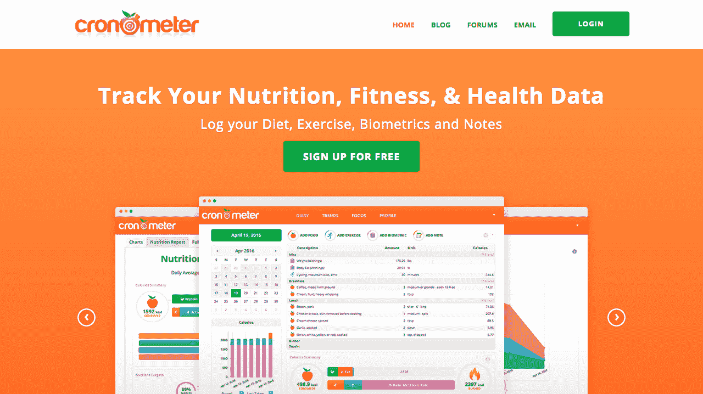
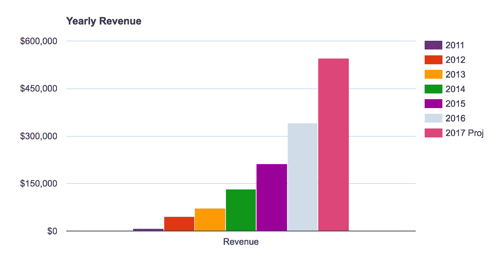

# 把我的小副业变成每月赚 4 万美元的生意

> 原文：<https://www.indiehackers.com/interview/turning-my-small-side-project-into-a-business-making-40k-mo-03874047f2>

## 你好！你的背景是什么，你在做什么？

我叫亚伦·戴维森，快 30 岁了。在我完成学士学位后。和理学硕士。在计算机科学领域，我曾在一些有趣的软件公司工作过或与人合伙创建了这些公司——涉及生物技术、在线扑克、游戏和通信软件。

[Cronometer.com](https://cronometer.com)是一个个人饮食和健康追踪器，它(与更受欢迎的大众市场追踪器不同)的特点是古怪地专注于过于详细的营养数据和分析，并迂腐地专注于让科学和数据正确。

Cronometer 在 2005 年开始作为个人的副业项目，多年来慢慢从一个爱好转变为一个真正的公司，收入为 40，000 美元/月，有几名全职员工，用户超过百万。

## 是什么促使你开始使用 Cronometer？

那是 2005 年，我想永远活着...我在奥布里·德·格里和玛士撒拉基金会做志愿者，学习克隆饮食(热量限制/最佳营养)的所有知识，这在当时是对哺乳动物进行的研究最多的干预，被证明可以延长寿命和健康寿命。

有兴趣尝试这种饮食的人需要仔细分析和跟踪他们的营养摄入，以安全地进行长期卡路里限制饮食。当时没有什么好东西，所以我写了我的饮食工具。

我称之为“CRON-O-Meter ”,因为这个程序有一个小小的进度条，显示你每天的营养需求。当你记录一天的健康食物时，你会看到你的目标栏填满了 100%——这就是“O 米”的部分。

这只是一个小小的 Java + Swing 桌面 GUI 应用程序，我作为开源项目发布在 SourceForge 上，并在网上向其他 CRON 爱好者公布。它慢慢地在这个社区获得了一小群追随者，并从那里传播开来。我继续维护了这个项目，并保持了多年的数据更新，它继续慢慢地流行起来。

## 构建最初产品的过程是怎样的？

我花了大约两个月的时间推出 MVP(最低可行产品)，然后又花了大约三个月的时间迭代和推出 iOS 和 Android 应用程序，以及高级升级。我在 Google Web Toolkit 中编写了服务器/web 版本，所以它主要是 Java，我们运行在 Amazon Web Services (AWS)上。

在此期间，我处于失业状态，并与我的前雇主进行少量咨询以支付账单。我还努力地在班夫滑雪，然后在美好的夏日攀爬和骑山地车——在那些日子里，我有一个非常棒的工作和生活平衡。

## 你是从什么时候开始把 Cronometer 变成“真正的公司”的？

2011 年初，我刚刚辞去了爱尔兰在线扑克的高薪工作，搬回加拿大落基山脉做了一段时间的滑雪爱好者。所有的 CRON-O-Meter 电子邮件(bug、问题、请求)开始让人觉得是一项糟糕的工作。显然这里有一些牵引力。

我过得很好。这是马拉松，不是短跑。

TweetShare

我知道我很快就会需要一些收入，所以我从头开始了一个完整的重写，这将成为 SaaS 版本——托管在云中，有一个网络应用程序和配套的移动应用程序。2011 年 2 月，我推出了 Cronometer.com。

这是最小可行产品的定义——令人尴尬的丑陋，笨拙，有限，但它有效。我推出了带有少量 Adsense 广告的免费网页版和用户可以订阅的付费“黄金”版。我还继续支持开源的 CRON-O-Meter 应用程序，但包括了一种将数据迁移到 Cronometer 帐户的简单方法。

因为有历史用户基础，我马上就有了用户和少量收入。到这个时候，我也很清楚，虽然它是为了挠我自己的痒而设计的，但它正被许多需要核心营养分析的其他群体采用——运动员、医疗条件管理人员、纯素食者和生酮节食者。

到 2011 年秋天，它的月收入大约为 2000 美元——足够支付托管费用，但还不足以维持生活。与此同时，在 Full Tilt Poker 引人注目的自我毁灭之后，我的几个朋友都被解雇了(这是一个很长的故事)，我最终在接下来的四年里与他们一起做了另外两家获得资助的创业公司。

在那四年里，我很少有时间投入到 Cronometer 上，基本上都是在维持生命和基本维护上。我偶尔会在这里或那里加入一些新功能，但这非常有限。

[

2017 年 5 月 Cronometer 的主页。](https://cronometer.com) 

尽管如此，它继续每年稳步增长。到 2012 年底，它的月收入为 35000 美元，2013 年为 6000 美元，2014 年为 12000 美元，2015 年为 18000 美元。2015 年，我开始用省下来的一些钱雇佣一些合同开发人员，并开始在急需的产品改进上取得一些进展。

2016 年(月薪 2.8 万美元)，我在另一家初创公司的[从全职工作转为兼职，并雇佣了我的第一批全职员工。2017 年我终于全职去了。我们现在每月挣 4 万美元，有 4 名全职和 2 名兼职员工。](http://chatbox.com)

尽管 12 年来，我们从一个业余爱好慢慢成长为一家真正的公司，但在许多方面，我们仍然非常像一家年轻的初创公司，因为在那些年的大部分时间里，我们的步伐都是渐进的。

## 这些年来，你是如何刺激这种用户增长的？

我们几乎完全是靠口口相传发展起来的。如果你有一个值得注意的产品，你愿意坐下来等 5-10 年，有机收购很容易！

我们实际上仍然有很差的搜索引擎优化。我们很大程度上是一个单页应用程序，只有很少的内容可以被抓取。由于我们的竞争对手是如此受 SEO 驱动，我们决定不在玩这个游戏上投入太多。我们没有太多的搜索引擎优化的存在。我们确实有很多很多人在互联网上谈论我们，在他们的博客、论坛、Reddit、YouTube 视频等等上推荐我们。

我们确实试验了谷歌和脸书的付费广告，但我们很快就认定，我们永远不会在这些广告支出上取得正的投资回报。

我们最成功的积极营销努力来自于与个人健康和饮食领域的目标影响者的合作和赞助。与已经是 Cronometer 的忠实粉丝的权威人物进行交叉推广有助于从他们的观众中吸引用户。

随着我们业务的成熟，我们需要开发一个真正的品牌和营销策略，但现在我们仍然非常专注于产品和工程。我们目前每天有超过 1500 个新注册用户，但要提高用户保持率，我们还有很长的路要走。

## 你的商业模式是什么，你是如何增加收入的？

我们从 3 个主要来源获得收入:

*   免费版的 Adsense 收入
*   来自黄金版和专业版的订阅收入
*   移动应用销售

我们现在只使用条纹。我们曾经提供 Stripe、Paypal 和 BitPay(用于比特币)，但简化选项，只使用 Stripe 是值得的。

这些年来，我们并没有真正改变这里的结构，只是继续专注于改善产品本身，这为我们赢得了更好的保留率和转化率。

从第一天就有办法赚钱。你需要支付成本，你需要知道人们是否会付钱。

TweetShare

我们有一个非常有趣的季节模式。每年我们都会看到从 1 月 2 日开始的大规模增长。除夕夜的宿醉过去后，新年决心开始生效，人们开始在夏天锻炼他们的海滩身材。我们看到 3 月份之前的快速增长，然后到 8 月份增长放缓。然后到了冬天会有一个缓慢的下降，从感恩节到圣诞节假期会有特别大的下降。

这一切都很合理，我们每年都看到这种非常明显的模式。好的一面是，我们在上半年的增长总是远远超过我们在下半年的萎缩！

 

我们的收入随着我们用户群的增长而成比例增长，除了广告收入自去年以来大幅下降，尽管我们有更多的观众。许多用户正在安装广告拦截器，谷歌的 Adsense 不断发布恶意软件和恶意广告，控制浏览器，这一直是令人沮丧的原因。

## 你未来的目标是什么，你打算如何实现它们？

我们对最近的大项目感到非常兴奋。我们最近推出了一个专业版本，让医疗保健和健康提供者管理他们的客户名册。他们可以在我们的系统中实时监控、互动和指导他们。我们认为这是一个巨大的新市场，在听取了前 100 名专业客户(医生、营养师、健身教练、营养学家)的反馈后，我们正在迅速改善这个市场。

我们还在数据监管方面进行了一些大的投资。我们希望拥有地球上最大最好的营养数据库。只有当我们能够找到聪明的方法来自动化通常非常劳动密集型的数据输入和管理时，我们才能做到这一点。我们正在开发一些智能系统，试图降低成本。这是一个困难的项目，但却是我们长期成功的关键组成部分。

从更个人的角度来说，我的目标是将公司发展成为一个强大的公司，并持续很长时间。我有很好的生活方式，仍然住在一个小山城(不列颠哥伦比亚省雷弗尔斯托克)，那里有一个很棒的滑雪场，离我家前门只有几分钟的路程。

## 你克服的最大挑战和障碍是什么？

最大的挑战一直是缺乏完成工作的资源。自举意味着你完成事情的能力受到现金流的限制，这可能会令人沮丧不已。我们总是因为积压的工作越来越多而耗尽现金流。我们不得不等到经济增长能够支撑他们的时候再雇佣急需的人。

我经常在想，如果我进行了传统的一轮融资，并在早期更加积极地进行融资，我会在这个行业中处于什么位置呢？

我早期做的一个决定产生了深远的影响。当我编写原生 iOS 和 Android 应用程序时，我没有花时间制作任何 UI 来注册和配置帐户。我只专注于将应用程序与基本要素一起发布，这样已经在 [Cronometer](https://cronometer.com) 上注册了帐户的现有用户就可以下载并使用我们的应用程序。

然而，任何通过 App Store 来到我们这里的新用户都不能创建帐户。为了避免我不可避免地从这些用户那里得到的所有投诉的客户服务开销，我决定对这个应用程序收费，假设没有人会为这个应用程序支付 2.99 美元，如果他们还没有一个帐户的话。

快进到今天，我们有点坚持旧的决定，因为这些应用程序的销售是我们收入的一大块，我们不能把它变成一个带广告的免费应用程序而不对我们的现金流造成巨大冲击。与此同时，我们发布免费应用的竞争对手增长得更快——2015 年，MyFitnessPal 以 4.74 亿美元的价格被安德玛收购。哎呀！

支持是一个巨大的负担。即使有专门的帮助，这么多事情仍然必须升级到我，这吃掉了很多时间，我希望可以花在开发上。但与此同时，与客户进行持续的对话是非常重要的，直接与客户讨论你产品中的痛点是非常宝贵的。

## 你最大的优势是什么？

有了这个生意，我有了不经意间偶然发现牵引力的难得的奢侈。一开始是个人爱好项目挠自己痒痒，最终有了明确的信号，有了市场需求。

如果你不想成为下一个硅谷独角兽，这可能是一个寻找牵引力的好策略。如果你为自己开发一个产品，因为它还不存在，而你真的需要它，那么可能有一百万个像你一样的人在那里。也许不是十亿，但除非你是个怪胎，否则有一百万。这足以建立一个好的小公司。

我真的不能说有任何其他的秘方——如果你有一个有吸引力的 MVP，那么之后你需要的就是良好的执行力。在发展方面，我很满意。除了资源限制带来的沉重负担，我们可以非常有效地执行。我觉得在我职业生涯的这一点上，我自信地知道如何编写软件和管理团队。

操作上的执行也很重要。每天关注你的指标/日志/客户。我早上喝几杯咖啡的时候有一个惯例:

1.  我通读支持电子邮件队列和论坛，并筛选任何重要问题。
2.  我在 New Relic 中扫描我们的系统指标，阅读任何新的堆栈跟踪和崩溃日志。

这是对事情如何运行的快速脉冲检查，它通常会发现隐藏的问题，否则我会在很久以后才发现。

尽管有一个可行的、不断增长的产品，人们喜欢，但我仍然每天醒来，看到垃圾箱着火。

TweetShare

由于我们是一个 100%远程团队(成员来自加拿大、美国和爱尔兰)，我们使用 Slack 来运营公司。不仅仅是日常聊天，还有运营意识。我们将源代码控制、问题跟踪、构建、部署消息、警报、销售和 KPI 消息集成到 Slack 中，因此作为一个团队，我们都知道系统中发生了什么。

在营销方面，我仍然完全不熟悉。为了在那里成长，我觉得需要外界的帮助，或者雇佣一些人来带来这种经历。作为一名工程师，我不能很好地适应这个世界。在我比较傲慢的日子里，我觉得我们不需要投资营销，因为我们已经有强大的有机收购，所以资源更好地用于改善产品(产生更好的保留和更多的口碑)。

我坚信要确保我们提供巨大的支持。没有什么比快速和个性化地回复客户的邮件更让他们惊喜和高兴的了。不要浪费取悦用户的机会。这会给你带来回报，帮助你赢得忠诚度和好评。

## 对于刚刚起步的独立黑客，你有什么建议？

这大部分是陈词滥调，但这是真的！

*   尽早并经常释放。你应该经常在人们面前为你的产品感到尴尬，并在公开场合不断努力改进它。如果有用，人们会原谅，看到进步会积极回应！反馈是无价的。他们越觉得你的产品有潜力，你就会收到越多的投诉。抱怨和要求改进是你有吸引力的强烈信号。缺乏批评意味着没有人关心你的产品到去抱怨。

*   从第一天就有办法赚钱。你需要支付成本，你需要知道人们是否会付钱。用户需要知道你不会破产，所以你最好从第一天就展示一个可行的商业模式，即使你有一个免费层。

*   多年来，我一直在做另一份全职工作，同时经营着 Cronometer。这是可行的，但有几次我差点累垮了。为了帮助解决这个问题，我很幸运，在我能负担得起全职工作之前，我可以协商把我的全职工作转为兼职。

*   云所有的东西！我们使用 AWS、BitBucket、Pivotal Tracker、Stripe 和 Slack。

*   工作/生活平衡，咄！我一周工作不超过 40 小时。我早上休假去滑雪。我过得很好。这是马拉松，不是短跑。

*   尽管有一个可行的、不断增长的产品，人们喜欢，但我仍然每天醒来，看到垃圾箱着火。我所能看到的是所有的缺陷和缺失的功能以及有问题的用户体验。我所能做的就是花我们有限的资源去尝试和改善事情，一天一次。

## 我们可以去哪里了解更多？

我们的网站是 Cronometer.com 的[，你可以在 https://www.linkedin.com/in/theaarondavidson](https://cronometer.com)的[了解更多关于我的信息。](https://www.linkedin.com/in/theaarondavidson)

我很高兴在下面回答一些问题！

—[<picture id="ember5272313" class="user-avatar ember-view user-link__avatar"></picture>cronometer](/cronometer?id=9Kuzc5IWUWUR3l9wgX8858zoQxX2)，Cronometer 的创建者

## 想像 Cronometer 一样建立自己的事业？

你应该加入独立黑客社区！🤗

我们是几千名创始人，互相帮助建立有利可图的业务和副业。来分享你正在做的事情，并从你的同事那里获得反馈。

还没准备好开始使用你的产品吗？没问题。这个社区是一个认识人、学习和实践的好地方。随意[随便浏览](/)！

——[<picture id="ember5272318" class="user-avatar ember-view user-link__avatar"></picture>柯特兰艾伦](/csallen?id=ibTLPyjwVebnZjMGKvz6ztarnuV2)，独立黑客创始人

11votes