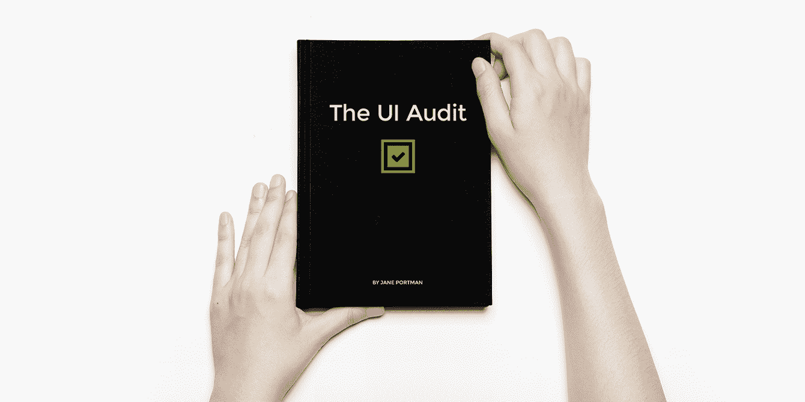
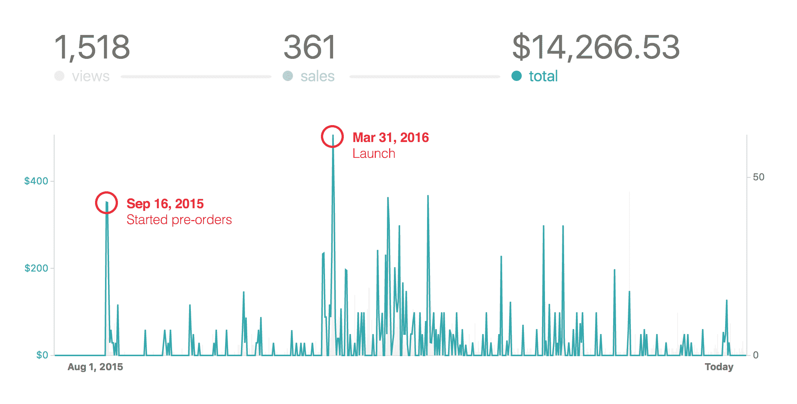

# 把我的网页设计知识变成一本有利可图的书

> 原文：<https://www.indiehackers.com/interview/turning-my-web-design-knowledge-into-a-profitable-book-0c2b20aaa5>

## 你好！你的背景是什么，你在做什么？

大家好，我是简·波特曼，独立 UI/UX 顾问，也是 [UI 早餐](http://uibreakfast.com)和[微小提醒](http://tinyreminder.com)的创始人。我之前是一家大型机构的创意总监，2012 年我第一个儿子出生时，我独自去了。从那以后，我一直在写书，运行播客，在会议上发言，以及做其他一些很棒的事情。

今天，我将分享[UI 审计](http://uibreakfast.com/audit)的故事——这是我的第三本书，主要讲述 web 应用程序的设计。这本书于 2016 年 3 月出版，截至今天已经赚了超过 14，000 美元，并帮助许多创始人解决了他们的 UI/UX 问题。

## 是什么促使你开始 UI 审计的？

2015 年年中，我面临着严重的职业倦怠。我承担了很多咨询工作，还接受了 InVision 的邀请，为他们写了一本书。我只用了一个月就写了[基础 UI 设计](https://www.invisionapp.com/ecourses/fundamental-ui-design)。(你可以在[我的年度报告](http://uibreakfast.com/year-in-review-2015)中了解更多信息)。难怪我会精疲力尽！

在费城与艾米·霍伊会面后，我决定完全放弃咨询，专注于产品。我接受了她的“九月发货”的挑战，并开始了 UI 审计。我的目标是为那些负担不起昂贵咨询服务的创业者创建一个自助的 UI/UX 指南。我想摘抄并写下我的 web 应用程序设计方法，这些方法都是关于简单和专注的。

应该是课程还是书？我犹豫了很久。研究表明，设计是一种痛苦，但对创始人来说从来不是最优先考虑的事情，而且他们努力寻求“快速解决方案”所以我决定把它写成一本书——更低的价格，更少的承诺，更快的结果，更好的影响。

为你的书选择一个特定的目的和特定的读者。写一个提纲，然后坚持下去。

TweetShare

生活阻碍了我，我没有在 9 月前把所有东西都寄出去，而是提前预定了。他们证实了对这本书的极大兴趣！到第二年这本书发行时，我已经收到了大约 3500 美元的预购。那年我还在欧洲微 Conf 上做了一个演讲，名为[1 小时 UI 审计](http://uibreakfast.com/1hour)。

## 是什么让这本书出版的？

这本书花了大约 6 个月的时间来写。为了收集材料和完善方法，我为我的客户进行了大量的[定制 UI 审计](http://uibreakfast.com/custom-audit)(作为一种产品化的咨询服务)。因此[UI 审计](http://uibreakfast.com/audit)完全基于在现有 web 应用程序中发现的现实问题。

同时，我安排并录制了 6 次对成功的 SaaS 创始人的音频采访，包括滴滴、Calendly、Teachable 和 Balsamiq 的创始人。把采访记录下来是明智之举:我后来通读了一遍，并把最好的引语收入了书的正文。相比之下，大量的音频文件，不能这样使用！

有了所有这些东西，我知道该写什么，更重要的是，该写什么，以保持这本书的重点和帮助。我已经写下了演讲和免费课程的核心思想，所以这本书的其余部分花了几个星期来编写和编辑。

 

与软件不同，书籍的生产成本相当低廉。我只为草稿支付了两轮编辑，加上音频编辑和转录。我用 Markdown 写了所有的东西( [Byword](https://bywordapp.com) 是一个非常棒的写作工具)，然后用 InDesign 制作了 pdf(感谢 [markdownID](http://www.jongware.com/markdownid.html) 脚本)。我还使用 InDesign 为顶层设计了可打印的工作表。

关于插图，一件有趣的事情发生了:当最终的草稿准备好了，它们似乎是不必要的！测试版读者向我保证了这一点。*UI 审计*是一个你可以用眼前的任何 UI 做的练习。

## 你是如何吸引用户和发展 UI 审计的？

当我开始写这本书时，我已经有了一个庞大而忠实的邮件列表，大约有 5000 名订户。这是一个巨大的竞争优势！

为了吸引新人，我在 2016 年 1 月推出了一个名为*1 小时 UI 审计的免费电子邮件课程。*我开设了产品搜寻课程，效果非常好。(这是在他们开始淡化免费课程之前。)

作为发布活动的一部分，我发出了样本章节、工作表和其他赠品。我还在 [UI 早餐播客](http://uibreakfast.com/podcast)上免费发布了两篇创始人访谈，逗逗观众。

我最大的优势是庞大的邮件列表和我过去的书籍经验。

TweetShare

这本书本身于 3 月 31 日在我的清单和产品搜索上推出。发布日令人兴奋，但就销售额而言并不巨大:所有容易买到的水果在预购阶段就已经被收集了。

但我在发布后的努力增加了曝光率，并帮助销售在全年滚滚而来。我在新书发布会前后做了一次播客旅行，结果出现了 9 次播客。(我在我的[内容指南](http://uibreakfast.com/content-guide/)中记录它们。)很难追踪销售情况，但累积效应是显而易见的。

我还为 InVision 写了一系列博客，非常有效——他们拥有大量的受众，在推广内容方面做得非常出色。再说一次，我与 InVision 的合作可以追溯到上一本书，我珍惜这种关系。

## 你用了什么策略来增加你的销售额？

帮助我赚更多钱的第一件大事是多层自助出版。我推出了三个包:独立的书，完整的包，和一个包，其中包括个人咨询。像这样的分级系统给了你最忠实的读者一个机会去购买更棒的内容并付给你更多。

第二件事是促销和打折。每当我参加促销活动时，我都会为这本书定制折扣。我也时不时地给我的邮件列表做闪购。

与任何一次性产品一样，销售额随着时间的推移而下降。我或许可以通过把这本书送给交易网站赚些钱，但是我还没准备好放弃这样一个伟大的产品。

尽管 UI 审计被计划为一个单独的自助产品，但它仍然很好地融入了我的[咨询服务](http://uibreakfast.com/services)的阶梯。更重要的是，它是我所有工作的基础方法。

## 你未来的目标是什么，你打算如何实现它们？

今年我计划推出这本书的第二版。我准备复习文字，录制一套新的创始人访谈，投入专业的音频旁白。

最近推出了[我自己的 SaaS 产品](http://tinyreminder.com)，我有很多新的见解要与创始人分享。我也很想把更多的注意力放在数据驱动的设计和用户测试上。

在推广方面，我期待着另一次播客之旅——这次的目标是受欢迎的 UX 节目。

## 如果你必须重新开始，你会做什么不同的事？

这本书是我的第三本，所以我设法避免了关键性的错误，总体来说我对它非常满意。(相比之下，我的第一本书[掌握应用程序演示](http://uibreakfast.com/mastering-app-presentation/)，定位非常模糊。)

如果我不得不重新开始，我可能会和观众走一个稍微不同的方向。我专门为创始人创建了 UI Audit，这让我在写这本书和营销文案的时候非常清晰。毕竟“小众到疼”是我一直推荐的。

然而，这次我会在关键的营销标题中避免使用“创始人”这个词，转而使用“功能定位”(这对所有与 UI/UX 打交道的人都很有用，比如设计师和产品经理)。由于我对创始人的高度关注，我可能会在产品发布会上留下很多潜在的签约。

2016 年秋天，我重写了这本书的登陆页面，将重点从创始人转移到更普通的读者(更多细节[这里](http://uibreakfast.com/ui-audit-rewrite-sales-page-book-sale-inside))，我打算保持这种方式。

还有一件事在开始时出了差错。我依赖 Gumroad 的预购功能，该功能将付款处理推迟到发布日。但是人们认为他们已经付过钱了！我得到的不是兴奋，而是许多人询问他们是否被收费两次。

所以我的建议是立即收取现金(发送一个空白的 PDF 或类似的东西)。即使未能发货，退款也比处理误会容易得多。

## 你最大的优势是什么？有什么特别有用的吗？

这一次，我最大的优势是庞大的邮件列表和我过去的书籍经验。五年前我什么都没有！所以我在这里的建议是再试一次，先推出小东西，永远不要放弃产品的想法。

如果没有我的朋友，我也不会走得太远。一路上他们让我开心，成为了很好的测试版读者，并帮助了我的推广。

## 对于刚刚起步的独立黑客，你有什么建议？

最重要的是专注。你不需要成为每个人的一切。而且，那很危险！为你的书选择一个特定的目的和特定的读者。写一个大纲，并坚持下去。

最重要的是专注。你不需要成为每个人的一切。

TweetShare

我强烈推荐[内森巴里](https://www.indiehackers.com/businesses/convertkit)的 [*权威*](http://nathanbarry.com/authority) 。这本书第一次给了我很大的帮助。

我还建议你在为你的产品做研究的时候尝试一下 [sales safari](https://unicornfree.com/2013/video-sales-safari-in-action) 。这是 Amy Hoy 的 [30x500](http://30x500.com) 程序中的一个方法，该程序需要探索论坛和其他社区。

如果写作让你害怕，试着先雇一个编辑——我第一本书就是这么做的。我给她看了几章，她向我保证我的写作是合法的。这就是我想要听到的！

## 我们可以去哪里了解更多？

首先我们说的这本书:[UI 审计](http://uibreakfast.com/audit)。下载带工作表的免费章节，并在结账时使用 promocode INDIEHACKERS39 享受任何图书套餐 39%的折扣。

然后是几个和书有关的帖子:

*   [UI 审计:为什么我重写了销售页面](http://uibreakfast.com/ui-audit-rewrite-sales-page-book-sale-inside)
*   [如何轻松命名你的下一本书](http://uibreakfast.com/name-your-book)
*   [进入 SaaS 创始人新书:UI 审计](http://uibreakfast.com/enter-ui-audit)
*   [我如何在三周内写完我的第二本书:我得到的教训](http://uibreakfast.com/how-i-wrote-my-second-book)

我在网上做的主要事情是:

*   UI 早餐网站 —丰富的 UI/UX 设计资源。
*   [UI 早餐播客](http://uibreakfast.com/podcast) —与顶级专家就 UI/UX 设计和产品策略进行对话。
*   [小提醒](http://tinyreminder.com)——一个简单的、永远免费的工具，帮助你按时收集东西。
*   欢迎你在推特上关注我 [@uibreakfast](https://twitter.com/uibreakfast) 。

感谢您通读整个故事！如果你有问题，我很乐意在下面的评论中回答。

—[<picture id="ember5246256" class="user-avatar ember-view user-link__avatar"></picture>简波特曼](/uibreakfast?id=FLkkVD5X8sSl6U2O72wgqQWXJOu1)，UI 审核的创建者

## 想像 UI 审计一样建立自己的事业？

你应该加入[独立黑客社区](/)！🤗

我们是几千名创始人，互相帮助建立有利可图的业务和副业。来分享你正在做的事情，并从你的同事那里获得反馈。

还没准备好开始使用你的产品吗？没问题。这个社区是一个认识人、学习和实践的好地方。随意[随便浏览](/)！

——[<picture id="ember5246261" class="user-avatar ember-view user-link__avatar"></picture>考特兰艾伦](/csallen?id=ibTLPyjwVebnZjMGKvz6ztarnuV2)，独立黑客创始人

8votes