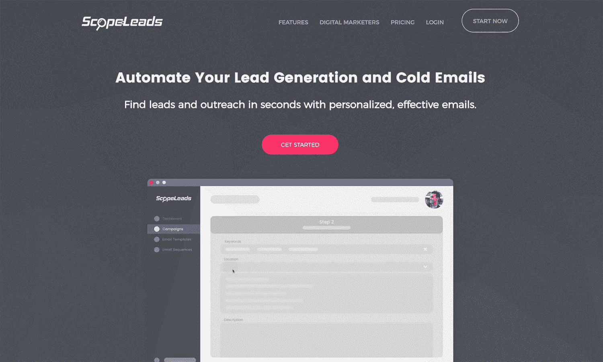
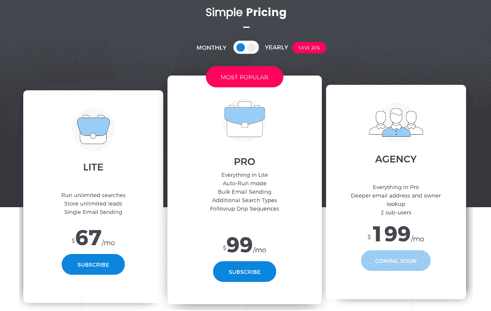
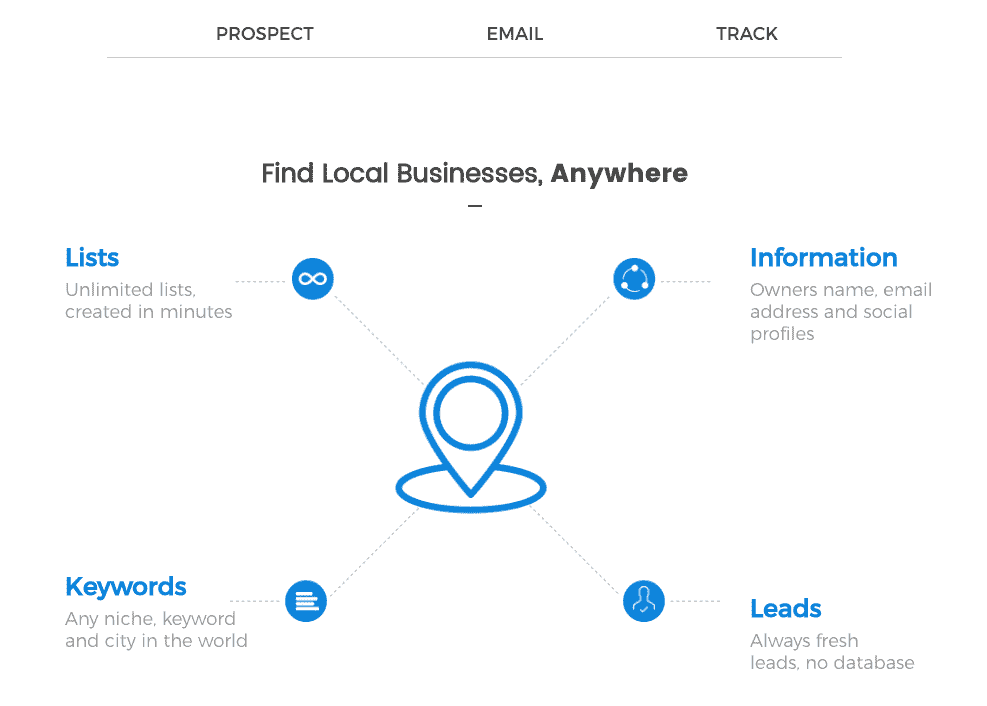

# 把我工作中最糟糕的部分变成成功的 SaaS

> 原文：<https://www.indiehackers.com/interview/turning-the-worst-part-of-my-job-into-a-successful-saas-8d39493aec>

## 你好！你的背景是什么，你在做什么？

你好。我的名字是 Lior Ohayon，我的背景是本地公司、电子商务公司和 SaaS 公司的数字营销(特别是 SEO)。

这些天来，我主要致力于 [ScopeLeads](https://scopeleads.io) ，这是一个帮助其他数字营销顾问和代理机构自动产生线索和联系的工具。我们能够在数字营销人员中成长并取得成功，是因为这款应用专门迎合了他们的需求，根据他们网站的状态过滤掉了那些*实际上需要*他们营销帮助的企业。

 

## 是什么促使你开始使用 ScopeLeads？

当我看到我的一些互联网营销伙伴进入软件领域时，我产生了 ScopeLeads 的想法。那时我唯一知道的是代理生活，我已经经营了三年。

所以我对自己说，“和客户一起工作，最令人沮丧、讨厌、昂贵和耗时的部分是什么？”答案是:探矿。很少有顾问会做很多这样的工作，但我很早就认识到，为了让管道保持满负荷，总是进行勘探是多么重要。

当时，我正在向我所在城市的领导发送实体包裹和冷冰冰的电子邮件。唯一可以自动化的是冰冷的电子邮件部分，所以我倾向于这一部分。每个星期天，我都会创建一个谷歌表单，上面有一个巨大的潜在客户名单，上面列有搜索引擎优化不好的人，他们可能需要我的帮助。然后，整整一周，我会通过冷冰冰的电子邮件、视频审计和跟进联系他们，试图达成交易。

我意识到*这个过程的每一个部分*都可以自动化，从寻找线索，到确定他们是否需要帮助，到审计，甚至后续跟进。有一些工具可以建立列表，也有一些工具可以跟进，但是没有一个工具可以用于数字营销领域，也没有一个工具可以整合到一个工具中。

于是，这个想法诞生了。

## 构建最初的产品需要什么？

我不是一个技术创始人，所以找到一个我可以信任并能完成工作的开发人员是一项艰巨的任务。我花了一年半的时间让开发人员开始、陷入困境、重新开始，然后逃跑(字面意思)，直到我最终找到一个从头开始并一直坚持的人。他仍然在团队中，是一个独立管理整个应用程序的普通全栈开发人员。从 2016 年 2 月到 2016 年 6 月我们的测试版开放，我几乎把我所有的咨询积蓄都投在了他身上。

如果你是一个独立创始人，而不是程序员，你将需要现金和一些指导。

TweetShare

我在脸书上开了一个群，允许几十个人加入这个应用，然后我们就出发了。特性、结果、迭代、bug——这是一次地狱之旅，但我把这一切都归功于这些最初的 beta 测试人员< 3。在这一点上，我开始计划一个巨大的发射，并停止接受营销客户。

## 你是如何吸引用户和扩大 ScopeLeads 的？

上线日期为 2016 年 8 月 16 日。这是提前几个月就计划好的，是典型的“网络营销”(IM)方式。JV(合资企业)合作伙伴、电子邮件、竞赛、销售页面、追加销售、视频销售信函，一切。

我们很幸运，因为发射本来应该在六月，我们推迟了它以避免与另一次发射相撞。在这额外的两个月里，我们通过联营公司(JVs)私下销售了一个软件包，这些联营公司能够让他们的观众坐满网络研讨会。仅这些网络研讨会我们就赚了 20 多万美元。

网络研讨会也给了我们动力，因为当听到这些数字时，更大的名字开始出现在主发布会上。不用说，它做得非常好——超出了我最大的预期——在四天内又获得了 20 万美元的收入。

无论你做什么都要全力以赴，你的用户会在你的产品中感受到。

TweetShare

在这次发布会上，我有一个合作伙伴，他的唯一职责是寻找、沟通和签署同一利基/行业的合资企业，以进行推广，另一个合作伙伴负责管理漏斗和其他一切。通过他的联系，其他排行榜和比赛冠军等，我们注册了数千个会员。

那年夏天，我们总共卖出了 4000 多个终身账户。直到今天，我们仍然依赖于最初发布的流量、分支机构和搜索引擎优化收益。除了偶尔的合资网络研讨会，我们不做其他营销。我建议任何一家新公司在开始时进行公开发布，并与已经成功发布的合作伙伴合作。如果你能向他们展示你的测试版用户得到了结果，你就能让他们对产品感到兴奋。

## 你的商业模式是什么，你是如何增加收入的？

在首次推出后，我们转向了每月和每年定期订阅模式。为了增加收入，遵循成熟的即时消息技术并提供追加销售、附属产品等对我们来说仍然很重要。该应用程序本身目前每月的订阅收入为 26，000 美元，我们还提供其他追加销售、附加服务和培训，这显著增加了我们的客户终身价值(CLTV ),并且每月几乎翻一番。

我建议每个人从 Stripe 开始，永远不要接触 PayPal。我们最近也转向了 Chargebee，尽管我们的一些订阅仍然“锁定”在以前的支付处理器上，这意味着我们仍然必须为它们支付荒谬的费用，并且我们不拥有客户。 ***痛定思痛！***

我们仍然通过 First Promoter 运营着一个[联盟项目](https://scopeleads.io/affiliates)，我们试图让尽可能多的联盟成员参与进来。如果他们教授数字营销，并且有课程或某种会员区，他们通常会制作一个关于冷邮件的视频，展示我们的工具，并使用他们的会员链接。

我们目前的目标是通过真正倾听客户的需求，并通过实际支持和培训帮助他们取得成效，从而尽可能地扩大我们的月订户基数并减少客户流失。我们提高了价格，而且价格似乎也保持坚挺。

我们的软件的一个有趣的部分是一切都是无限的，所以基于资源使用来估计成本是一个永远不会结束的杂耍行为！

 

## 你未来的目标是什么？

我们的下一个目标是到 2019 年底，仅订阅费用就达到每月 4 万美元，并大幅降低客户流失率。这意味着简单地成为市场上最好的产品，用一种能产生效果的产品。我们计划扩大我们的搜索引擎优化，博客，并开始与付费广告来完成这一目标。

我还计划开设一些课程，这些课程将增加 CLTV，并引发与潜在买家的有趣对话。已经有人联系我们出售，但在我们有更大的想法之前，可能不会准备好。

## 你面临的最大挑战和克服的障碍是什么？如果你必须重新开始，你会做什么不同的事？

我们面临的最大挑战是技术和战略的结合。

由于我们的大多数用户只支付了一次，我们现在必须永远兑现我们的承诺。这是资源和成本密集型的，很难弄清楚如何平衡一切(字面上)。

如果让我重新开始，我肯定会从一个循环模型开始。没有例外。这是我们犯的最大的错误。尽管在向合作伙伴和分支机构付款后，发布会为我们提供了一点现金，但这只是一笔总额。

我还会从度量标准和早期的适当报告开始。我一直等到最近才整理好我们的计费系统和指标，我们正在为此付出代价。

最后但同样重要的是，要明白如果你是一个单独的创始人，如果你不是一个程序员，你将需要现金和一些指导，以了解所有的技术堆栈，以及什么适合什么。

## 有没有发现什么特别有帮助或者有优势的？

我认为不要为了质量而牺牲时间(不要急于发布，不要急于推出新功能，等等)已经一次又一次地得到了回报。

无论你做什么都要全力以赴，你的用户会在你的产品中感受到。

 

## 对于刚刚起步的独立黑客，你有什么建议？

找一个以前去过，但现在还不算太大的导师。如果你在$5k 的 MRR，想在$10k，找一个在$10-15k 的人，因为他们以前去过那里(最近)，对他们来说是新鲜的。

实际上，我给我的竞争对手打了电话，并设法说服了一个人来指导我，这获得了很好的回报。

我的另一个建议是专注。专注于一个营销渠道，一次一个功能，一次一个问题。只有当你掌握了它，你才能继续下一步。

你越是想往自己的盘子里放东西，你的营销看起来就越是草率和空洞。我看到许多人整天做社交和内容，但看不到回报，因为他们在 10 个不同的平台上从屋顶尖叫。

专注，尤其是在基础上。流量、转化和留存。这似乎是显而易见的，但这也是我每天都告诫自己的！

## 我们可以去哪里了解更多？

我在 [ScopeRush](https://scoperush.com) 写了关于客户获取的博客，我们最近也开了一个 [ScopeLeads 博客](https://scopeleads.io/blog)。

你可以在 [Instagram](https://instagram.com/liorohyn) 和[脸书](https://facebook.com/lior.ohayon)上找到我。

请随时在下面的评论中问我任何问题，我会在那里和博客上积极的！

——[<picture id="ember8044700" class="user-avatar ember-view user-link__avatar"></picture>Lior Ohayon](/liorohayon?id=FFQNcWhznVaJKB781nCCc3KhsYS2)，ScopeLeads 创始人

## 想像 ScopeLeads 一样建立自己的事业？

你应该加入独立黑客社区！🤗

我们是几千名创始人，互相帮助建立有利可图的业务和副业。来分享你正在做的事情，并从你的同事那里获得反馈。

还没准备好开始使用你的产品吗？没问题。这个社区是一个认识人、学习和实践的好地方。随意[随便浏览](/)！

—[<picture id="ember8044705" class="user-avatar ember-view user-link__avatar"></picture>考特兰艾伦](/csallen?id=ibTLPyjwVebnZjMGKvz6ztarnuV2)，独立黑客创始人

38votes