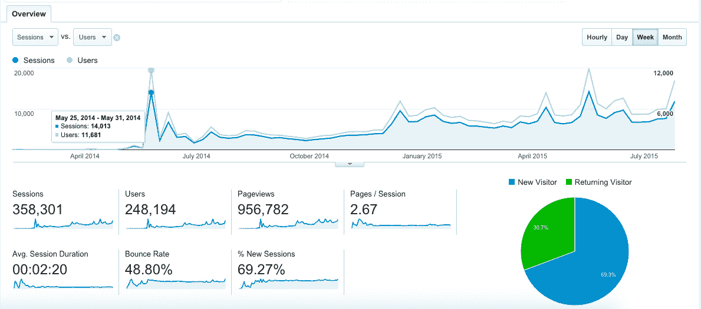
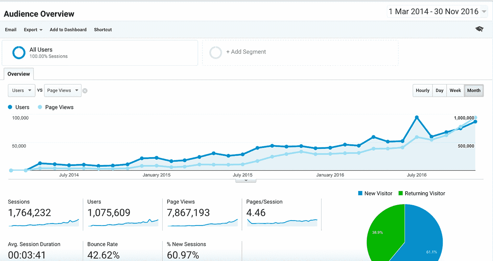
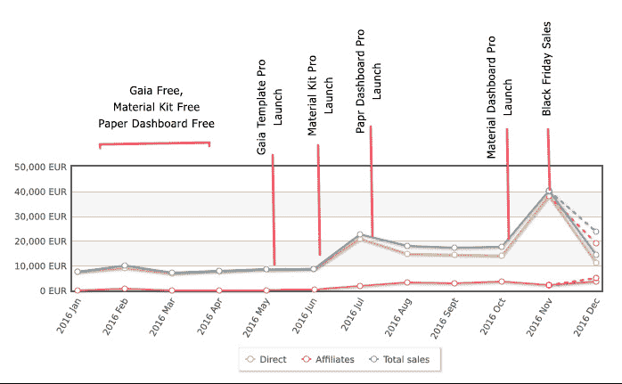
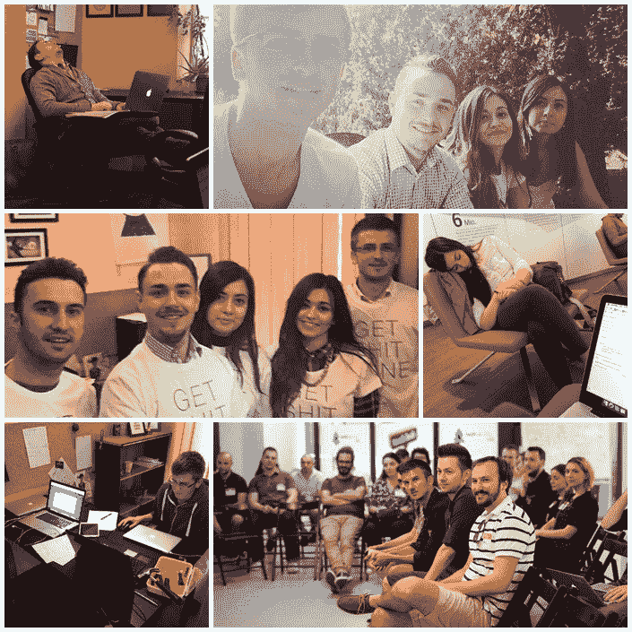

# 使用免费增值业务模式将收入提高到每月 17，000 美元

> 原文：<https://www.indiehackers.com/interview/using-a-freemium-business-model-to-grow-revenue-to-17-000-mo-fcd1be4ff4>

## 你好！告诉我们关于你自己和你正在做的事情。

我是亚历克斯·帕杜拉鲁，我学过数学和计算机科学，我有软件工程学位，我是 T2 创意公司的联合创始人。我和我的同事[克莉丝汀娜·康纳尔](https://twitter.com/conacelelena)在罗马尼亚的一家星巴克开始了我们的创业。

Creative Tim 是一家创业公司，致力于打造最好的网页设计工具。范围从 [UI 套件](http://www.creative-tim.com/bootstrap-themes/ui-kit?affiliate_id=92253)到[仪表盘](http://www.creative-tim.com/bootstrap-themes/admin-dashboard?affiliate_id=92253)、[模板](http://www.creative-tim.com/bootstrap-themes/free?affiliate_id=92253)和[插件](http://www.creative-tim.com/bootstrap-themes/components?affiliate_id=92253)。我们是一个由 6 个人组成的团队，自从 2 年前成立以来，我们一直在努力开发对开发过程有帮助的产品，并且我们会使用这些产品。

目前，我们的产品被全球超过 130，000 名网络开发者使用，我们已经赞助了来自 14 个国家的超过 20 场全球黑客马拉松。在收入方面，如果我们不考虑黑色星期五的销售额(这是我们 11 月份销售额的两倍)，我们每个月大约有 17，000 美元。

## 是什么促使你开始使用创意 Tim？你是如何找到时间和资金来制造最初的产品的？

我们在星巴克起步，没有外部资金。我们没有任何现金来租一间办公室或住在一个中心，所以我们必须为不同的客户工作，以赚取一些钱来支付我们的日常开支。

Creative Tim 是一个附带项目，我们认为对像我们这样的 web 开发人员来说会很方便。我们注意到，在与客户的合作中，我们总是“重新发明轮子”，一遍又一遍地为他们的网站创建相同的项目，所以我们想创建一些标准元素，如登录/注册模式、日历、向导等。

有几个月的时间，我们致力于实现平台和一些免费赠品(除了我们自己做的代理工作)。一开始，因为我们没有任何 Twitter 追随者、脸书粉丝或订户，我们在各种设计论坛上发布了许多关于我们的免费赠品的东西。

## 能不能多说说做这些帖子的事？你是如何推出创意 Tim 并获得第一批用户的？

起初，没有人真正理解我们想要做什么，也不理解我们为改善他们的业务所提供的价值。这非常困难，所以我们认为最好是创造一个更复杂的产品，帮助人们理解我们在做什么。

我们推出了 [Get Shit Done Kit](http://demos.creative-tim.com/get-shit-done/index.html?affiliate_id=92253) ，这是一个基于 Bootstrap 3 的 UI 套件。它出现在设计师新闻上[，并且在那段时间非常流行。我们从该来源获得了超过 11，000 名用户，这对我们的业务来说是一个巨大的突破。然后两周后](https://www.designernews.co/stories/24249-get-shit-done-bootstrap3-ui-kit)[我们提交了 it 产品搜索](https://www.producthunt.com/posts/creative-tim)。这给了我们超过 5000 名用户的另一个高峰。之后情况稳定下来，我们从 0 用户/周转变为 2-3，000 固定用户/周。

 

几个月后，受免费的“搞定狗屎”工具包成功的激励，我们发布了[搞定狗屎工具包 PRO](http://gsdk.creative-tim.com/?affiliate_id=92253) 。我们最初只做了几笔生意——每周大约 200 美元，不足以维持一家企业。与此同时，我们正在为我们的一个大客户做一个项目。

然后在 12 月，我们出现在 [Bootstrap Expo](http://expo.getbootstrap.com) 上，这是最重要的展示 Bootstrap 网站的画廊。这是我们业务的另一个重要突破，因为所有去 Boostrap Expo 寻求灵感的人都已经知道 Bootstrap 或与 Bootstrap 合作过，所以这些人是我们业务的完美观众。

## 从那以后你用了什么营销策略来发展？

我们的大部分营销策略是将我们的内容提交给不同的社区，如 Reddit、产品搜索、设计师新闻、黑客新闻等。(在我们的领域中工作良好的一些重要子编辑包括 [/r/web_design](https://www.reddit.com/r/web_design) 、 [/r/html5](https://www.reddit.com/r/html5) 、 [/r/frontend](https://www.reddit.com/r/frontend) 和 [/r/webdev](https://www.reddit.com/r/webdev) 。)

我们也为几次简讯活动支付了 100-200 美元。这些活动不太好，投资回报率与我们的投资额相当。(也许只是我们的案例没有盈利，但对其他人来说效果更好。)然后我们花了 400 美元买了 Get Shit Done Kit PRO，让它出现在 Sacha Greif 制作的 5 个最佳设计链接的精选列表中。对我们来说，这是一份非常有益的简讯，产生了大约 1500 美元的销售额。然后我们从 [eWebDesign](https://ewebdesign.com/giveaway-quality-bootstrap-components) 购买了“评论+简讯”套装(550 美元)。大约有 5000 名用户参与了赠品活动，总销售额达 2800 美元。

我们还考虑了不同的地方，在那里我们可以找到可以使用我们产品的 web 开发人员，我们意识到黑客马拉松正是我们所需要的。因此，我们开始与组织黑客马拉松的人交谈，向他们提供我们“优质产品”的免费许可证。我们赞助了 20 场来自世界各地不同城市的黑客马拉松(你可以在这里查看)。所有的开发者都很高兴获得免费许可证，这让我们很高兴我们可以在黑客马拉松期间帮助他们创建更快/更好的项目，他们也发现了我们是谁，所以双赢。

 

## 你的商业模式是如何运作的？你的营收背后有什么故事？

我们意识到，[创意蒂姆](http://www.creative-tim.com/?affiliate_id=92253)的最佳商业模式是免费增值:创造好看的免费赠品，帮助网站开发者创建伟大的网站，然后发布包含更多元素的免费赠品的专业版。目前，我们有 8 个有免费赠品的优质产品，价格从 19 美元到 599 美元不等，取决于许可证和存档类型。这些免费赠品出现在不同的社区、博客、时事通讯、社交网站上，它们驱动着我们所有的流量。

基本的想法是，那些免费赠品总是出现在那些大社区的前十名名单上。前 10 名中的每个帖子(取决于社区的规模)在一天内会给你带来 1000 到 15000 个目标用户:-O。我敢打赌，如果你想做一个常规的营销活动，你知道这要花多少钱...

一些例子:

*   纸质工具包— [在 Reddit 上获得 380 张赞成票](https://www.reddit.com/r/webdev/comments/3kwb16/paper_kit_bootstrap_ui_kit_ps_the_examples_are)
*   材料套件— [在 Reddit 上获得 560 张赞成票](https://www.reddit.com/r/web_design/comments/4t6qcv/material_kit_a_badass_bootstrap_ui_kit_based_on)
*   光自举仪表板 Angular — [在 Reddit 上获得 210 张赞成票](https://www.reddit.com/r/web_design/comments/5ihjco/bootstrap_dashboard_for_angular_2_free_admin)
*   材料套件— [黑客新闻](https://news.ycombinator.com/item?id=12099876)上的 180 个 uvpotes(峰值位置 9，一天内有超过 14，000 个用户访问我们的网站)
*   材料套件— [860 张产品搜寻投票](https://www.producthunt.com/tech/material-kit)
*   完成任务套件— [产品搜索获得 440 张赞成票](https://www.producthunt.com/posts/get-shit-done)
*   等等...你已经明白了

今天，我们的收入来自几个来源:

**产品销售**

这是我们网站上的常规销售，大约占总销售额的 24%。这还不包括[大捆](http://www.creative-tim.com/product/buy/bundle?affiliate_id=92253)。

这一大包到底是什么？我们已经看到我们的一些用户正在下载我们所有的免费产品。(我说的全部，字面意思是他们创建账户后 2-3 分钟左右的全部。)我们还发现，我们的一些客户购买了所有的高端产品。

因此，我们决定测试一个名为“大捆绑”的新产品，让您以巨大的折扣(超过 60%)访问我们的所有产品。这个大包裹每个月大约有 6-8 次购买。由于这个大捆绑包的价格是 299 美元(而不是 500 美元)的个人许可和 669 美元(而不是 2127 美元)的开发者许可，这是一个很好的收入来源，对于那些为多个客户使用我们产品的网站设计者/代理商来说是一笔大交易，双赢。

**代销商销售**

我们还在发展一个代销商网络，我们的代销商非常高兴，因为他们从每笔交易中获得 50%的分成。例如，我们最重要的从属关系之一是通过一个非常受欢迎的 GitHub 回购完成的:[Bootstrap Material Design](http://fezvrasta.github.io/bootstrap-material-design)(GitHub 上的 17000+星星)。你可以看到我们的朋友费德里科有两个关于我们产品的横幅。目前，代销商约占我们总收入的 25%。

**有机搜索(SEO)**

我们已经看到，我们也从 SEO 中获得了一些收入，大约占收入的 22%。所以我们决定投资搜索引擎优化，我们有一个搜索引擎优化顾问，我们支付大约 500 美元/月，以提高我们的产品在谷歌排名。

**其他**

我们每月收入的剩余部分来自脸书、推特和我们的时事通讯。以下是我们的收入如何随着时间的推移而演变，以及一些具有历史意义的重要时刻，这样您就可以理解为什么在几个月内收入会增长:

 

至于我们如何烧钱，我们收入的 44.5%是利润，42%是工资，7.5%支付我们的办公室，3%支付服务器成本，剩下的 3%支付意外开支。

## 你未来的目标是什么？你认为未来会有什么大的挑战吗？

通过致力于所有这些变化和产品，我们发现我们真的很喜欢我们所做的事情，因此我们将继续发展[创意 Tim](http://www.creative-tim.com/?affiliate_id=92253) 。我们的产品现在比我们去年创造的产品更加成熟。我们已经看到来自微软、沃达丰、Orange、育碧、哈佛大学、斯坦福大学和政府的人在不同的内部工具中下载和使用它们。

因此，这不再是一个附带项目，而是一个真正的业务，我们必须以*高质量*交付产品，不管我们创造了多少产品，也不管团队中有多少人。我们希望提高整体质量和文档，并对实际产品进行更多的更新。知道我们的业务已经开始盈利，我们现在想将所有的利润投入到新产品的开发、我们团队的成长以及名为 DaaS 的新平台的开发中。

**DaaS(设计即服务):**我不知道这个术语是否存在，也不知道它是否正确(查看更多关于 [SaaS、IaaS、PaaS](https://apprenda.com/library/paas/iaas-paas-saas-explained-compared) )。但是它很酷，我们想把它用在我们正在做的项目中。我们在模板/仪表板市场上看到了一个问题:当你购买一个模板/仪表板/UI 工具包时，你购买了一个大的包，里面有很多你可能不需要的库(可能每个人都只使用了他所购买的 10%，但是每个人都使用了不同的 10%，所以你不能将其减少到一个简单/最小的产品)。因此，我们正在构建一个 web 应用程序，您可以在其中选择您想要的项目设计和您想要包括的功能(如数据表、jQuery 验证、向导、矢量地图、谷歌地图、卡片、滑块、开关等)，然后我们将向您提供该软件包。

新产品:我们正在开发新的 UI 套件和仪表盘。最近，我们与来自 [InvisionApp](https://www.invisionapp.com) 的家伙们进行了交谈，将他们用 Sketch 制作的最受欢迎的 UI 套件之一转换成基于 Bootstrap 的完全响应的 UI 套件。不幸的是，我们现在不能分享哪种产品或给你更多的细节:-(但请继续关注！它将在 2017 年初到来。

**新分支机构**:目前，我们将从分支机构获得每笔交易的 50%。如果你想加入我们，你可以把细节发给我们。

## 到目前为止，你学到的最大的教训是什么？如果你必须重新开始，你会做什么不同的事？

不要指望成为下一个脸书，而是尝试解决一个真正的问题。在当时，我们发展的每一步似乎都是自然而然的事情。回顾我们的进化，我们不会改变任何东西。但这次我们肯定能做得更快。我们总是根据客户的反馈创造和改进我们的产品，这是发展业务的最佳方式。你喜欢什么并不重要，你需要确保你为一个真正的客户解决了一个真正的问题。

如果你想走得快就一个人走，如果你想走得远就一起走。没有我特别的同事，我不可能完成这个故事。我很幸运身边有这么伟大和年轻的人。下面是一张和我们一起“努力”的拼贴画:

 

*读，读，读。在过去的两年里，我读的书比我一生中读过的书都多，这让我感觉很棒。以下是我推荐给大家的几本我最喜欢的书:*

*   [如何赢得朋友和影响他人——戴尔·卡耐基](http://amzn.to/2hp8UnD)
*   [零比一——彼得·泰尔](http://amzn.to/2irgtvx)
*   本·霍洛维茨
*   [成功法则——拿破仑·希尔](http://amzn.to/2iF33zu)
*   [思考致富——拿破仑·希尔](http://amzn.to/2i8gI0U)
*   [从优秀到卓越——吉姆·科林斯](http://amzn.to/2hp4oFt)
*   [精益创业——埃里克·里斯](http://amzn.to/2i8145D)
*   [魅力神话——奥利维亚·福克斯·卡班](http://amzn.to/2ieDIti)
*   [精益分析:使用数据更快地建立更好的创业公司——Alistair Croll](http://amzn.to/2i8ewX0)

## 在你的旅途中，什么对你最有帮助？你对有抱负的独立黑客有什么建议？

我认为我们所做的最好的决定是把我们的客户放在第一排，并确保他收到一个很棒的 UI 套件/仪表板来解决他的问题。引导我们走完了整个旅程。我真的认为我们的秘密武器是，我们提供优秀的产品，结合优秀的用户体验和优秀的客户支持。

我的建议是一切皆有可能。我们生活在这样一个世界里，任何人都可以成为他们想成为的任何人，只要他们愿意投入必要的时间。我说的是时间，不是金钱，因为我们都有时间。我想推荐两本书都在讨论这个问题:[卡拉 ok 资本主义——乔纳斯·里德斯特勒、杰尔·诺德斯特龙](http://amzn.to/2i8kJCn)和[零对一——彼得·泰尔](http://amzn.to/2irgtvx) (Paypal 联合创始人)。

此时此刻，没有任何限制:你可以去地球上的任何地方，你可以通过联系他们的社交资料与他们交谈，等等。比如一个普通人，可以比一个小国的总统有更大的影响力。想想那些拥有数百万粉丝的 Instagram 账号。如果我(一个来自罗马尼亚的普通人)在 2.5 年内建立了一个盈利的企业，挣 60 倍 MMW(最低月工资)，那么天啊，一切皆有可能。

## 我们可以去哪里了解更多？

*   官方网站:[http://www.creative-tim.com](http://www.creative-tim.com/?affiliate_id=92253)
*   我们的博客:[http://blog.creative-tim.com](http://blog.creative-tim.com/?affiliate_id=92253)
*   邮件: [【邮件受保护】](/cdn-cgi/l/email-protection#a9c8c5ccd1e9cadbccc8ddc0dfcc84ddc0c487cac6c4)
*   https://www.facebook.com/axelut 脸书
*   推特:[https://twitter.com/axelut](https://twitter.com/axelut)
*   你可以阅读我的博文，详细讲述我们如何从 0 美元开始创业，以及每一步的细节[这里](http://blog.creative-tim.com/creative-tim/started-0-starbucks-created-startup?affiliate_id=92253)和[这里](http://blog.creative-tim.com/web-design/started-0-starbucks-created-startup-part-2?affiliate_id=92253)。

希望这能激励你自己创业。如果你有任何问题，请给我留言，我很乐意帮助你！

—[<picture id="ember8115987" class="user-avatar ember-view user-link__avatar"></picture>亚历山大鲁](/alexpaduraru?id=5onDYKxQS9WzLqZ1m72S71fpZFq2)【创作添

## 想像创意蒂姆一样建立自己的事业吗？

你应该加入[独立黑客社区](/)！🤗

我们是几千名创始人，互相帮助建立有利可图的业务和副业。来分享你正在做的事情，并从你的同事那里获得反馈。

还没准备好开始使用你的产品吗？没问题。这个社区是一个认识人、学习和实践的好地方。随意[随便浏览](/)！

—[<picture id="ember8115992" class="user-avatar ember-view user-link__avatar"></picture>考特兰艾伦](/csallen?id=ibTLPyjwVebnZjMGKvz6ztarnuV2)，独立黑客创始人

28votes