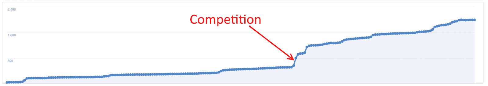
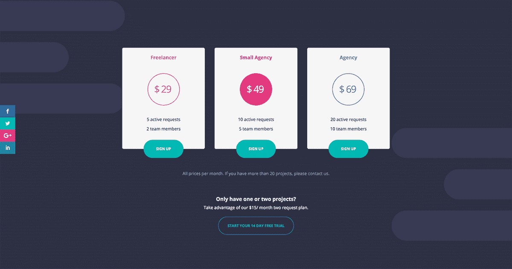
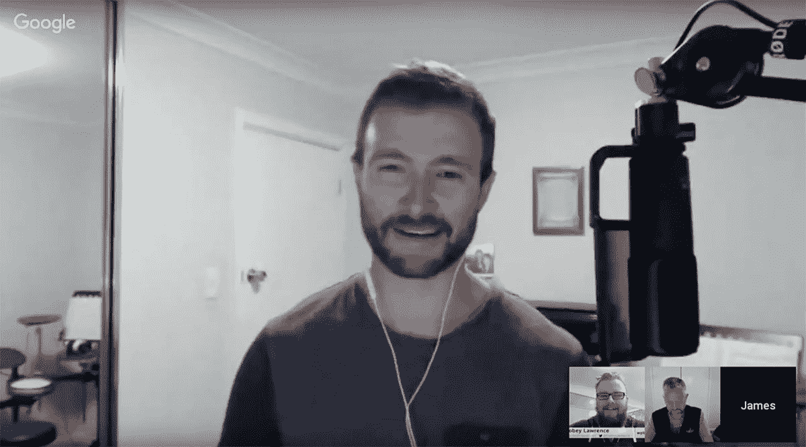

# 使用多方面的营销策略增长到每月 960 美元

> 原文：<https://www.indiehackers.com/interview/using-a-multifaceted-marketing-strategy-to-grow-to-960-mo-969fac56d8>

## 你好！你的背景是什么，你在做什么？

嘿！我是詹姆斯·罗斯，我做的事情太多了。我们的最新产品 [Content Snare](https://contentsnare.com) ，帮助网页设计师从客户那里获取内容。

我们还经营网络开发业务( [Aktura Technology](http://akturatech.com) )、条纹记账产品( [Silver 虹吸管](http://silversiphon.com))以及一款我有点羞于提及的老式桌面软件产品。

大学一毕业，我就进入了控制系统工程，这基本上是“工业编程”的另一种说法这是一种不同的编程，让机器自动运行，并为人们创造控制和监控设备的界面。

过了几年，一次偶然的机会，我了解了互联网营销。当时人们制作大量糟糕的网站，优化他们的搜索引擎排名，从广告收入中赚钱。

如果你是一名程序员，你需要学习或外包文案和营销。

TweetShare

当时，这个领域的大多数软件都很糟糕。在与我现在的商业伙伴马克共进午餐时，我们决定要做些更好的东西。所以，我们进入了 SEO 行业。

在埋头苦干了几年后，我们开始使用我们学到的网络技能来创建网站，并帮助当地客户进行 SEO。我们的目的一直是回归软件，因为这是我们所热爱的。我们发现，通过服务大量不同的客户，我们会发现另一个需要解决的问题。

花了几年时间，但我最终偶然发现了一个想法。在寻找方法来改进和自动化我们的网页设计过程时，有几个主要问题。那是 9 个月前。我们最近才完成测试版，而我们的月收入已经达到了 1000 美元。

## 是什么促使你开始使用内容陷阱？

它从一个完全不同的地方开始，而不是结束——网站的简报过程。我想要一种更好的方法来找出客户在他们的网站上想要什么。

我之前读过很多关于想法验证的文章。最重要的部分之一是在浪费开发时间之前与潜在用户交谈的重要性。

求助于各种在线社区和我当地的网页设计师网络，我安排了大约 15 个电话和会议。我们从头到尾报道了他们的过程，小心不要问关于我的想法的引导性问题。我们深入挖掘他们的任何痛点或挫折。事实证明，几乎所有的网站都存在从客户那里获取内容的严重问题。

就这样，简报工具被扔掉了，而[内容陷阱](https://contentsnare.com)的想法被卡住了。经营一家网站设计公司，我知道这个过程有多乏味。简单地坐下来，集中精力，想出一些关于如何制作软件来修复它的想法是相当合乎逻辑的。

此时，我在 90 分钟内创建了一个登录页面。我们开始通过现有的网络建立电子邮件列表，比如 LinkedIn 和脸书。当邮件列表达到 250 封左右时，我创建了一个基本的支付页面。它允许人们通过提前一年注册来获得很大的折扣。这让我们可以看到人们是否真的会注册。他们中的 25 个人做到了，这为我们带来了第一笔 1250 美元的收入。从电子邮件到一个根本不存在的产品有 10%的转化率，这看起来是相当有效的。

## 构建最初的产品需要什么？

我们现有的业务是软件开发，这有助于启动该项目。首先，收入允许我们资助发展。第二，专业知识已经存在。我们的开发者已经被审查过了。

在这一点上，我们非常有信心这个想法会飞起来，感谢预售，电子邮件列表，以及我们得到的反馈。这让我们比通常在 MVP 上花费更多。(事后看来，我认为我们做得有点过了，花了不该花的钱。我们当然可以削减很多东西。)

在开发之前，我们聘请了一位 UX 设计师来创建线框，然后进行设计。这真的很重要——它允许开发人员看到需要什么，从而使开发变得更容易。它还提供了我们用来预售产品的第一个模型。

 

我们已经有了一个巨大的功能电子表格，有些是原创的，有些来自采访和与脸书人的交谈。因此，在这一点上，我们坐下来，选择哪一个将成为 MVP，在时间范围内保持现实。

对于最小的特性集，我们试图隔离那些可以直接改善我们要解决的一个痛点的东西。这些客户以奇怪的格式和大量的电子邮件提供内容，他们必须不断地跟踪这些电子邮件以获取内容。因此，基于这种客户需求，例如，将内容直接导出到网站的潜在功能没有达到 MVP。

我们的团队主要由 Ruby on Rails 开发人员组成，我们希望用 Angular 2 创建一个单页面应用程序。所以在开始的时候，需要一点时间来获得新的技能。但是这些人接受了挑战，并在最初开发的 6-7 个月里完成了出色的工作(比最初的目标大约多了两个月)。

这一时期相当残酷，试图平衡我们现有的业务与发展，并建立预发布列表。我们不得不做很多工作来保持一切向前发展，但是构建一个新产品并看到社区的发展是非常令人兴奋的。让我们继续前进。

## 你是如何吸引用户和扩大内容陷阱的？

早在发布之前，脸书就已经是内容陷阱中最重要的东西了。这是以下因素的结合:

*   付费广告
*   加入其他团体
*   建立我们自己的团体

在发布前的大约六个月里，我们写了一堆博客文章。这些都是长的，高质量的，真正有帮助的帖子，对于我们的目标受众是网页设计师，这使得他们很容易在小组中分享，并让讨论进行下去。他们收到了很多感谢，并使人们意识到内容陷阱。我每周会在两到三个关键群体中发帖，并尽我所能帮助他人，这与我们的产品完全无关。

一旦我们有了自己的观众，我们就把他们引导到一个新的[脸书小组，该小组的目标是寻求发展业务的网页设计师](https://contentsnare.com/group)。这不是一个针对我们产品的群体，只是一个我们的目标受众可以去寻求建议的地方。

通过这些小组和 Twitter，我开始与我们领域的有影响力的人接触。他们中的一些人有播客。我得到的第一个播客采访完全是个意外。发了几条推特后，我被邀请去参加 [WP 创新者](https://angledcrown.com/podcast/)的活动。进展如此顺利，以至于播客成了我们战略的一部分。一旦你上了其中的两三个，你就可以用这些内容作为社交证明，在更多的网站上接受采访。

从那以后，已经有了六七个采访，这些采访在获取内容方面令人惊讶。很难给出确切的数字，因为在谷歌分析中，大部分流量都是“直接”进来的。但是每次采访直播后，总会有大量的人在“你是怎么知道我们的”表格中输入播客的名字。

我们还[进行了一次赠品](https://contentsnare.com/giveaway-helped-double-email-list-2-days/)测试，结果比我预期的好得多。赠品要求人们分享他们的特殊链接，以解锁一些与产品相关的奖励。这些事情是这样的:

*   测试版邀请/早期访问
*   两三个月的免费账户
*   邀请最多人的人享受终身折扣

这个策略**爆炸**。内容陷阱开始出现在网页设计者的大量群体中，出现在 Twitter 上，甚至出现在一些电子邮件列表中。

脸书广告也是一个核心策略。我们为博客文章制作广告来吸引人们访问网站。然后我们重新锁定这些访问者，让他们回来注册。这是一个相当低的预算，每天 10 美元左右，以获得缓慢的新注册。我们还通过电子邮件向所有新注册用户发送了赠品，鼓励他们分享。

最后，我们注意到有些人在寻找“[竞争对手名称]备选”，因此我们为这些关键词创建了几个网站页面。其中一个推动了缓慢的注册，但大多数人没有。我们处在一个大多数人都没有寻找的空间，所以 SEO 一直很难证明是正确的。

事后看来，创建社区是最好的事情。它帮助我们围绕常见问题提出博客主题，推动赠品，并在网页设计师中建立品牌认知度。

## 你的商业模式是什么，你是如何增加收入的？

对于内容陷阱来说，现在还是非常早期的阶段，所以现在我们的模型非常简单。这是典型的 SaaS 月度订阅，基于用户打开的“请求”数量。一个请求通常代表一个网站，所以开放的请求越多，代理就越大。

唯一的变化是最初的预发布，它以很大的折扣出售 12 个月的计划。

我们用[和](https://www.chargebee.com)建立了支付系统。我们从以前的软件中了解到，一开始就构建定制的东西是一件非常痛苦的事情。在现有的系统中构建处理优惠券、催款、升级、按比例分配和所有你不应该在早期考虑的东西更容易。

 

我们每月的经常性收入刚刚超过 1000 美元，大部分来自我们现有的用户群。老实说，这比我预期的要低一点。我们有很多用户报告说，虽然他们喜欢这个工具，但他们没有一个活动的项目来使用它。这意味着我们需要一场培育运动来让我们在时机到来时保持最佳状态。

发展业务从来都不容易。尽管进行了可靠的验证，解决了一个真正的痛点，并从用户那里获得了很好的反馈，但增长仍然没有达到我的预期。那可能只是因为我不切实际，或者我们还有事情需要努力。或者两者都有。

即使你做的每件事都“正确”……创业仍然需要很长时间。

TweetShare

## 你未来的目标是什么？

我们的主要目标是让[内容陷阱](https://contentsnare.com)成为 2500 名网页设计师的核心工具。但在此之前，最重要的事情是让它的收入能够让我们完全专注于这个产品。

我们正准备对著名的[牵引](http://tractionbook.com/)书的营销渠道进行一系列测试。一旦我们找到了一个对内容陷阱有效的方法，我们将会关注它。

理想情况下，我们可以引入帮助来为我们运行这些测试，但我们的收入还不允许这样做。

我会继续扩大这个小组，写文章，上播客，因为这些到目前为止都很有用。

与 WordPress 和 Zapier 等工具的集成对产品来说是一件大事，所以这也是一个重要的目标。

## 你面临的最大挑战和克服的障碍是什么？

最大的挑战是在一天中找时间做所有的事情。阅读牵引在这方面帮助很大。我有试图同时做所有事情的倾向，牵引力迫使我选择几件事情来钻研。

还没有真正的严重问题。在我看来，有很多事情似乎很严重，但结果证明是反应过度了。比如寻找竞争对手，听取不切实际的用户意见，或者担心增长。我们的上一个产品撞了很多墙，所以到目前为止这是一个不错的改变。

一切都归结于微小的、渐进的改进，比如增加一个电子邮件序列来吸引人们加入我们的小组和博客。或者撰写支持文章来帮助人们理解如何使用该产品。或者为用户录制视频。或者写新的内容来吸引更多的访问者。

有很多事要做！

## 有没有发现什么特别有帮助或者有优势的？

到目前为止，脸书集团是最好的。这有助于我们更好地了解我们的观众、他们使用的语言以及他们提出的问题。这反馈到营销，内容，搜索引擎优化和复制。

为了获得正确的产品，最初的面试也非常重要。如果那些电话没有发生，我们会制造出完全不同的产品。

为了吸引观众，参与到他们已经去过的地方会带来最大的网站流量。这些东西就像播客、其他脸书团体和博客。虽然这不是什么神奇的捷径，但它比从头开始构建要容易得多。

 

对于帮助，有一个你可以去问问题和获得帮助的地方总是好的。我参加了几个在线商务小组，里面都是愿意回答关于营销、工具以及其他任何在当时具有挑战性的问题的人。

对于我们其他人来说，听听类似于 [Startups 的播客](http://www.startupsfortherestofus.com/)可以帮助产生想法，让你保持动力。

## 对于刚刚起步的独立黑客，你有什么建议？

如果你是一名程序员，你需要学习或外包文案和营销。无论是在网上还是在当地的创业现场，我看到很多企业的网站或副本都非常糟糕。我从工程师变成了程序员。我花了好几年时间才学会写关于功能和技术的东西，学会如何写利益驱动的文章(这方面我还只是一般水平)。或许外包出去会更容易些。

我学到的最重要的事情是，即使你做的每件事都“正确”,每件事看起来都像要爆发一样，T2 仍然需要很长时间来建立一个企业。我们有一个不错的预发布列表和预售，我们有数百人谈论我们的产品，并在任何地方分享它...这仍然是一场缓慢而稳定的比赛。

我最喜欢的商业书籍是:

1.  [返工](https://www.amazon.com/Rework-Jason-Fried/dp/0307463745/)——杰森·弗里德
2.  [牵引力](https://www.amazon.com/Traction-Startup-Achieve-Explosive-Customer/dp/1591848369)——加布里埃尔·温伯格&贾斯汀·马雷斯
3.  从你所拥有的一切中得到你所能得到的一切
4.  [影响力](https://www.amazon.com/Influence-Psychology-Persuasion-Robert-Cialdini/dp/006124189X)——罗伯特·恰尔迪尼
5.  [艺术的战争](https://www.amazon.com/War-Art-Through-Creative-Battles/dp/1936891026)——史蒂文·普莱斯菲尔德
6.  永不分裂——克里斯·沃斯

## 我们可以去哪里了解更多？

内容陷阱可以在[contentsnare.com](https://contentsnare.com)找到。你可以在推特上关注[我或者查看](http://aktura.tech/jamestwitter)[内容陷阱博客](https://contentsnare.com/blog) & [脸书集团](https://contentsnare.com/group)。

——[<picture id="ember5275646" class="user-avatar ember-view user-link__avatar"></picture>神木](/jimmyrose?id=ZjvbCikxOveLeylqd9sPHKLdisE2)，内容网罗的创造者

## 想像 Content Snare 一样建立自己的事业？

你应该加入[独立黑客社区](/)！🤗

我们是几千名创始人，互相帮助建立有利可图的业务和副业。来分享你正在做的事情，并从你的同事那里获得反馈。

还没准备好开始使用你的产品吗？没问题。这个社区是一个认识人、学习和实践的好地方。随意[随便浏览](/)！

—[<picture id="ember5275651" class="user-avatar ember-view user-link__avatar"></picture>考特兰艾伦](/csallen?id=ibTLPyjwVebnZjMGKvz6ztarnuV2)，独立黑客创始人

5votes