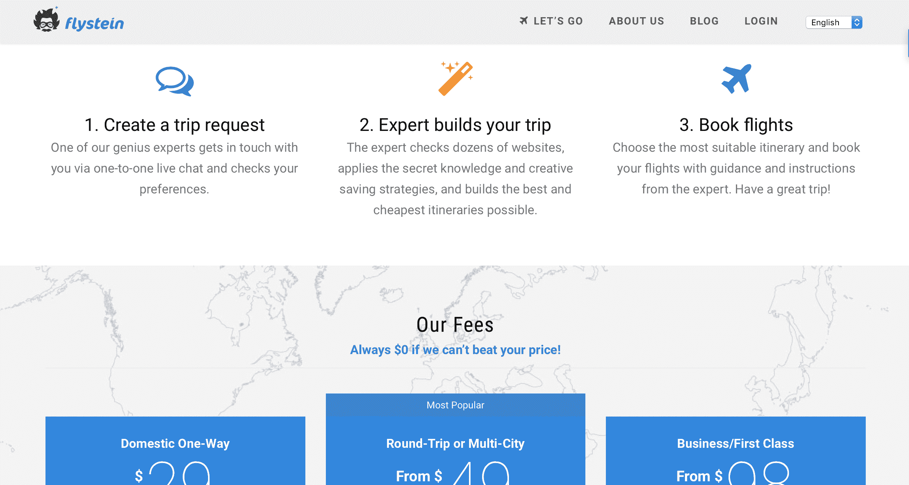

# 使用数据驱动营销将我的业务增长到每月 8，000 美元

> 原文：<https://www.indiehackers.com/interview/using-data-driven-marketing-to-grow-my-business-to-8-000-mo-427ddf1c90>

## 你好！你的背景是什么，你在做什么？

我叫 Roman Kalyakin，是一名软件工程师，也是一名旅行爱好者。

2015 年初，我联合创立了 Flystein，这是一家航班搜索服务公司，为旅客和航空旅行专家牵线搭桥。我们有一组专家，他们在充分利用航空公司、机场、机票和常旅客计划方面有着令人印象深刻的背景。在 Flystein，他们帮助我们的客户制定最好和最便宜的飞行路线。

自 2015 年推出以来，我们已经帮助近 2，000 名客户节省了机票费用。最近，我们平均每月收入 8000 美元。

 

## 是什么促使你开始使用 Flystein？

在 2015 年 1 月我随机遇到弗拉德·普罗塔索夫之前，我已经用“飞行黑客”的技巧为自己预订了几年的廉价航班。弗拉德坐 400€(约合 450 美元)的往返机票从欧洲来到澳大利亚，他也在做同样的事情，只是规模稍大一些。他有一群快乐的客户，他们定期付钱给他，以换取定制的行程，这些行程不仅方便，而且往往比他们在 Expedia 或 Kayak 上找到的任何东西都便宜得多。

聊了几个月之后，我们决定将这个小小的“一个人的管弦乐队”业务转变为任何人都可以使用的服务。我在为初创公司构建 MVP(最小可行产品)方面有丰富的经验，我构建了一些工具来自动化航班搜索。弗拉德比我知道更多的漏洞和技巧，并有向客户推销这些的经验。他还经常在飞行常客论坛上闲逛，并在那里保持着良好的关系网。

最棒的是这个想法已经被弗拉德证实了。我们只需要把它包装成一个漂亮的网络应用程序，召集一群“飞行专家”，并开始获得客户。我们花了一些时间来决定如何展示它。我们曾考虑过为飞行常客创建一个仅限受邀者的俱乐部，或者开发一些严肃的自动化工具，但最终决定从一个简单的付费服务模式开始。这是一个很好的决定，因为当时我们都有全职工作，所以冒险做一个需要几个月才能完成的东西可能只会让[弗莱斯坦](https://www.flystein.com)永远见不到天日。不久之后，我们决定试一试。

## 构建最初的产品需要什么？

我攀岩时严重扭伤了脚踝，几乎不能走路。因此，在我离开体育和社交生活的那几周，我白天做合同工作，晚上和周末为 [Flystein](https://www.flystein.com) 制作 MVP，审阅创业所需的文书工作，并与 Vlad 讨论初始产品功能。与此同时，弗拉德一直在招募我们的第一批专家。

我从构建 MVP 的常用堆栈开始:MongoDB 的 Node.js 在后端用于 API 和批处理作业，Angular.js 在前端用于两个 web 应用程序(一个用于客户端，另一个用于我们的专家)。

从简单开始。除非你完全无法使用谷歌文档，否则不要建立文档管理系统。

TweetShare

我们用了不到三个月的时间推出了该平台的第一个版本。

我们简单地讨论了从孵化器和天使投资者那里获得种子资金，但我们决定先建立一些简单的东西，尝试一下，看看我们是否需要更多的资本，这样会花更少的时间。

## 你是如何吸引用户和壮大 Flystein 的？

最初，弗拉德将他所有的个人客户都发送到了 Flystein，并使用我们的个人脸书和推特账户开始了大规模的游击营销活动。发布后的第二天，我们就有了第一个付费客户，这涵盖了建立业务、购买域名和托管的初始成本。

一旦我们惹恼了所有的朋友，并在我们自己的关系网中尽可能地延伸，我们就转向更传统的营销方法。我们推出了博客和邮件列表，并开始接触博客作者，与旅游领域的其他成长型企业建立合作伙伴关系。我们提供代销商佣金和折扣作为交叉促销的回报。

半年后，我们的一个客户偷偷把 Flystein 提交给了 [ProductHunt](https://www.producthunt.com/posts/flystein) 。我们的分析记录了 17，000 名访客。这个月我们的收入翻了两番，并教会了我们如何尽早使用 CDN(内容交付网络)来加快服务器的响应时间并减少负载。我们还决定为“飞行专家”的职位建立一个候选人库。

从那以后，我们尝试了不同的营销活动:每月简讯、Reddit AMAs 和付费广告。但我们发现，有影响力的博主发来的关于 Flystein 的电子邮件重定向和交叉推广博文是最有效的销售驱动力。

## 你的商业模式是什么，你是如何增加收入的？

我们的商业模式介于传统旅行社业务和市场平台之间，比如优步或 AirBnB。我们有一批专家，他们知道如何找到便宜的航班，并将它们与需要飞行但不愿向航空公司支付大笔费用的客户联系起来。客户向我们支付这项服务的费用，作为回报，我们会向他们提供个人建议，以及在哪里以及如何预订廉价航班的逐步说明。专家从客户支付给我们的费用中分得一份。

在我们推出之前，我们已经通过我们的朋友提出了人力航班搜索平台的想法。我们已经知道，我们的商业模式对于普通旅行者来说可能很难理解:如今任何人都可以在互联网上搜索机票，为什么你还要花钱请人来搜索呢？

从第一天起，我们就提供了保证:如果我们的专家找不到比客户能找到的更便宜的航班(减去我们收取的费用)，那么这项服务是绝对免费的。这个简单的概念很难沟通。我们试验了措辞、布局和结账流程，向新客户传达这一信息。但是两年后，我们仍然会收到很多电子邮件，都是同一个问题:“如果你找不到足够好的交易，会发生什么？”

我们使用 Stripe 作为支付网关。这非常符合我们“基于担保”的业务模式。要启动航班搜索请求，我们要求每个人输入信用卡详细信息。Stripe 针对我们的费用金额对卡进行预授权。如果我们无法保证找到比客户找到的航班更便宜的航班，授权就会被取消。

我们一直在尝试提供 B2B 服务。事实证明，这带来了良好而稳定的收入流。然而，在经营现有 B2C 业务的同时，赢得业务变得非常困难。我们意识到需要一个专门的销售人员和一个单独的平台来管理公司客户。

我们的定价方案已经包含了合理的利润。因此，我们从未试图大幅调整，担心我们的收入会下降。与此同时，我们注意到收入波动和成功的营销活动之间有很强的相关性。收入和旅游季节之间也有一点点明显的关联。然而，随着我们开始从不同的国家和大洲获取客户，这种相关性变得不那么突出了。

我们过去 3 个月的平均收入约为每月 8，000 美元(或过去 6 个月每月 6，000 美元)。

## 你未来的目标是什么，你打算如何实现它们？

我们的短期目标是完善我们的工作流程。Flystein 主要基于两件不可预测的事情:人与人之间的互动和航班价格的波动。通常需要大量的创造力来解决因沟通不畅、误解和票价突然变化而产生的问题。我们一直在慢慢地实现这个目标。

长期目标是进一步扩展到 B2B 领域，获得更多的企业客户。根据我们的经验，这大大减少了客户服务工作，并带来了更稳定的收入流。需要运送员工的企业通常全年都有，而偶尔出差的人一年只使用一两次 Flystein。

## 如果你必须重新开始，你会做什么不同的事？

当我推出 [Flystein](https://www.flystein.com) 的时候，我严重低估了与人打交道所需的时间和精力。这包括与我的联合创始人保持富有成效的关系，以及让我们的专家和客户满意。

如果我有机会重新开始，我会认真考虑找一位导师，当我和我的联合创始人有分歧时，他可以在我们之间进行调解。或者，我可能会尝试寻找第三位联合创始人，在决策过程中创造另一个平衡点。

即使我们现在有一个专门的客户服务代表，我也会在更早的时候寻找这个职位的人选。在实际客户报名少，负荷较轻的情况下，培训客服人员更好。

尽可能多地外包，为自己扫清道路，专注于业务发展。

TweetShare

我也有点后悔我们花了时间和精力去追求和建立伙伴关系，但最终却没有给我们带来任何价值。开始的时候我们有很多，但是当我们有了更多的经验后，我们变得更有选择性。

我强烈建议任何没有经验的互联网 B2C 创业者先看看是否有办法瞄准其他企业而不是消费者。如果可能的话，就这样做。

## 你最大的优势是什么？有什么特别有用的吗？

我们从第一天起就拥有的最大优势是，我们不需要经历产品验证阶段。以前在小规模上做过，我们已经知道我们能够在短时间内达到收支平衡。这帮助我们在没有外部启动资金的情况下，凭借自己的努力启动并度过了最初的几个月。

我们在一些营销决策上相当幸运。我必须说，其中一些的结果我无法确定。

首先看看是否有办法瞄准其他企业而不是消费者。

TweetShare

花费时间和精力与我的共同创始人发生分歧的不利之处，实际上来自于我们对事情的不同处理方式，我认为这本身就是一个很大的优势。弗拉德总是采取纯粹的机会主义方法来进行营销、销售和日常运营:如果有什么东西出现在我们面前，无论是建议还是想象，都应该尝试一下——最好是直接尝试。

我总是倾向于保持稳定的步伐，评估，参考数字，核实事实，并计划事情。这两种不兼容的方法通常会导致做出好的决定，要么尝试一下，要么避免浪费时间。

## 对于刚刚起步的独立黑客，你有什么建议？

创业可能会让人不知所措。在开始时，反馈如此之少，方向如此之多，很容易开始实现许多永远不会被使用或最终被证明是无关紧要的特性。从简单开始。除非你完全无法使用谷歌文档，否则不要建立文档管理系统。

尽可能多地外包，为自己扫清道路，专注于业务发展。很容易发现自己陷入了日复一日的运营任务中。

## 我们可以去哪里了解更多？

*   [www.flystein.com](https://www.flystein.com)
*   [www.twitter.com/flystein](https://twitter.com/flystein)
*   【www.facebook.com/flystein 号

如果您有任何问题，请不要犹豫，在下面提问。感谢有机会分享我们的故事！

——[<picture id="ember8041416" class="user-avatar ember-view user-link__avatar"></picture>罗曼·卡雅金](/RomanKalyakin?id=flystein-owner)，《飞来斯坦》的创作者

## 想像 Flystein 一样建立自己的事业？

你应该加入[独立黑客社区](/)！🤗

我们是几千名创始人，互相帮助建立有利可图的业务和副业。来分享你正在做的事情，并从你的同事那里获得反馈。

还没准备好开始使用你的产品吗？没问题。这个社区是一个认识人、学习和实践的好地方。随意[随便浏览](/)！

——[<picture id="ember8041421" class="user-avatar ember-view user-link__avatar"></picture>考特兰艾伦](/csallen?id=ibTLPyjwVebnZjMGKvz6ztarnuV2)，独立黑客创始人

4votes