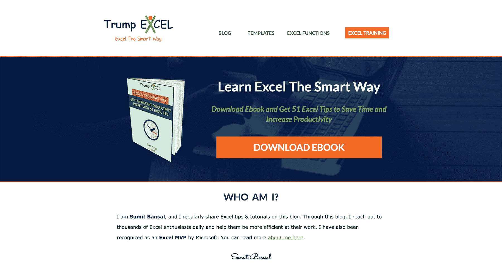
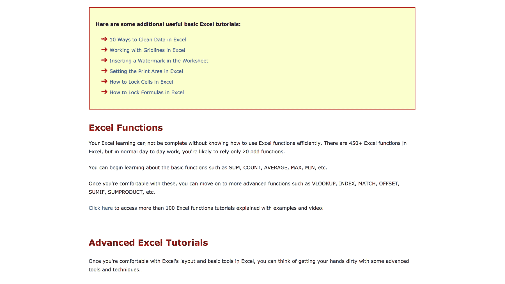

# 使用 Excel Experience 构建盈利的在线社区

> 原文：<https://www.indiehackers.com/interview/using-excel-experience-to-build-a-profitable-online-community-ce0aadf068>

## 你好！你的背景是什么，你在做什么？

我叫苏米特·班萨尔。获得金融 MBA 学位后，我开始在营销和咨询公司工作。7 年多来，我在市场营销部门担任各种角色。

2013 年，我开始[TrumpExcel.com](https://trumpexcel.com)分享我每天学习的 Excel 电子表格。并且在 2015 年 1 月，我离职全职做我的 Excel 网站。

TrumpExcel 多年来一直在增长，目前每月的浏览量约为 30 万次。我通过展示广告和出售我的在线课程来赚钱。我也偶尔推广其他附属课程。

目前，我每月的收入约为 4500 美元。

 

## 是什么激励你开始使用 Trump Excel？

我开始在 TrumpExcel.com 的[做兼职。我当时是一名数据分析师，我的日常工作包括使用 Excel 电子表格大约 4-5 个小时。随着我学习新的技术来更快地用电子表格完成工作，我决定创建这个网站，并以教程和视频的形式与他人分享我的专业知识。](https://trumpexcel.com)

我已经在 Excel 上看到了许多成功的网站，我知道这可能是一个有利可图的利基市场。随着我开始创作更多的素材，我的流量开始增长。

2014 年 7 月(大概是开始建站 14 个月后)，我被微软的[认定为 Excel 中最有价值的专业人士(MVP)。这个奖项是基于我对分享我的 Excel 知识和帮助人们学习该计划的承诺而授予的。](https://mvp.microsoft.com/en-us/PublicProfile/5000966?fullName=Sumit%20%20Bansal)

这极大地增强了我的信心。

## 构建最初的产品需要什么？

我的电子邮件订户是第一个建议我开发产品的人。

我一直在创作教程和视频，并在我的邮件列表和社交媒体上分享。虽然把流量带到 TrumpExcel.com 需要时间(因为搜索引擎优化需要时间)，但我的视频一炮而红。

YouTube 显示相关视频的算法对我有利。我的视频获得了大量的有机浏览量。人们订阅我的频道并发表评论。这让我有信心考虑创建一个在线视频课程。

我已经具备了创建课程所需的 Excel 技能，并且能够在大约一个月的时间里创建一个 14 小时以上的视频课程。但是因为我是全职工作，所以只能在周末工作。

避免抄袭他人。确定什么对你有用，并比别人做得更好。

TweetShare

一旦课程完成，我必须在我网站的会员页面上设置它。由于没有技术背景，对 WordPress 的了解也很少，这被证明是一个相当大的挑战。在最终选定正确的工具集之前，我不得不花很多天时间测试新的工具和支付网关。

鉴于我在印度之外，我能使用的支付网关很少。一些流行的支付网关，如 [Stripe](https://stripe.com/) ，在印度仍然不可用。贝宝是一个选择，但它禁止我接受来自印度的人的付款。最后，经过大量的研究和测试，我选择了 [FastSpring](https://fastspring.com/) 作为我的支付处理器。

## 你们是如何吸引用户，让 Trump Excel 成长起来的？

目前，我一个月有大约 30 万的浏览量。80%的流量来自搜索引擎，其余来自我的电子邮件链接、社交媒体和推荐。

当我开始的时候，我只是从社交媒体上获得流量。但是慢慢地，当我创造了更多的内容并受到关注时，我开始获得反向链接和搜索引擎流量。我的流量增长是持续的。

与此同时，我确保自己收集了电子邮件地址，并在社交媒体上表现良好。截至目前，我有 25000 多个电子邮件订阅者，23000 多个脸书页面赞，15000 多个 YouTube 订阅者，以及 18000 多个 Twitter 关注者。

我的大部分精力都花在了制作教程和视频上。我不是 SEO 专家，所以我不会花太多时间在主动建立链接上。

对我有效的做法是为我写的每个教程创建一个视频。这有助于人们体验我的教学风格，也有助于获得更多的课程销售。用外行人的术语解释难懂的概念对我来说很容易，这也是我最大的优势。

我已经在 Excel 上看到了许多成功的网站，我知道这可能是一个有利可图的利基市场。

TweetShare

到目前为止，我有三个[在线课程](https://trumpexcel.com/excel-training/)，我定期发布这些课程，只开放 5-7 天。在我最近的一次创业中，我赚了大约 9000 美元。

现在，我每天都能收到 60-70 封电子邮件。我根据它们来自的页面和它们点击的链接对它们进行分类。这让我可以给他们发送相关的教程。

我对初露头角的网上创业者的建议是，从第一天起就获取电子邮件地址并保留一份清单(尤其是在数字信息产品领域)。你邮件列表上的人参与度很高，更有可能转化。

## 你的商业模式是什么，你是如何增加收入的？

截至目前，[TrumpExcel.com](https://trumpexcel.com)通过三种方式赚钱:

**展示广告**:这里我用的是 Goole Adsense。由于我获得了大量的浏览量，这使得我每月在广告上赚了一大笔钱。除了我的网站，我还在我的 YouTube 频道上使用广告。随着我在那里添加更多的视频，我看到 YouTube 的广告收入也在增加。

课程销售:这是我赚钱最多的地方。每两个月，我都会做一次迷你产品发布会。目前，我有三种价格在 127-297 美元之间的课程。

**代销商**:有时候，我也会推荐我认识的其他 Excel 专家的代销商产品。我不常这样做，因为这有时会与我自己的产品发布相冲突。

 

在我多年来所做的课程发布中，我测试了多个价位。当我推出我的第一款产品时，我把它定价为 99 美元。它做得很好。然后，当我把它定价为 67 美元时，它的表现一点也不好。后来，我把价格提高到 127 美元，我发现这是最好的价格。

我还不断在我的课程中添加新内容，不断为我现有的学生提供更多价值，并使网站对新的潜在客户更有价值。

## 你未来的目标是什么？

我未来 12 个月的目标是:

*   持续创建高质量的教程(至少每周一次)。
*   创建 1-2 门新的在线课程。
*   将月浏览量提高到 50 万以上的水平。
*   通过创建新的权威网站使收入来源多样化

虽然我不需要做任何不同的事情来实现这些目标，但我看到的主要障碍之一是持续地创建内容。由于这是一个非常小众的话题，我一直没能找到能为我创作内容的作家。

关于多样化我的收入，我也正在创建另一个权威网站。它已经在[生产现场](https://productivityspot.com)上线。

我将在我现有的网站上模拟这个网站，但我用不同的商业模式创建它。我的目标是用谷歌广告和附属公司只赚钱。

## 你面临的最大挑战和克服的障碍是什么？如果你必须重新开始，你会做什么不同的事？

我面临的最大挑战是让自己熟悉技术和工具。我必须学习如何编辑 CSS 代码，如何管理 WordPress 和主机，如何编写销售页面，如何制作和录制视频等等。

但是既然这些都已经完成了，我可以用更少的努力和时间开始一个新的网站。

我犯了两个错误，我需要从中吸取教训:

*   投资于我并不真正需要的工具。我是一个彻头彻尾的工具迷，我会投资每一个引起我注意的闪亮的新工具。这导致了每月巨大的订阅费用。我现在已经把工具减到最少。
*   我外包得不够早。我会尝试设计所有的社交媒体图片，并自己解决所有的技术问题。如果我今天重新开始，我会尽可能多地将它外包出去。

## 有没有发现什么特别有帮助或者有优势的？

我是一名在家工作的企业家，完成工作需要巨大的动力和纪律。

我听了很多播客，我发现[的人真的很有帮助。他们不仅谈论经营网上业务，还谈到挑战和心态。](https://fizzle.co/show)

我也发现阅读小说非常有帮助。它帮助我脱离现实世界。我也是网飞和亚马逊 Prime 视频的超级粉丝。

对我的健康和工作产生积极影响的生活方式改变之一是使用立式办公桌。除了消除背痛，它还帮助我完成了更多的工作。

## 对于刚刚起步的独立黑客，你有什么建议？

我的建议是避免抄袭他人。相反，试着找到你自己的工作方式。确定什么对你有用，并比别人做得更好。

此外，许多新创业者会被其他博客作者赚了多少钱或者一家新公司获得了多少资金弄得不知所措。虽然知道这一点很好，但不要让它影响你的决定。

我极力推荐的另一件事是“伸手”。尽早寻求帮助。不要试图成为那个能解决所有问题的人。求助，继续前进。

## 我们可以去哪里了解更多？

你可以看看我的网站—[TrumpExcel.com](https://trumpexcel.com)和[ProductivitySpot.com](https://productivityspot.com)。

你也可以在推特上联系我: [@trumpexcel](https://twitter.com/trumpexcel) 。

我喜欢谈论创建权威网站和分享我目前为止在旅途中学到的东西。如果有兴趣，就给我喊一声。

你也可以在下面的评论区问我任何问题。

—[<picture id="ember7999171" class="user-avatar ember-view user-link__avatar"></picture>sumitbansal](/sumitbansal?id=drzEOiuhYmOs55sBqJA8MCUfWzi1)，王牌 Excel 的创造者

## 想像川普 Excel 一样建立自己的事业？

你应该加入[独立黑客社区](/)！🤗

我们是几千名创始人，互相帮助建立有利可图的业务和副业。来分享你正在做的事情，并从你的同事那里获得反馈。

还没准备好开始使用你的产品吗？没问题。这个社区是一个认识人、学习和实践的好地方。随意[随便浏览](/)！

—[<picture id="ember7999176" class="user-avatar ember-view user-link__avatar"></picture>考特兰艾伦](/csallen?id=ibTLPyjwVebnZjMGKvz6ztarnuV2)，独立黑客创始人

7votes