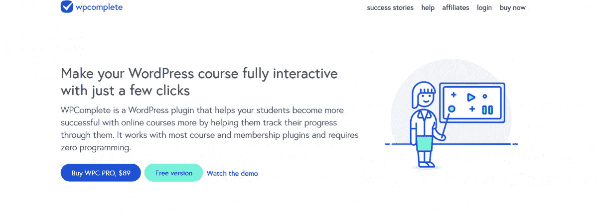
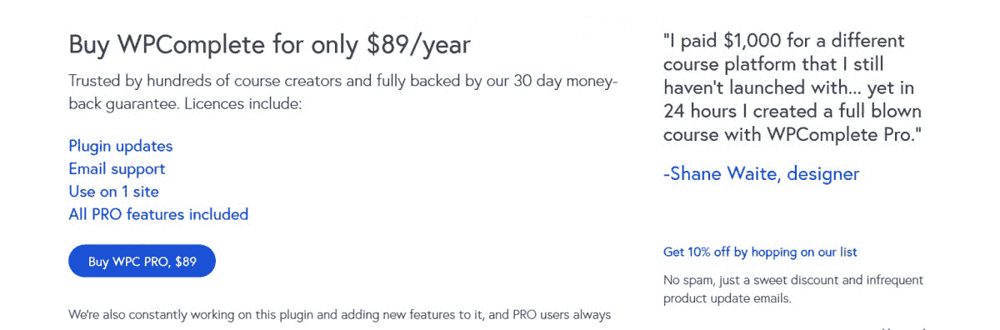

# 利用洞察力和邮件列表从副业项目中每月赚 15000 美元

> 原文：<https://www.indiehackers.com/interview/using-insight-and-a-mailing-list-to-make-1-5k-mo-from-a-side-project-1ed7f712b4>

## 你好！你的背景是什么，你在做什么？

嗨嗨。

我的名字是保罗·贾维斯，你需要知道的关于我的大部分信息都在这次采访中。我和我的商业伙伴 [Zack Gilbert](https://twitter.com/zackgilbert) 一起在 [WPComplete](https://wpcomplete.co/) 上工作。扎克和我还一起建立了一些其他项目，如 of course books(2017 年出售)、 [YourPack](https://yourpack.co) 和 [Fixtail](https://fixtail.com) 。

WPComplete 源于我个人对 WordPress 课程功能的需求。有很多很棒的软件，只要点击几下就可以把任何 WP 网站变成在线课程，但是没有一个软件解决方案能够让学生跟踪他们在课程中的进度(或者让教师/管理员跟踪学生的整体进度)。

2016 年，我聘请扎克作为自由职业者，专门为我的课程开发一个插件，他做到了(他也做得很好)。我不知道会发生的是，在我所有的课程都添加了这一功能后，我收到的主要问题是学生们问:“嘿，你的课程很棒，但我可以购买让我跟踪我的进度的插件吗？”。我收到的关于 WPComplete 功能的邮件比我收到的关于课程内容的邮件还多。

所以，Zack 和我聊了聊，决定把我课程的定制插件变成一个免费的插件，任何人都可以从 WP 插件目录下载或者直接从我们这里购买。从那时起，该插件已经从能够向任何页面或帖子添加单个按钮发展成为任何 WP 课程平台的全功能附加，允许客户创建多个课程，向同一页面添加多个按钮，显示各种跟踪视觉效果，创建“同行压力”消息(例如。“56%的学生已经完成了本课”)，列出每门课程的课程，并显示哪些已经完成，哪些没有完成。此外，它还显示“有条件的”内容，只有在课程完成或未完成时才会出现。我们也在不断增加更多的特性和功能。

目前，我们有 800 多名免费用户，527 名付费用户，我们已经创造了 33，488.49 美元的收入。

 

## 构建最初的产品需要什么？

当时我有 4 门课程，大约有 8000 名学生在学习。所以我有预算雇佣一个开发人员(Zack)来为我的课程构建自定义插件，这是该软件的一个很棒的版本。构建第一个版本花了大约一个月的时间，然后又花了大约两个月的时间构建一个任何人都可以购买和使用的免费和付费版本。

WPComplete 采用年度许可模式。这在 WP 插件领域相当流行。客户每年支付 89 美元，它带有免费更新(如附加功能)、支持和单一网站的许可证(注意:它在大多数开发环境下自动激活，如“anydomain.local”、“anydomaindev”或“localhost”)。

我们使用 [Easy Digital Downloads](https://easydigitaldownloads.com/) 来推动支付和许可，因为它非常容易使用，而且他们的支持团队是一流的。这样，我们就不必构建支付引擎、许可软件或其他任何东西。我们将他们的许可代码插入我们的插件，上传一个 zip 文件，连接 Stripe 和 Paypal。

Easy Digital Downloads 是一套工具，是 WordPress 的插件，所以我们特别使用了以下内容来创建我们需要的功能，以销售一个带有年度许可证的插件:

*   轻松的数字下载
*   轻松的数字下载:贝宝网站支付专业版和贝宝快捷网关
*   轻松的数字下载:定期支付
*   轻松数字下载:软件许可
*   轻松的数字下载:条纹支付网关

这让我们每年花费 400 美元来获得一个真正全功能的销售 Wordpress 软件的方法。

我们的免费版插件托管在 WordPress.org，这为付费版带来了可观的流量和客户，因为 WP 社区非常庞大。

## 你是如何吸引用户并发展 WPComplete 的？

WPC 最初的吸引力来自我自己的观众。我有一个大约 30，000 名订阅者的邮件列表，目前有大约 14，000 名学生在学习我自己的课程(所有课程都运行 WPC)。

所以当我们开始免费出售 WPC 时，我首先告诉的人是我的列表和我的学生。我已经知道我的许多学生有他们自己的课程或者想要有他们自己的课程，所以对那些人来说这是一个相当容易的推销，因为他们已经熟悉了 WPC 所做的事情，因为他们在从我这里学到的课程中使用了它。

由此，我认为我们主要通过三种方式吸引用户:

1.  **我的私人观众**。他们中的许多人是独立黑客、自由职业者和在线课程创作者。我每周在[我的时事通讯](https://pjrvs.com)中给他们发一次电子邮件，并经常谈论 WPC。
2.  **WordPress.org**。一旦人们找到并安装了功能有限的免费版本，他们就会迷上 WPC 能为他们的课程做些什么，很多人最终会购买专业版。
3.  **WP 影响者的口碑**。我们真的尽了一切可能让 WPC 成为一个伟大的软件，可以与大多数在线课程软件、大多数主题一起工作，并且可以与大多数其他插件一起很好地运行。我们的支持(扎克和我自己的支持)也是积极的和有益的。通过这样做，我们的插件脱颖而出，并在在线课程软件综述博客帖子中被谈论([就像这个](https://www.elegantthemes.com/blog/divi-resources/creating-a-learning-management-lms-website-with-divi))，我被 WP 社区的人采访，分享他们的“课程堆栈”的在线课程创建者一直提到我们。

我认为，由于 WPC 是出于我个人对这类软件的需求而发展起来的，而且我是它的目标市场，所以我对什么是需要的、什么是可以忽略的以及如何推销它有很好的洞察力。我还有一个好处，那就是我的工作有很多热情的观众，这些人信任我，信任我发布的产品。此外，扎克和我以前合作过，我的观众已经和我一样了解和喜欢他了。

我认为，由于 WPC 是出于我个人对这类软件的需求而发展起来的，而且我是它的目标市场，所以我对什么是需要的、什么是可以忽略的以及如何推销它有很好的洞察力。

TweetShare

最后，因为我们的软件有一个年度许可证，每个月(因为我们已经存在一年多了)我们都会看到新的销售和来自许可证更新的经常性收入。第一年过去了，我们看到了复合收入，这很好。

 

## 你的商业模式是什么，你是如何增加收入的？

我们的商业模式一直是增长是利润的直接结果。我们从来没有从外部来源拿钱，随着更多的收入产生，我们在 WPC 上花费时间。

Zack 和我都没有把 WPC 当成什么比副业更重要的事情，这对我们来说很好，因为我们还有其他事情要做。我们喜欢这个项目，并在需要的时候专注于它，但这并不要求我们任何一方全职参与，收入也不会支持这一点。

我们的费用是*所以*最少。我们支付托管费(120 美元/年)和 EDD 软件许可费(403.20 美元/年)，仅此而已。因此，我们每年需要销售 6 份 WPC 副本来满足这一需求(我们每个月都这样做，在过去的 12 个月中，平均每月 20 份许可证)。我们使用 MailChimp 的免费版本给我们的客户发电子邮件，并在我的邮戳帐户上为交易电子邮件提供免费积分。

我们的 Stripe 与 PayPal 在客户支付方式上的差异几乎相等，而且由于我们使用 EDD，两者都花了几秒钟整合。我们目前平均每月收入超过 1，500 美元，在过去几个月中，新客户和现有客户的收入平均分配。

## 你未来的目标是什么？

我认为 WPComplete 的未来不会有太大变化。我们有一个很棒的超级利基软件产品，运行良好，我们的客户喜欢它。随着收入的不断增加，我们将继续慢慢增加和完善功能。

正如我所说的，Zack 和我在生活和工作中都有其他的关注点，但是 WPC 仍然是我们都喜欢从事和支持的一个很棒的副业项目。我认为这不会改变。

当 Gutenberg 最终出来时，我们显然必须做一些工作，因为人们如何向 WordPress 添加内容(以及使用插件向 WordPress 添加内容)将会有很大的改变。

## 你面临的最大挑战和克服的障碍是什么？如果你必须重新开始，你会做什么不同的事？

很容易，对于任何 WordPress 软件来说，最大的挑战是它只是一个更大的软件集合中的一部分，全部由不同的人编码。

所以我要说，我们的大多数支持请求与我们的插件无关，主要与服务器设置、主题播放不佳的问题或破坏我们代码的其他插件有关。

我们可以很容易地告诉大多数顾客，“对不起，你的错误不是 WPComplete 的错，拜拜！”到此为止，但在早期，Zack 和我认为这不是对待客户的方式，尽管从技术上讲，大多数问题都不是由于我们的软件。因此，我们总是尽力提供帮助，不管是什么代码或服务器设置导致客户的课程出现故障。是的，这肯定会很耗时，但它为我们的软件和支持带来了很好的口碑，并且没有很多客户流失或客户不续订他们的许可证。

老实说，我们不知道会是这种情况，因为我们的其他软件产品是独立的，不会因为其他软件问题而中断。所以一开始意识到一个 WordPress 产品需要如此多的支持是令人震惊的。也就是说，现在我们知道了，我们肯定会做更多的测试，在有其他插件、其他主题、其他课程软件等的网站上尝试我们的插件。因此，推出新功能会慢一些，但从长远来看，这会节省时间。

## 对于刚刚起步的独立黑客，你有什么建议？

我真的认为，理解你想为谁服务是很多新软件公司所忽略的一大块。WPC 之所以有效，是因为我存在于我们服务的领域中，我非常了解这个领域，并且与这个领域有着密切的联系。

了解你想为谁服务是很多新软件公司忽略的一大块。WPC 之所以有效，是因为我存在于我们服务的领域中，我非常了解这个领域，并且与这个领域有着密切的联系。

TweetShare

举个例子，如果我想卖房地产软件。我只认识一个单身的房产经纪人(我的房产经纪人)，由于我很久没买过房产或房子，我们已经很多年没说过话了。我不知道这个市场，不知道其中的玩家，也不知道他们的需求是什么。如果我为房地产开发软件，大部分都是猜测。

然而，对于在线课程世界，这就是我的背景。我了解玩家(我就是其中之一)，也了解客户(因为我现有的课程中有 14000 名客户)。所以我用课程软件做的决定不仅仅是基于我的猜测，而是基于数据和知识。对我来说，推销和谈论在线课程软件也更容易，因为我的观众知道我是做什么的，并且相信我比其他人(比如房地产经纪人)更了解它。)

我们需要自负来从零开始构建一些东西，因为它基于一个假设，即我们可以做得比市场上现有的更好(否则，如果没有那点自负，我们只会使用现有的产品)。所以自我，在这种情况下，是伟大的，必要的。事情可能出错的地方，这在我个人身上发生过，也在我的朋友身上发生过，是如果自我开始妨碍了决定。

我的意思是，有时我们认为自己最了解，但实际上我们对市场、客户或他们的需求知之甚少。我们越是依靠同理心而不是自我，我们就越能设身处地为潜在客户着想，真正理解他们的需求和动机。从长远来看，这只会让我们受益，因为我们会对我们的产品做出更明智、更明智的决定。

## 我们可以去哪里了解更多？

我的网站是 pjrvs.com 的，扎克的是 zackgilbert.com 的 T2 的。在 [pjrvs](https://twitter.com/pjrvs) 和 [zackgilbert](https://twitter.com/zackgilbert) 我们都在推特上。

WPComplete 可以在[wpcomplete.co](https://wpcomplete.co)找到，免费版本在[WordPress.org](https://wordpress.org/plugins/wpcomplete/)上。

如果你有任何关于创建或销售 WordPress 插件的问题，请在下面提问！扎克或我会尽力给你一个答案。

👋

——[<picture id="ember7992177" class="user-avatar ember-view user-link__avatar"></picture>pjrvs](/pjrvs?id=BHvEdjamzebbLVjl1SQWkaZazpG2)

## 想像 WPComplete 一样建立自己的事业？

你应该加入[独立黑客社区](/)！🤗

我们是几千名创始人，互相帮助建立有利可图的业务和副业。来分享你正在做的事情，并从你的同事那里获得反馈。

还没准备好开始使用你的产品吗？没问题。这个社区是一个认识人、学习和实践的好地方。随便去[随便浏览](/)！

——[<picture id="ember7992182" class="user-avatar ember-view user-link__avatar"></picture>考特兰艾伦](/csallen?id=ibTLPyjwVebnZjMGKvz6ztarnuV2)，独立黑客创始人

44votes