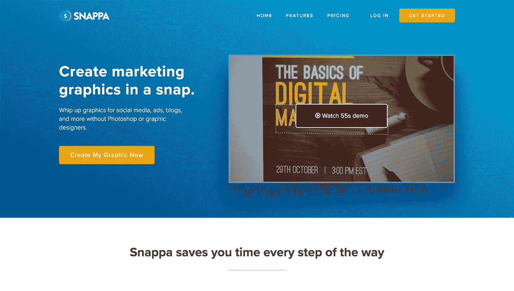
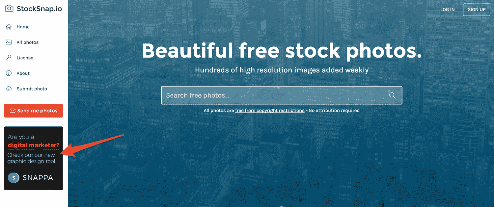
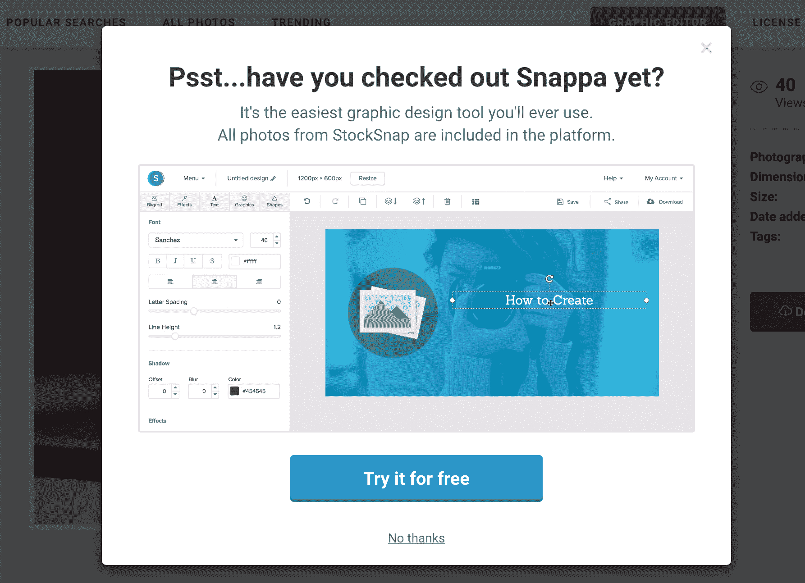
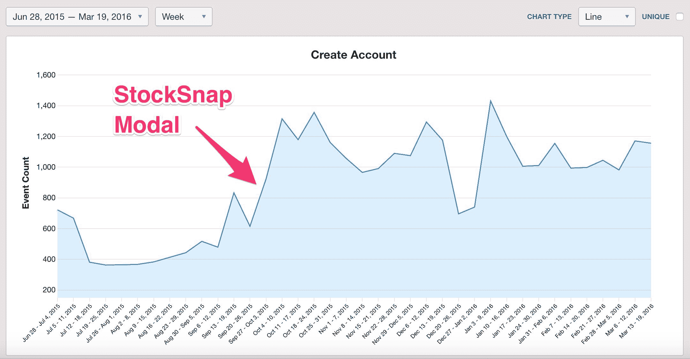

# 使用低成本营销策略创造每月 26k 美元的收入

> 原文：<https://www.indiehackers.com/interview/using-low-cost-marketing-strategies-to-generate-26k-mo-302fb5f585>

## 你好！你的背景是什么，你在做什么？

你好。我叫 Christopher Gimmer，是 SaaS 一款帮助非设计师创作在线图形的应用程序 [Snappa](https://snappa.com) 的联合创始人。

在投身创业之前，我实际上是加拿大政府的一名金融分析师。在这样做了 5 年后，我最终厌倦了公司生活，开始对建立一个在线业务感兴趣。在完成了几个不同的项目(有些成功，有些失败)后，它最终将我引向了 Snappa。

Snappa 让为社交媒体、广告、博客等制作图片变得异常简单，无需依赖 Photoshop 或图形设计师。Snappa 通过预设的图像尺寸、预先设计的模板和巨大的内置照片、图形和字体库，为您节省每一步的时间。

自 2015 年 11 月推出以来，使用我们的软件已经创建了超过 100 万张图像，我们在 MRR 的销售额刚刚超过 26，000 美元。

## 是什么促使你开始使用 Snappa？

在我们推出 [Snappa](https://snappa.com) 之前，我和我的联合创始人马克(Marc)正在开展一项名为 [BootstrapBay](http://bootstrapbay.com) 的业务，这是一个高级 Bootstrap 主题和模板的市场。在发展业务的同时，我们发现内容营销和搜索引擎优化非常有效。

因为只有我们两个人，所以我负责撰写和发布我们博客上的所有内容。然而，我与设计师相去甚远。每次我需要为博客创作图片时，都是一场持续的斗争。尽管我知道 Photoshop 的基本知识，但创建图像花费的时间太长了，而且它们看起来也不怎么样。

当我环顾四周，看看有什么，我发现其他图形设计工具分为两类。它们要么有大量的功能，但很难使用，要么很容易使用，但功能有限。随着内容营销和社交媒体越来越重要，我认为需要一种既易于使用，又能提供足够功能来创建高度吸引人的图像的图形设计工具。

从本质上说，我希望有一个平面设计工具，供像我这样的营销人员和企业家使用。

 

## 你做了什么来证实这个想法吗？

大约在这个时候，我在[上写了一篇博客，在那里可以获得免费的股票照片](https://blog.snappa.com/free-stock-photos)，这篇博客迅速走红。不久之后，由于 CC0 运动变得如此流行，我们决定创建我们自己的免费股票照片网站。(CC0 是一个“无版权保留”选项，实际上意味着放弃你在作品中拥有的所有版权和类似权利，并将这些权利奉献给公共领域。)

在产品搜索上推出 StockSnap 并在我们的博客文章中链接到它之后，它开始腾飞。接下来你知道，我们有一个股票照片网站，每月产生超过 100 万的浏览量。我们知道这些用户中的一些人可能会对像 Snappa 这样的工具感兴趣。

不要浪费几年时间试图想出一个完美的主意，因为它很可能会失败。

TweetShare

在接下来的一个月左右，我开始验证一个面向营销人员和企业家的图形设计工具的想法。我首先向选择订阅我们的 StockSnap 时事通讯的人发送了一份调查。这项调查只是问人们使用我们网站上的库存照片做什么。绝大多数人说是博客和社交媒体，这正是我们希望 Snappa 服务的受众。

调查结果出来后，我对部分受访者进行了跟进，并进行了约 10-15 次 Skype 采访。我想知道他们当前创建图形的流程是什么，他们的痛点是什么。事实证明，我采访的许多人都在经历和我完全一样的挣扎。对我来说，这已经足够验证构建一个初始原型了。

那时，我们决定将 BootstrapBay 置于自动驾驶状态，并开始将所有精力投入到 Snappa 上。Marc 开始开发最初的原型，而我则致力于建立一个发布列表。

## 建造最初的原型需要什么？

我们创办的第一家企业是一家名为 ClassmateCatch 的学生交友网站。大约花了 4 个月的时间来建造(晚上和周末)，业务最终失败。决心不再犯同样的错误，我们开始尽我们所能构建最基本版本的 [Snappa](https://snappa.com) 。

在这个时间点上，Marc 还在做一天的工作，所以他没有太多的时间来开发产品。我们也没有钱雇佣其他开发人员。使用 PHP 和 [FabricJS](https://github.com/kangax/fabric.js/) 作为我们的客户端编辑器库，Marc 在 2015 年 3 月底开始编写前几行代码。

三个月后，我们在 2015 年 7 月 1 日发布了我们最初的公开测试版。这是非常基本的。它没有模板，你不能搜索内置图形，甚至不能保存你的设计。但是尽管缺乏特色，人们对这个产品的反应还是不错的。

我们通过[堆分析](https://heapanalytics.com)跟踪产品的使用情况，我们看到创建的图像数量每周都在增加。我们还注意到，许多用户不断回来创建新的图形。这给了我们推动初始版本并开始对产品收费的信心。

尽早发布测试版的好处是我们从用户那里得到了反馈。一些我们认为不那么重要的特性结果却非常重要(反之亦然)。如果我们继续自己开发产品而不发布测试版，我们可能会浪费很多时间来构建错误的东西。

我们意识到，一个改变游戏规则的功能比十个“最好拥有”更有价值。

TweetShare

我们使用 [Trello](https://trello.com/) 跟踪所有收到的反馈(直到今天我们仍然这样做)。随着反馈的到来，我们试图确定哪些对发布绝对重要，哪些不重要。我们知道，我们等待充电的时间越长，我们等待*真正*验证产品的时间就越长。

在我们推出测试版后，Marc 也请了假，所以我们两个都靠 BootstrapBay 生活，自从我们把它置于自动驾驶状态后，它的利润就开始下降了。考虑到我们正在启动 Snappa，我们需要尽快创收。

我们写下了几个我们认为绝对必要的关键特性，并向自己发誓，在我们产生收入之前，我们不会开发任何其他不在这个列表上的特性。信守承诺，我们构建了这些功能，并于 2015 年 11 月 22 日以免费增值模式正式推出了 Snappa。

## 你们是如何吸引用户，壮大 Snappa 的？

**交叉推广**

在早期，StockSnap 对于 [Snappa](https://snappa.com) 的成功绝对至关重要。我们不仅能够向这些观众验证我们的想法，我们还几乎完全从这个用户群中建立了我们的发布列表。为此，我们在 StockSnap 的侧边栏中添加了 Snappa 的横幅广告。

当用户点击那个横幅时，它会把他们带到一个登陆页面，在那里他们可以注册 Snappa beta。在我们构建 Snappa 的三个月时间里，我们的发布列表增加到了 2，754 个电子邮件订户。

测试版上线后，我们继续使用 StockSnap 交叉推广 Snappa。看到它在构建我们的初始发布列表时的效果，我们开始优化从中可以获得的注册数量。在运行了几个不同的测试后，我们能够通过添加一个带有动画 gif 的模型，在有人在 StockSnap 上下载了他们的第一张图片后，我们的注册人数增加了近三倍。

实施该模式后，我们的注册人数从平均每周 400 人增加到超过 1000 人:

**SEO 和内容营销**

一旦我们优化了可以从 StockSnap 获得的注册数量，而又不显得过于咄咄逼人，我们就测试了各种其他营销渠道。Snappa 的低价位使得付费广告几乎不可能。这也使得开展任何需要大量资源的营销工作变得困难。

因此，我们决定将重点放在内容营销和 SEO 上，这是一种可扩展的“免费”方式来产生流量。我在以前的业务中也有这方面的专业知识。

在对各种类型的内容进行实验后，我们发现长形式的常青树内容效果最好。我们转而采用两周一次的发布时间表，只写那些有潜力带来可观的有机流量的内容。我们使用了像谷歌关键词计划器、 [AHFREFs 关键词浏览器](https://ahrefs.com/keywords-explorer)和 [KeywordTool.io](http://keywordtool.io/) 这样的工具来寻找相关关键词。

通过日复一日地关注小的增量成功，你会震惊于它们会滚雪球般越滚越大。

TweetShare

我们还优先考虑漏斗中底部的内容。例如，我们注意到“Twitter 标题大小”每月被搜索 30，000 多次，这个主题与我们的目标受众高度一致。因此，我们写了一篇关于[完美 Twitter 标题尺寸](https://blog.snappa.com/twitter-header-size/)的帖子，并在帖子中直接添加了行动号召。这篇帖子每月为 Snappa 带来 500 多名注册用户，此后我们一直致力于更多类似的内容。

**产品搜寻**

我们也想像大多数软件产品一样推出产品搜索。然而，由于我们在发布时已经获得了稳定的牵引力，我们决定等到产品更加成熟时才真正实现利益最大化。

我们终于在 2015 年 6 月[启动了产品搜索](https://www.producthunt.com/posts/snappa-2)，在我们实际发布产品 7 个月后。我们以超过 1000 次的投票成为当天的第一产品。我们还被评为 2016 年夏季推出的[最受欢迎产品之一](https://medium.com/product-hunt/the-44-most-loved-products-launched-in-summer-2016-deaa36125316#.1qzcgm2yc)。等待在 PH 上发布绝对是正确的策略。

**合伙企业**

另一件对我们来说非常有效的事情是与我们领域中没有竞争关系的公司合作。

在我们推出后不久，我们的一位客户向我介绍了 LeadPages 的业务开发主管。然后我们进行了一次非常成功的促销活动，他们以很低的折扣购买了我们产品的年度许可证，然后作为免费奖励提供给升级到年度计划的 LeadPages 客户。这导致了我们最大的一周销售额，并产生了大量的曝光率。

看到这一活动取得成功后，我们联系了 SaaS 的其他公司，与相扑和微光开展了类似的推广活动。

**口碑**

自然地，随着我们的产品吸引越来越多的注册，口碑开始传播开来。

借鉴亚历克斯·特恩布尔(Alex Turnbull)的剧本(playbook)中的一页，我在早期有一封自动发送的电子邮件，询问人们为什么注册 Snappa。数量惊人的人说他们注册是因为朋友或同事的推荐。

此外，我们开始在许多营销博客上发表文章，并被有影响力的人分享。我认为我们产品的免费增值性质肯定有助于口碑和推荐。

自推出以来，付费用户稳步攀升至 2000 多名。

| 月 | 收入 |
| --- | --- |
| 十一月 | 238 |
| 十二月 | 389 |
| 一月 | 495 |
| 二月（February 的缩写） | 561 |
| 瑕疵 | 722 |
| 四月 | 884 |
| 五月 | 946 |
| 六月 | 1105 |
| 七月 | 1196 |
| 八月 | 1341 |
| 九月 | 1492 |
| 十月 | 1592 |
| 十一月 | 1674 |
| 十二月 | 1706 |
| 一月 | 1845 |
| 二月（February 的缩写） | 2005 |
| 瑕疵 | 2139 |

## 你的商业模式是如何运作的？

[Snappa 的](https://snappa.com)商业模式极其简单。我们提供免费的入门计划和付费的专业计划。我们的专业计划每年支付 10 美元/月，按月支付 15 美元。因为我们图书馆中的所有照片和图片都是免费的，所以没有任何额外的费用。

我们很早就从客户访谈中了解到，人们真的不喜欢一次性费用。我们空间中的其他产品有时会对模板或照片收取一次性费用，并且只允许您在 24 小时内使用它们。

因此，我们希望我们的定价尽可能无摩擦。如果客户需要一张只能从付费图库中找到的照片，他们可以轻松上传到我们的平台。

## 你的收入增长情况如何？

由于我们现在只有一个付费计划(团队计划正在进行中)，我们的收入增长反映了我们的客户增长。自发布以来，MRR 一直稳步攀升至 26k 美元。

| 月 | 收入 |
| --- | --- |
| 十一月 | 2095 |
| 十二月 | 4093 |
| 一月 | 5625 |
| 二月（February 的缩写） | 6483 |
| 瑕疵 | 8768 |
| 四月 | 10925 |
| 五月 | 11691 |
| 六月 | 13661 |
| 七月 | 14806 |
| 八月 | 16566 |
| 九月 | 18450 |
| 十月 | 19745 |
| 十一月 | 20320 |
| 十二月 | 20765 |
| 一月 | 22490 |
| 二月（February 的缩写） | 24435 |
| 瑕疵 | 26240 |

## 你对 Snappa 未来的目标是什么？

我与客户交谈得越多，我就越意识到我们正在解决一个真正的问题，并为我们的目标市场创造了很多价值。我们的目标是让 [Snappa](https://snappa.com) 成为营销人员、企业家和小企业的头号图形设计工具。

从产品的角度来看，我们正在制定一个团队计划，这将使来自同一个团队/企业的多人能够一起分享和协作图形。目前，团队被迫共享一个登录或购买多个没有连接的订阅。一旦我们启动我们的团队计划，我们将处于更有利的位置来执行我们的任务。

从收入的角度来看，我们的目标是年经常性收入达到 100 万美元。我们目前不打算进行任何投资。

## 你面临的最大挑战是什么？

我们面临的一些最大的挑战是在技术方面。我们的图形编辑器的第一个版本是使用 FabricJS 库构建的。虽然它使我们能够快速启动，但我们在早期就遇到了限制。

例如，我们在发布后不断收到的最大的功能请求是调整图像大小。我们的用户想要创建一个脸书图形，然后自动将其转换为 Twitter 的大小(我们后来添加了这个功能)。使用 FabricJS 做这件事将会是一场噩梦。

此外，当我们查看所有其他功能请求以及我们希望将我们的产品带到哪里时，我们知道继续在 Fabric 上构建将会堆积大量的技术债务。因此，我们做出了一个艰难的决定，在发布几周后就完全重建了应用程序的编辑器部分。在接下来的一小段时间里，新编辑为我们提供了很好的服务。然而，当扩展、性能和更高级的功能需求开始成为问题时，我们遇到了另一个障碍。

那时，这个应用是建立在 PHP 上的，有一个专用的主机。当我们寻找更好的解决方案时，我们意识到 NodeJS 将让我们访问各种有用的包，并允许我们在 Amazon EC2 上托管我们的应用程序，以实现轻松的可伸缩性。我们再次进行了一次大规模的重写，彻底改造了我们应用的后端。我们现在对我们的代码库和应用程序的可扩展性非常满意。

你越努力尝试，你学到的就越多，你就越幸运。

TweetShare

回顾过去，说“我们本应该以不同的方式做这件事”很容易，但事后诸葛亮是 20/20。我们一开始的首要任务只是发布，我们使用了当时我们熟悉的技术。话虽如此，我们确实做出了正确的决定，重写了应用程序的某些部分。我会提醒其他创业者从这件事中吸取教训，尽可能提前做好计划。

除了技术之外，另一个主要挑战是以如此低的价格开发产品。要支持一个月收费 10-15 美元的应用程序，你需要*很多*客户。

幸运的是，我们事先建立的受众和营销努力取得了回报，但除非我们能够提高每位客户的平均价格并降低流失率，否则增长到 100 万美元的 ARR 业务将是一个挑战。我们希望成功启动团队计划将在这方面有所帮助。

## 你最大的优势是什么？有什么特别有用的吗？

就像我之前提到的，我们目前最大的优势是我们之前用 StockSnap 建立的受众。这使我们能够验证我们的产品，并成为刺激我们增长的最初营销渠道。其他成功的创始人，[像内森·巴里](https://www.indiehackers.com/businesses/convertkit)，使用了完全相同的剧本。

我们做得好的另一件事是坚持不懈地优先考虑我们的发展，这对于一个自举的创业公司来说是至关重要的。我们没有致力于只需要几天时间编码的小的增量改进，而是专注于帮助我们获得更多客户或减少取消数量的大功能。我们意识到，一个改变游戏规则的功能比人们生活中没有的十个好东西更有价值。

最后，我非常相信动力，我已经发展出的一句口头禅是“每日进步”每天我都确保完成至少一件事，这将有助于我推动我们的业务。这可能是写一篇博客，与客户交谈，或与有影响力的人联系。

通过日复一日地关注小的增量成功，你会震惊地发现在接下来的 6-12 个月甚至更长的时间里，它们会像滚雪球一样越滚越大。也就是说，如果你在做正确的事情。

## 对于刚刚起步的独立黑客，你有什么建议？

首先，我会告诉他们去读《牵引》这本书。这是为数不多的能真正帮助你起步的商业书籍之一。这是我唯一定期推荐的书籍之一。

二、开始*任何事情*。我们从一个学生约会网站，到夜总会的客人名单系统，到一个用于引导模板的市场，到一个用于创建图形的 SaaS 应用程序。沿着这条路的每一步，我都学到了一些东西，并把它们带到了下一个项目中。每个项目都比上一个更成功。

你的第一次创业很少会成功，所以不要浪费几年时间去想一个完美的想法，因为它很可能会失败。相反，你需要让自己“进入游戏”你越努力尝试，你学到的就越多，你遇到的人就越多，你就越幸运。在某个时候，你可能会在你打算做的事情上绊倒，动力开始出现。

## 我们可以去哪里了解更多？

首先，如果你想更多地了解我们的创业公司，你可以去 Snappa.com 的[看看。](https://snappa.com)

第二，你可以在[ChrisGimmer.com](http://chrisgimmer.com)看看我的个人博客。我贴的不多，但是写了几个详细的案例分析，可能会有帮助。我也上传了一些我最喜欢的播客访谈。

最后，你可以在推特上联系我。我的手柄是 [@cgimmer](https://twitter.com/cgimmer) 。

如果你对这篇文章中提到的任何东西有任何问题，请在下面留下评论，我很乐意回答。

谢谢邀请我:)

—[<picture id="ember8179644" class="user-avatar ember-view user-link__avatar"></picture>克里斯托弗·吉默](/cgimmer?id=wCfEmz4gTPfUTNnz0tCYhGLEXrJ3)，Snappa 联合创始人

## 想像 Snappa 一样建立自己的事业？

你应该加入独立黑客社区！🤗

我们是几千名创始人，互相帮助建立有利可图的业务和副业。来分享你正在做的事情，并从你的同事那里获得反馈。

还没准备好开始使用你的产品吗？没问题。这个社区是一个认识人、学习和实践的好地方。随意[随便浏览](/)！

——[<picture id="ember8179649" class="user-avatar ember-view user-link__avatar"></picture>柯特兰艾伦](/csallen?id=ibTLPyjwVebnZjMGKvz6ztarnuV2)，独立黑客创始人

16votes