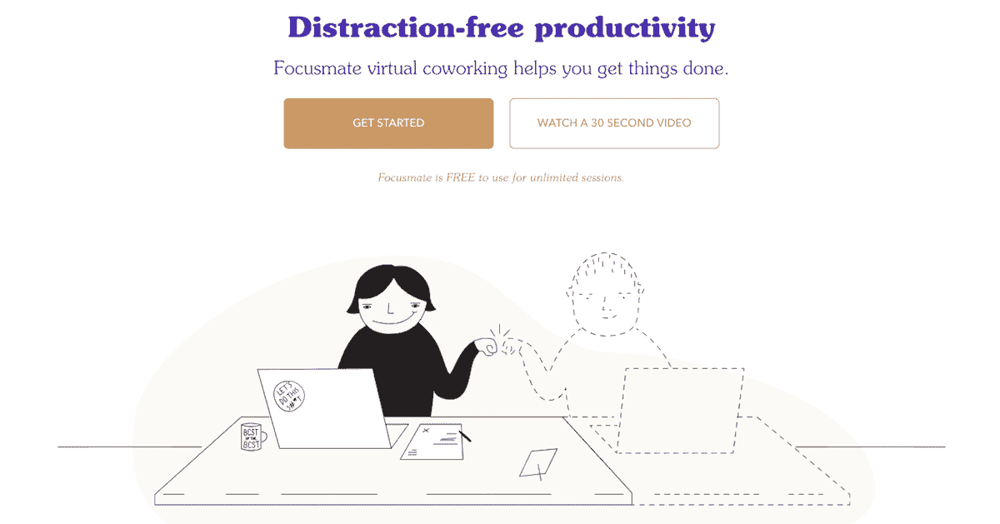
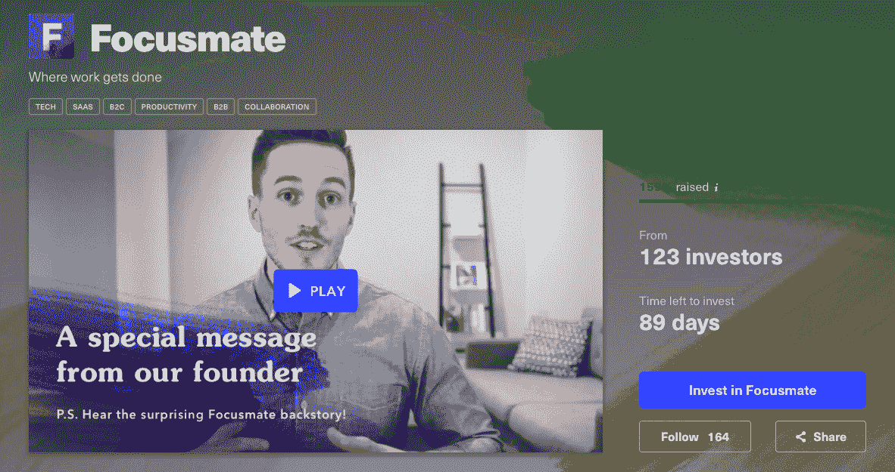
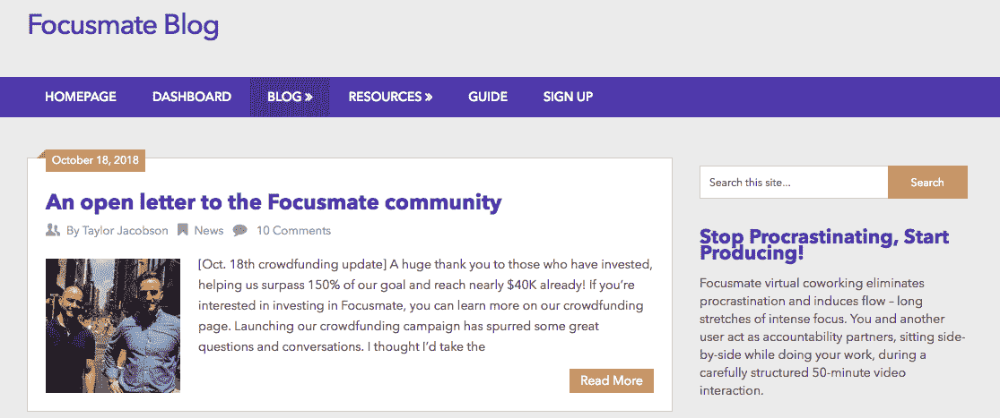

# 把我最大的奋斗作为成功事业的起点

> 原文：<https://www.indiehackers.com/interview/using-my-biggest-struggle-as-the-launchpad-for-a-successful-business-87e761332f>

## 你好！你的背景是什么，你在做什么？

我是泰勒·雅各布森， [Focusmate](https://www.focusmate.com/) 的创始人。

2011 年的大部分时间，我都在羞愧的漩涡中度过，因为拖延，我差点被解雇。我通过学习自我提升——行为科学、生产力、精神——找到了出路，并意识到我可以用我的坩埚来帮助别人。

找到最好的方法花了一些时间，但我最终接受了高管教练的培训，并与耶鲁大学、沃顿商学院和康奈尔大学等客户建立了自由职业业务。这些客户给了我一个很好的真实世界的数据集，关于其他人在努力做什么，什么可行，什么不可行。我了解到有很多像我一样的人在努力实现他们的目标。

我创建 Focusmate 是为了提供我一直想要和需要的那种实际责任。Focusmate 虚拟共同工作使您能够根据需要找到一个负责任的合作伙伴，通过视频远程与您并肩坐在一起，进行 50 分钟的视频工作会议。这就像和一个学习伙伴一起去图书馆，只不过它是在线的，点播的，适合任何人和任何任务。

今天，我们每月的捐款收入为 700 美元，每月增长 15-20%。

 

## 是什么促使你开始使用 Focusmate？

这个概念来自于我自己与拖延症的斗争以及我作为一名高管教练的工作。

我的一个客户打电话给我，要求我为一个只有两周时间的大型演示文稿提供紧急帮助。他希望负责任的人坐下来工作，直到把事情做完。另外，我一直在拖延写一篇博客文章，所以我提出了一个想法，在 Skype 上聊上几个小时，在我们各自的项目上工作时让彼此负责。

随之而来的是两个小时疯狂的生产力——我们都没有经历过这样的事情。那一刻，我们俩都意识到，我们无意中发现了一个具有非凡价值的解决方案，其他人也可以从中受益。Focusmate 愿景是从种子开始的。

今天，我们有一个超过 1，600 名虚拟同事的社区，这些人对完成他们最重要的工作负责感兴趣。

## 构建最初的产品需要什么？

我用 Wordpress 做网站，用 Google sheets 做数据库，用 Zapier 做连接，拼凑了最初的 MVP。我花了大约 50 个小时把它组装起来，包括一些非常古怪的 Excel 代码和对 Zapier 的创造性使用。

我很幸运，刚开始的时候有一个灵活的时间表(我已经在经营自己的公司了)，所以我可以腾出大量的时间来做这件事。最后，我放弃了大部分的教练工作，转而加倍投资于少数稳定的、能支付我最低生活成本的自由职业客户。

10 个月后，我筹集了一点钱(约 6.7 万美元)，并雇人帮忙打造了第一个真正的 MVP。对于大多数公司来说，筹集资金可能不是正确的方法，但我做了很多研究，觉得利用外部资金更快更大规模地发展是企业的正确战略，也是我准备承诺的事情。

## 你是如何吸引用户和发展 Focusmate 的？

我试图在每个阶段都坚持精益启动的验证方法，运行微小的实验来获得增量验证。例如，最初我所做的只是在脸书的 solopreneurs 群中发布帖子，在那里我不认识任何人，如果人们填写表格回答一些客户研究问题(例如，“你通常是如何拖延的？”)并分享他们的联系信息。

帖子通常是这样的:

“我和一个朋友正在尝试通过视频进行虚拟合作，以此来对抗拖延症。有人有兴趣和我们一起尝试吗？如果是这样，请在此表格中分享您的信息，我会将详细信息发送给您！

我知道与陌生人分享私人信息和回答深入的问题是一个相当大的障碍，所以当我收到这些帖子的巨大回应时——第一个帖子有超过 20 个调查回应——这是一个很好的迹象。

在那之后，我在脸书组织了一个名为“拖延爆破者”的小组，基本上只是给成员们提供了一套 DIY 体验的指导。我这样做是为了看看人们是否真的被这种解决方案所激励，并愿意为之努力，以克服拖延带来的痛苦。我再一次看到了巨大的反响，这个团体很快就发展到了 100 多人。

我们最初的营销要么是游击营销，要么是口碑营销:

*   在相关子主题和相关 FB 群组中发帖和评论
*   那些明确表示需要拖延的人会有所帮助
*   要求我们的用户分享(我们设定的目标是在一周内获得 500 名新用户，这激发了很多行动)
*   用户撰写博客文章，讲述 Focusmate 如何帮助了他们(我们总是在我们的新闻页面上给予大量的致谢和反向链接)

## 你的商业模式是什么，你是如何增加收入的？

我们一直设想成为一个免费增值产品，这最初提出了一个挑战，因为我们不能同时支持免费和付费版本的产品。

我们通过保持产品免费但寻求捐赠来解决这个问题。这是一种非常不常见的方法，但出于以下几个原因，它值得考虑:

1.  你不需要支持该产品的两个版本或一个付费墙，你只需要派人去 PayPal 或 [Patreon](patreon.com/focusmate) (我们两个都用过)
2.  你保持较低的期望，因为它仍然是一个免费的产品
3.  捐赠用户的心理是给予，而不是获取，所以他们要求更少，更支持
4.  你仍然可以确认人们会为你提供的东西支付真正的现金

帮助我们的一个策略是使用[承诺偏差](https://www.aqr.org.uk/glossary/commitment-bias)。我们要求人们填写一份价格调查。最后，我们问他们是否愿意捐款支持 Focusmate，以及捐多少。如果他们同意，我们会跟进并邀请他们这样做。

将“人们想要的东西”定义为“人们愿意支付的东西”

TweetShare

我们从捐赠中收集的定价数据也很有用。我们提出三个问题来帮助我们确定用户如何评价我们的产品，以及我们可能如何评价我们的产品:

*   一个月的可承受价格是多少？
*   什么是昂贵的月租价？
*   一个月的价格有多贵？

这有助于我们了解人们实际上有多重视这项服务，以及他们可能愿意支付的价格。我们还对未来产品的折扣进行了限时优惠，以帮助刺激用户采取行动，同时还提供了一些与他们计划的长期使用该平台相一致的价值。

 

## 你面临的最大挑战和克服的障碍是什么？如果你必须重新开始，你会做什么不同的事？

#### 挑战 1:拖延和孤立

我面临的第一个大挑战是克服自己的拖延症，现在依然如此。对我来说，拖延症通常看起来像是做了错误的事情，逃避了会产生最大影响的棘手任务。

独自工作，只对自己负责是很难的。我发现了两个非常有效的解决方案:

1.  日复一日，我在我自己的产品 [Focusmate](www.focusmate.com) 上进行虚拟合作会议。不是自我推销，而是有一个我必须去面对的负责任的伙伴，帮助我在工作中有目的和一致，这已经改变了游戏规则。
2.  为了管理大局，我组建了一个以商业为中心的智囊团。我每周做一次书面检查，分享我那一周的目标。我们还每个月亲自会面，汇报进展并讨论问题。保持不断进步是一个很好的强迫函数。

#### 挑战 2:成为一名非技术型的创始人

对我来说，第二大挑战是成为一名非技术型的创始人。这个问题是一个迷因，但却是一个严重的问题。如果你不知道如何编写自己的产品代码，你该怎么办？

我认真地考虑过学习如何编码，甚至完成了为期三周的 Javascript 课程中的一周，实际上我对自己有能力学习很有信心。也有 2-3 个月的时间，我真的找不到任何合适的候选人一起工作，很绝望。

但对我来说，答案绝对不是成为我自己的技术合伙人。我认为这是一个被高估的解决方案，原因如下。首先，几乎每个企业都因多个创始人/人攻击企业的不同部分而变得更好。成为自己的技术联合创始人只是意味着一个人实际上在做所有的事情，这意味着每件事情的成就更少。一个问题被另一个问题取代。

虽然我可以成为一名优秀的程序员，但我要花很长时间才能做出好的产品。无论我如何全身心地投入到学习中，我仍然无法构建最终成为必需的产品的质量和范围。此外，还有很多软件工程师。是的，他们都有工作，但他们中的很多人都喜欢创业或兼职做些其他事情来赚点外快。事实上，他们通常都被雇佣，这就为你在你所设想的业务上，以及作为一个好的商业伙伴，树立了一个更高的标准。为了招聘一名技术型联合创始人，让你自己和你的企业变得更有吸引力，这一过程可以说与学习编码一样有价值——尤其是如果你的长期角色不是编码的话。

最后，我自己用 Wordpress、Zapier、Google Sheets 和 ScheduleOnce 构建了第一个原型。现在有很多工具可以不用代码就能构建原型。你可以不用学习编码就开始验证你的产品，这将帮助你吸引资源和人才。

你必须解雇那些行为和态度与你想要实现的目标不一致的人。

TweetShare

#### 挑战 3:厨房里有太多的厨师，却没有足够的员工

我过去讨厌营销，所以当我的一位导师，一位杰出的营销人员，对与我合作感兴趣时，我抓住了这个机会。最终，我们为他制定了一个领导市场营销的角色，我认为这将是非常有价值的，除了一个重要的警告:他将主要提供建议，而我则负责所有的执行工作。

在试图改变我们的工作关系后，我最终不得不解雇了这个人，因为我们有太多的想法，但没有足够的手和脚来执行，而且他对执行没有兴趣。

我学到的一个关键教训是，有很多人有很好的想法，但最终你需要有人来执行它们。没有这些，你伟大的想法就毫无意义。

## 有没有发现什么特别有帮助或者有优势的？

我经常重复的一句口头禅，至少在我的脑海中是这样的，那就是*只和 A 级选手*玩。

这可能是我有史以来最喜欢的生活窍门。它来自吉米·罗恩的一句名言，“你是和你相处时间最长的五个人的平均值。”

我对这个建议的不同看法是，我们是社会动物，我们不能不模仿周围人的行为、言语和思维模式。如果你的配偶每天晚上 7 点回到家打开电视，你有多大可能拿起你的笔记本电脑，发出一些冷冰冰的电子邮件，或者写一篇博客？完全不可能。:)

反之亦然。如果你花时间和那些有很大可能性、毅力、积极性等等的人在一起，你会将这些态度内化，它们会在你如何攻击你的生活和事业时表现出来。我已经提过我的智囊团几次了。我为那个小组招募的企业家们的能力以一种好的方式威胁着我。

我问自己，“如果我要变得像我的团队成员一样，我希望团队中有谁？”把自己保持在那个标准是很可怕的(我以为我会被拒绝)，但我努力了。

这个建议的另一面是，你必须解雇那些行为和态度与你想要实现的目标不一致的人。我采纳了一条“不演戏”的原则。如果我的一个朋友或同事在制造事端，我会把他们甩开，不管这是意味着我不再和他们一起制定计划，还是真的不得不解雇他们。

用托尼·罗宾斯的话说，“你得不到你应得的，你得到你所容忍的。”

 

## 对于刚刚起步的独立黑客，你有什么建议？

有一个原则是你将赖以生存和死亡的。恰好是 Y Combinator 的座右铭，就是“做人们想要的东西。”如果你什么都不做，如果你做了人们想要的东西，你很可能会成功创业。

就这一点而言，将“人们想要的东西”定义为“人们愿意支付的东西”是一个好主意。一个非常非常好的代理来发现人们想要什么，愿意为什么付钱，就是建造一些你愿意为自己付钱，并且非常希望存在的东西。不过，请注意，你很容易欺骗自己，认为你想做的东西和人们想要的东西是一样的。不要让你对一个想法的兴奋蒙蔽了你的双眼，让你看不到人们是否真的想要你做的东西。

一些阅读建议:

*   加里·维纳查克的[粉碎它](https://www.amazon.com/Crushing-Great-Entrepreneurs-Business-Influence/dp/0062674676)对独立黑客来说是很好的营销建议。
*   [乔治·高](https://www.georgekao.com/)充满爱心地给出了严肃的个人创业建议。
*   对于产品设计来说，Nir Eyal 的[钩](https://www.nirandfar.com/hooked)是必读书。
*   对于创业的灵感和基本原则，我喜欢彼得·泰尔的《从零到一》

## 我们可以去哪里了解更多？

大家在评论里聊聊吧！

附:如果你独自工作，与拖延症作斗争，或者想强迫自己花更多的时间在你的兼职上，试试[焦点伴侣虚拟合作](https://www.focusmate.com)！

—[<picture id="ember5276354" class="user-avatar ember-view user-link__avatar"></picture>泰勒·雅各布森](/taylorjacobson?id=ebWORANLCwe7UWcC6gPRPgaHr5t2)，Focusmate 创始人

## 想像 Focusmate 一样建立自己的事业？

你应该加入独立黑客社区！🤗

我们是几千名创始人，互相帮助建立有利可图的业务和副业。来分享你正在做的事情，并从你的同事那里获得反馈。

还没准备好开始使用你的产品吗？没问题。这个社区是一个认识人、学习和实践的好地方。随意[随便浏览](/)！

——[<picture id="ember5276359" class="user-avatar ember-view user-link__avatar"></picture>柯特兰艾伦](/csallen?id=ibTLPyjwVebnZjMGKvz6ztarnuV2)，独立黑客创始人

28votes