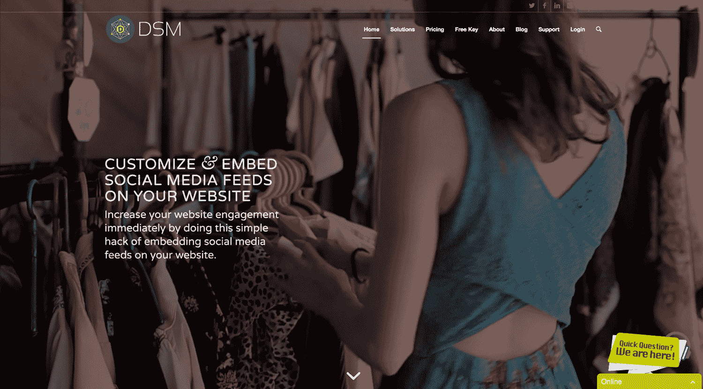
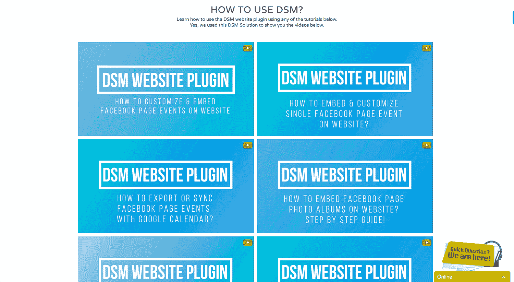

# 使用我的编码博客来验证和吸引付费用户

> 原文：<https://www.indiehackers.com/interview/using-my-coding-blog-to-validate-and-attract-paying-customers-512d40b56c>

## 你好！你的背景是什么，你在做什么？

我叫 Mike Dalisay，从 2010 年开始担任软件开发人员。我白天工作了四年零八个月。2015 年辞职给自己打工。我在 codeofaninja.com 开始作为一名代码博主赚钱，但我的梦想是创造自己的盈利软件产品。现在，它正在成为现实。

我制作了 [DSM 网站插件](https://www.sociablekit.com//)(现在叫做 SociableKIT)，这是一个 SaaS，可以让你在自己的网站上定制和嵌入社交媒体。这包括脸书页面事件，以及 Instagram、YouTube、Twitter、[和更多](https://www.sociablekit.com/solutions/)的订阅源！DSM 是为专业和商业网站创建的。它允许用户花更少的时间手动更新他们网站上的社交媒体内容，而花更多的时间直接与社交媒体平台互动。

DSM 自 2014 年以来一直存在，但有一段时间我不够聪明，无法添加新功能并向更多人提供服务。相反，我优先考虑写博客。

我们在 2017 年初获得了可观的收入，如今帝斯曼每月收入 2000 美元，拥有数百名付费用户。鉴于目前的增长速度，我预计在 2018 年之前，它至少会增长到每月 5000 美元。

 

## 是什么促使你开始使用 DSM 网站插件？

2011 年，我写了关于社交媒体 API、如何使用它们以及如何将来自社交媒体的信息显示到网页上的博客。这些类型的博客文章成为我网站上访问量最大的页面。他们有数百条评论(你可以看到这里的[和这里的](https://www.codeofaninja.com/2011/07/display-facebook-events-to-your-website.html)和)。

这证实了在网站上嵌入定制社交媒体源的需求。人们希望他们的社交媒体源和他们的网站颜色一样。他们希望它融入他们的网站主题。默认的社交媒体插件，比如[脸书页面插件](https://developers.facebook.com/docs/plugins/page-plugin)，不允许你这么做。他们也没有反应。 [DSM 网站插件](https://www.sociablekit.com/)可以为你解决这些问题。

我用那些博客帖子制作了 WordPress 插件，但并不成功。已经有很多带有这些功能的 WordPress 插件了。我不太擅长营销，所以我没有精力在这个市场上竞争，而且有太多的主题和插件需要支持，这对我来说根本不起作用。

如果你知道一个问题的解决方案，建立它并尽早告诉潜在客户。

TweetShare

所以我选择构建一个可嵌入的网站插件。我发现维护和更新新功能变得更加容易。最重要的是，它能够支持 WordPress 和非 WordPress 网站。

在 2015 年成为全职 solopreneur 之前，我是菲律宾一家技术服务公司的程序员。我很享受当员工的时光。我的同事都是好人。

虽然我的薪水不错，但不足以供我的兄弟们上大学，也不足以支撑我现在和未来的家庭。

## 构建最初的产品需要什么？

2014 年，我开始为我的客户开发 [DSM 网站插件](https://www.sociablekit.com/)。他们需要与网站颜色相同的社交媒体源。那是在我还在全职工作的时候，所以我在公司办公室附近租了一个每月 100 美元的床位，这样我就可以在工作前后有更多的时间在网站上工作。

2015 年，有了来自我的代码博客 codeofaninja.com(我卖源代码的地方)的资金，我辞掉了工作，夜以继日地编写代码，为 DSM 发布新功能。这些更新让我的客户非常高兴！那时，我和妻子玛丽克里斯成立了我们的公司 [Codalify 软件开发](https://www.codalify.com/)。

2016 年，在我妻子非常友好地帮助营销和搜索引擎优化的情况下，我们开始收到数百个注册。今年(2017 年)，帝斯曼在流量和付费用户方面取得了显著增长。事实上，我以前的一台服务器没有能力处理这种增长，所以 DSM 现在使用谷歌云平台的力量。

抛开 Google Cloud 不谈，我用来构建 DSM 的技术非常常见(有些人甚至会称之为老技术):后端的 Linux、Apache、PHP 和 MySQL。HTML5，CSS，jQuery，前端的一些 jQuery 插件。

对我来说，技术固然重要，但更重要的是它提供的解决方案。

TweetShare

DSM 代码的基本构件也可以在我的代码博客上找到。在不久的将来，我们可能会使用 Node.js 和 Angular 等现代技术。但是 DSM 目前的栈工作得很好，我可以开发得更快，因为我很了解这些技术。

对我来说，技术固然重要，但更重要的是它提供的解决方案。如果不能解决客户的问题，现代技术就什么都不是。

## 你们是如何吸引用户并发展 DSM 网站插件的？

我的代码博客在谷歌上的关键词排名很好，比如“在网站上显示 facebook 事件”或“在网站上显示 facebook 照片”。当有人登陆博客时，他们会学习如何编写特定功能的代码。但是他们也了解了替代方案——使用 [DSM 网站插件](https://www.sociablekit.com/)为他们实现那个特性(或者[其他特性](https://www.sociablekit.com/solutions/))。

因此，有机搜索一直是我们最好的获取渠道。当我问我们的客户他们是如何找到我们的，答案大多数时候是“谷歌”。其中一些写着“StackOverflow ”,因为我在那里发布了我们的代码和相关问题的链接。一些客户提交了“来自我的朋友”的答案，所以推荐也起了很小的作用。

早些时候，我和妻子尝试在不同的脸书团体、Google+社区和 Twitter 上发布 DSM 链接。(大部分是以音乐家为单位，因为当时很多 DSM 的客户是音乐家或 DJ，他们希望在自己的网站上嵌入定制的脸书页面活动。)我们还尝试向这些群体的个人成员传达有关 DSM 的信息。

不幸的是，我们没有办法衡量这些努力的结果——这意味着从来没有任何具体的证据表明有人通过我们发布的链接注册。

唯一的解决办法是开发一个联盟系统来跟踪这些链接的点击和注册，我们做到了。我们刚刚推出了我们的 [DSM 附属计划](https://www.displaysocialmedia.com/join-dsm-affiliate-program/)。这给了我们一种方法来知道发布在社交媒体上的链接是否会转化为客户。

我们也试过冷邮件。我们推广了一个 DSM 功能，允许用户在他们的网站上[嵌入脸书页面事件](https://www.displaysocialmedia.com/embed-show-display-facebook-events-on-website/)。为了给这个活动找到合适的受众，我们从脸书的网页上搜集了一些电子邮件，这些网页使用了脸书的活动，并且网站上有一个“活动”页面。我们收到了大约一万封电子邮件。我们设计了 5 封电子邮件，每隔一天发送一次。我们收到了很多自动回复和一些人工回复。

但是只有 8 个人买了我们的产品。邮件营销有点作用，但是需要大量的时间和精力。我没有资源继续做下去。我妻子也忙于自己的项目。所以我选择更专注于产品开发和 SEO。我很快就要雇人帮我做电子邮件营销了。

## 你的商业模式是什么，你是如何增加收入的？

我们的收入模式是基于订阅的。用户可以选择仅免费试用我们的产品 7 天。在此期间，他们可以使用所有的 [DSM 解决方案](https://www.sociablekit.com/solutions/)，并在其网站上嵌入自定义提要。如果他们不升级，他们的网站上会显示一条简单的消息。该消息看起来像这样:

*由 [DSM 网站插件](https://www.sociablekit.com)支持的定制 feed。如果您是该网站的所有者，您的 7 天免费试用期已经结束。[请升级](https://www.displaysocialmedia.com/upgrade/)。*

如果用户选择升级，他们可以选择每月支付 15 美元或每年 120 美元(每月 10 美元，按年收费)。我们很早就开始收费，因为我们知道我们的产品对于专业和商业网站的价值。

我们之前实施了 30 天的免费试用。这样过了一个月，我们把它改成了 14 天免费试用。这两种方法都有效，因为人们在期限结束后支付，但是钱进来得很慢。有些人甚至试图在试用期结束后再次注册，以便无限期地免费使用我们的服务。所以我们认为，如果有用户愿意为我们的服务付费，30 天或 14 天的等待时间太长了。

免费试用的目标是让用户认识到你的产品的真正价值。我们相信 7 天的免费试用可以实现这个目标，它做到了。我建议你也这样做。据我所知，以下是我关于如何让人们为你的产品付费的建议。

1.  设计您的产品来解决客户的问题。永远不要假设他们需要什么。永远不要花时间开发客户不需要的功能。你通过直接询问或调查让他们说话。
2.  教潜在客户如何使用你的产品解决他们的问题。我们通过博客帖子和 YouTube 视频来实现。你也可以这样做。如果你创建了高质量或有用的分步教程，谷歌将奖励你。
3.  给他们一个免费试用期。7 天免费试用对我们来说很好。试用期可以帮助你的潜在客户认识到你的产品的真正价值。这也是你向他们展示你的产品有多有用、多易用的机会。
4.  在这个阶段，你的潜在客户会知道你的产品是为解决他们的问题而设计的。你将教会他们如何使用它，你将允许他们用它来度过他们的宝贵时间。下一个合乎逻辑的步骤是让他们为此付出代价！

 

我们使用贝宝来处理付款。PayPal 太棒了。他们可以处理借记卡和信用卡付款，甚至不需要创建一个贝宝账户。PayPal 也可以自动向他们收费。如今，PayPal 每月向 DSM 支付超过 2000 美元，这还不包括新客户。

出于某种原因，有用户不喜欢 PayPal。在这种情况下，我们必须使用 Stripe 这样的信用卡处理器。可惜 Stripe 不支持我们国家(菲律宾)。我问了很多黑人代表他们什么时候会支持我们的国家，总结一下他们的回答:他们不知道。我刚刚申请了 [Stripe Atlas](https://stripe.com/atlas) ，但我不确定这是否是适合我们的解决方案。

我认为以下是 DSM 项目的费用:

*   每笔交易收取 4.4%+15.00 菲律宾比索(15 菲律宾比索，约合 0.30 美元)的贝宝费用。
*   虚拟主机每月 135 美元。
*   谷歌邮箱每月 5 美元。
*   咖啡每月 25 美元。
*   域名每年 16 美元。

## 你未来的目标是什么？

我的产品目标是让 [DSM](https://www.displaysocialmedia.com/) 成为管理专业和商业网站定制社交媒体源的最佳场所。我相信帝斯曼可以通过不断倾听客户的需求并根据这些需求增加新功能来实现这一点。

DSM 也需要增加高质量的流量。尝试我们产品的人越多，我们获得新客户的机会就越大。这可以通过制作更多清晰展示如何使用 DSM 的博客帖子、教程和 YouTube 视频来实现。

我对帝斯曼的收入目标是，到 2018 年底或更早，每月收入 10，000 美元。

我个人的目标是在 2019 年打造另一款 SaaS 产品。

我相信这些可以通过建立一个伟大的团队来实现。雇佣全职员工是其中的一个方面。总的目标是通过软件解决客户的问题。简单高效的软件能让人们的生活变得更好，这真是令人惊讶。

## 你面临的最大挑战和克服的障碍是什么？

对我来说最大的挑战是营销。与其说我是营销人员，不如说我是产品开发人员。我不喜欢电子邮件营销。我不喜欢创建脸书或谷歌广告。我不喜欢制作操作视频。我喜欢 SEO，但没那么喜欢。我只想创造和发展。然而，这些东西对于[帝斯曼](https://www.sociablekit.com)的成长来说是无价的，所以我不得不学习并去做。我目前正在做自己的 SEO 和如何做视频，但我期待着很快雇人为我做其他形式的营销。

我也试着在 [Upwork](https://www.upwork.com/) 、 [Fiverr](https://www.fiverr.com/) 上雇人，甚至是当地的自由开发者。我得到了一些结果，但是我对它们不满意。我觉得这些工人拖慢了产品开发。为什么？因为当我在项目中编写自己的代码时，我必须定期与他们交流。也许我还不擅长表达我想要完成的目标。比起兼职或自由职业的开发人员，我更擅长与全职开发人员合作。所以我期待着尽快雇佣全职开发人员。

如果我必须重新开始，我会迫不及待地为更多的人提供服务，提供免费试用，并向用户收费。帝斯曼始于 2014 年，2017 年才开始看到显著增长。我浪费了很多时间，也损害了潜在客户的利益。我比我们的竞争对手更早知道解决方案。我甚至早在 2011 年就在博客上写了这件事。

如果我早些做了这些，DSM 现在会有成千上万的客户。因此，如果你知道一个问题的解决方案，那么就构建它，并尽早告诉潜在客户。这是我学到的最重要的一课。

## 有没有发现什么特别有帮助或者有优势的？

我认为我的优势之一是我每天至少花 2 个小时消耗和学习新信息。在这一天剩下的时间里，我在执行和做实际的工作。

我在公司办公室附近租了一个每月 100 美元的床位，这样我就有更多的时间在网站上工作。

TweetShare

我喜欢看网站和博客，听播客，看能激励我，改善我的工作和个人生活的视频。以下是其中的一些。

网站:

*   [独立黑客](https://www.indiehackers.com/businesses)
*   [SPI 收入报告](https://www.smartpassiveincome.com/income-reports/)
*   [背林科](http://backlinko.com/)
*   [社交触发](https://socialtriggers.com/start-here/)
*   [企业家灵感](https://www.entrepreneur.com/topic/inspiration)

播客:

*   [独立黑客播客](https://www.indiehackers.com/podcast)
*   [SPI 播客](https://www.smartpassiveincome.com/podcasts/)
*   [蒂姆·费里斯秀](http://tim.blog/podcast/)
*   [基础播客](https://thefoundation.com/podcast)

视频:

*   [TED 演讲](https://www.youtube.com/user/TEDtalksDirector/videos)
*   托尼·罗宾斯
*   [加里·维纳查克](https://www.facebook.com/pg/gary/videos/)
*   埃文·卡迈克尔

我做的一个好决定是扩大需求侧管理解决方案的范围。最初，我的计划是将功能限制为仅嵌入脸书、Twitter 和 Instagram 内容。但客户要求 YouTube 视频、Yelp 评论和谷歌评论的功能。此后，我们发布了 DSM YouTube 视频功能，已经有几个客户在使用它。现在，我期待着根据我们客户的需求，将 DSM 功能扩展到更多的社交网站。

我在编码、博客和搜索引擎优化方面的技能对 DSM 的发展也很有帮助。我能够更快的开发 DSM 是因为我多年的编程经验。博客和搜索引擎优化帮助人们发现我们的产品。这就是我们的销售方式。这些技能是我们的产品取得今天成就的基础。

## 对于刚刚起步的独立黑客，你有什么建议？

不要做一个完美主义者。我是一个完美主义者，为此我挣扎了很久。它削弱了我的生产力，所以我决定放手。DSM 的早期版本很糟糕。如果你见过它，你会说它很难使用。但是人们仍然使用它，因为它以这样或那样的方式解决了他们的问题。你只需要继续努力。一路走来，你会找到更好的做事方法。通过电子邮件向您的客户更新您的进度。

一旦你开始构建基本的解决方案，并且已经有了早期的客户或用户，让他们开始讨论。采访他们。调查他们。永远不要假设，也不要试图猜测他们需要什么。构建他们*实际*需要的功能。

我们的许多客户说 DSM 是他们的完美解决方案，因为这些功能正是他们所需要的。有些人甚至问我们是如何读懂他们的思想的。我只是告诉他们这个功能是另一个客户直接要求的。

## 我们可以去哪里了解更多？

如果您想了解更多关于我们的信息，请点击以下链接。

*   访问帝斯曼网站插件[网站](https://www.sociablekit.com)
*   订阅帝斯曼 [YouTube 频道](https://www.youtube.com/channel/UCVJuOVxQdRH-DR83b4LZm7Q?sub_confirmation=1)
*   就像 DSM 在[脸书](https://www.facebook.com/DisplaySocialMedia/)
*   在推特[上关注 DSM](https://twitter.com/DSM_WebPlugins)
*   在 [Instagam](https://www.instagram.com/displaysocialmedia/) 上跟随 DSM
*   在 [LinkedIn](https://www.linkedin.com/in/mikedalisay/) 上与我联系
*   访问我的[忍者的代码](https://www.codeofaninja.com/)代码博客
*   给我发邮件到 [【邮件保护】](/cdn-cgi/l/email-protection#167b7f7d7356727f65667a776f6579757f777a7b73727f773875797b)

感谢阅读！如果你有任何问题，请在下面的评论区留言。我会回复每个评论，问题或建议。

——[<picture id="ember8087224" class="user-avatar ember-view user-link__avatar"></picture>迈克·达利赛](/ninjazhai?id=jajCUSdlT2NNgUoBnqZMX6IL3JF3)《社交工具包》的创作者

## 想像 SociableKIT 一样建立自己的事业？

你应该加入独立黑客社区！🤗

我们是几千名创始人，互相帮助建立有利可图的业务和副业。来分享你正在做的事情，并从你的同事那里获得反馈。

还没准备好开始使用你的产品吗？没问题。这个社区是一个认识人、学习和实践的好地方。随意[随便浏览](/)！

——[<picture id="ember8087229" class="user-avatar ember-view user-link__avatar"></picture>考特兰艾伦](/csallen?id=ibTLPyjwVebnZjMGKvz6ztarnuV2)，独立黑客创始人

4votes