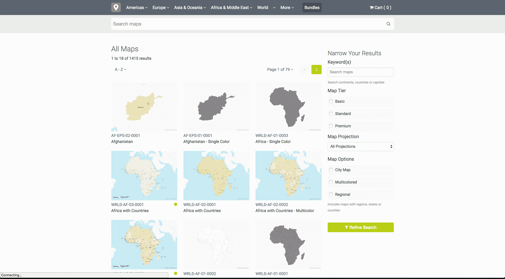

# 使用搜索引擎优化来发展我的利基测绘公司到 2000 美元/月

> 原文：<https://www.indiehackers.com/interview/using-seo-to-grow-my-niche-mapping-company-to-2-000-mo-e700c9d534>

## 你好！你的背景是什么，你在做什么？

你好，我是 Ted Grajeda，[自由矢量地图](https://freevectormaps.com/)的创始人。早在上个世纪，我就已经是一名设计师了，当时我搬到了伦敦，开始从事一项叫做互联网的新事物。我目前住在美国，但我在英国和新西兰住过。

自由矢量地图正是它所说的那样。这是一个免费的、一致的、高质量的矢量图库，面向全世界的设计师。您可以在一个地方找到世界上的每个国家，包括州、洲、地球等等。

现在有超过 1400 张地图(并且还在增长)，免费矢量地图已经成为网络上矢量地图的主要来源。

免费矢量地图已经存在了近 4 年，拥有坚实的用户基础，每月用户超过 50，000 人，每月页面浏览量超过 250，000 次，几乎来自世界上的每个国家。

 

## 是什么促使你开始使用免费矢量地图？你最初的目标是什么？你是怎么想出这个主意的？

[免费矢量地图](https://freevectormaps.com/)真的是我人生许多经历的集大成之作。

当我 20 岁出头的时候，我离开美国去环游世界，最后来到了伦敦。在阅读《国家地理》、翻阅历史书和环游世界的过程中，我一直对地图情有独钟。当我寻找新项目时，地图是合理的选择。

我理解设计界对地图的需求。虽然这是一个利基领域，但你会惊讶地发现自己经常会寻找某个国家或州来完成设计。

我在为股票投资组合网站做贡献方面也取得了相当大的成功，并看到了对矢量地图的需求，但也看到了随着贡献者饱和度的上升，质量下降，他们变得更加分散。更不用说专门的地图网站过去(现在仍然)对低质量的工作收费过高。

## 构建最初的产品需要什么？离你准备发射还有多长时间？

[免费矢量地图](https://freevectormaps.com)是使用 PHP 和 MySQL 开源软件构建的。前端使用 Bootstrap，所以我能够快速启动并运行框架。

最大的挑战是创建所有的地图。我发现了一个极好的公共领域数据来源(自然地球数据)和一个我自学的开源 GIS 程序。

我花了大约 2 个月的时间来创建最初的库，确保我覆盖了世界上所有的国家。之后，当我有时间的时候，我就可以添加地图了。

## 你用什么策略来增加你的收入和用户群？

当[免费矢量地图](https://freevectormaps.com)首次发布时，我把它提交给了一个作品集展示，我知道这会引起设计师的注意，就是这样。除此之外，都是 SEO 和口碑。

搜索引擎优化一直是这个项目的核心…如果你能做到这一点，它真的很有帮助。

TweetShare

幸运的是，它已经被许多备受尊敬的时事通讯和设计资源博客广泛接受和报道，并且每个月的使用量都在增长。

大部分收入是通过免版税许可(通过 Stripe)产生的，这些许可是针对那些不能在设计中注明地图属性的人的，如果你是在为客户工作，这是一个常见的问题。

我还通过广告获得收入，这是确保覆盖 AWS 和服务器成本的必要手段。

虽然 99%的地图都是免费的，但我也有一些“优质地图”，以合理的价格提供更多的细节。更不用说免版税的“地图捆绑包”只占标准许可证的一小部分。

## 你认为你最大的优点是什么？

我最大的优势是我很了解市场。凭借多年的库存图像库经验，我知道网络上需要矢量地图。

专用地图网站对低质量的工作收费过高(现在仍然如此)。

TweetShare

我也已经设计和建设了近 20 年的网站，喜欢创造东西。这让我有了一个想法，并迅速创造出一个产品。

SEO 一直是这个项目的核心，并且为我提供了很好的服务，因为我通过有机搜索结果获得了绝大多数访问者。如果你能做到这一点，那真的很有帮助。

## 你对有抱负的独立黑客有什么建议？

有想法就去追求！只要你真的喜欢你正在做的事情，那么它就非常值得，不管你赚不赚钱。

你会惊讶于你所有的想法能走多远。

我们可以去哪里了解更多？

*   [https://freevectormaps.com](https://freevectormaps.com)
*   https://www.facebook.com/freevectormaps
*   【https://twitter.com/freevectormaps 

—[<picture id="ember8047414" class="user-avatar ember-view user-link__avatar"></picture>泰德·格拉耶达](/TedGrajeda?id=freevector-maps-owner)，自由矢量地图的创造者

## 想像免费矢量地图一样建立自己的业务？

你应该加入[独立黑客社区](/)！🤗

我们是几千名创始人，互相帮助建立有利可图的业务和副业。来分享你正在做的事情，并从你的同事那里获得反馈。

还没准备好开始使用你的产品吗？没问题。这个社区是一个认识人、学习和实践的好地方。随便去[随便浏览](/)！

——[<picture id="ember8047419" class="user-avatar ember-view user-link__avatar"></picture>考特兰艾伦](/csallen?id=ibTLPyjwVebnZjMGKvz6ztarnuV2)，独立黑客创始人

5votes