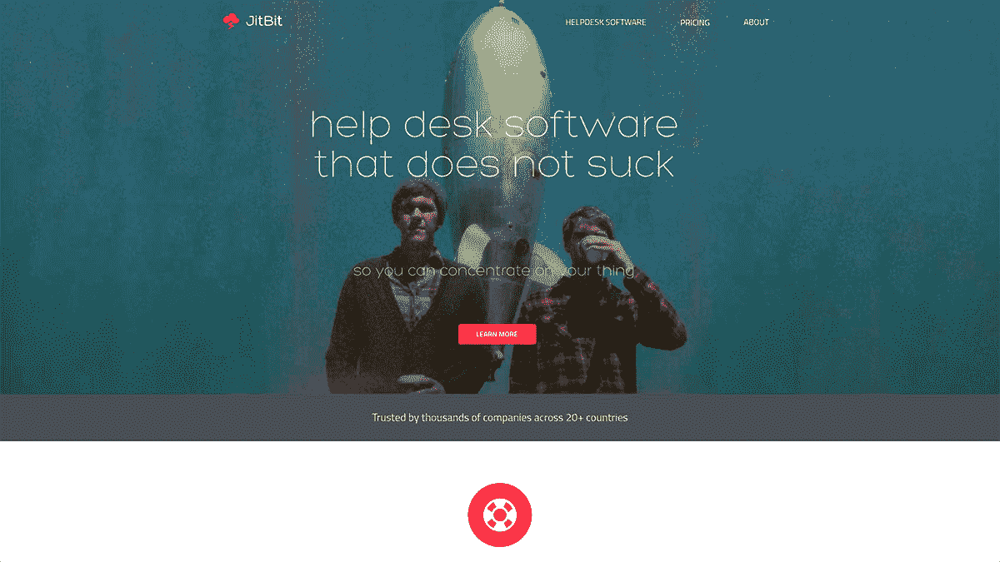
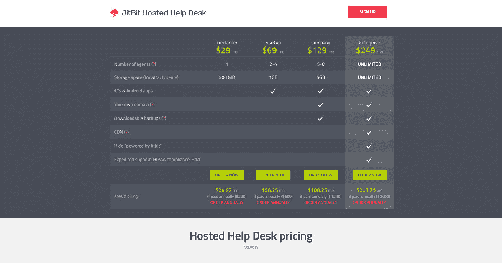

# 使用病毒式工具吸引客户，每年获利 170 万美元

> 原文：<https://www.indiehackers.com/interview/using-viral-tools-to-attract-customers-and-make-1-7m-year-291efb72ba>

## 你好！你的背景是什么，你在做什么？

嗨，我叫亚历克斯·尤马舍夫。我是一名全栈开发人员，也是 Jitbit 的创始人——我的副业项目最终成长为七位数的 ARR 业务。

Jitbit 制造**服务台软件**，我们几乎是这个市场上唯一一家自负盈亏的公司。

我们有意保持低调。核心团队只有四个人，但是我们很活跃(就像“踢那些笨拙的资助团队的屁股”)。

 

## 是什么促使你开始使用 Jitbit 帮助台？

我在俄罗斯长大，学习数学和计算机科学，然后在一家银行找到了一份无聊的软件工程工作。不完全是梦想成真。所以我开始了一个“共享软件”项目(如果你足够大，还记得“[共享软件](https://en.wikipedia.org/wiki/Shareware)”是什么的话)。

买了域名，编了个小网站，开始发布 Windows 小程序“下载目录”。几个月后，神奇的事情发生了——有人为系统管理员买了我的 19 美元网络工具。

因为我是一个差劲的博客作者，我想我会写一些病毒式的工具，而不是病毒式的博文。

TweetShare

这是我一生中遇到的最大的激励——“天哪，这东西真的有用！”是时候把一个好玩的项目变成生意了。

我在晚上和周末工作，还在白天工作来支付我们在莫斯科的破公寓。我几乎没有睡觉，开着 500 美元的车，不断尝试不同的想法，每 4-5 个月发布一个新的应用程序。这些大多是用于 Windows 的共享软件工具，还有几个基于网络的应用程序，比如网站的留言板应用程序，但没有一个真正流行起来。整个事情一个月才赚一千美元，所以我一直在寻找“正确”的想法。后来终于灵光一现。

在我的日常工作中，我不得不身兼数职，当然也包括技术支持。这是一家银行，你知道。没人在乎你是不是高级认证团队领导建筑师什么的。人们仍然会打电话给你:“嘿，我的谷歌坏了。”

所以我对帮助客户和组织技术支持团队略知一二，我甚至为自己设计了一个不错的小票务系统。于是我带着我所有的知识，开始在 [Jitbit 帮助台](https://www.jitbit.com/helpdesk/)工作。尽管这个利基市场已经非常拥挤，我还是看到了这个市场是多么的巨大，现有的系统是多么的笨拙。

## 构建最初的产品需要什么？

从头开始写 [Jitbit](https://www.jitbit.com/helpdesk/) 花了 6-7 个月。尽管我是 MVPing 产品创意和整个“快速运输”概念的超级粉丝，但这仍然花了很多时间。没什么新鲜的:你把大量的咖啡变成软件。

该产品是“本地的”(SaaS 不存在)，所以人们应该把它安装在自己的服务器上。这就是我选择的技术的闪光点——ASP.NET 在 Windows 上运行，而 Windows 在 2000 年代驱动着 99%的企业。

3 年后，大约在 2009 年，当我从“本地”产品中获得足够的动力和现金时，我终于辞掉了工作，搬到了英国，开始开发“托管”产品。起初很难说服客户转向云计算，但现在它为我们带来了 65-70%的收入。

## 你们是如何吸引用户，壮大 Jitbit 的？

首先，SEO。我已经在我的网站上发布了几个产品。我甚至让其中一些免费，所以从第一天起，副业营销就开始了。我的桌面工具是那些提升我的旗舰产品的链接磁铁。

我们今天仍在使用这种技术——提供很棒的免费应用程序、在线工具、开源组件，甚至 Chrome 扩展——让人们了解我们。因为我是一个差劲的博客作者，我想我会写一些病毒式的工具，而不是病毒式的博文。

我几乎没有睡觉，开着 500 美元的车，不断尝试不同的想法，每 4-5 个月发布一个新的应用程序。

TweetShare

还有一件事。我试图将我的 B2B 营销和定位定位于购买、安装和维护软件的实际人员，而不是他们为之工作的企业。

我相信这是人们在企业 B2B 中犯的最大错误——认为他们是在向*的企业主*(那些真正关心“节约成本”、“增加价值”、“双倍转化率”和其他营销 yada-yada 的人)销售。你不是。你在卖给那些不在乎的雇佣者。他们关心自己的工作、老板、晋升和薪水。

因此，我没有向某个不知名的“ABC 保险公司”出售内部帮助台软件。我把它卖给了一位 45 岁的 it 经理，他有两个孩子和一份抵押贷款，他热爱自己的服务器机房，对微软技术了如指掌。您知道—活动目录、Windows 域、Exchange 服务器、Sharepoint。酷孩子不想听的所有无聊的微软的东西。见鬼，我*过去就是*这些家伙中的一个。

所以我找到了合适的词，写出了令人信服的文案，把产品定位在这些技术旁边。我还提供了免费下载，并编写了一个超级流畅的“setup.exe ”,所以这位 45 岁的经理在三分钟内就启动并运行了，没有任何愚蠢的“安排演示”或“快速呼叫”或“请求报价”操作。(他是个内向的人，别让他和你说话。)

所有这些在早期都很有帮助。

## 你的商业模式是什么，你是如何增加收入的？

Jitbit 每年的收入约为 170 万美元，其中约 65%是定期订阅，35%来自“内部”许可。我想这也是经常发生的，因为人们无论如何都会回来进行版本升级和漏洞修复。

我们还将 SaaS 的产品转换为“分层”定价，而不是按“每用户”收费。这是一个很好的心理技巧，因为人们倾向于高估自己的尺寸。就像，当他们看着定价表，看到“微小、小型、创业、企业”的时候，他们的自我并不想成为“小型”——每个人都想成为“企业”。尤其是如果他们花的是别人的钱。

在软件行业中，你每天做的大多数“非编码”的事情都是与产品无关的。

TweetShare

“内部”版本甚至是无限的。和百万用户一起购买使用。我们不在乎。

我们没有销售。一切都是入境。

我们不做演示。

我们没有电话支持。(但是如果你给我们发邮件，你就可以和真正的开发人员交谈，而不是那些几乎不会说英语的呼叫中心的家伙。)

我们不使用任何付费获取渠道。一切都是有机的。

我们*做*电子邮件序列、试用“牵手”、A/B 测试、推荐项目和其他“漏斗”东西的实验。

 

## 你未来的目标是什么？

我们真的热爱我们的工作。所以我想我们会继续增长 [Jitbit](https://www.jitbit.com/helpdesk/) 和所有，但我的首要目标是让我的*现有*客户满意。我们真心希望他们成为这里家庭的一员。

我想这是我从 Peldi Guilizzoni(Balsamiq 软件的创始人)那里学到的，他也把自己的公司定位为一家不错的意大利家庭餐馆，让人们有宾至如归的感觉。我甚至在考虑为付费用户创建一个封闭的讨论组，这样我们就可以一起出去逛逛了……等着瞧吧。

## 你面临的最大挑战和克服的障碍是什么？

12 年前创办软件企业与今天创办软件企业完全不同。没有“创业博客”，没有书籍，没有留言板。*连 StackOverflow* (whaaat)都没有。没有自举者的会议，也没有“自举”网页设计工具包。更不用说在你的网站上接受信用卡是一个巨大的问题。条纹？并不存在。PayPal？当时我还在俄罗斯，那里还没有贝宝。

对于自费软件企业家来说，唯一可以闲逛和分享痛苦的地方是乔尔·斯波尔斯基网站上一个名为“软件商业”的小讨论板。Patio11 是那里的主持人，他正准备推出他的“宾果卡创建器”的东西。

所以我想最大的挑战是:**你必须自己学习一切，并从零开始构建东西**。但这反过来成了最大的优势。因为当没有 Stripe 时，你必须实际去编码一个支付网关，然后将它与你的网站的 CMS 集成，顺便说一下，你也必须为自己编码，你往往只是出于需要而让球滚动。

从头开始写 Jitbit 花了 6-7 个月…没什么新鲜的:你拿了成吨的咖啡，把它变成软件。

TweetShare

换句话说，被这些路障淹没的好处是，整个“没有产品创意”的事情不再是一个问题。谁会在乎那些愚蠢的“产品创意”呢？反正我有可能无法用信用卡付账。！我需要先处理那个的*，然后我再考虑想法。*

它会改变你的心态。当找到一个产品创意的时候，你已经处于那种“搞定狗屎”的超级英雄模式了。你已经去过地狱了，所以你就去做吧。

## 帮助你成功的最关键因素是什么？

对于 [Jitbit](https://www.jitbit.com) ，SEO。即使在竞争激烈的利基市场，SEO 也有发展空间。当然，如果你在谷歌上搜索“服务台软件”，我的公司会出现在第四页的某个地方，但是你应该关注的是*长尾搜索*。

我说的 SEO 不仅仅是指为搜索机器人优化你的网站。你还必须获得宣传和反向链接，这样搜索引擎会认可你在利基市场的权威。

## 对于刚刚起步的独立黑客，你有什么建议？

如果你正在努力寻找产品创意——甚至在你有想法之前就开始努力。向后工作。想出一个品牌名称。开始设计一个网站，然后真正启动一个网站，并开始写关于你的旅程的博客。建立反向链接、从事 SEO、建立个人品牌、确立自己的专家地位、建立联系、在会议上发言……并不是缺乏想法阻碍了你；是拖延症。

在软件行业中，你每天做的大多数“非编码”的事情都是与产品无关的。

此外，我在某次聚会上从乔尔·斯波尔斯基(Joel Spolsky)那里听到了这句至理名言:“你*可以*教一个软件工程师做营销/管理/商务方面的事情，但你*不能*教一个 MBA 如何写好代码。”

## 我们可以去哪里了解更多？

查看我的网站([https://www.jitbit.com](https://www.jitbit.com))和我的博客，或者在评论中留下问题。我会试着给你回电话。

我在 Twitter 和 Medium 也是@jitbit。你可以给我发一封电子邮件给“jitbit com 的亚历克斯”——没有什么比和一位企业家朋友聊天更让我喜欢的了。

—[<picture id="ember5200756" class="user-avatar ember-view user-link__avatar"></picture>亚历克斯·尤马舍夫](/jitbit?id=gNOvodABf3hj1zsRqBrs3OOUIR83)，Jitbit 帮助台的创建者

## 想像 Jitbit Helpdesk 一样建立自己的企业？

你应该加入独立黑客社区！🤗

我们是几千名创始人，互相帮助建立有利可图的业务和副业。来分享你正在做的事情，并从你的同事那里获得反馈。

还没准备好开始使用你的产品吗？没问题。这个社区是一个认识人、学习和实践的好地方。随意[随便浏览](/)！

——[<picture id="ember5200761" class="user-avatar ember-view user-link__avatar"></picture>柯特兰艾伦](/csallen?id=ibTLPyjwVebnZjMGKvz6ztarnuV2)，独立黑客创始人

30votes