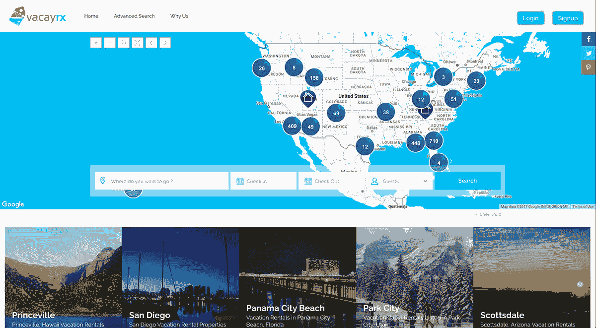
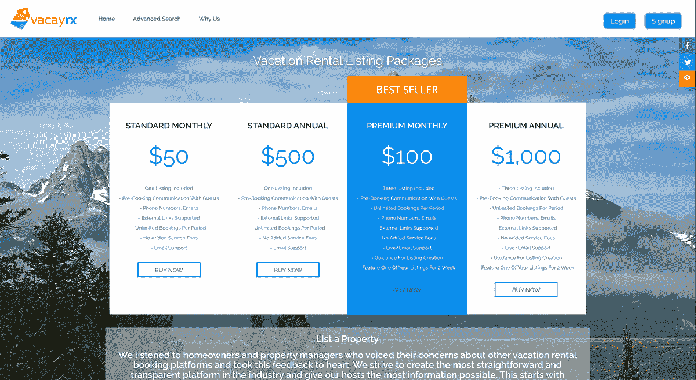
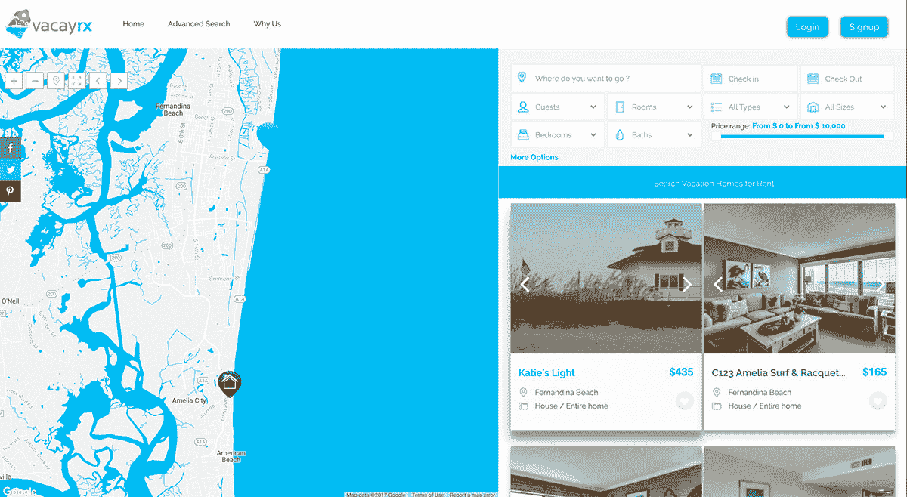

# 现场验证和引导至 7，500 美元/月

> 原文：<https://www.indiehackers.com/interview/validating-in-the-field-and-bootstrapping-to-7-500-mo-b62762126e>

## 你好！你的背景是什么，你在做什么？

我叫杰西·马丁内克，是 [Vacayrx](https://vacayrx.com/) 的创始人兼首席执行官。我们是度假租赁业主、经理和客人的替代平台，他们在网上列出和预订度假租赁时寻求更加透明和实用的解决方案。

该公司成立于 2016 年底，今年早些时候首次推出，在过去的三个月里，我们发展迅速。在开业的前 12 个月中，已经在 30 多个州添加了 2100 多个房产列表。

## 是什么促使你开始使用 Vacayrx？

我在度假租赁行业工作时，发现用户(尤其是房主)对最大的上市平台的看法发生了重大变化，于是产生了 [Vacayrx](https://vacayrx.com/) 的概念。

在开始自己的项目之前，让自己经历一些具有挑战性的职业经历。

TweetShare

由于一些重大收购，发生了一些变化，这些变化极大地影响了日常用户，在直接观察这些变化时，我看到了我认为是提供更好东西的巨大机会。

## 构建最初版本的 Vacayrx 需要什么？

开发 [Vacayrx](https://vacayrx.com/) 的有趣之处在于，我真的完全没有网络开发的技术背景。我在 Upwork 上外包了一些服务，以确保我有一些关键信息，我相信这些信息会帮助我获得用户，在这样做的过程中，我遇到了一个对这个项目感兴趣的承包商。

在几个成功的项目之后，他问我打算做什么，我告诉了他我的想法。我们很快开始越来越多地一起工作，到了他成为公司重要组成部分的时候，他成为了联合创始人和首席技术官。

然后，我们聘请了一名全职开发人员和一个 SEO/PPC 营销专家小组，从那以后我们一直在一起工作。

 

## 你们是如何吸引用户并壮大 Vacayrx 的？

我的背景一直是业务开发和销售(最近是在度假租赁行业)，这对我们早期的发展帮助很大。

度假租赁业的伟大之处在于，每个人都很友好，如果你打电话给他们，他们通常会拿起电话，因为他们认为这是一个潜在的预订。这给了一个很好的机会在他们放松警惕的时候介绍一项服务，如果这项服务引起了他们的注意，这将是一次轻松的谈话。

我对这个项目最大的担忧是，我以前在这个行业中感受到的情绪是否发生在微观层面上，以及这种情绪是否会在国际层面上分享。

幸运的是，这似乎是事实。我们现在在美国各地都有用户，甚至一些国际房地产业主/经理也有早期兴趣。

## 你的商业模式是什么，你是如何增加收入的？

我们 100%致力于统一、透明的定价。不像我们的竞争对手在每次交易中向业主/客人收取一定比例的总租金，我们选择为希望在我们的网站上列出其物业的业主和物业管理公司提供统一的年度会员资格。

 

会员资格每年 500 美元起，这使得这些用户通过我们的平台预订 1-2 次后就可以轻松获得投资回报。在客人方面，每次预订向客人收取 25 美元的固定费用，这比其他平台上的预订节省了大量成本，其他平台上的预订通常收取总租金的 5-15%。

到目前为止，我已经启动了整个项目，这对我来说是一个巨大的财务压力。

TweetShare

## 你未来的目标是什么？

我们的下一个目标是为 Vacayrx 吸引一些风险资本，并向投资者真正展示机会有多大。

到目前为止，我已经启动了整个项目，这对我来说是一个巨大的财务压力，但我相信所有的努力、金钱和资源都得到了回报，因为我们看到了早期采用者的真正认可。

从好的方面来看，我们看到行业中的其他公司(比我们大不了多少)被收购了数以亿计，整个行业正在膨胀。

一旦筹集到资金，我们希望将大部分时间和精力放在通过营销和销售快速提高品牌知名度上，同时开展一些非常令人兴奋的开发项目。

## 你面临的最大挑战和克服的障碍是什么？

我可以毫无疑问地说，迄今为止最大的挑战之一是继续我对我们的想法的信念，尽管成本不断增加，而且有偷工减料的诱惑。

我很早就意识到，如果我想与比我们大得多、大得多的公司竞争，我们就必须不仅向市场推出有竞争力的产品，而且很可能是一种*优于*的产品，我们已经尽了一切努力来提供这种产品。

 

实现这一点通常需要富有挑战性和昂贵的开发，但在我看来，毫无疑问，我们在选择实现的功能上做出了正确的选择。

## 对于刚刚起步的独立黑客，你有什么建议？

我要高度强调的是，在开始自己的项目之前，你应该让自己经历一些具有挑战性的职业经历。

关于开发 Vacayrx 有趣的部分是，我真的没有任何 web 开发的技术背景。

TweetShare

我一直是一个有创造力的人，从 15 岁开始，我就一直在想点子。当时我很有信心，我可以成功地经营一家企业，但现实是，在真正准备好接手如此规模的项目之前，我需要从观察他人中吸取一些惨痛的教训。

最大的挑战是平衡成功所需的自信和被踢几次屁股后获得的谦逊。

## 我们可以去哪里了解更多？

请到以下任何一个地方来看看我们:

*   [https://vacayrx.com/](https://vacayrx.com/)
*   https://www.crunchbase.com/organization/vacayrx#/entity
*   【https://www.linkedin.com/company-beta/17922901/ 
*   [https://www.facebook.com/vacayrx](https://www.facebook.com/vacayrx)

—[<picture id="ember8090015" class="user-avatar ember-view user-link__avatar"></picture>vacayrx](/vacayrx?id=AB0dr37iAsYuyobtDbxjtvIOe923)，Vacayrx 的创建者

## 想像 Vacayrx 一样建立自己的事业？

你应该加入独立黑客社区！🤗

我们是几千名创始人，互相帮助建立有利可图的业务和副业。来分享你正在做的事情，并从你的同事那里获得反馈。

还没准备好开始使用你的产品吗？没问题。这个社区是一个认识人、学习和实践的好地方。随意[随便浏览](/)！

—[<picture id="ember8090020" class="user-avatar ember-view user-link__avatar"></picture>考特兰艾伦](/csallen?id=ibTLPyjwVebnZjMGKvz6ztarnuV2)，独立黑客创始人

4votes