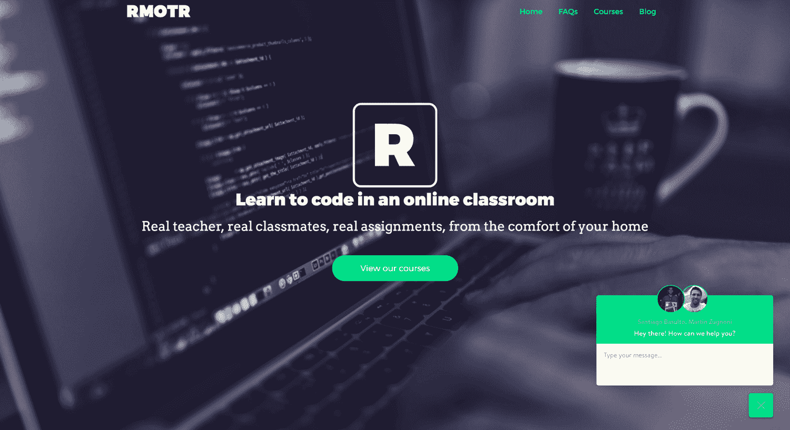
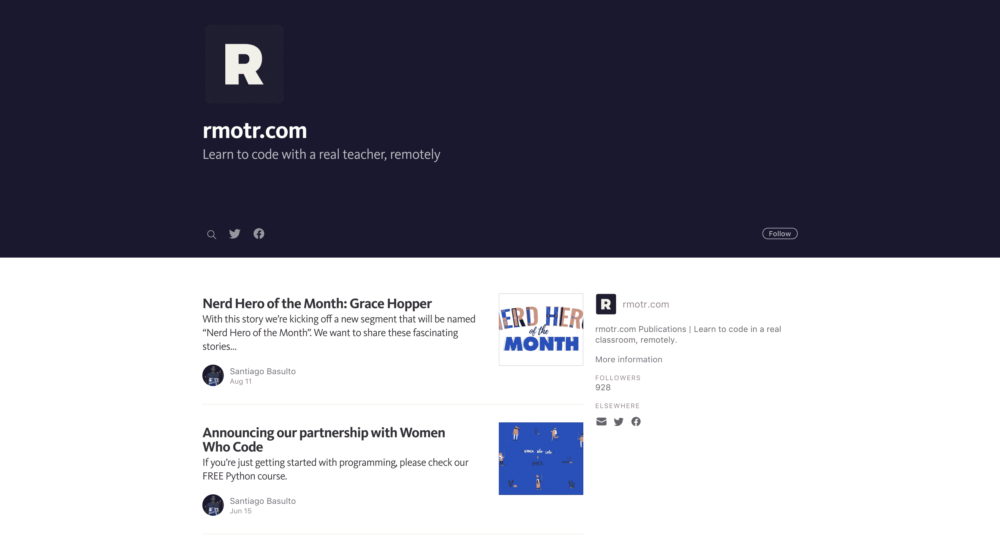
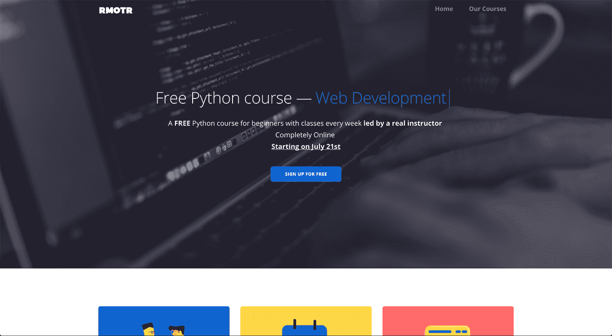

# 等到我们的想法被验证后再写一行代码

> 原文：<https://www.indiehackers.com/interview/waiting-until-our-idea-was-validated-to-write-a-line-of-code-149f0f7091>

## 你好！你的背景是什么，你在做什么？

我叫圣地亚哥。我和联合创始人马丁一起创建了[rmotr.com](https://rmotr.com/)，这是一个专门研究 Python 和 React/React Native 的在线编程训练营。我们为世界带来新的黑客👊。

我们创建了 rmotr，因为我们对目前可用的编程教育选项不满意。我们喜欢远程/在线课程的便利性和经济性，但我们知道仅仅坐着看视频并不是最好的教育体验——事实上，我们自己也深受其害。

我记得新的 MOOCs(大规模开放在线课程)浪潮来袭的时候。我们几次试图完成[吴恩达的机器学习课程](https://www.coursera.org/learn/machine-learning)，出于某种原因，我们总是中途放弃。我们想，“如果有一个偏远的环境，但有真正的老师和同学，那该多好啊？”或者更简单地说，将传统教育模式移植到远程环境中。

当我们创建 rmotr 时，我们决定要改进编码的教学方式。我们在当地大学从事教学工作已经八年多了，我们一直在寻找改进的方法。有了 rmotr，我们意识到我们有机会将这些年来收集的所有想法付诸实践。

我们现在已经有了一个很好的教育模式，它结合了真实的人类体验和远程工作的便利性。从开始到现在，我们已经教了 500 多名学生，我们没有在广告上花一分钱。

 

## 构建和发布最初的产品需要什么？

我们最近在一家完全不同的初创公司失败了，为了应对挫折，我们决定休息一段时间，回到传统的咨询行业。我们像朋友一样一起出去玩，但我们没有明确的打算回来开始新的生活。

然后发生了两件事:正如我之前所说，我在尝试完成各种 MOOC 应用程序的课程时遇到了问题。我是一个很容易分心的人，如果没有严格的时间表，我很难做一些事情。我喜欢在家学习的想法，但我需要更接近传统教育模式的东西。

与此同时，Martin 在我们当地的大学教授操作系统和系统编程，他对授课方式非常不满。他多次尝试做出改变，使课程和工具现代化，并改进方法，但他总是得到一个声音“不！”作为回答。

因此，考虑到我们还没有开始我们自己的新项目，我们决定通过教人们编码来填补这个“肾上腺素缺口”。我们会让它成为一项兼职活动，以帮助人们，并对一项补充活动感到满意。这有点像当地的阅读俱乐部，但只针对程序员。

所以我们从小处着手。在我们之前的投资中，我们写了很多软件，却几乎没有客户。所以我们挑战自己，决定了两件重要的事情。首先，为了测试这个概念和我们的想法，我们开始时没有写一行代码。第二，我们从第一天开始收费，这是知道你的服务是否真正帮助了人们的唯一方法。

尽快开始销售。我们黑客从来没有足够重视销售有多重要。

TweetShare

在接下来的几周里，我们使用 Google 文档、Hangouts、在线 ide 和表单将我们的想法整合成了一个 alpha 版本。我们使用了所有可用的服务来创建我们的初始版本，并准备测试它。我们[在/r/learnprogramming](https://www.reddit.com/r/learnprogramming/comments/2h4j9b/im_going_to_teach_a_free_remote_class_of/) 中发帖，感受一下其他程序员的感受。然后我们免费发布了我们的第一个版本，以帮助我们测试我们的 MVP——尽管我们开始对第二个版本收取最低 50 美元的费用。

## 你是如何吸引用户和发展 rmotr.com 的？

口碑是我们获取新生的主要来源。我们在产品上下了很大功夫，尽可能给学生最好的体验，我们得到了积极的反馈。我想说投资你自己的产品，尤其是*投资帮助和服务你的客户，是你最好的营销策略。*

从第一天起，我们就致力于为那些没有能力支付我们课程费用的人提供学习机会。我们与像[women hocode](https://www.womenwhocode.com/)和[djangogirms](https://djangogirls.org/)这样的协会建立了不同的奖学金模式，这让我们有很多机会接触付费客户。

我们也走传统的路线来处理 SEO 和其他常见的营销策略。我们有一个非常强大的内容营销战略，老实说，这是一个偶然的发现。

 

从一开始，我们就为自己的学生制作了大量内容，我们决定让这些内容全部免费和开源。我们没有意识到这么多客户会在发现和欣赏我们的内容后间接找到我们。一个很好的例子是我们创建的[免费烧瓶教程](https://flask-tutorial.com)，它现在为我们带来了大量的流量。

最近，我们为初学者发布了一个[免费 Python 课程](https://rmotr.com/free-python-online-course)，类似于我们在标准课程中所做的。它稍微浓缩了一点，因为每周只有一节课，但它仍然提供了一个很棒的体验。

我们这样做是为了了解我们当前的课程，同时也是为了帮助我们的学生开始编程。大多数学生在刚刚开始学习一门课程的时候都不愿意付费，即使这门课程很棒。他们只是有太多的疑虑:也许他们不会喜欢，也许他们会感到不舒服，等等。所以免费课程让他们有可能尝试一下。如果他们喜欢并想继续，他们已经了解我们了。

## 你的商业模式是如何运作的？你的营收背后有什么故事？

我们的商业模式非常简单:我们向学生收取固定的课程费用。我们目前有两门课程——[Python 编程入门](https://rmotr.com/introduction-to-python-programming)和[高级 Python 编程](https://rmotr.com/advanced-python-programming)——以及一个专业:[Django Web 开发](https://rmotr.com/web-development-with-django)。我们目前正在致力于数据科学专业化，我们将很快宣布。

正如我已经提到的，我们一开始没有写一行代码。围绕 rmotr.com 的一切都是实验的主题，定价就是最好的例子。这是迄今为止我们要解决的最复杂的事情。

我们都知道，活着的蹩脚产品胜过你头脑中的伟大想法。

TweetShare

开始时，我们每门课收费 50 美元。我们不知道什么是便宜的或昂贵的。我们做了一些改变，提高和降低价格，直到有一天我们偶然发现了我们的“幸运”号码。一个以前的学生发邮件给我们，感谢我们给他的所有帮助。他得到了他的第一份编程工作。他说，“这是我投资过的最好的 50 美元”，因为他收到了一份接近 7 万美元/年的初级职位的报价。

这意味着我们向他收取的费用不到他第一年工资的 0.1%。这听起来有点太便宜了，但给了我们一个想法，如何调整我们的价格，使之与我们提供的价值相对应。

如今，这两种课程的价格都在 800 美元左右(参加两种课程都有折扣)，这使得成本接近初级开发人员工资的 1%。但我们仍在不断改进学习体验。

我们最大的成本依赖于我们的导师。(我们有真正的人来帮忙，而且我们付给他们有竞争力的薪水。)好消息是，我们所有的导师都是以前的学生，所以一个学生真的很容易过渡到导师的位置，而不必经过漫长的培训过程。当我们需要更多的导师时，这也使我们这边的过程变得容易得多。

## 你未来的目标是什么，你打算如何实现它们？

我们现在为[rmotr.com](https://rmotr.com/)设定的最大目标是完成数据科学专业化并保持增长。我们知道在客户方面我们还没有实现所有的潜力，但是我们的产品仍然没有我们想要的那样可扩展。

也就是说，作为 MVP，它做得很好(即使是在 16 个月后)，它不仅让灯亮着，还帮助我们学到很多东西，改善我们的体验和产品。

解决这些问题后，我们将深入研究其他技术，首先关注 Javascript。

## 你最大的优势是什么？有什么特别有用的吗？

到目前为止，我们最大的优势是我们建立的团队。我们都对我们所做的事情充满热情，每一个新加入的人，即使她每周加入导师两个小时，也分享着同样的热情。

教育带来激情。有利可图当然很好，但教育是一个可以满足个人需求的领域。

## 对于刚刚起步的独立黑客，你有什么建议？

嗯，我认为这将是非常标准的，但现在开始:*现在就开始！不要再浪费时间了。开始吧。我们都知道，活着的蹩脚产品胜过你头脑中的伟大想法。*

而且更重要的是:*关注团队*。拥有一个优秀的、值得信赖的、紧密的团队是任何创业公司成功的关键。

另一个重要的是销售。如果你只是一个黑客(就像我和马丁过去一样)，我建议你尽快开始销售。我们黑客从来没有足够重视销售有多重要。为了让你迈出第一步，我推荐杰弗里·吉托梅尔的[销售红宝书](https://www.amazon.com/Little-Red-Book-Selling-Principles/dp/1885167601/ref=sr_1_1?ie=UTF8&qid=1501395972&sr=8-1&keywords=little+red+book+of+selling)。它简短而基本，但却是不可思议的资源。如果你稍微有一点经验，我会推荐尼尔·雷克汉姆的[旋转销售](https://www.amazon.com/s/ref=nb_sb_ss_i_1_4?url=search-alias%3Dstripbooks&field-keywords=spin+selling&sprefix=spin%2Cstripbooks%2C267&crid=3GF8IKG4MNN5L)——尤其是针对 B2B 业务。

最后，有一本书，我每年都试着读*。说真的，它永远不会过时，我总能从中获得新的有价值的东西，这是 Basecamp 的 Jason Fried 和 David Heinemeier Hansson(Ruby on Rails guy)的[返工](https://www.amazon.com/Rework-Jason-Fried/dp/0307463745/ref=sr_1_1?s=books&ie=UTF8&qid=1501396065&sr=1-1&keywords=rework)。*

 *## 我们可以去哪里了解更多？

如果你想开始编程，我想再一次提到我们的免费 Python 课程。我们知道迈出第一步有多难。今天的问题是我们要学的选项太多了，我们有点头晕。如果你对此不太确定，你仍然可以加入我们在 Slack 上的[开放 Python 社区，看看大家都在谈论什么。](http://slack.open-python-community.org/)

 

我们鼓励您给我们留下您的意见或问题。我们将尽可能做出响应，并随时愿意提供帮助。

——[<picture id="ember8097116" class="user-avatar ember-view user-link__avatar"></picture>santiagobasulto](/santiagobasulto?id=4WAv0yAGNUdEpYH5lKmGy39qiOH3)，rmotr.com 的创造者

## 想像 rmotr.com 一样建立自己的事业吗？

你应该加入独立黑客社区！🤗

我们是几千名创始人，互相帮助建立有利可图的业务和副业。来分享你正在做的事情，并从你的同事那里获得反馈。

还没准备好开始使用你的产品吗？没问题。这个社区是一个认识人、学习和实践的好地方。随意[随便浏览](/)！

——[<picture id="ember8097121" class="user-avatar ember-view user-link__avatar"></picture>柯特兰艾伦](/csallen?id=ibTLPyjwVebnZjMGKvz6ztarnuV2)，独立黑客创始人

9votes*