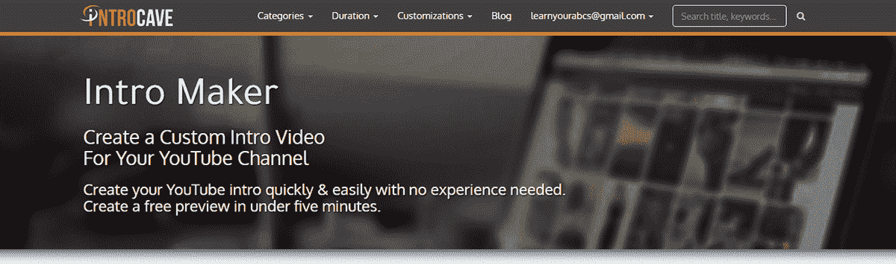
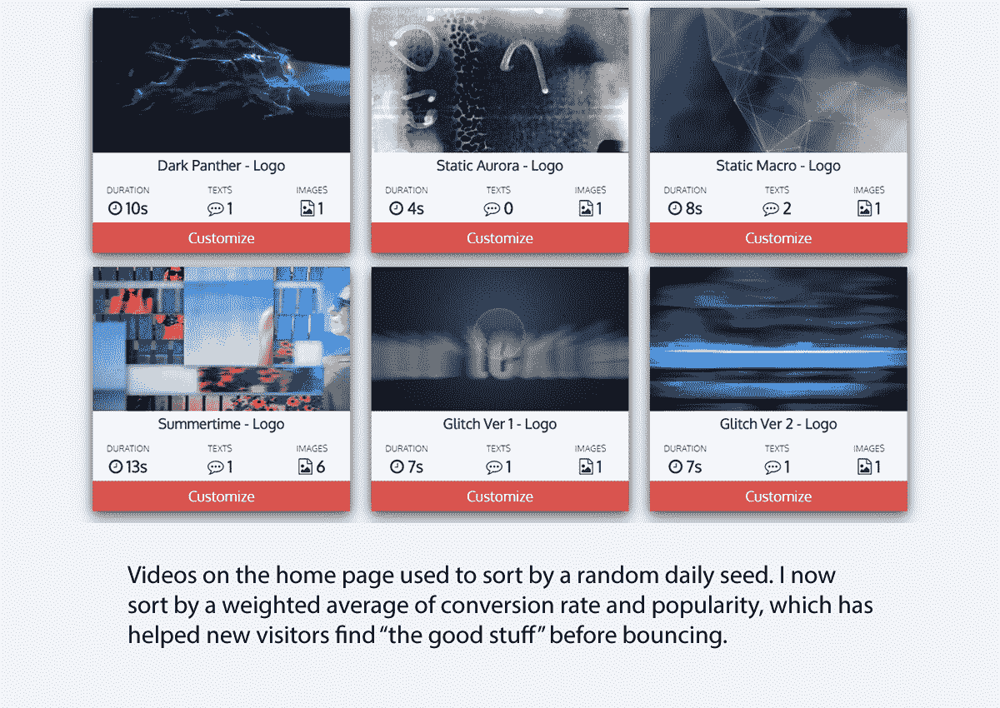
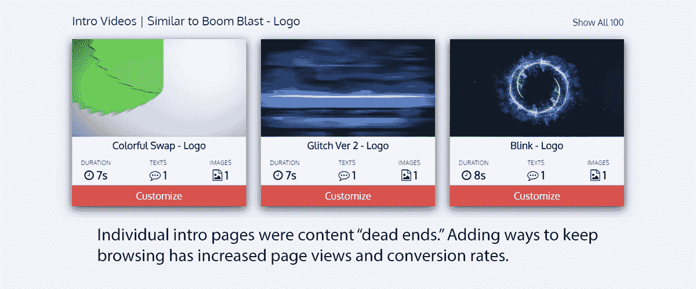
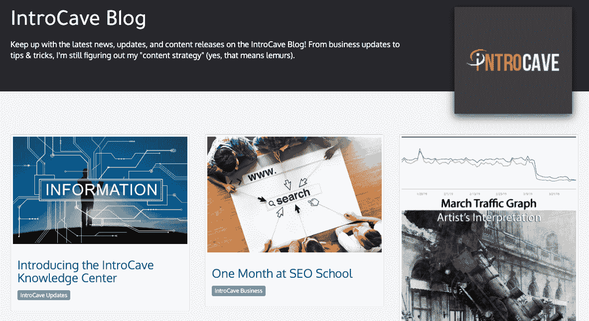

# 我从购买企业而不是创办企业中学到了什么

> 原文：<https://www.indiehackers.com/interview/what-ive-learned-from-buying-a-business-instead-of-founding-one-458c55b2ba>

## 你好！你的背景是什么，你在做什么？

嗨！我叫威尔·汉金森。在过去 10 年左右的时间里，我一直在游戏开发和网页开发之间徘徊。在 Flash 去世之前，我作为一名独立 Flash 游戏开发人员取得了一些成功，我经常在我的博客(现已关闭)上发布收入和销售统计数据。博客没了(我厌倦了 WordPress 被黑)，但你可以在我的个人网站上看到大多数旧游戏和项目。人们似乎总是喜欢这种程度的透明度，所以我想我会在我的新企业中继续这样做。

[IntroCave](https://introcave.com/) 是一个在线介绍视频制作者。用户可以浏览我的模板(目前大约有 100 个)，选择一个，并定制它以满足他们的需求。确切地说，可以定制的是模板驱动的，但它通常是一些徽标、字幕、音乐，有时还有颜色的组合。这项服务主要由小企业使用，他们希望在他们的社交视频和刚刚起步的 YouTube 频道上展示更花哨的标志。

去年夏天我买下这个网站时，它的月收入约为 2700 美元。自从我掌权以来，这个数字已经涨到每月 5000 美元，然后回落到每月 1800 美元左右。

 

## 是什么促使你开始使用 IntroCave？

几年前，我在 Hacker News 上看到一个帖子，讲的是一些人以大约 10 万美元的价格收购了一家现有企业。这似乎是一个很好的主意，所以我注册了几个经纪人电子邮件列表，并开始浏览。在最终购买 IntroCave 之前，我在其中的 20-30 个上建立了财务模型。我不会说我是“每周工作 4 小时”或“提前退休”的铁杆支持者，但总的来说，我喜欢把我的钱投入到能赚更多钱的资产中的想法(我和我妻子也做出租物业)。

除了“为钱而做”，我目前的工作是在一家数字营销机构。我主要是构建 MVP——无论是客户的内部工具还是小型营销网站——我很少去做我认为 web 开发中“有趣的部分”:缩放、分析、A/B 测试。我没有太多的时间来处理这个问题，所以购买一个意味着我要跳过“这可行吗”这一步，直接进入操作阶段。

## 你为什么收购 IntroCave 而不是其他公司？

结果是很多小原因，但不一定是我在寻找其他待售企业时所期望的原因。我*以为*我在购买一个基于 Ruby 的 SaaS 小应用。IntroCave 是用 PHP (Laravel)构建的，有一个单点业务模型(和 ads 一起)。后端呈现器是。NET 和 After Effects 脚本。我做了很多 Ruby on Rails(类似于 Laravel)，很多 C#(在 Unity 中，而不是. NET 环境中)，还有很多 Photoshop 脚本(和 AfterEffects 一样怪异的 JSX 和文档模型，但是用了不同的 API)。这是许多随机的片段，非常接近我所熟悉的。

在技术层面上，我认为我们离 YouTube 的受欢迎程度还远着呢。介绍者是一个更大的市场(可定制的视频模板)中相对较小的子集，这个市场看起来不像一个赢家通吃的环境。这里有足够的需求(而且还在增长！)我看到了许多扩张的方式——要么进入新的点播视频领域(解说视频、产品视频、为 Instagram 创建内容)，要么在这个利基市场加倍努力，让产品比竞争对手更好。

从更个人的角度来说，我本科时是电影专业的。在我进入编程之前，我涉足过动画和视频剪辑。这似乎是一个重温旧技能的好借口。

最后的决定因素:我看到 intromaker.com 只是一个待售的域名。当我为 IntroCave 谈判时，我也伸出手，开始为那个域名谈判。IntroCave 的大量流量来自与“intro maker”相关的搜索，因此它似乎是一个自然的目标。我目前专注于稳定和发展 IntroCave，但我的长期计划是建立一个 2.0 版本，它将存在于 Intro Maker 域中。

这些都不是购买该网站的确凿理由，但它似乎有很多我想要的东西。我提出了一个报价，有一点谈判，我们在 2018 年 6 月转让了一切。

## 你能谈谈你是如何买下这个网站的吗？

小型在线企业的销售价格通常是利润的两到四倍，所以做一些简单的数学运算，算出一个月收入约 2500 美元的网站可能会卖多少钱并不困难。加上我购买的额外域名和其他启动成本，最终价格可能会在 10 万美元到 12 万美元之间。其中约有四分之一是基于业绩的盈利，这让我有了一些信心，认为最初的卖家会留下来回答出现的任何技术问题。

这听起来像是一个巨大的风险，但它似乎并不疯狂。我从事独立游戏开发已经有一段时间了，大多数人会称之为失业。我看不出自掏腰包花 10 万美元和放弃一年软件开发人员的薪水有什么区别。就实际支付而言，我使用了信用额度。还本付息额约为 500 美元/月，在购买时约为每月利润的 20%。我目前拿着所有的现金来偿还贷款，所以可能要过几年我才能发现我是否在这笔交易中赚了钱。

找一些有趣的事情，一次做几年。

TweetShare

## 接管产品的过程是怎样的？

我没有构建最初的产品，但我可以稍微谈一谈跳进你刚买的代码库却不知道发生了什么是什么感觉。网络服务器没问题。这些年来，我侮辱了 PHP 很多次，但是 Laravel 是一个很好的合作伙伴。我不得不做大量的谷歌搜索，但我基本上能够把我的常规 Rails 策略翻译成 Laravel，而不需要太多精神上的翻腾。

困难的部分是渲染服务器。在不透露太多秘密的情况下，After Effects 并不是真的设计用来一天打开和关闭数百个文件的。这些服务器需要定期照看和重启，在最初的六个月左右，我偶尔会醒来，发现一切都着火了。对于被认为是主要被动的收入流，IntroCave 开始时相当活跃。我几乎立即决定完全重建渲染管道，这是我拥有这个网站以来一直在进行的工作。

重建渲染管道也意味着重建所有的内容，所以我一直在手工重新架构网站上的每个模板，以适应新的系统。我已经能够将新系统中的一些更改移植到旧系统中，这大大减少了照看孩子的工作量。

最近，我进入了一个相当好的发展节奏。我在 Trello 中保留了一桶“大工作”(营销自动化，新的渲染管道)和“小工作”，如果我能找到一两个小时来修补，我就可以完成它们。在过去的几个月里，我没有太多的时间去做大事，但是有了这些琐碎的工作，我觉得我还在进步。

## 你是如何找到时间来开发产品的？

我很幸运能在目前的工作中每周工作四天。这样做我的薪水会受到一点影响，但作为一个总是喜欢涉猎和修补的人，每周有一天专门用来做这件事会有很大的不同。从纯数学的角度来看，盈亏平衡点大约是每年 25000-30000 美元(附带项目税很奇怪，所以很难进行直接比较)。在那条线下，我最好只工作五天，拿全薪。我提到过我在一家数字营销机构工作——我在那里的工作通常很无聊。我周围的人都很棒，我确实相信我们正在建造的东西会对我们的客户产生影响，但如果没有薪水，我不会选择建造这种东西。每周有一天我可以拥有、控制和修补一个产品，这是一个让我在日常工作中保持满足感的令人惊讶的好方法。

薪水很高！不要害怕做几年的全职工作，然后兼职修补一下。

TweetShare

十年前，我在下班后和周末做这些事情。现在我 35 岁了，我需要更多的睡眠，晚上/周末往往会被与家人(妻子、狗、两个孩子)共度的时光填满。我们有一个“要么使用，要么失去”的假期政策，所以如果我们在休息时间去玩 IntroCave，我也不会羞于多休一两天假。

## 你的商业模式是什么？

我出售单一服务定制的视频渲染。我目前的 720p 渲染收费为 4.99 美元，1080p 渲染收费为 9.99 美元，但在未来几个月里，我会做一些价格调整。通过 Stripe 的销售通常占我收入的大约三分之二(扣除交易费)，Adsense 占其余部分。

这个领域的大多数网站(我广义地称之为基于模板的渲染服务)都收取小额订阅费。我认为，如果你的目标是那些希望每周在五个不同频道上发布视频的营销机构，这是很有意义的。然而，具体到 YouTube 的介绍，大多数人真正需要多少介绍呢？我觉得我的网站主要面向那些希望提高产品质量的新频道，我只是没有看到大多数客户购买多个视频。

我有一个客户参加了年度计划(我并没有大肆宣传)。时不时地，我会在分析中看到有人重复购买，我会联系他们，看他们是否愿意改变，但到目前为止，我交谈过的大多数客户更喜欢现收现付的灵活性。

## 你做了什么来种植 IntroCave？

该网站已经从几个关键词排名中获得了相当多的有机流量，所以我的努力主要集中在增加参与度、漏斗优化、直接联系和电子邮件增长上，并瞄准更广泛的关键词来降低单一有机渠道的风险。参与度和漏斗优化是齐头并进的。我添加了许多功能来增加“可浏览性”,并让谷歌分析中的漏斗跟踪工作得更好一些。我开始在谷歌优化中运行 A/B 测试。我不会说我在任何一个领域都击败了它，但平均每次访问收入和其他指标，如网站停留时间和广告收入，自接管以来都有所上升。

 

我收到了相当多的电子邮件注册(现在仍然如此！)，所以我开始每月发简讯，并开始每月发一两篇博客。我请了一位作家来写一些博客文章，以减轻我的负担，但最终我认为，与我自己写相比，这样做并不能节省足够的时间。电子邮件流量和有机流量开始上升。我浏览了网站上的每个模板，重写了所有的标签和描述。我扩充了类别描述，让它们包含真正的内容，而不仅仅是一墙的视频缩略图。我开始对一些更深层次的关键词搜索进行排名。收入从第一个月的 2800 美元左右上升到今年 1 月的近 5000 美元。老实说，我飞得很高！

 

在三月份，大约在月中的时候，流量跌落悬崖。我把大部分热门搜索词放到了第二或第三页，现在我的大部分流量都是直接的。SEO 对我来说仍然是一个黑匣子，所以我真的不知道该怎么办。独立黑客上的一些人给我指出了一个谷歌算法的更新，我当时基本上认为我已经把 10 万美元冲进了马桶。我和几个搜索引擎优化顾问谈过，并雇人做了搜索引擎优化拆卸。他们中的一个人使用一些专业工具做了一个视频审查，我注意到 Ahrefs 中的一个仪表板上有一些东西——我在 3 月份收到了大量的反向链接。

| 月 | 收入 |
| --- | --- |
| 2018 年 7 月 | 2832 |
| 2018 年 8 月 | 4102 |
| 18 年 9 月 | 3760 |
| 18 年 10 月 | 3408 |
| 18 年 11 月 | 3947 |
| 2018 年 12 月 | 3562 |
| 19 年 1 月 | 4966 |
| 2019 年 2 月 | 3952 |
| 19 年 3 月 | 3134 |
| 2019 年 4 月 | 1764 |

我注册了自己的 Ahrefs 账户，开始四处闲逛。从三月初开始，就在我的流量变得一团糟之前，我开始收到大量来自垃圾网站的链接。有人对我进行负面的搜索引擎优化活动。事实证明，不仅仅是我。在访问了一些垃圾链接农场网站后，我可以看到很多链接指向我的网站以及我的一些竞争对手。作为一个相对较新的网站，垃圾链接不成比例地影响了我的排名。我没有任何确凿的证据(特别是考虑到谷歌也在这个时候推动了算法的改变)，但我有一个很好的想法，谁是幕后黑手，基于哪个网站在这些关键词的排名中飙升。

因此...现在怎么办？战争？以毒攻毒？

不完全是。

我知道利基是可行的。我知道这个行业的上限比我现在赚的要高得多。如果我能在 1 月份每月赚到 5000 美元，我会很激动。外面的某个混蛋成功逃脱抢劫真是太糟糕了。这可能太愤世嫉俗了，但我内心有一点点认为我现在不应该出现在头版。这个产品还不错，但是它并不是最好的介绍者。还没有。

这并不是说竞争对手更好——他们不是。我现在可以做推广工作，并努力获得更多的反向链接，但要解释为什么 IntroCave 比同一领域的其他网站更好似乎有点困难，因为大多数网站都相当类似。我目前的很多反向链接都是这个领域其他网站的列表帖子，这没什么帮助。我需要给人们一个写 IntroCave(或 Intro Maker)的理由，然后开始营销。

## 你未来的目标是什么？

早期的增长实际上与我最初的路线图背道而驰。我把大部分时间花在了支持和稳定性上，而没有时间花在我想添加的更大的特性上。现在，事情已经冷却了一点，我想完成重写渲染系统，并将我现有的所有模板迁移到新系统。我想完全重写结账流程。我想建立一些常青的知识库文章，我可以插入到一个电子邮件序列。这些都是短期的路线图任务，尽管从工作量的角度来看，其中一些相当可观。

有了坚实的基础，我的运营任务可以转移到营销和内容上。在营销方面，我将有更多的时间开始做外联，并开始尝试建立一个足够强大的反向链接配置文件，这样我就可以对负面 SEO 攻击之类的事情有更多的免疫力。按理说，我应该已经这么做了。在内容方面，我已经推迟添加任何新的视频模板，直到我完成这个渲染系统重写。我的直觉告诉我，新内容将是新收入的良好驱动力，但我可能完全错了。

从更中期的角度来看，我有两个大目标。我想在购买/经营/资助这个网站上达到收支平衡。按照目前的速度，这可能需要几年时间，但即使不考虑我在网站上投入的数百个小时，那也将是真正“轻松休息”的时刻。第二，我想建立自己的运动图形工具。对于所有用例，我不一定认为我能比 AfterEffects 做得更好。不过，对于我的特定领域，我有一些非常好的想法，可以让我更快、更适合定制。渲染速度与转换率直接相关(更快的预览=更多的销售)，但它也为营销创造了机会。如果我能把渲染成本降低到足够低，我可以做一些事情，比如提供没有水印的免费介绍视频，以吸引更多的客户。

从更长的时间来看，我不认为自己会在几年内退出游戏开发。我目前没有足够的精神带宽来做一天的工作*和*投入*和*的游戏工作。在 IntroCave 得到充分回报之前，我所有的剩余精力都将投入到这个目标中。之后，我会重新评估。如果我能让它持续每月花费 4-5000 美元，它可能值得我无限期地保留。我希望尽可能多地实现自动化，并开始出租重复性的任务(客户支持、博客、时事通讯、新内容)，这将腾出我的时间从事另一个项目。每月$10K，我会开始考虑是否把 IntroCave 作为我的全职工作，而不是副业。假设在这样的规模下运营还是相当有效率的，我认为一个好的时间表应该是一周两天在 IntroCave 上，一周三天在新项目上(无论这是指游戏还是可能购买另一个小网站来发展)。

## 你面临的最大挑战和克服的障碍是什么？如果你必须重新开始，你会做什么不同的事？

很容易说，我希望我有不同的收入结构或支付更少，因为反向链接配置文件的弱点或网站的相对年轻。不过，该网站有多个报价，所以如果我出价过高，很有可能根本买不到这个网站。在足够长的时间范围内，2 万-3 万美元真的没有太大的区别，所以假设它没有真正跌至 0 美元，我可以继续赚钱和偿还债务，我很高兴我买了它。这是一个有趣的项目，我仍然认为它有很多好处。

我对以前的自己的建议可能是:“你应该早点做，白痴。”

TweetShare

最困难的部分实际上是在身份方面。我没有大量的推特粉丝(600-700 人)，但是那些关注我的人可能会关注我的游戏内容。自从接管 IntroCave 以来，我感到有点瘫痪。我正在做的很多事情都很有趣，但突然把我的 Twitter 帖子从谈论很酷的游戏内容切换到谈论自举和网络开发，对我来说有点不真诚。随着我进入内容创作和处理很酷的视觉效果，一些不和谐可能会消失，但与此同时，我觉得我曾经重视的东西被拿走了。

为了填补这个空白，我在 Reddit 上花了很多时间。Reddit 对改变兴趣有更好的支持——你只需不关注你的老用户，而关注一些新用户。但也感觉价值低了很多。我没有从参与那里得到任何东西，所以感觉没有回报。Twitter 可能也总是在浪费时间，但感觉上并不完全是浪费时间。

我知道我只需要克服它，合并我的数字身份，然后张贴我想张贴的任何东西，但迄今为止我还没有成功地遵循我自己的建议。一旦我最终克服了这个困难，我对以前的自己的建议可能是:“你应该早点做，白痴。”

 

## 对于刚刚起步的独立黑客，你有什么建议？

薪水很高！不要怕工作几年，边修边补。大学毕业后的头几年，我除了做入门级的 web 开发工作之外，还做 Flash 游戏，年薪 3 万美元。我把那段经历变成了做脸书游戏的高薪工作，最终经营了一家小型游戏工作室，但这也让我意识到失业并不一定意味着零收入。

如果你特别考虑买些东西而不是建筑:找些有趣的东西，一次做几年。我知道进入 IntroCave 可能需要三到五年才能达到盈亏平衡点。我还不到一岁。这将是一次长途旅行。承诺 IntroCave 意味着在接下来的几年里对很多东西说“不”。

如果样本量只有一个，我还想补充一点，你看到的任何声称你可以在每周 5 到 10 个小时内完成业务的列表都是胡说八道。我并没有完全按照前任老板的剧本来做，但那些离题的话可能是我在搜索流量大幅下降后降到每月 1800 美元而不是每月 200-300 美元的原因。这些东西不是你可以交给物业经理的租赁物业(也许那里有商业模式？)，所以，如果你打算进入一个已经开始运营的业务，一定要确保你有足够的带宽来支持它。

## 我们可以去哪里了解更多？

你可以关注 [IntroCave 博客](https://introcave.com/blog)，在 Twitter 上给我发消息 [@SimianLogic](https://twitter.com/SimianLogic) ，或者干脆[给我发邮件](/cdn-cgi/l/email-protection#127e7773607c6b7d67607370716152757f737b7e3c717d7f)。我边走边想出了很多东西，但如果我能帮上什么忙，请尽管开口！

—[<picture id="ember5262252" class="user-avatar ember-view user-link__avatar"></picture>将汉金森](/SimianLogic?id=nokJssjvkofbyvwLFdxHhm0jWnz1)，介绍制造者的拥有者

## 想像 Intro Maker 一样建立自己的企业吗？

你应该加入[独立黑客社区](/)！🤗

我们是几千名创始人，互相帮助建立有利可图的业务和副业。来分享你正在做的事情，并从你的同事那里获得反馈。

还没准备好开始使用你的产品吗？没问题。这个社区是一个认识人、学习和实践的好地方。随意[随便浏览](/)！

——[<picture id="ember5262257" class="user-avatar ember-view user-link__avatar"></picture>考特兰艾伦](/csallen?id=ibTLPyjwVebnZjMGKvz6ztarnuV2)，独立黑客创始人

34votes