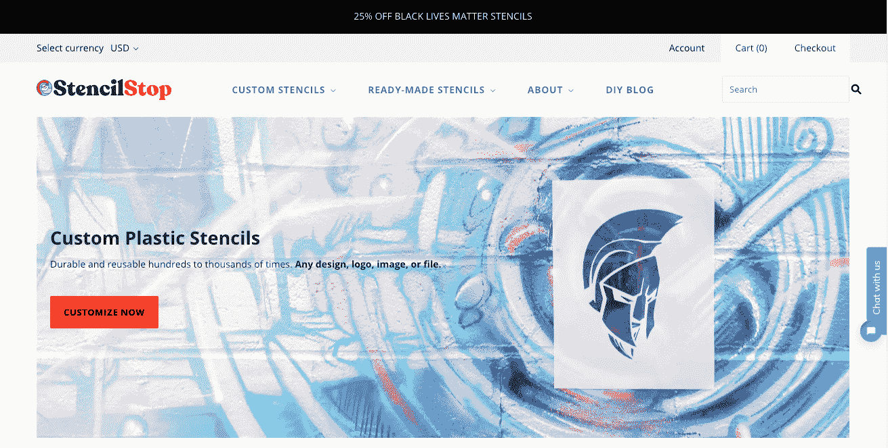

# 为什么扩大我的产品帮助我达到$40k MRR

> 原文：<https://www.indiehackers.com/interview/why-expanding-my-products-helped-me-reach-40k-mrr-ca2526bf01>

## 你好！你的背景是什么，你在做什么？

我是科林，[模板停止](https://stencilstop.com)的首席执行官。我曾经在包装行业工作，最初是一名结构设计师，后来是一名评估员，为生产纸板和瓦楞纸箱的公司工作。我肯定不是最好的员工，但我从现实生活中的制造组织学到的东西对我从头开始创建一个组织非常有价值。

【T2

模板停止使定制和现成的模板。业余爱好者、艺术家和营销人员使用我们的产品来粉刷墙壁、装饰人行道、蚀刻玻璃、定制鞋子、定制玉米洞板、在咖啡上撒肉桂、宣传活动，以及几乎所有介于两者之间的事情。(实际上，人们如何使用这些东西是非常令人兴奋的。我们每天都很惊讶。)

目前，我们的网站每月收入超过 40，000 美元。

## 是什么促使你开始使用 Stencil Stop？

2015 年，我们从克莱姆森大学毕业后不久，我和一个朋友一起创办了 Stencil Stop。毕业没几个月，我就已经知道朝九晚五的生活不适合我，所以我每天晚上都在努力构思介于“巴勃罗·桑切斯摇头娃娃”和“一只能装三瓶啤酒的袜子”之间的新点子。

我一直在工作时用我的切割机用硬纸板制作各种克莱姆森主题的标志(我应该用它来做我实际的包装设计工作。)一天晚上，朋友说:“克莱姆森 stencils 怎么样？”我确信快速搜索会产生大量的产品结果。但是神圣的克莱姆森标志模板并不存在！

我有一些不错的设计技能，因为我的包装专业，因为我的妈妈是一名美术老师，所以我想我可以开始了。做了一些样品，拍了一些图片，做了一个超级粗糙的网站。克莱姆森模板在网站上挂牌的第一个晚上，*就有人买了！我甚至不知道他们是怎么找到它的。大概是在谷歌的第 37 页。在任何情况下，这都是我所需要的确认，我想知道人们是否愿意在网上找到模版。*

虽然 Stencil Stop 已经成为一个成熟的公司，但自从第一次出售 Stencil Stop 以来，许多其他想法已经诞生并消亡。我在没有任何模板专业知识的情况下创办了这家公司。但是今天，我很自豪地说，我们都在模版上。

## 构建最初的产品需要什么？

我用 Adobe Illustrator 设计模板，用我提到的切割机 Kongsberg 制作模板。更费时的部分是研究我们想卖什么样的现成设计，以及我们如何获得学院许可，实际上合法地继续销售克莱姆森标志模板。

在不知道自己在做什么的情况下，我和克莱姆森的首席许可人员见了面，向他展示了产品，并问他我需要做些什么才能获得批准。他有一些想法，基本上只是几个调整，我需要得到他的授权。这实际上是一次很好的学习经历，因为我能够在花一美元申请许可、填写表格和所有这一切之前，将想法直接带给看门人，这最终是一个非常复杂的过程。

我最近读了《四小时工作制》和《精益创业》这两本书，所以这些书很可能促进了廉价验证想法的概念。

为了实现这一目标，我在晚上和周末工作。如果我需要钱买东西，我会花自己的钱。我大学毕业后的第一份工作是在一个陌生的城镇，所以我一直拼命工作。让我们现实一点，我在工作中也花了很多时间在这个*上。就像我说的，我不是最好的员工。*

## 你是如何吸引用户并发展 Stencil Stop 的？

我们的发布会本质上是一个家伙，在半夜买模板。我最初是在 Squarespace 上建立这个网站的，不过我很快转向了 Shopify，因为它有更多的电子商务模板。该网站自 2015 年以来增长缓慢，因为我们基本上没有创建优质内容的物理位置。我总是觉得模版的想法是如此的直观，如果没有补充的照片和视频，你就不能写一篇博文。无论如何，自从我们于 2019 年 11 月搬进位于萨克拉门托市中心的新工作区以来，我们的内容战略才刚刚开始。

如果你正在开始和经营一个企业，把你的产品放在那里！一个人能说的最糟糕的话就是不。

TweetShare

一开始，我从未做过任何冷冰冰的电子邮件和公关之类的事情。我总有一种挥之不去的感觉，觉得我们不够“合法”。今天，你可以谷歌模板停止和整个第一页基本上是我们。看起来像现实生活中的网络品牌。我的销售过程一直是“成为每个在线模版交易的一个选项”，所以我想如果我给人们发电子邮件，我会在他们不需要的时候把模版塞进他们的喉咙。事后看来，这可能也有点胆小。如果你正在开始和经营一个企业，把你的产品放在那里！一个人能说的最糟糕的话是不。(嗯，他们可以说“去你妈的”，但他们可能不会。)

今天，我们有两台自己的模版制作激光切割机。在工作中制作模版几年后，我和我的朋友攒够了钱购买了第一台机器，并以每月 100 美元的价格租下了一个旧的 900 平方英尺的飞机库。我们从一个朋友的父亲那里租的，那个朋友现在也是公司的合伙人。我们在那个旧机库里熬了两年多，直到 11 月份搬进了 3500 平方英尺的仓库。在我写这篇文章的前两天，我们的第二台机器真的到了！

| 月 | 用户 |
| --- | --- |
| 2016 年 1 月 | 390 |
| 2016 年 7 月 | 643 |
| 2017 年 1 月 | 507 |
| 2017 年 7 月 | 1023 |
| 2018 年 1 月 | 778 |
| 2018 年 7 月 | 9525 |
| 19 年 1 月 | 7398 |
| 2019 年 7 月 | 9106 |
| 1 月 20 日 | 9703 |
| 2010 年 7 月 | 17846 |

## 你的商业模式是什么，你是如何增加收入的？

我们大约 80%的销售是定制模板。在将[定制模板](https://stencilstop.com/products/custom-mylar-stencils)加入我们的产品组合后，我们的收入真正开始增加，整个业务围绕着这样一个原则，即客户通常不会在网上找到他们想要的模板设计。

我们最初开始销售它们，是因为客户实际上开始特别要求它们。我有能力在 Illustrator 中设计它们，所以如果顾客愿意购买，我总是会答应。通过[投资内容](https://stencilstop.com/blogs/diy)和围绕定制模板建立的网页，我们已经能够找到一个稳固的利基市场，并成为互联网上最受欢迎的定制模板公司。

然而，我最近学到了一些新的有价值的东西。我们[在亚马逊](https://www.amazon.com/stencilstop)上销售商品，并将现成商品的数量增加了 10 倍。我一直假设，如果我们从最初 30 种左右的畅销设计中稀释我们的现成产品，我们会给我们的客户太多的选择，销售额会下降。

但基本上，相反的结果是正确的。当我们查看数据时，我们的销售增长是可预见的，并且与上市数量成线性比例。这在逻辑上也说得通。如果你正在寻找一个狗模板，而你在一个网站上只看到一个狗模板，它可能不是你想要的确切的狗模板。但是如果你看到 100 种不同品种、不同风格和不同大小的狗的图案，可能会有适合你的。

所有这些都是说，我们仍然非常小，非常灵活。我以精益的方式建立了公司，这样我们就可以快速利用新数据和新信息。如果我在 2016 年测试我的假设，也许我们现在会大 10 倍。

今天，我们大约有 40，000 MRR 的收入。我们将几乎所有的利润重新投入到业务中，但是(以牺牲增长为代价)我们可能会削减成本，将利润率保持在 20%左右。回过头来看，我们似乎一次经历了几个月的销售停滞期，然后是短暂的爆发式增长。在平台期，我们只是试图赶上并解决在增长期出现的所有问题和流程。随着我们的成长，我们将消除平台期，主要是因为现在比以前有更多的人帮助我。

| 月 | 收入 |
| --- | --- |
| 2016 年 1 月 | 554 |
| 2016 年 7 月 | 2481 |
| 2017 年 1 月 | 2151 |
| 2017 年 7 月 | 2037 |
| 2018 年 1 月 | 4387 |
| 2018 年 7 月 | 18535 |
| 19 年 1 月 | 21064 |
| 2019 年 7 月 | 39528 |
| 1 月 20 日 | 46577 |
| 2010 年 7 月 | 39845 |

## 你未来的目标是什么？

我希望 Stencil Stop 成为互联网上的顶级模板公司。这伴随着一些事情，比如出现在谷歌搜索“模版”的第一页，得到不同的机器，允许我们用新材料制作模版...所有这些都会及时到来。

我是《Inc. Magazine》的忠实粉丝，我希望我们的公司明年能进入 Inc. 500 榜单，我计算过，这需要我们在 2021 年实现$2M 的收入，所以这可能是最接近我目前的收入目标的事情。

## 如果你必须重新开始，你会做什么不同的事？

缺乏文章和内容创作是我想要改变的主要事情之一，如果我能回到过去。我曾经觉得我们制作的每一个内容都必须无可指责，绝对完美。我最近才意识到，如果我在 2015 年才开始创作内容，我会在这个过程中发现它，我们的有机流量数字会比今天高得多。但是，我们看到了积极的一面，对吗？我们现在正在创造大量的内容。五年后我们还会存在。

我还在犯错。今年 2 月，我们临时将我们的网站从 Shopify 转到 Wordpress，结果是一场网站迁移的灾难。大约两周后，我们又换回了 Shopify。我有一个朋友经营着一家小型数字营销公司，负责这项迁移工作。他彻底搞砸了，通过代理，我也搞砸了。我的团队指望我在内部领导迁移，并提供一个改进的网站，增加我们的销售额并扩大我们的覆盖范围。所以，除了我自己，我不能怪任何人。我相信别人告诉我的，而不是我看到的。尽管该网站的预发布版本无法运行，但我得到承诺，所有问题都会在发布时得到解决。我错在用希望代替证据。我们的流量和销售额下降了大约一个月。这是一次可怕的经历。

## 你面临的最大挑战和克服的障碍是什么？

与他人合作，尤其是在公司所有权方面，一直是经营这项业务最困难的部分之一。我最初的“朋友”在头脑风暴的早期提出了模板的想法，结果却不是这样。

我们的情况几乎完全遵循了“与朋友一起创业”的老套故事，你知道它的结局。泰勒，造物主说得好:“我想帮助，但你想要的一些/一些人真的不想自己。”

## 所以，你不再和你最初的联合创始人一起工作，这种情况发生在相当多的初创公司创始人身上。你对其他可能处于类似情况的人有什么建议吗？

如果你不确定是否要和某人做生意，那就不要。尤其是朋友。许多人可以清楚地交流他们的想法、欲望和情感，但大多数人不能。如果你或你的伴侣或朋友不能 100%地交流他们的感受，这将会导致问题渗透到工作和友谊的每一个方面。

我现在仍然和几个最好的朋友一起工作，但是我们经常吵架。不是每段感情都能经受住这种压力。我当然不想经常和我的大多数朋友或家人争论。这需要一个非常自信和专注的人来消除激烈辩论中的情绪。我喜欢那些东西，但不是每个人都喜欢。

## 有没有发现什么特别有帮助或者有优势的？

在创办一家公司的过程中，我发现，通过自己完成一项任务或工作，你可以在任务或工作被外包之前优化它，使之成为自己的最佳版本。

Stencil Stop 最稳定的部分，实现，客户服务和设计，最初都是几年前由我 100%管理的。通过做每一项工作，我能够构建健壮的过程基础。业务中最薄弱的部分，搜索引擎优化和市场营销，从一开始就被外包出去，最近才被引入公司内部以增强实力。我仍然处理大部分的会计、产品开发和社交媒体。

## 你开始很少做市场营销。你认为如果你一开始就这样做，你可能会更快获得成功，还是你认为你等待会更好？

你做得越快，你就能越快地了解那件事，所以是的，我应该早点开始。你学得越快，你就能越快地消化信息并改进你的行动。

因此，我肯定地认为，如果我更快地做一些事情，比如运行 Google AdWords，甚至是一个我认为看起来很糟糕的网站，每天 1 美元的预算，我就会收集到我可以用来更快地学习的数据，这将允许更早地增长。

## 对于刚刚起步的独立黑客，你有什么建议？

永远不要认为事情会很容易。看到人们在 Instagram 上爆炸，或者他们的网站销售额飙升，这很有诱惑力。当然，那个*可能是*你。但有 99.9%的可能不会。要明白，如果你想让某样东西长得又大又好又持久，你必须日复一日、月复一月、年复一年地付出额外的努力和牺牲。另外，如果最终真的很容易，也没什么坏处(恭喜你，你属于那 0.1%，我很嫉妒。)

要明白，如果你想让某样东西长得又大又好又持久，你必须日复一日、月复一月、年复一年地付出额外的努力和牺牲。

TweetShare

此外，永远不要轻信与事情结果没有利害关系的人告诉你的话。一个简单的例子是一个客户服务代表，他在电话里告诉你只需导航到一个网页就可以解决你的问题。你可能信以为真，结果却发现那个网页根本不存在。没什么大不了的。但是你还会遇到更多像银行家、投资者和顾问这样的超级重要的情况，在这些情况下，你会想了解他们告诉你的全部内容，以及为什么信任他们会影响你。

除了我上面参考的书，我推荐一些书:

*   *团队的 5 大功能障碍*帕特里克·兰西奥尼的团队建设大原则
*   *吉姆·科林斯《从优秀到卓越》——了解真正伟大公司的方法*
*   *Eliyahu gold ratt 的目标*——从本质上理解制造实践
*   雷伊·达里奥的《原则》——让你的思维正确
*   *思考致富*拿破仑·希尔——要*真的真的*让你的思维正确

也可以看看[尼尔森诺曼集团](https://www.nngroup.com/articles/)关于 UX/用户界面设计的伟大原则和早期[贴纸骡的博客](https://www.stickermule.com/blog)由首席执行官撰写。

## 有很多书对你有帮助，但是你有没有遇到过你不同意或者强烈不推荐的书或者建议？

我对包罗万象的文章或建议持谨慎态度。显然，任何阅读这篇文章的人都知道，经营一家企业需要大量的研究和学习。

像“Instagram 的最佳发布时间是周二上午 11 点”这样的简单提示非常诱人，因为它们似乎消除了数小时的试错测试。上午 11 点发帖对你的账户来说可能是完美的。但是为什么要相信那篇文章呢？如果统计数据是错误的，文章作者不会承担后果，但你会。所以你必须自己做这项工作。

“不要和朋友一起做生意”是另一个没有具体细节的广泛建议的好例子。和朋友一起工作对我有用，对我没用。这当然取决于所涉及的各方。就其本身而言，这并不是什么好建议。因此，在我看来，这不值得太多关注。

## 我们可以去哪里了解更多？

你所要做的就是[跟随 Instagram](https://www.instagram.com/stencilstop/) 上的模板停止。大多数时候，你可能会在当天的视频中看到我的手。我通常会在我们帖子的文本块中提供一些小的见解和更新。

欢迎在评论中提出问题！我会回答任何问题。

——[<picture id="ember5241928" class="user-avatar ember-view user-link__avatar"></picture>科林·米切尔](/Cituation?id=JQoGyedj3yTYkqdS4vPL80LNmU13)【模板停止创始人

## 想像 Stencil Stop 一样建立自己的事业？

你应该加入[独立黑客社区](/)！🤗

我们是几千名创始人，互相帮助建立有利可图的业务和副业。来分享你正在做的事情，并从你的同事那里获得反馈。

还没准备好开始使用你的产品吗？没问题。这个社区是一个认识人、学习和实践的好地方。随意[随便浏览](/)！

—[<picture id="ember5241933" class="user-avatar ember-view user-link__avatar"></picture>考特兰艾伦](/csallen?id=ibTLPyjwVebnZjMGKvz6ztarnuV2)，独立黑客创始人

24votes