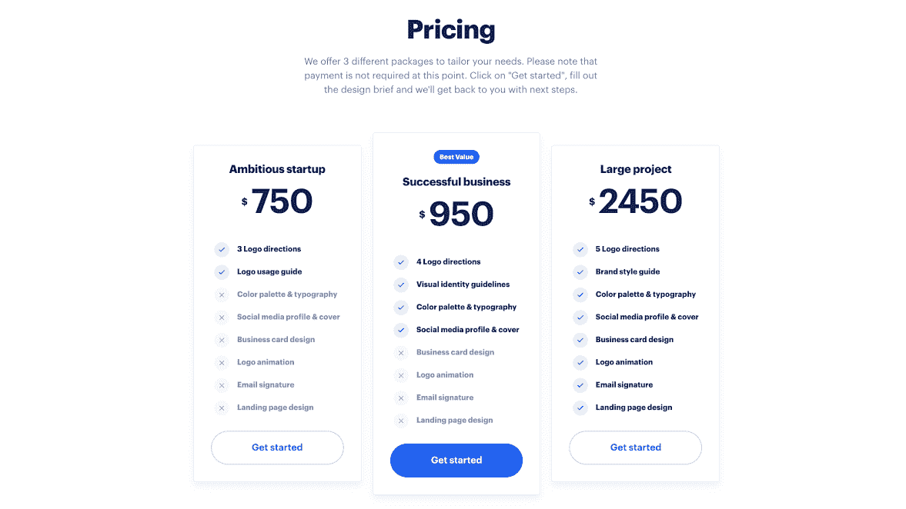
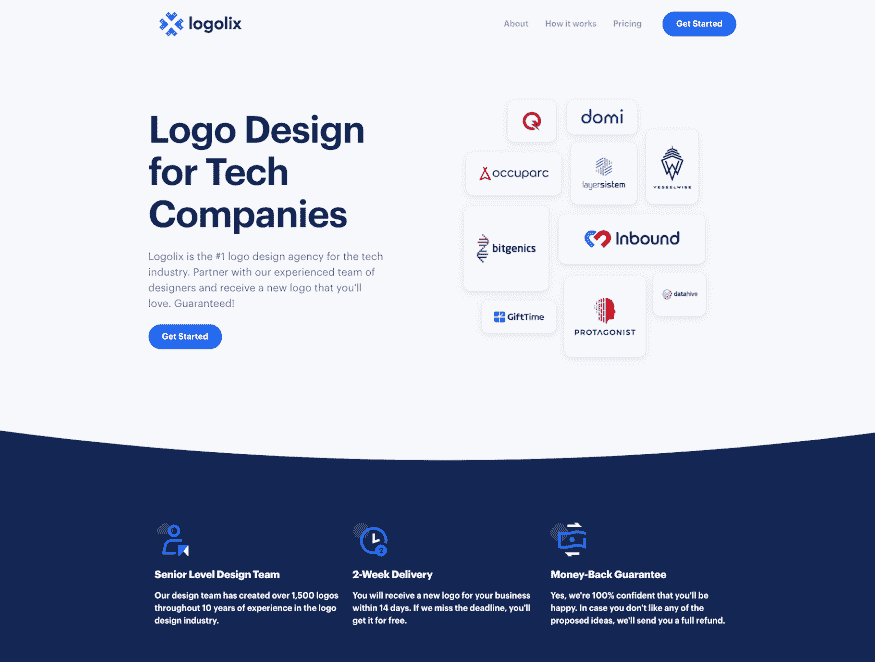

# 为什么免费增值定价是我 4k MRR 的秘密

> 原文：<https://www.indiehackers.com/interview/why-freemium-pricing-is-my-secret-to-4k-mrr-ae27c5bb82>

## 你好！你的背景是什么，你在做什么？

我叫 Jovan Babovic，是一名来自塞尔维亚贝尔格莱德的品牌设计师。我一直在为科技创始人设计一个产品化的 logo 设计机构，名为 [Logolix Free](https://logolix.com/) 和 [Logolix Pro](http://logolix.pro/) ，已经快三年了。如今 Logolix 一个人的乐队每月能赚 3500 美元。

## 是什么促使你开始使用 Logolix？

从 2012 年到 2017 年，我花了很多时间在自由职业网站上寻找客户，并参加设计竞赛。这些网站上的竞争似乎在迅速加剧，获得新的工作变得越来越难。就在那时，我决定放弃自由职业网站，去别处寻找更大的客户。我看到一些代理公司将他们的服务产品化，我想我应该尝试一下。

标志设计一直是我的激情所在，我真的很喜欢为公司设计新标识。但是有一个大问题:公司每隔几年才需要一次新的外观。当我成功完成一个项目时，我总是面临寻找新客户的任务。我必须想办法创造稳定的销售线索。

几个月的过度分析和计划过去了，我想出了免费赠送我的一些设计的主意。在标志设计项目中，每个客户都有三到五个标志创意可供选择。他们选出了获胜者，但是其他的设计被藏在我电脑的某个地方。

我想有很多人只是在测试他们的想法，不想花钱买一个好看的标志。所以我给了他们一个免费测试这些想法的地方，希望他们以后会回来订购定制设计。

这正是所发生的事情，我已经连续三年没有做任何额外的营销就获得了源源不断的线索。

## 构建最初的产品需要什么？

最初的产品是在两周内创造出来的。除了我的时间，建造它的成本非常低。购买域名、主机和主题花了我大约 100 美元。我不是任何意义上的开发者，但是我有一些从 [Themeforest](https://themeforest.net/) 定制主题的经验。

这些是我在头两周采取的步骤:

1.  对所有未使用的徽标进行分类，选择最佳徽标并打包，以便于下载
2.  编写登录页面的内容，并创建三个不同的定价包
3.  自定义主题以匹配 Logolix 品牌，并添加所有徽标
4.  创建设计简介和整合到网站的字体。
5.  上传网站，并确保一切正常运行(谷歌分析，类型，下载功能，联系形式等)。)
6.  准备图片和文案，以便在产品搜索中发布
7.  发射！

差不多就是这样。我不想在 MVP 上花太多时间。主要关注点是业务的后端和提供卓越的服务。

## 你的技术是什么？

因为我是一个偶尔涉足前端开发的设计师，所以我决定尽可能保持简单的技术堆栈。该网站将只作为一个线索生成工具，所以没有理由把它复杂化。

正如我提到的，最初的产品是用来自 Themeforest 的价值 20 美元的主题制作的。几个小时的定制就足以启动 MVP 了。

我做的最好的决定就是这么做。我过去常常花几个月的时间思考想法，在脑子里计划一切，直到我跳到下一个闪亮的商业想法。

TweetShare

登陆页面是用 HTML/CSS/Javascript 构建的。虽然有一些设计和结构上的变化，但技术堆栈始终保持不变。

## 你是如何吸引用户并发展 Logolix 的？

我记得我看到一位 SaaS 营销专家写了一篇关于免费增值在软件世界的重要性的文章，他说人们想在购买之前尝试一些东西。这是让我第一次意识到创始人不想在测试他们的想法时花钱买一个新的标志，这创造了我最初的概念。

我开始研究科技创始人在网上花了多少时间，那是我第一次听说产品搜索。我看到有人推出各种各样的产品，但标志设计类别没有太多的竞争。

在我推出网站的几天后，我在[产品搜索](https://www.producthunt.com/posts/logolix)上创建了一个产品页面。那天晚上睡觉，我想如果能从中多拉几个客户就太好了。当我醒来时，我看到了 11 个新的查询，Logolix 已经有了大约 780 次投票，这使它成为当天的第一产品。

发射发生在 2017 年 6 月 11 日。到那个月底，Logolix 有 12，000 人访问。在接下来的几个月里，来往车辆慢慢减少了。然而，在接下来的三年里，平均每月约有 1，200 名游客。

我不确定我能给你任何其他营销策略的建议，因为我从一开始就没有做任何额外的营销。推荐是新客户的最大来源。在 Product Hunt、 [BetaList](https://betalist.com/) 和其他一些目录网站上发帖被证明是一项巨大的时间投资。三年后的今天，他们带来了线索。

## 你的商业模式是什么，你是如何增加收入的？

当我开始创业时，我有两种赚钱的方法。第一种是销售独家标识，第二种是为定制设计提供三种不同的包装。独家徽标是最好的，我不想免费赠送，而是想以独家所有权出售。这被证明是一个坏主意，因为没有人购买它们。后来，我也开始免费赠送这些东西。

决定价格总是很难。因为当时我没有稳定的收入，所以我决定让 Logolix 变得非常实惠，这样就能带来一些新客户。后来，我意识到我没有足够重视我的技能，因此没有给它们更高的价格。我花了很多时间反复试验，才找到一个最佳点，让我能够与那些知道为自己的企业获得一个令人惊叹的品牌形象的价值的客户合作。

有些人来到 Logolix，立即决定他们想要一个定制的解决方案，而大多数人只是下载免费版本，这样他们就可以测试他们的想法。许多下载了免费软件的人后来又回来购买了定制的解决方案。

给这些客户开发票从来都不是问题。PayPal 一直是我付款的首选。我希望条纹在我的国家可以买到。然后，将它与 Typeform 集成并立即接受付款就很容易了。

如今 Logolix 每月收入约 3500 美元，利润率约为 90%。这仍然是一个人的乐队，我不打算进一步扩大规模。这是一个兼职项目，因为几年前我开了一家[数码设计公司](https://henderton.digital/)。我也有一些重要的事情要做，到时候我会和 IH 社区分享。

| 月 | 收入 |
| --- | --- |
| 1 月 20 日 | 2450 |
| 2 月 20 日 | 3150 |
| 3 月 20 日 | 3900 |
| 2010 年 4 月 | 4650 |
| 5 月 20 日 | 4850 |
| 2010 年 6 月 | 2550 |
| 2010 年 7 月 | 3150 |
| 8 月 20 日 | 3900 |

## 我很好奇在 Logolix 之前，是什么让你开始从事设计和设计 logos 的。你能告诉我们更多吗？

很久以前，我曾经玩过一款名为*反恐精英*的电子游戏。我的游戏团队需要一个新的标志，所以我决定做一些研究并尝试创造一个。当我看到可以做什么时，我立刻被吸引到设计领域。

几周过去了，我偶然发现了一个名为 99designs 的网站，在那里，如果设计师赢得了设计比赛，他们就会得到报酬。我认为这是一个获得额外收入的好方法，所以我开始狼吞虎咽地学习标志设计教程，提高我的技能，直到我赢得了我的第一次比赛。

正是这个灵感让我在那个网站上创作了 1200 多个标识，后来还帮助我开创了自己的事业！

## 你未来的目标是什么？

这是从一个侧面开始的骗局，我不想扩大它。它只是给我提供了额外的收入，让我可以从事我真正喜欢的项目。我通过这项服务建立了良好的业务关系，后来我被更大的项目聘用。

话虽如此，如果我们能在年底前触及 5000 美元 MRR，那就太好了。我计划写几篇客座博文，看看 Logolix 会走向何方。

我的大部分目标都在我即将到来的项目中。我计划很快推出一个独特的产品化服务，并将开始一个关于独立黑客的线程。

## 你面临的最大挑战和克服的障碍是什么？

我犯的第一个错误是在发布后过于兴奋。在检查了我的收件箱，看了那 12 个订单后，我觉得我在月球上。从每个月只有一到三个客户，到一天之内收到 12 个咨询，这变成了一个巨大的负担。

当时，我非常害怕委派和寻找一个符合我工作风格的设计师。因为这个原因，我被迫拒绝了其中的六个，选择了五个最有赚钱潜力的。大错特错。

如果我当时找到了另一位设计师，接手了所有源源不断的项目，或许我可以扩大 Logolix 的规模，让它比现在更大。

我的第二个错误是决定无缘无故地重新设计我的登陆页面几次。其中两次重新设计非常不成功，导致跳出率大幅增长。通过最近的重新设计，我终于设法让它恢复正常。教训:如果某样东西已经在工作，不要仅仅因为你认为它会工作得更好就做出巨大的改变。跟着数据走，试着一步一步慢慢改进你的产品。

## 你已经有了一份设计师的职业，但显然寻找更多的客户是一个持续的斗争。对你来说，个人、职业或其他方面的风险是什么？

当我 18 岁时，我获得了篮球奖学金，并出国在加拿大的一所大学学习。在那里我一个人都不认识，从我上岸的时候起，我就不得不自己想办法。

我很快发现，我的生活费用将比在我的祖国几乎高三倍。在那里租房子、支付水电费和伙食费会变得相当昂贵。暑假期间，大多数学生都会回家探亲，但我“被迫”留在加拿大工作，以便为明年攒些钱。我的自由设计生涯并没有给我提供足够的收入。

很快，我找到了几个工作机会，这些机会消耗了我的时间，但给我提供了不错的收入。像粉刷墙壁、护理草坪、公共设施和园艺等工作。每天早上醒来，我都不喜欢镜中的自己。并不是说这些工作有什么问题，我只是无论如何都不满足。随着时间的推移，我训练自己用它作为燃料来扩展我的技能，并在空闲时间里学习更多关于商业、营销和设计的知识。

最初的几个月是从一个想法跳到另一个想法，典型的发光物体综合症。当我决定只专注于一件事，创造惊人的标志，我开始看到不同的机会来发展和扩大我的自由职业生涯。Logolix 是第一个让我开始全身心地投入设计的想法。那是推动我事业的火花，开启了许多我甚至不知道存在的新领域。

我坚信，如果 Logolix 没有成功，其他东西也会成功，因为我坚持不懈。对于那些寻找新门的人来说，这是另一个很好的教训。

## 有没有发现什么特别有帮助或者有优势的？

我说不出对我有帮助的具体建议，但沉浸在数字营销内容和 SaaS 世界中给了我很多见解。如果没有 SaaS 的一篇关于免费增值的文章，我甚至不会想到通过免费赠送来推广我的商标。

开始相信你自己，只是跟随下一层的人在做什么。不要抄袭，要效仿。

TweetShare

我做的最好的决定就是这么做。我过去常常花几个月的时间思考想法，在脑子里计划一切，直到我跳到下一个闪亮的商业想法。

## 你的工作空间是什么样的？在家、在办公室还是在工作场所，更多地致力于设计还是更多地致力于经营企业？

我是那种会找各种借口拖延时间的人。似乎总有一些事情阻碍了你真正坐下来工作。

直到去年，我都无法在家里保持高效率。只有当我决定租一个办公室，并把“工作”和“家”分开时，我才能够保持一致。承诺租一个小办公室是一个可怕的时刻，但我从未回头。

如今，我大部分时间都在经营一家代理公司和一些副业项目。当一些大项目出现时，我喜欢亲自动手，但我会尝试外包大部分低收入的任务，以便能够专注于更大的画面。

## 对于刚刚起步的独立黑客，你有什么建议？

我知道这听起来很老套，你可能已经听过很多次了，但是开始吧。直到你开始，你才开始学习，没有什么会像你计划的那样。你可能会失败，但把它当成一个教训。你也可能会取得超乎想象的成功。

*一切都与心态*有关，这一点怎么说都不为过。我曾经是一名 *wantrepreneur* ，从来没有想过我可以超越销售 200 美元的商标。开始相信你自己，只是跟随下一层的人在做什么。不要*抄袭*，而是*效仿*。

给从事创意行业的人的另一个建议是阅读史蒂文·普雷斯菲尔德的作品。我过去常常与拖延症作斗争，直到他的书给我指出了一条出路。如果你挣扎着开始一个新项目，或者等到最后期限才完成一项任务，阻力正在击败你。如果你想有所成就，你必须学会如何克服它。不管怎样，他会比我解释得更好。说真的，今天就订那些书吧！

我强烈推荐其他几本书:

*   百万富翁浪子
*   [唯一的事情](https://www.amazon.com/The-ONE-Thing-audiobook/dp/B00FPVS27W/ref=sr_1_1?dchild=1&keywords=the+one+thing&qid=1599750770&s=books&sr=1-1)——加里·凯勒
*   [造出来卖](https://www.amazon.com/Built-Sell-Creating-Business-Without/dp/1591845823)——约翰·瓦里洛
*   艺术的战争——史蒂文·普雷斯菲尔德
*   [转向专业](https://www.amazon.com/dp/B07FWS2FHP?plink=ckKQIbgpWRpIyAtm&ref=adblp13nvvxx_0_0_im)——史蒂文·普雷斯菲尔德

## 几乎每个人都经历了一个与预期截然不同的 2020 年！新冠肺炎对你的业务有很大影响吗？

新冠肺炎对我的业务影响不大。

我看到咨询量略有增加，因为很多人试图在网上开展一些活动，他们需要品牌推广方面的帮助。除此之外，没什么变化。

## 我们可以去哪里了解更多？

我目前不使用社交网络，但如果我的一个业务需要社交媒体增长，我计划开始使用。相反，如果你有任何问题，你可以发电子邮件给我， [【电子邮件保护】](jovan@logolix.com) 。

我希望你喜欢这篇文章！如果您对我使用 Logolix 的方式有任何疑问，请告诉我。请随意表达你对这个概念以及作品质量的看法。我一直在寻求反馈和批评。

谢谢大家！

——[<picture id="ember8072425" class="user-avatar ember-view user-link__avatar"></picture>约万·巴博维奇](/Equinox4?id=TBbUK8htGzVFnepairRakM1NRO82)，Logolix 创始人

## 想像 Logolix 一样建立自己的事业？

你应该加入独立黑客社区！🤗

我们是几千名创始人，互相帮助建立有利可图的业务和副业。来分享你正在做的事情，并从你的同事那里获得反馈。

还没准备好开始使用你的产品吗？没问题。这个社区是一个认识人、学习和实践的好地方。随意[随便浏览](/)！

——[<picture id="ember8072430" class="user-avatar ember-view user-link__avatar"></picture>柯特兰艾伦](/csallen?id=ibTLPyjwVebnZjMGKvz6ztarnuV2)，独立黑客创始人

20votes