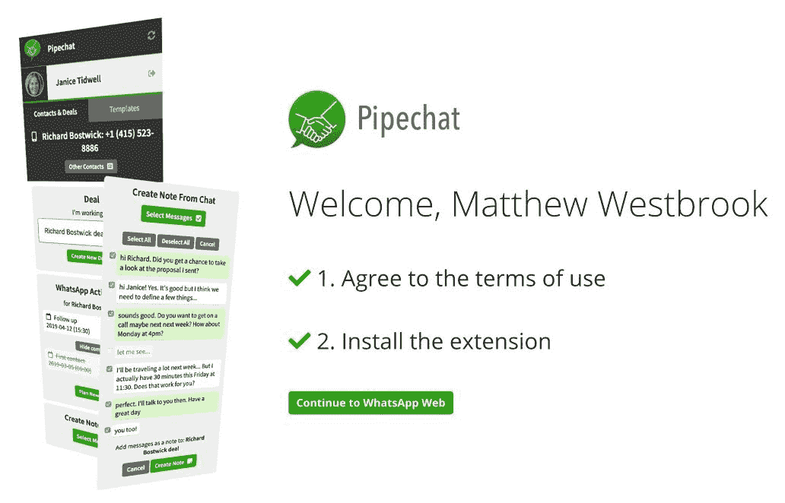
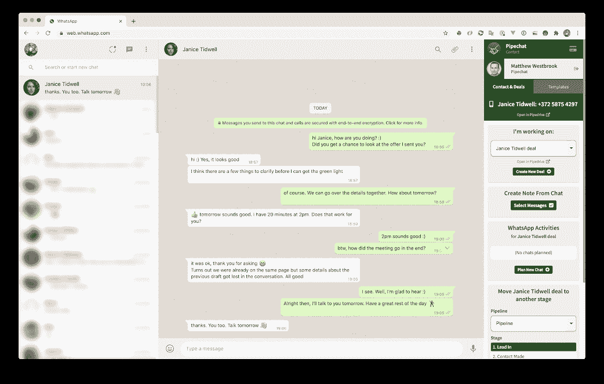

# 为什么我为我的日常工作产品创建了第三方应用程序

> 原文：<https://www.indiehackers.com/interview/why-i-created-a-third-party-app-for-my-day-jobs-product-2dd1d0005c>

## 你好！你的背景是什么，你在做什么？

我叫丹尼尔，是一名软件工程师。在过去的两年半时间里，我一直在销售 CRM 公司 Pipedrive 全职工作。起初我在开发人员关系部工作，现在是产品经理。

我自己的项目是 [Pipechat](https://pipechat.app/) ，一个连接 Pipedrive 和 WhatsApp Web 的简单应用。它仍然是一个次要项目，但自推出以来一直在稳步增长。

目前每月收入约为€3000 英镑，每月增长约 15%。

【T2

## 你的雇主 Pipedrive 是否参与了 Pipechat 的资金或生产？你如何处理任何潜在的利益冲突？

我没有收到 Pipedrive 的资助。这是一个独立的项目，我从零开始，就像任何外部开发人员可以做的那样。

目前没有冲突。该应用程序可与 Pipedrive 配合使用，在其他 CRM 上不可用。(即使是，也不会是什么问题。)这是双赢。事实上，我当初创建 Pipechat 的原因之一就是我必须相信我在 Pipedrive 卖的东西。

我可以想象 Pipedrive 可能会在某个时候构建一个类似的解决方案，在这种情况下，我可能会卖掉 Pipechat。在现有功能上与 Pipedrive 竞争毫无意义。

## 是什么促使你开始使用 Pipechat？

正如我之前提到的，我必须相信我卖的东西。

在开发人员关系部工作时，我的目标是——现在仍然是——帮助外部开发人员为 Pipedrive 的市场开发应用程序，我想向自己和其他人证明，在 Pipedrive 的基础上建立一个有利可图的业务是可能的。不仅对于大玩家，对于独立开发者也是如此。

我必须相信我卖的东西

TweetShare

我只解决了一个具体的问题，我相信还有很多问题等待解决。

## 构建最初的产品需要什么？

该产品的第一个版本在几个周末就准备好了。我不确定我所想的在技术上是否可行，所以当我让它工作时，我非常兴奋。

我知道很多销售人员使用 WhatsApp，但我也知道你只能通过商业账户使用它的 API，而且通常是通过复杂而昂贵的平台。

我开始构建一个非常简单的解决方案，但在发布之前，我并不确定它对客户来说是否足够好；当第一批正面评价开始出现时，我非常高兴。

人们喜欢它的简单。对于它能做什么和不能做什么，我总是非常开放和直接，客户对此反应良好。

## 你提到对 Pipechat 能做什么和不能做什么持开放和直接的态度。你如何着手解释那件事？是通过与客户通信还是在网站上还是其他方式？

通常情况下，他们会通过电子邮件询问应用程序是否可以做他们需要的特定事情。如果我能实现它，我很乐意这样做，但通常我不得不告诉他们这是不可能的(无论是出于技术原因还是保持在 WhatsApp 的条款范围内)，仅此而已。

偶尔也会有人请求为单个客户实现一些非常具体的东西，我通常会拒绝这些请求。我曾在许多情况下试图取悦每个人，我也看到了这种方法会带来多少麻烦，所以我只选择实现一些大家都有的要求或者对每个人都有用的东西。

## 你的技术是什么？

[Laravel](https://laravel.com/) 和 [Vue.js](https://vuejs.org/) 。

当这个应用程序开始受到关注时，我就把它从沙盒 VPS 转移到了[数字海洋](https://www.digitalocean.com/)上的一个专用程序中。我通过 [Laravel Forge](https://forge.laravel.com/) 管理一切，它运行得很好。

我目前在所有的项目中使用 Laravel 和 Vue.js。我喜欢它。我总是得到不同框架的建议，但是我没有时间或者兴趣去尝试所有不同的框架。这对我很有效，所以我会坚持下去。

向我展示一个框架，我可以用人类的术语描述我想要构建的框架，并为我编写代码。那是我绝对想尝试的一个！

## 你是如何吸引用户并发展 Pipechat 的？

到目前为止，我在营销方面的投资为零。

我认为这实际上是我和任何想为任何市场开发应用程序的人最兴奋的事情之一。

这是一个真实的“建造它，他们会来。”你正在利用现有的客户群和营销机器。

我真的认为市场是最令人兴奋的机会之一，但有时也会被忽视。

## 你说你在市场营销上零投入。你在这个项目的其余部分投资了多少？

运行一个 web 应用程序仍然会有一些常规的成本(比如托管、域名、电子邮件等。).最大的成本可能是法律咨询，但这些都是一次性成本。

就时间而言，有时需要一周几个小时，有时需要整个周末。如果要我说一个数字，我会说在它运行的一年半时间里，我花了大约两到三个月的时间。

## 你的商业模式是什么，你是如何增加收入的？

这是一个有月度和年度计划的小 SaaS。

基本价格是每个用户每月 4€。大约 60%的订阅是单用户包月订阅。剩下的 40%是 5、10 或 15 个用户的年度订阅和捆绑包。

该应用程序是 Chrome 的扩展，我通过 Chrome 网络商店的支付获得了第一批客户。产品一经确认，我就将款项转给了收款人[。它运行良好，他们的支持非常积极。](https://www.chargebee.com/)

我起初使用 Braintree 作为支付网关，后来在爱沙尼亚推出 Stripe 后，我就改用了它。

这款应用从一开始就一直保持着线性增长，对此我很满意。这让我能够在事情出现时就处理好，并以一种舒适的速度改进。

平均每月的流失率在 8%左右，考虑到产品的性质，我认为这是合理的。

我知道我可能会在低价上留下一些钱，但我认为这有助于让客户更有耐心和快乐。

## 你未来的目标是什么？

Pipechat 在我每周只花几个小时的时间就能平稳运行，所以我现在让它继续发展。

对于未来，我有几个选择。一种是卖掉它。我已经收到了一个私人买家的有趣报价和一个经纪人的非常好的估价。另一个选择是加倍努力，为 WhatsApp 商业用户创建一个更强大的集成。

无论如何，我会在我的顾客中做更多的调查，找出他们需要什么，看看是否有另一个唾手可得的机会。

## 你考虑过卖掉这款应用。扣动扳机需要什么？

这是个时机问题。目前，收入增长缓慢但稳定，更重要的是，在自动驾驶仪上。如果它达到一个点，开始停滞不前，需要更多的时间和努力来保持增长，那时候我可能会把它交给可以投入更多时间和资源的人。

换句话说，如果我可以通过等待来提高最终估值，那对我来说听起来不错。没有什么是确定的，该项目可能会消亡，更大的竞争对手可能会吞噬 Pipechat，但嘿...你必须选择你的风险。

## 如果 Pipedrive 真的扩张到淘汰 Pipechat，你会转向一个新的副业项目吗？

毫无疑问。我已经在兼职做一个新项目了。

这是一个更大的项目，它确实需要更多的时间和精神空间，所以释放一些内存可能是一件好事。如果我找到合适的人，我也会考虑合作。

## 你有过什么意外或艰难的学习曲线吗？

嗯，Chrome 改变他们的 cookie 政策是个好主意。

调试它花了一段时间，应用程序停止工作了几天...

## 有没有发现什么特别有帮助或者有优势的？

你猜怎么着所有的东西中，*谷歌翻译*。

我的许多客户会说葡萄牙语或西班牙语，多亏了它，我仍能设法提供支持。当然，如果我收到大量的支持请求，我会雇人，但目前我能应付得很好。

尽早交付产品，拥抱最初的不确定性。

TweetShare

我通常会提到我正在使用自动翻译工具，并为任何错误道歉。客户一点都不介意。如果说有什么不同的话，那就是它定下了一个友好的基调。

## 对于刚刚起步的独立黑客，你有什么建议？

我认为许多独立黑客的主要问题是能够在技术和商业思维之间转换，特别是如果你自己做所有事情的话。

为了制造一个有利可图的产品，你必须专注于解决一个特定的问题。尽早并经常与客户交谈。

此外，尽早交付产品，拥抱最初的不确定性。

我认为大多数独立黑客已经有了很多好的建议，来自比我更有经验的人，所以只要在自己身上找到不断尝试和构建东西的动力，最终，一些会坚持下来。

## 我们可以去哪里了解更多？

如果你想了解更多关于 Pipechat 和我是如何构建它的，你可以在这里发表评论。我很乐意回答。

要为 Pipedrive 开发你自己的应用，你可以从[开发者角](https://developers.pipedrive.com/)开始。有一个面向销售人员的[社区](https://community.pipedrive.com/)，你可以去那里寻找需要解决的问题。

此外，你也可以随意伸出手去联系。我很想知道你在忙什么。

你可以在独立黑客和推特上找到我。(我不怎么用但是还是会回复 DMs。)如果你在塔林，你可以帮我组织下一次独立黑客聚会。

—[<picture id="ember5298401" class="user-avatar ember-view user-link__avatar"></picture>Daniele](/daniti?id=J2jdTKIaZrdxkCktvi6y7WIUVS43)，Pipechat 创始人

## 想像 Pipechat 一样建立自己的事业？

你应该加入独立黑客社区！🤗

我们是几千名创始人，互相帮助建立有利可图的业务和副业。来分享你正在做的事情，并从你的同事那里获得反馈。

还没准备好开始使用你的产品吗？没问题。这个社区是一个认识人、学习和实践的好地方。随意[随便浏览](/)！

——[<picture id="ember5298406" class="user-avatar ember-view user-link__avatar"></picture>柯特兰艾伦](/csallen?id=ibTLPyjwVebnZjMGKvz6ztarnuV2)，独立黑客创始人

17votes