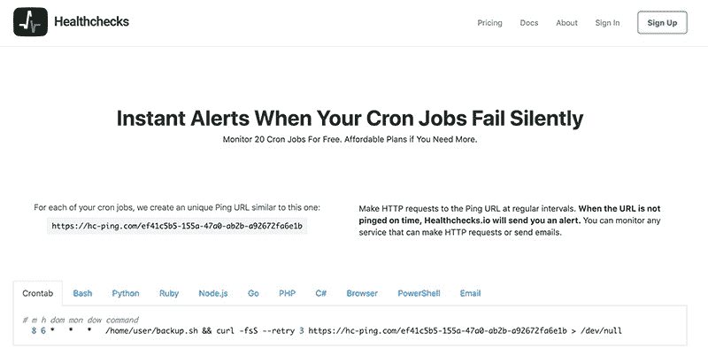

# 为什么我不专注于快速盈利

> 原文：<https://www.indiehackers.com/interview/why-i-dont-focus-on-generating-a-quick-profit-160d4f87b6>

## 嗨，彼得里斯！告诉我一些关于你的背景和你正在做的事情。

你好！我是彼得里斯·考恩，一个来自拉脱维亚雷加的人。我 36 岁，已婚，有一个两岁的女儿和三个月大的儿子。近 10 年来，我一直在家里远程办公。现在有小孩在身边越来越有挑战性，但我仍然喜欢有一个灵活的时间表，没有通勤。

我正在开发 [Healthchecks.io](https://healthchecks.io/) ，这是一个针对 cron 作业、后台服务和预定任务的监控服务。它通过监听来自被监控服务的 HTTP“ping”来工作。当它在可配置的时间内没有收到服务消息时，它会发送一个警报。

Healthchecks.io 主要由开发团队用来跟踪他们的各种自动化过程。它在 [homelab](https://www.urbandictionary.com/define.php?term=homelab) 爱好者中也很受欢迎。人们还会想出一些非常规的用例，比如“当一段时间没有人清理办公室的咖啡机时发出闲置警报”

 

## 是什么促使你开始使用 Healthchecks.io？

在我的“日常工作”中，我有越来越多的小型后台服务，如备份和数据导入任务，如果有监控就好了。这要追溯到 2015 年。已经有一些服务在做这种类型的监控:DeadMansSnitch 和最近推出的 [Cronitor](https://www.indiehackers.com/interview/cronitor-b92b126fa2) 。就功能而言，它们看起来不错，但我无法证明它们监控我的非关键服务的价格是合理的。

我认为这更像是一场马拉松，而不是短跑。

TweetShare

我不断回想起自己建造它的想法。我有构建 web 应用程序的专业知识和一些业余时间。我想我可能会喜欢一个由我来做所有决定的副业。

由于现有服务的价格，我无法使用它们，这也让我很恼火。因此，我提出了一个挑战，即构建一个与现有服务一样好甚至更好的服务，提供有用的免费层和负担得起的付费层，但仍能自我维持。

随着时间的推移，这扩展到以“错误的方式”做越来越多的事情。我决定将代码开源。为了避免 cookie 警告，我避免使用任何分析服务。当价格发生变化时，我不受现有用户的影响。我不发任何营销邮件，基本避免做其他公司对我做的让我这个用户恼火的事。

我的主要动机是尝试新事物，而不是尽快产生利润。我可以负担得起这样的试验，因为相对于拉脱维亚的生活成本，我有一份收入相当不错的日常工作。

## 构建最初的产品需要什么？

我将这个项目基于 Django，因为这是一个我已经精通的框架，我不想浪费时间去学习新的工具。我想要一些有用的东西尽快运行起来。从第一次 Git 提交到发布初始版本，我花了大约一个月的时间在业余时间工作。

它拥有被认为有用的绝对最少的功能:用户注册、被监控系统的简单仪表板、用于接收 pings 的 API 端点和电子邮件警报。最初没有付费计划，没有多种通知方法，没有团队访问，没有能力将事情组织成项目。

一切都靠一个 5 美元/月的 DigitalOcean droplet 运行，但它最初也只有很少的流量，所以这很好。由于代码是开源的，我可以利用 GitHub、Travis CI 和工作服的“免费开源”计划。我通过向开源项目和非营利组织免费提供付费健康检查来支付它。

我的主要动机是尝试新事物，而不是尽快产生利润。

TweetShare

我做出了一个深思熟虑的决定，尽可能长时间地保持技术堆栈的简单性。“requirements.txt”中尽可能少的依赖关系，传统的 PostgreSQL 数据库而不是一些花哨的分布式数据存储，没有任务队列或消息代理，简单的部署过程和尽可能少的抽象层，以及不依赖专有技术以避免供应商锁定。

我最终可能会添加一些或所有这些东西，但我想看看我能在这个简单的 Django 应用程序和 PostgreSQL 数据库的核心设置上走多远。

## 你是如何吸引用户并发展 Healthchecks.io 的？

主要策略是提供良好的服务，让口碑来发挥作用。我很高兴看到现有用户在 Twitter、Reddit、论坛和其他地方推荐 Healthchecks.io。这带来了直接的流量，有助于谷歌排名。随着用户群的增长，这种影响会越来越大。例如，有相当规律的“你用什么来进行 cron 监控？”Reddit 上的问题。通常当我发现它们的时候，已经有人在评论中加入了 Healthchecks.io 的链接，甚至给出了他们的评价。

 

看到推荐和良好的反馈也是一个令人难以置信的好动力，让我们继续开发新功能，完善现有功能。

当有实质性的东西要分享时，我会写一篇博客文章，交叉发布到 Medium，然后提交给 Hacker News。我只有一篇文章登上了黑客新闻的头版。这是在我们的第一年，并带来了大量的早期用户。作为一个非英语母语的人，我通常会在 Fiverr 上花钱请人校对我的博客文章；我总是很惊讶他们发现了多少错误。绝对值得字面上的五英镑。

我做的一件小事是在开源项目的页脚包含一个“Powered by”行。当某人自己托管一个 Healthchecks 实例并且没有定制页脚模板时，它会显示在那里。我不认为这与谷歌排名有多大区别，但它在使用或偶然发现托管实例的人中传播了这种意识。

我还涉猎了 Reddit、Google 和 Twitter 广告。虽然我可以看到有多少人点击，但我没有任何转换跟踪，因为我不想添加跟踪像素。广告预算很少，所以很难知道有多少人注册，以及是否有人因为广告而升级到付费计划。但是尝试不同的创意和目标选项是很有趣的。我确实喜欢如何锁定特定 Twitter 账户的特定子主题或关注者。

## 你的商业模式是什么，你是如何增加收入的？

免费增值和按月或按年付费订阅。“业余爱好者”计划是免费的，可以用来监控多达 20 项服务。“业务”计划是每月 20 美元，可以监控多达 100 项服务，并支持更多的团队成员。我经常看到这样的情况，用户开始使用免费帐户，他们的使用量增长缓慢，然后他们最终转换为付费订阅，可能两年后，当他们最终达到免费计划的极限时。

Healthchecks.io 使用 [Braintree](https://www.braintreepayments.com/) 来处理支付和定期订阅，并直接与之集成。据我所知，Braintree 不生成 PDF 发票，所以我在我这边实现了它。我拼凑了一个脚本来生成会计用的增值税报表。最近，我更新了计费代码，以支持 3D 安全。如果我从今天开始，我会考虑在支付网关上使用一个额外的服务来节省我的一些工作。

如今，Healthchecks.io 拥有 7000 多个活跃用户账户，150 名用户使用付费计划。目前的 MRR 是 2200 美元。对我来说，全职工作还不够，但每月收入正在稳步攀升。我预计 Healthchecks.io 迟早会成为我的主要收入来源和主要职业。

我认为这更像是一场马拉松，而不是短跑。

| 月 | 收入 |
| --- | --- |
| 18 年 10 月 | 860 |
| 18 年 11 月 | 954 |
| 2018 年 12 月 | 1052 |
| 19 年 1 月 | 1168 |
| 2019 年 2 月 | 1355 |
| 19 年 3 月 | 1371 |
| 2019 年 4 月 | 1527 |
| 19 年 5 月 | 1603 |
| 19 年 6 月 | 1766 |
| 2019 年 7 月 | 1963 |
| 2019 年 8 月 | 2177 |
| 19 年 9 月 | 2260 |
| 19 年 10 月 | 2296 |

## 你未来的目标是什么？

我没有雄心勃勃的目标；该计划基本上是继续进行小的增量改进。一个重要的里程碑将是当我全力以赴这个项目。之后，合伙人或第一个雇员减少了[的公车因素](https://en.wikipedia.org/wiki/Bus_factor)。目前只有我在管理一切。因为我不能 24/7 都在我的电脑旁，所以让其他人参与进来并解决问题是件好事。

## 如果你必须重新开始，你会做什么不同的事？

当我开始的时候，我没有意识到作为一个监控服务的可靠性是多么重要。如果我决定做一些对小故障不太敏感的事情，我的工作会容易得多。我喜欢挑战，但我希望我在开始时就意识到这一点。

此外，推出一项服务意味着保持其长期运行。当我推出 MVP 的时候，我没有想过“长期”可能是多久。当一位客户询问他们是否可以有三年的计费周期而不仅仅是一年时，我认为这是我第一次想到的。这一切都很好，但这是我在开始时没有考虑足够多的事情。

## 有没有发现什么特别有帮助或者有优势的？

自力更生和相对稳定的财务意味着没有快速产生利润的压力。我可以做出对用户有利但不一定对短期盈利有利的决策。我可以从新功能开发中休息一下，或者我可以花时间在一个只有少数人会注意到的小细节上。

## 对于刚刚起步的独立黑客，你有什么建议？

如果你列举出构建一个完整项目的所有工具和技巧，这个清单会非常庞大。

我想这里最好的建议是从某个地方开始；从简单的事情开始，不要害怕学习新的工具和技能，即使是那些你认为你可能永远不会用到的。迟早它们会派上用场。

## 我们可以去哪里了解更多？

*   网址: [https://healthchecks.io](https://healthchecks.io)
*   博客:[https://blog . health checks . io](https://blog.healthchecks.io)
*   开发@ GitHub:【https://github.com/healthchecks/healthchecks 

—[<picture id="ember7997235" class="user-avatar ember-view user-link__avatar"></picture>pēteris Caune](/cuu508?id=CPP7kdohcXNr5QSxa5yuQu9fDvi1)【health checks . io 创始人

## 想像 Healthchecks.io 一样建立自己的企业？

你应该加入[独立黑客社区](/)！🤗

我们是几千名创始人，互相帮助建立有利可图的业务和副业。来分享你正在做的事情，并从你的同事那里获得反馈。

还没准备好开始使用你的产品吗？没问题。这个社区是一个认识人、学习和实践的好地方。随意[随便浏览](/)！

——[<picture id="ember7997240" class="user-avatar ember-view user-link__avatar"></picture>考特兰艾伦](/csallen?id=ibTLPyjwVebnZjMGKvz6ztarnuV2)，独立黑客创始人

30votes