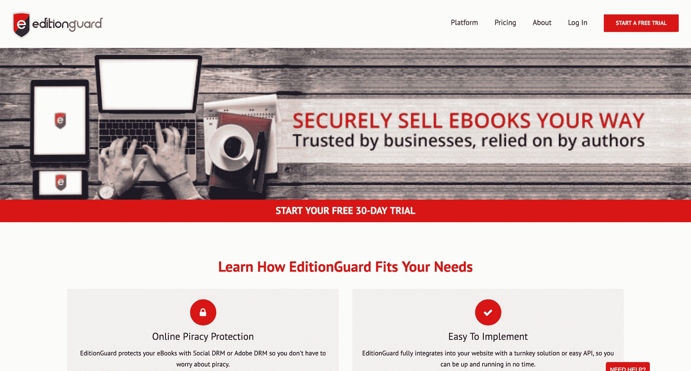
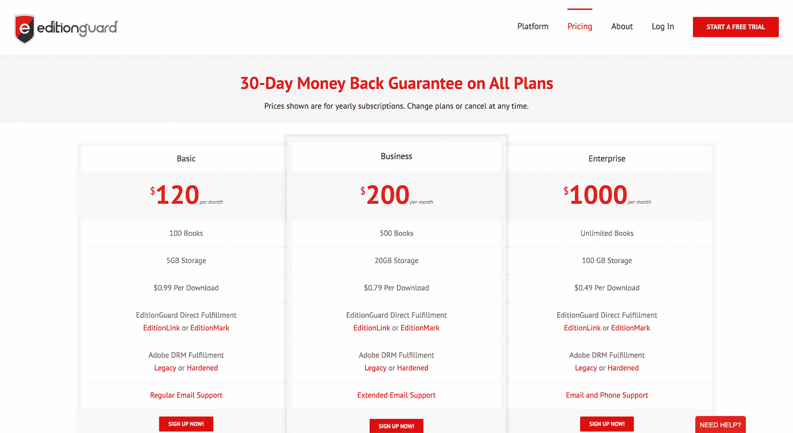

# 为什么我在早期客户身上花了数千美元，以及它的回报如何

> 原文：<https://www.indiehackers.com/interview/why-i-spent-thousands-on-early-customers-and-how-it-paid-off-67518b8a3d>

## 你好！你的背景是什么，你在做什么？

感谢采访我——我很高兴能成为独立黑客！

我叫特盖·比兰德，我的整个职业生涯都是一名企业家。虽然我一生中从未做过全职工作，但我可以很容易地说，我曾经有过多个老板，因为我做过一段时间的承包商。

EditionGuard 是一个电子书的数字版权管理平台。它本质上是确保一家公司出售的电子书在未经授权的情况下不能被复制或印刷。它目前被全球的大学出版社、政府、企业和出版商使用，以确保他们的电子书安全地送到用户手中。

迄今为止，它已在 40 多个国家使用，自成立以来已帮助交付了近百万本电子书，该公司目前平均带来约 25，000 美元的 MRR。

 

## 是什么促使你开始使用 EditionGuard？

在与一些当地电子商务企业发生一些失败后，我不得不在 2009 年左右作为一名开发人员接一些合同工作，因为我需要更多的收入来偿还一些银行贷款和偶尔吃点东西。:)

那是一段艰难的时光！但是当了一段时间的承包商后，我开始变得越来越赚钱。

但是我内心的某些东西一天比一天痛苦。我不再构建和运行我自己的产品，这一直是我梦寐以求的。最重要的是，我认为自己是一个创造者，我需要根据自己的愿景来制作东西。我还想要一家可扩展、盈利且不需要我全天候关注的企业。

我从来不是个独角兽猎人。我宁愿先有一堆摇钱树再去追！

TweetShare

幸运的是，当我为一个大客户做项目时，开发这样一个产品的机会来了。当时，我们正在开发欧洲一家相当大的连锁书店的电子商务网站，他们找到我们提出一个要求:“我们想出售电子书，但我们和出版商都担心盗版问题。你能帮我们吗？”

我以典型的承包商方式说，“当然！”在做了大量的研究和考虑后，我们决定使用 Adobe 的 DRM 解决方案。在成功地将该解决方案部署并集成到他们的电子商务网站后，有趣的事情发生了:我开始收到更多来自国内和国际市场的相同设置的请求。

这种解决方案的问题是，虽然它是当今的行业标准，但它非常昂贵，难以部署，甚至更难管理。我们不得不每次为每个项目向潜在客户报价 4 万到 5 万美元！当然，我们在那里的转化率接近 0.0%。

然后我开始想，有这么多的需求，为什么没有一个 SaaS 的解决方案呢？这就是 [EditionGuard](https://www.editionguard.com/) 的想法产生的原因。在从 ThemeForest 上花 20 美元买了一个简单的登陆页面，然后用一些后端代码对它进行了修改，几个月后我就有了一个管道胶带产品。

## 构建最初的产品需要什么？

血泪和苦难资助了[编辑卫队](https://www.editionguard.com/)。

好吧，这有点过了——这主要是我的汗水。我开发了最初产品的大部分，并花了我所有的积蓄从一个朋友那里获得了一些产品功能的帮助。Adobe DRM 堆栈使用 Java (ick ),我必须处理和扩展它，而 web 应用程序端是使用 PHP 上的 Codeigniter 框架构建的。本质上，有两个后端应用程序通过 API 相互通信来完成任务。

我真的鼓励每个人，尤其是企业家，学习一点软件开发。

TweetShare

总而言之，我在最初的版本上花了大约 1 万美元，包括服务器、软件开发和最初获得的 10 个客户。谢天谢地，我从来没有接受过任何外部投资，所有的增长都是通过利润再投资实现的。

当然，这是线性的缓慢增长。但是我并不着急，因为我从来不是一个独角兽猎人。我宁愿先有一堆摇钱树再去追！

在那段时间，我读了许多关于创业公司的不同书籍，喜欢拥有一个只有基本功能的非常简单的产品的想法。事后看来，这真的很尴尬！客户可以上传电子书，但不能编辑。他们必须给我发电子邮件来升级或取消他们的订阅。不过，它让我赚了钱，我可以看到它有一个未来，这就是最初推动前进的全部内容。

最终，最初版本中“缺失”的所有特性都找到了它们的位置，而且越来越多，但它们在开始时并不是关键的。开始时，您不需要订阅升级/降级功能，因为它不会告诉您任何信息。

我认为这是在一开始确定范围时使用的主要方法；关于我的市场和我的潜在客户，这个特征告诉了我什么？如果它什么也没告诉你，那就不要考虑这个特性。一件容易但不容易接受和实现的事情，尤其是对一个认为自己是创造者和理想主义者的人来说。但是我还是尝试了，我很高兴我这么做了！

## 你们是如何吸引用户，壮大 EditionGuard 的？

我没有像你今天看到的那样真正的“发射”。在我完成了 [EditionGuard](https://www.editionguard.com/) 的构建之后，我给一些对电子书 DRM 感兴趣的组织发了电子邮件，这些组织在一开始就是最初客户的主要来源。这是我的第一阶段，我接触了 10 个付费客户，这告诉我我有一个可行的商业模式。

在 SaaS 做生意的好处是经常性收入。开始时，你不需要太担心客户流失，因为你的用户群很小。这让我每个月一点一点地重新投入到生意中。

我记得在第一阶段结束时设定了 30 个付费客户的目标，那时我开始通过页面优化、博客、链接建设和新闻发布将一些利润投入到 SEO 等业务中。我想我又花了 4-5 个月达到这个目标，对我来说第二阶段结束了。

 

那时，我能够完全放下所有的承包工作，开始专注于我的生意。我当时住在一个生活成本非常低的廉价(而且无聊)城市，这是一个很大的优势。我会向任何一个 bootstrapper 强烈推荐这一点；只是搬到一个低成本的城镇或城市，至少一段时间。你对账单的担心会少得多，成功的几率也会高得多，因为这总是关乎毅力。你坚持的时间越长，你的机会就越大。你最大的开销总是住房，所以减少它真的会给你很多空间。

在这个阶段之后，我设定了一个更加雄心勃勃的目标:我想拥有 100 名客户。这对我来说是一件大事，因为它会给我想要的财务自由。

为了实现这一目标，我开始真正专注于入职和转化优化，在应用程序中添加更多教育内容、整个入职序列和详细的滴滴电子邮件活动。我还为最大的电子商务平台，如 WooCommerce、Shopify 和 Magento，建立了一些交钥匙解决方案。对于资金紧张的独立出版商，我推出了一个低价计划和基于 PayPal 的非常简单的解决方案。

最后，我会说这些是从 30 个客户到我今天所处位置的最大驱动力。从长远来看，这些努力证明比我希望的更有效，我实际上超过了我的 100 个客户的目标，达到了大约一年前的水平。在那个时候，我的客户流失赶上了我的新客户收购，我认为这是业务第三阶段的自然结束。现在我正在考虑下一步继续前进！

## 你的商业模式是什么，你是如何增加收入的？

edition guard 的赚钱方式是通过定期订阅费和每月可变使用计费。

可变使用量基于用户通过我们提供的下载次数，我们对此收取固定费用。这项业务从一开始就是一项付费服务，因为价值定位非常明确。

最初我们使用 PayPal，几年后由于其出色的 API 和较低的佣金，我们改用 Stripe。但最重要的是，我希望能够使用一些非常棒的工具，如 Baremetrics 或 Firstofficer，来实时跟踪我的指标。我能说什么呢，我真的很爱度量！对于可变使用计费，我们一直通过它的 API 使用 Freshbooks，它总是工作得很好。

为了增加收入，我做的一件事是每六个月提高 20-30%的价格。我这样做是因为我总是在许多不同的来源上遇到相同的想法；我们倾向于低估自己和我们的服务。我可以告诉你，这绝对是真的。因为我的提价从来没有影响到我的转化率。更重要的是，随着时间的推移，它让我增加了每个用户的收入。

我认为提高价格时要注意的一件非常好的事情是，确保你在保护现有客户。你不仅给了他们另一个忠诚的理由，而且通过帮他们一个忙，你和他们建立了更深的关系。我仍有一些客户在关注 2012 年的定价，在需要时，他们总是反馈和灵感的重要来源。

同样，不要理会那些告诉你你的产品“太贵”的人。我向你保证，即使你只收了 1 美元，大多数人也会继续抱怨，如果他们注册了，他们会用无数的支持票让你的生活变得痛苦，“让他们的钱花得值”。

如今，这项业务带来了 2.5 万美元的经常性收入。其中约 2.3 万美元来自订阅费，2 万美元来自可变使用费。开销约为 4k 美元，包括所有服务器、软件和支持成本。我使用许多 SaaS 工具和一个虚拟助手来帮助我处理一级支持查询。

## 你未来的目标是什么？

这是一个很好的问题，一个我在另一个阶段结束时仍在思考的问题。谢天谢地，我已经达到甚至超过了我的财务自由目标，所以讽刺的是，接下来的步骤有点难以确定。

一方面，我知道 EditionGuard 仍然有很大的增长潜力，可能有足够的现金流来实现它。这可能需要一些我没有的专业知识，比如直销、广告、出现在行业活动中等等。虽然这很有吸引力，但也意味着建立一个团队，这增加了开销和风险。

另一方面，企业在财务上处于一个非常好的位置，它只需要很少的时间来运行和管理。但更重要的是，业务提供的自由让我专注于一些有趣的副业项目，其中一个已经显示出一些前景。而且我有办法和工具去打造另一棵摇钱树(甚至可能是一只独角兽？？)所以也许我还是保持现状吧。

这是一个艰难的决定，也是我和许多其他企业家讨论过的一个决定。好消息是，这不是我必须马上做出的决定之一。因为我已经在做其中的一个，另一个在短期到中期内仍然是一个选择。这就是为什么我要慢慢来。

作为企业家，我们很多人很难让自己的思维和想法慢下来。感觉好像我们一直在为生存而与时间赛跑；如果我们一直不迅速采取行动，我们就会破产。

虽然迅速采取行动总是一件好事，尤其是在开始时，但当你的企业处于某个生存阶段时，做事太快也是一种可能。我认为这给了你足够的时间和精力去认真思考你的选择，并做出一个你感觉良好的决定。毕竟，如果你的事业在某些时候不能为自己争取更多的时间，那它还有什么意义呢？

## 你面临的最大挑战和克服的障碍是什么？

我在 EditionGuard 中面临的最大挑战是在开始的时候，当时我正忙于合同工作。进展缓慢，而且总感觉产品不能足够快地启动。激励自己日复一日地把事情从待办事项清单上划掉是一场持续的斗争。

基于此，你可以很容易地说我当时最大的挑战是我自己。我相信对大多数企业家来说都是如此。我们总是对自己太苛刻，期望太多，不让事情顺其自然。那样的生活压力很大，但我可以向你保证，事情不一定是那样的。

如果我有了这些知识，我会试着更多地随波逐流，并告诉自己以下几点。

*放松，享受旅程。无论成功与否，你每天都在学习。每天坚持做到最好就好，不要自寻死路。坚持你的方向，记住你的目标，但不要每天都纠结于朝目标前进。一定要尽可能消除生活中的压力因素，尤其是那些会让你不断考虑收入的财务因素。房租太贵？暂时搬到更便宜的地方。自己做饭。去公园散步，而不是去看电影。如果可能的话，尽量减少多余的工作量。记住 80/20 法则！*

我每天都会通读这些内容，并努力与它们保持一致。我发现当我能够这样做的时候，我真的很享受我的工作和生活。

## 有没有发现什么特别有帮助或者有优势的？

我认为对于每个企业来说，成功主要取决于创始人，但也取决于一些我们无法控制的外部条件。有些人可能称之为运气，虽然我不完全否认，但我认为任何企业都可以通过做很多事情来创造和增加运气。

是的，如果你在市场崩溃之前推出某个产品，你可能一开始会遇到很多困难，甚至会因此而破产。但我仍然相信这比你没有发射要好，因为你将学会如何在生活中创造更多的运气。很明显，说起来容易做起来难，但它是建立在这样一个信念上的:所有的逆境都伴随着成长而来。你甚至可以引用尼采的话:“杀不死你的会让你变得更强。”虽然这有点极端，但基本思想是一样的。我发现这对于任何努力都是非常鼓舞人心的。

血泪苦难资助版卫士。好吧，这有点过了——这主要是我的汗水。

TweetShare

我认为我的业务增长从电子书行业的整体增长中受益匪浅。我在全球电子书销量迅速增长的时期推出并发展了它。这也帮助许多关于企业家精神的优秀电子书找到了我的 Kindle，到目前为止，我的成功在很大程度上归功于它。当时我住在东欧，如果没有电子书，几乎不可能买到这样的书。

说到书，真正让我集中思考我想要的企业类型以及如何获得它的一本书是 MJ·德马科写的《百万富翁浪子》 。这本书的名字、封面和介绍让人感觉像是一个“快速致富”的计划，但我向你保证，这与事实相去甚远。

到目前为止，这是我读过的关于企业家精神的最诚实、信息量最大、最吸引人、最有影响力的书。MJ 是一个经历过这一切的人。你一定会从中了解到有价值的、可操作的信息。事实上，每当我需要评估任何业务努力时，我仍然使用“NECST”标准:需求、进入、控制、规模和时间。

当然，如果没有我的软件开发技能，我真的不能说我会有今天。我在大学的时候学会了这一点，当时我正在做一些联盟营销，想自动化一些东西，如目录提交。(那时候还没有验证码！)我真的鼓励每个人，尤其是企业家，学习一点软件开发。

## 对于刚刚起步的独立黑客，你有什么建议？

我的第一条建议与我的上一个答案有关。我看到很多有着潜在好想法的非技术型创始人浪费了好几个月去寻找完美的软件开发人员。然后一旦他们认为他们找到了，他们就给那些人 1%的股权来建造整个产品，因为他们不知道涉及到什么。不用说，他们继续花越来越多的时间寻找。

相反，我会鼓励每一位创始人在开始他们的旅程之前参加一些软件开发课程。在像 udemy.com 这样的地方有令人惊奇的课程，在那里你可以相对较快地达到速度。即使你决定不自己开发产品，至少你会对概念有更好的理解，并能以更好的条件雇佣他人或与他人合作。

最重要的是，我认为自己是一个创造者，我需要根据自己的愿景来制作东西。

TweetShare

我要重申的另一件事是:削减你的财务和情感开销。尽可能减少你的工作量。一周工作 80 个小时直到筋疲力尽是没有奖牌的。但是，即使每周花几个小时，带着目标和毅力去实现一个目标，也会有巨大的回报。读一读蒂姆·费里斯的《T2 4 小时工作制》和约翰·瓦里洛的《T4 为销售而建》——他们会给你一些如何达到这种精神状态的好主意。

记住，创业和生活都是马拉松，不是短跑。别忘了享受你的工作和你的生活，因为这样的日子不会再回来了。无论有多难，都要努力保持心流。我知道我必须每天提醒自己这件事。

创造深思熟虑的惯例和仪式，让你恢复精力，提醒你真正重要的事情。创业首先应该是关乎自己和他人的幸福，而不是金钱。金钱只是另一种工具，你可以利用它去实现你的目标。问问你自己那是哪里，一切都会更清楚！

最后，腾出时间感恩。因为我们已经拥有太多了！

## 我们可以去哪里了解更多？

你可以在[www.editionguard.com](https://www.editionguard.com/)看到 EditionGuard，我们有一个相当大的关于自助出版的博客，如果你有兴趣写和出版你自己的电子书，它肯定会很有价值。

作为一名企业家，我也非常喜欢专注于生产力，我在这个领域的一个副业项目是一个结合了任务管理和时间跟踪概念的应用程序。它叫做 Zask，我最近发布了它的公测版。甚至不用在 [www.zask.io](https://www.zask.io) 注册就可以免费试用。我一直喜欢建造它，它已经引起了很多人的兴趣。我很高兴听到任何关于它的反馈！

虽然我在上面并不太活跃，但我确实使用 Twitter 的用户名 [@tbirand](https://twitter.com/tbirand) 。随便打我上面，给我一个用的借口！

当然，我在独立黑客上潜伏了一段时间，但现在必须改变了！如果你有任何问题，请在下面的评论中告诉我，我很乐意详细说明。

—[<picture id="ember8116156" class="user-avatar ember-view user-link__avatar"></picture>图尔盖·比兰德](/tugi?id=HqFWCIKJvXRBtIQcCICNpgEMYVk2)，《EditionGuard》的创作者

## 想像 EditionGuard 一样建立自己的事业？

你应该加入独立黑客社区！🤗

我们是几千名创始人，互相帮助建立有利可图的业务和副业。来分享你正在做的事情，并从你的同事那里获得反馈。

还没准备好开始使用你的产品吗？没问题。这个社区是一个认识人、学习和实践的好地方。随意[随便浏览](/)！

——[<picture id="ember8116161" class="user-avatar ember-view user-link__avatar"></picture>柯特兰艾伦](/csallen?id=ibTLPyjwVebnZjMGKvz6ztarnuV2)，独立黑客创始人

10votes