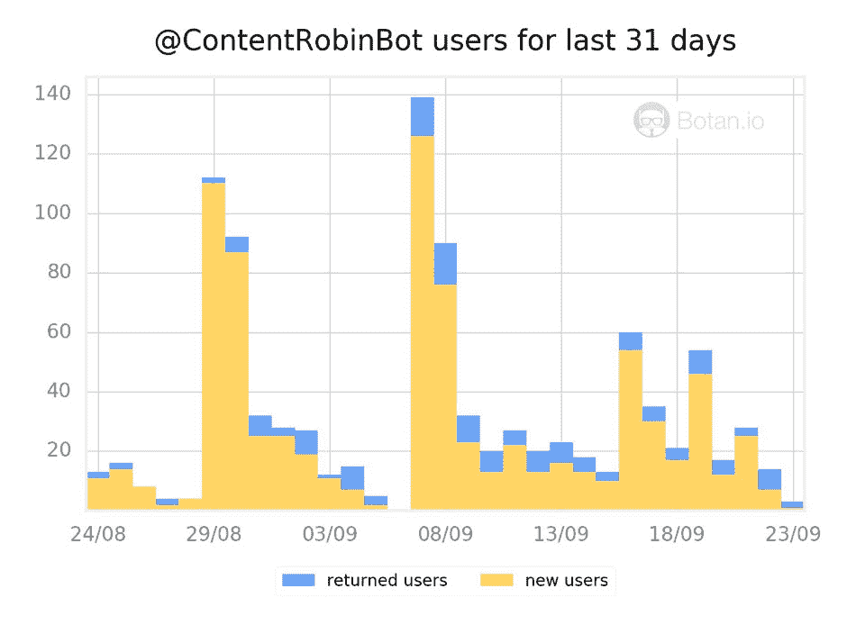

# 打三份工来资助一家公司，现在每月赚 12，000 美元

> 原文：<https://www.indiehackers.com/interview/working-three-jobs-to-fund-a-business-now-making-12-000-mo-f3000f0c4f>

## 告诉我们关于你自己和你正在做的事情。

我叫亚历克斯，我是一名专业营销人员和记者。我的经历包括在金融和 IT 安全领域的企业公司工作，在广告和公关机构做自由职业者，以及在一个关于创业公司的在线博客([VC . ru](https://vc.ru/)——这是东欧的 TechCrunch)担任编辑。

随着时间的推移，我意识到我在工作中做的每一件事(比如写文案和管理社交媒体账户)我也可以独立完成。我的联合创始人 Dmitry 同意了，于是我们开始了我们的事业:[摇滚罗宾](http://www.rockinrobin.co/eng)。

起初，它只是一个小型的内容营销工作室，帮助当地企业进行公关和内容创作，但我们最终设法获得了来自世界各地的客户。我们也追根溯源(我们大学学的是计算机科学)，开始开发内容营销工具。我们建立的一个工具是我们的[电报](https://telegram.org/blog/bot-revolution)机器人 [@ContentRobin](http://telegram.me/ContentRobinBot) ，它帮助企业找到流行营销问题的答案，并安排与我们的专家进行咨询。

## 你是如何开始你的事业的？

2012 年，rock in robin 开始从事自由职业。那时我已经有了一些营销经验，我决定通过一个简单的博客来分享它。我的朋友兼合伙人 Dmitry 当时对播客很感兴趣，他已经开始经营自己的网络电台。所以我们决定由我来为公司写稿子，我们还会为公司创建新的播客，涵盖 UX 和可用性主题。

这个项目获得了巨大的成功！我们的文章被阅读了 100 多万次，播客在 iTunes 的同类产品中排名第一。我们还意识到，我们在没有太多费用的情况下获得了良好的收入，因此我们有了一个商业模式的概念证明——公司的内容营销订阅——我们决定扩大规模。

## 你是如何找到时间和资金来建立你的企业的？

起初我们俩都还在其他地方有工作。几个月来，我打了 4 份工:一家 IT 安全公司的全职营销人员，兼职在线创业博客编辑和 SMM 经理，一家公关公司的自由撰稿人，以及自己创业公司的创始人。经济上一切正常。我们有足够的钱来进行选择，而不是必须接受每个到来的项目。但事情非常繁忙，这对我们的创业不利。后来，随着我们的投资组合中有了更多的客户，我们能够更加专注于[摇滚罗宾](http://www.rockinrobin.co/eng)。

这是我一生中非常有趣的时期。它教会了我要有条理和专注，尽管我不确定我是否还想再经历一次。我的一天只有 24 小时，我必须把它们分散得很薄。首先，我争取到了一个全职在家工作的机会，这样我就不用整天呆在办公室了。后来我决定不再做自由撰稿人了。这为我赢得了时间去做我们自己的项目，从而赚更多的钱。最后，我离开了我的在线博客编辑职位——但我应该提到，那份工作给了我创建不同格式内容的经验，所以它非常有用。

德米特里和我都是保守的逐步战略的支持者。当我们的项目看起来像一个真正的企业时，我已经有了一个家庭(妻子和小女儿)，所以我不可能简单地辞掉所有的工作，全力投入我们的事业。然而，我可以有很多工作，产生足够的钱来储蓄和投资于我们的业务发展(例如，雇佣我们的第一批员工)。

## 你是如何吸引用户和发展业务的？

我们用了几种策略来吸引我们的第一批顾客。首先，我们推出了一个[博客](http://www.rockinrobin.co/blog-eng)，那里的文章被分享到 Reddit 和其他社交媒体上。

我们也依靠我们的老关系——例如，我们最早的客户之一是我几年前工作过的金融公司。我在那里认识很多决策者，所以我能够说服他们并得到一份合同。

一大渠道是口碑增长。我们通过向现有客户提供优惠折扣来刺激这一点，如果他们向他们网络中的人推荐我们，这样的谈话最终为我们带来了新的合同。

另一个对我们有用的方法是发送冷冰冰的电子邮件。我们利用网络进行研究，寻找我们可以帮助提供内容的公司，并试图通过电子邮件向他们推销。我们的大部分信息都是徒劳的，但不管怎样，这种方法为我们赢得了几个好客户，他们与我们保持了很长时间的联系。

久而久之，我们最终耗尽了正常的获客渠道。我们需要新的东西，但是我们没有营销预算。投资者对我们的模型不感兴趣。我们自己的收入足以支付团队的薪水和扩张，但还不够支付广告费用。当你没钱的时候，你应该变得有创造力以保持竞争力。

这就是我们推出新服务的原因:内容营销研究。如果一家公司想了解他们的竞争对手使用了什么营销技巧，或者同行业的公司在 Reddit/Hacker News/Product Hunt/等网站上的表现如何，他们可以向我们求助。我们有自己的分析和程序员，他们分析数据，并使用数据来创建清晰的建议。我们也可以为客户实施这些建议。这项服务给了我们新的线索流。

另一个创造性的渠道是我们的聊天助手项目。我们对聊天机器人的炒作很感兴趣，也很兴奋，所以我们决定跟上潮流，创造一个工具，帮助公司和他们的员工迈出内容营销的第一步。我们创建了 [@ContentRobin](http://telegram.me/ContentRobinBot) ，这是一个电报聊天机器人，它可以就如何创建出色的文案提出建议，分析现有文案的“可读性”，并安排与内容营销专家的咨询。当然，这些专家是我们的员工，所以每个请求都会发送给我们，我们会得到新的线索。

## 你的营收背后有什么故事？

如今，我们平均每个客户每月可赚 1000-1500 美元，总计约 12000 美元。我们正在努力开设一家美国公司，我们将努力吸引更多的美国客户，并使我们今年的月收入增长 2-3 倍。

我们最大的优势是我们从一开始就冲锋陷阵。随着时间的推移，我们掌握了我们的服务，出现了追加销售的机会。例如，如果一家公司以博客起家，那么后来他们可能也会决定使用公关。如果一家公司是东欧的，后来它通常需要扩展到英语市场，这需要分析和能够创建本地化内容的人。(我们可以！)

## 如果你必须重新开始，你会做什么不同的事？

如果我能重来一次，我会更早开始招聘。招聘确实帮助我们把更多的时间花在销售上，而把更少的时间花在日常工作上。

## 你最大的优势是什么？

我们的商业模式有一个好处，那就是我们不想建立一个传送带，生产精品风格的作品。相反，我们在每位顾客身上花了很多时间，并提供高质量的服务，这有助于我们脱颖而出。

此外，由于我们在东欧(莫斯科)生产，当地货币相对于美元相对便宜，因此我们可以为美国和西欧客户保持相对较低的价格。就连说英语的团队成员也是来自美国和英国、常驻莫斯科的外国人。这确实有助于我们提高成本效益。

## 你会给有抱负的独立黑客什么建议？

以下是我在项目工作中学到的一些东西:

*   当有另一份工作和收入来源时，心理上更容易开始。
*   很难同时有效地处理不同的项目，但是这种情况可以帮助你学会如何更有效率。
*   如果你不在美国/西欧等地，不要认为这是一个劣势。相反，探索当地的机会。例如，我们设法找到了优秀的专业人员，他们的成本比在任何发达国家都要低。这使得我们的美国市场扩张更加容易。

## 我们可以去哪里了解更多？

你可以阅读[我们的博客](http://www.rockinrobin.co/blog-eng)或者查看[我的 Quora 简介](https://www.quora.com/profile/Alexander-Lashkov)和我在那里的回答。此外，你可以阅读我们的聊天机器人，它已经在 [VentureBeat](http://venturebeat.com/2016/09/18/how-this-telegram-chatbot-improves-business-efficiency/) 和 [ALLTOPSTARTUPS](http://alltopstartups.com/2016/09/16/how-bots-are-helping-people-and-businesses/) 上报道。

请随时通过电子邮件( [【电子邮件保护】](/cdn-cgi/l/email-protection#61090821130e020a080f130e03080f4f020e) )或通过下面的评论部分与我联系。

——[<picture id="ember5280512" class="user-avatar ember-view user-link__avatar"></picture>亚历山大·拉什科夫](/AlexanderLashkov?id=rockin-robin-owner)《洛金罗宾》的创作者

## 想像摇滚罗宾一样建立自己的事业吗？

你应该加入[独立黑客社区](/)！🤗

我们是几千名创始人，互相帮助建立有利可图的业务和副业。来分享你正在做的事情，并从你的同事那里获得反馈。

还没准备好开始使用你的产品吗？没问题。这个社区是一个认识人、学习和实践的好地方。随意[随便浏览](/)！

—[<picture id="ember5280517" class="user-avatar ember-view user-link__avatar"></picture>考特兰艾伦](/csallen?id=ibTLPyjwVebnZjMGKvz6ztarnuV2)，独立黑客创始人

4votes