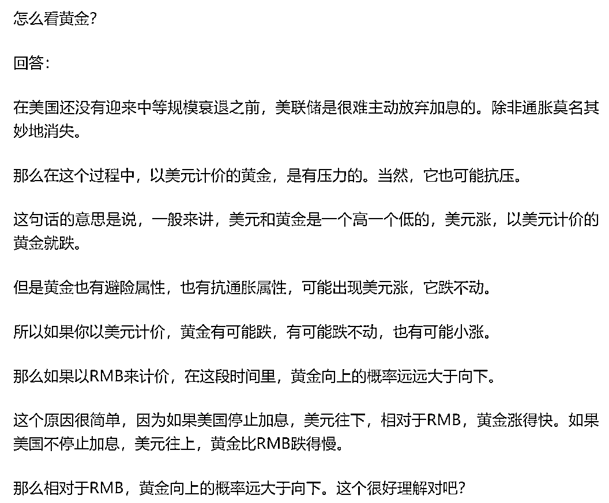

# 重点从来不是做黄金，而是哪种做黄金？

> 原文：[`mp.weixin.qq.com/s?__biz=MzU3NDc5Nzc0NQ==&mid=2247525747&idx=1&sn=2c9ff5b82ed236e475698dfdb9bc6c54&chksm=fd2ec7adca594ebb654859d2e38e81b6577998ae9206dc867218af3f0d2a6c13f730bcbf71ab#rd`](http://mp.weixin.qq.com/s?__biz=MzU3NDc5Nzc0NQ==&mid=2247525747&idx=1&sn=2c9ff5b82ed236e475698dfdb9bc6c54&chksm=fd2ec7adca594ebb654859d2e38e81b6577998ae9206dc867218af3f0d2a6c13f730bcbf71ab#rd)

我们有个读者，连续问了五六次，问黄金。

他为什么问黄金呢？因为最近这段时间很多自媒体在聊黄金，确切地说，是聊人民币黄金涨势迅猛。 

我看了下后台数据，这不是个常读用户，其实有时候怎么话说呢，你有功夫每天问八回，不如下功夫去把历史文章读一读。 

如果你这个心思都不下，伸手党做成这样，你确定你伸手得到的东西，真的是自己需要的么？ 

人世间不存在大力丸，还得是通用的，任谁吃了都好，世上没这玩意儿。 

**这个问题非常简单，重点从来不在于你问的做黄金，而在于你是哪一类做黄金的？**

在我看来，做黄金有三类。

**第一类是做毛刺套利的。** 

这种人和黄不黄金没关系，任何一个交易品种里都存在这种套利者。 

你比如炒房子的人，他遇到特别低的卖家，就迅速买下来了，然后转手立刻加价卖出。这个加价的幅度很小，保证他自己是低于市场真实成交价的。

他赚的钱很简单，就是一个你急的钱。 

其实你不急，你挂 2 个月也能卖掉，说不定比他加价后的价格还高，但是因为特殊原因，你必须 3 天内成交，那么你打了一个很大的折扣，他就接了。然后他 1 个月内卖掉。 

他就赚一点点差价。 

他能赚这个差价，一方面他手里随时有那么多流动资金，另一方，他遥控着大量的中介。 

换句话说，第一信息一定是给到他的，第二信息才是在中介的小圈子里流动，第三信息才会挂牌上网，被所有人看到。

职业炒房客都是做第一信息生意的，换句话，你上网找到的房源，都是职业炒房客不要的。挑拣之后，觉得没有短期利益，才会被广大购房者看到。 

你把这个模型放到所有交易品种上，都是一样的。 

炒股的，炒汇的，炒商品的，炒黄金的，都是一样的。

如果你是这种人，那按照你自己的既有套路去做就行了呀。

**第二类是做对冲套利的。**

这种也是市场里普遍存在的现象，包括进一步的延伸形态都是有的。

你比如升水高的时候，有人就把国外的黄金运进来，赚这个差价。

反过来假如贴水高，那么就有人倒过来做。当然，倒过来做有些限制，对吧。具体我们不谈，做的人知道我聊什么。 

那也有人像我之前聊过的模式，他们做的实际上是[回归，就是不管你升水贴水，过段时间总会回归。](http://mp.weixin.qq.com/s?__biz=MzU3NDc5Nzc0NQ==&mid=2247525482&idx=1&sn=2832373ac02d839e1644991e70a1d025&chksm=fd2ec6b4ca594fa2c4ae86cab271511a0864aad4464b7cdae829c4cddb06aa9e137b750433ec&scene=21#wechat_redirect)

他们套取的是回归过程中的利润。 

包括开采金矿的商人，他们为了锁定价格，自己等量做空，相当于提前把自己未来要采出来的金子先以一个确定的价格卖掉。 

这就跟某些持股未到解禁期的大股东，担心几年后股价下跌，于是找人等量做空，相当于提前锁定了自己的股票出售价格，一回事。 

那么既然市场有这个需要，你觉得借钱给他们空的那些资金，赚的是什么钱？ 

本质上还是一种套利。 

所以换句话说，这种套利模式，并不仅限于黄金，而是普遍存在于股市，商品，汇市。 

同样，如果你是这种人，那按照你自己的既有套路去做就行了呀。

**第三类是押涨跌的。**

这种非常简单，我之前聊过的，我聊这个有日子了，好多个月了。 

[今年 3 月份我还专门回答过这个问题，回答读者关于国内市场的五个问题。](https://mp.weixin.qq.com/s?__biz=MzU3NDc5Nzc0NQ==&mid=2247523248&idx=1&sn=14b43f16182b77163845b379917ddc35&chksm=fd2e396eca59b0782163f4afef8b3cf654ba0fb64d11250ac5d87bf1fb95bb32969f06e2770d&token=1539494171&lang=zh_CN&scene=21#wechat_redirect) 

其中第三个问题专门回答黄金，而且专门回答人民币黄金。我的回答到今天已经半年过去了。

说白了，当时买人民币黄金的人，本质上买的是什么？

而且你还要思考一个问题，他为什么不得不绕路？ 

等你想明白了，你就会发现，这事儿跟你没关系，如果你的家庭年收入连 300 万都没有的话。

说白了如果兜里就那几个钱，没必要绕。你七大姑八大姨，对吧。

而且说实话，彼此的处境，需求完全对不上。 

如果你兜里只有千八百万的，那是你要花的钱呀，媳妇今天买个包，几万块没了，全家旅游一次，十万块没了，换个车几十万没了，儿子娶媳妇买房，所有钱都没了。

我说得很明白了，自己琢磨吧。

但是反过来，如果你有几个小目标，是绝对用不上的，那是另一回事。

对于这些人，我前面讲了，他们实际上在买什么。

但是我们回头看，你会发现黄金并不是他们唯一的选择，选择多了去。

也就是说，他们要做那个，但是没法做那个，额度不够，于是选择了间接，那么间接的品种有一大堆呢。 

明白我意思么？你回头看涨幅，都差不多的，没区别。 

之所以我把三类罗列出来就是告诉你，其实这个市场里，所有的生态位都很成熟，狼每天在找羊，羊每天在找草。 

所有人都在做着他们所处的生态位本应该做的事情，俗称各自套各自的利。

这个问题很简单，你是哪一类？ 

你到底是三种里的哪一种？ 

就像你问我赌钱怎么赚钱？很简单，先去赌场观察下，长期赚钱的生态位有哪些。 

开赌场的是赚钱的，拉客人收佣金是赚钱的，借钱给客人收利息是赚钱的，当荷官伺候客人是赚钱的。

其他都是消费行为。

所以赚钱很简单，对号入座，你只要找一个生态位的位置，坐下去，就是赚钱的。 

反过来，如果你总是在澳门大街上，今天看到一个旅游大巴上面写的小报，明天看到一个传单，然后来问我，那我听得一头雾水。

媒体本质上是追逐热点的娱乐圈，俗称什么热，你就会在媒体上看到什么。

换句话说，我前面给你分拆的生态位，那种东西天天赚钱，形成产业链一样的赚钱，媒体不会聊，因为不够热，没人关注。

如果你只是要追逐热点，那你应该做一个媒体从业者，而不是投资人。

反过来，如果你要做个全职的投资人，就是我今天说的，任何一个赌场，研究清楚有哪些生态位，去找一个自己够得上的位置，坐下来。

而不是每天被追逐热点的媒体牵着鼻子跑。

我们平日里也追娱乐热点说说相声放松下，但是所有和钱相关的，和楼市相关的，和股市相关的，和汇市相关的，和商品相关的，和行业相关的，和就业相关的，和教育相关的。

这七大类，我都是提前告诉读者的。

如果你错过了，那是你的问题。你不可能要求我又及时，又凑巧是热点。

天底下的新闻，全都是过期的旧闻。

就像我前面第一个买卖房子里打的比方，第三手的老旧消息，才会拿到网上给大家看。 

一个还有交易价值的当期消息，一定会被职业投资人们吃干嘛净。 

所以你拿着别的自媒体热衷的过期消息来问我，不如反问自己，为什么我当初给你的当期消息，你会漏掉呢？

当然了，人没必要为了打翻的牛奶哭泣，漏掉了，那也只能拉倒。

既然反复来问我，你当下非要介入的话，相对来说靠谱的模式很简单，就是我那天提到的，对锁，押注升水迟早回归。

如果你有 100 块，50 块去空人民币黄金，另外 50 块也就是 7 美金，等仓位去做多伦敦金。

有一件事是确定的，就是升水一定会消失，因为前面讲过，那些套利者会把海外的金搬进来，从而抹平升水。

也就是说，升水这部分的钱你是必然赚到的，而且无所谓价格，因为你等于对锁了，无论价格拉到天还是跌成零，你某个仓也许会爆，但是这个交易组合单，整体上，是只有盈利的，而且盈利的部分就是升水那部分。

这段话，我那天讲过了，今天再补充一句。

到时候平的时候，如果伦敦金靠近 1900，那么你先平人民币黄金空的那张单子，而等仓位伦敦金多的那张单子，可以多拿几天，再涨个几十美金你再平，等于把等待期的隔夜利息赚回来，再多赚些。

反过来，如果升水消失时，伦敦金的价格已经涨上去了，那么空单和多单一起平就是了。

这个道理就跟房价不同走势下，置换时是先卖旧房再买新房，还是先买新房再卖旧房一回事。

你要做短期就是这么一个确定的操作手法，长期则是另一回事。

我想，我讲得够清楚了。