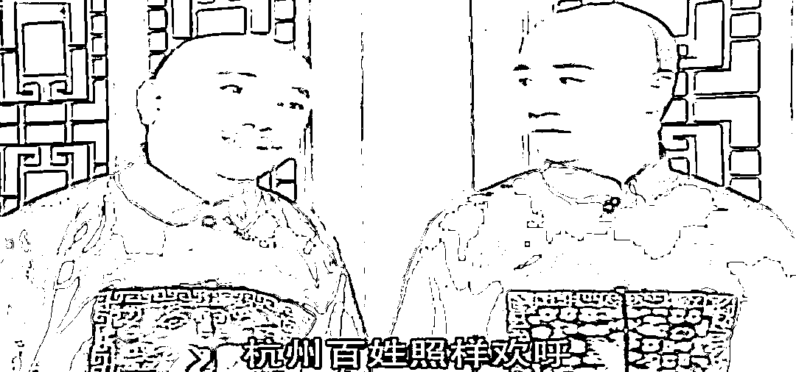

# 人生第三悲是老婆是女医药代表？

> 原文：[`mp.weixin.qq.com/s?__biz=MzU3NDc5Nzc0NQ==&mid=2247525319&idx=1&sn=de1613b79ffec812615ddfaf41a7100b&chksm=fd2ec119ca59480f91d3e7d8d98aa17d0db4e71a20c5548051c8f2f2b2e9aae2d4366a1ff58d#rd`](http://mp.weixin.qq.com/s?__biz=MzU3NDc5Nzc0NQ==&mid=2247525319&idx=1&sn=de1613b79ffec812615ddfaf41a7100b&chksm=fd2ec119ca59480f91d3e7d8d98aa17d0db4e71a20c5548051c8f2f2b2e9aae2d4366a1ff58d#rd)

随着医疗反腐的进行，女医药代表这个词儿，上了热搜。

甚至冒出个段子，人生三悲，钱投了什么，房买了什么，老婆是什么。

很多读者在后台留言问，各种有关女医药代表的花边新闻，各种关于医生收钱以及两性关系的热搜。

我想问大家一句股市里常用的说法。

**昨天和今天，究竟有什么变化？** 

就是每逢市场大跌或者暴涨，你不妨想想看，到底是企业盈利亏损的基本面发生了本质变化，还是情绪或者说预期，在起作用呢？

如果我没有记错，去年，医生在大多数自媒体口中，还是小甜甜，各种溢美之词不绝于耳，为什么，瞬间就变成牛夫人了呢？

我没有讽刺的意思，我只是想起铁齿铜牙纪晓岚里面一段台词，和珅对纪晓岚讲的。

和珅说，这百姓哪儿懂得什么大是大非，只要所杀之人比他们地位高，身价大，他们就暗喜，今天杀了王亶望，杭州百姓欢呼，赶明杀了你纪大人，杭州百姓照样欢呼。

我只是引用电视剧台词，这可不是我说的，有意见去骂编剧，不关我的事。

中国古代哲学有一个重要的话题，或者说引子式的话题，名实之辩。

提出这个话题的是邓析，与老子，孔子同时代人。

老子的态度很清晰，名是被实决定的。

但是老子也承认，名可名，非常名，人类，尤其是聪明人，是很喜欢用名的方式去操控预期的。

这人是谁，大家都知道，孔子。

孔子很喜欢玩弄定义，以此操控人们的预期。

[操控预期没毛病，昨天刚聊过金融市场里的名与实，你那被操控的预期，与真实可能要发生的事。](http://mp.weixin.qq.com/s?__biz=MzkwMzQ1MzczOQ==&mid=2247484001&idx=1&sn=1acc164b00cad51f2dbf39f8b376661b&chksm=c0974f25f7e0c633d28d9e8c26bd3f8fe4595878d2e51b1285efcc44b0ed2e9bfc3a7ebd76c8&scene=21#wechat_redirect) 

[你要是昨天看得懂，你就知道接下来一段时间怎么不当韭菜，以及怎么反过来获利。](http://mp.weixin.qq.com/s?__biz=MzkwMzQ1MzczOQ==&mid=2247484001&idx=1&sn=1acc164b00cad51f2dbf39f8b376661b&chksm=c0974f25f7e0c633d28d9e8c26bd3f8fe4595878d2e51b1285efcc44b0ed2e9bfc3a7ebd76c8&scene=21#wechat_redirect) 

具体到我们今天的话题上，我只问大家一个问题，收受贿赂的医生，和医生，是不是两个词儿？

被潜规则的女医药代表，和女医药代表，是不是两个词儿？

如果你一定要混淆两个词，把他合二为一，那我只能认为你是刻意要污名化一个群体。

读者分享给我，让我点评的那些个新闻我看了。

实话实说，我并没有因此对医疗系统产生异样的看法，因为如果你单看问题，每个行业都有各自的问题。

那些个数额十分巨大的院长，他们那个爆出的数额是今天的。

十多年前，钱比今天值钱多了的年代，我跟过的上司，一次涉及的数额的绝对值，就比他今天那个还要巨大。

我昔日的上司哪儿去了？面壁去了。

他多年前已经提前退了，去美国了，转型做商人做投资公司董事去了，几年前依然被查出来，法律怎么规定，就怎么判。

这样的违法之人，如今蹲着面壁的，在我的行业里，在我多年前认识的那些人里，有两位数。

干嘛，要因此也来污名化下我们行业么？

我告诉你，每一个手握采购权的人，都会面临诱惑，就好比每一个求人采购的，都有可能施加诱惑。

但我们不可能因此就污名化每一个采购，每一个销售。

因为任何事你都不能脱离比例。

我从业以来，打过交道的采购销售四位数都不止，有问题的可不可能占多数？

绝对不可能。

任何一家企业，一个团体，10%的人下水，已经是重灾区了。

前段时间互联网上流行阿里的桃色新闻，以至于街头巷尾都在议论，说的有鼻子有眼，绘声绘色。

知道的阿里是家互联网公司，不知道的还以为是那啥呢。

这就是大多数人的习惯，名实不分。

一个单位里几个人违法，就把帽子扣到全单位的人头上，一个行业里部分人违法，就把帽子扣到全行业头上。

甚至，扣到一个性别头上。

中国男子足球，即便他们输到这种程度，球迷们是怎么骂的？

前两个字侮辱了这个国家，中间两个字侮辱了这个性别，后面两个字侮辱了这项运动。

难道你能因为一支球队的问题，就责怪一个国家，就责怪所有男人，就责怪整项运动么？

医疗系统有八百万人之多，别说爆出来的人几千个，即便是几万个，能因此就污名化整个行业么？ 

**这么做，对得起那些兢兢业业，坚持职业操守的医疗系统内的工作人员吗？**

即便是这么多自媒体在以讹传讹，在抹黑，在污名化一个职业，一个群体，一个系统，不仍然有我这样的人，站出来实事求是么？ 

所以不要讲自媒体怎么样，因为至少有我站在这里，至少还有我，还在讲真话。 

一码事归一码事。

一个女医药代表怎么样了，就说这个女医药代表怎么样，一个男医生怎么样了，就说这个男医生怎么样。

哪怕是几千个，几万个，就说这几千人，几万人怎么样。 

不要随意污蔑人家整个行业，因为背后，还站着上千万人呢。

以讹传讹，利用人的猎奇心理是很容易获得流量的。

但是我很好奇，**如果我们轻易的否定一个又一个职业，这么随意的污名化，那以后，你，或者你的孩子，还能从事什么工作？**

女医药代表不能做对吧，女护士好像也不能做，互联网上关于空姐的小作文也不少，女导游更是铺天盖地，好像女公务员也没有被放过。

我很好奇，女人究竟能做什么？

都去做江浙沪独生女，都去做小公举？

我不理解这种梗最近这么流行究竟有什么意义。

江浙沪独生女一瞬间上了热搜，父母给买好房子买好车子不用你赚钱，你只需要负责美美的买买买就可以了。

江浙沪一共有多少家庭，收入中位数你们调查过么？ 

没有数据依托，随便找几个网红秀几张小资图片，这跟前段时间流行的我想嫁到民国做姨太，有什么区别？

查一查，背后是不是同一个操盘手。 

这就是庄子说的圣人不死，大盗不止。

因为聪明人最喜欢做的就是操控定义，玩弄预期。

我四十多岁了，见过很多有钱人，里面不乏只有独生女儿的。

[这些女孩，我们昨天讲的那种复杂的金融内容，人家完全听得懂。](http://mp.weixin.qq.com/s?__biz=MzkwMzQ1MzczOQ==&mid=2247484001&idx=1&sn=1acc164b00cad51f2dbf39f8b376661b&chksm=c0974f25f7e0c633d28d9e8c26bd3f8fe4595878d2e51b1285efcc44b0ed2e9bfc3a7ebd76c8&scene=21#wechat_redirect) 

我就没见过谁只知道美美的。

即便是爱晒朋友圈的人，多数也有自己另外的事业。

就像一个产品经理开了一天会，临了晒那杯咖啡，你能说他一整天都在喝咖啡？

大众相信这种说辞，只有一种可能。

那就是绝大多数人真如和珅说的那样，他们根本就没有办法理解两个数学概念。

一个叫比例，一个叫概率。

任何名，都不会是实的全部，都只能是实的百分之多少，这个概念叫做比例。

任何事都没有绝对，站在无限时间和空间上看，总是百分之几，这个概念叫做概率。

这么简单的东西大多数人终其一生都建立不了，所以才会被人耍弄，这叫被操控预期。

女人做这个是被污名化，做那个是被污名化，什么都不做，每天做梦江浙沪独生女？

男人每天做梦自己是李莲花，裸辞后原先的岗位整整十年都无人能够取代，玩消失整整十年前女友还在等自己，全世界都求着自己回去给他们当 CEO，自己偏不，偏要用马拉着房车满世界种萝卜？

你有没有想过，究竟是什么人才会信这些？

如果那些年轻人里的精英，如果那些年轻人里的富二代信了这些，那你真就安心了。

问题是，恰恰相反。

巴依老爷越来越阿凡提化，而阿凡提想帮的那些人，反而越来越像昔日的巴依老爷了。

[我昨天聊，筹码在谁手里的时候会涨，在谁手里的时候会跌，你想不通么？](http://mp.weixin.qq.com/s?__biz=MzkwMzQ1MzczOQ==&mid=2247484001&idx=1&sn=1acc164b00cad51f2dbf39f8b376661b&chksm=c0974f25f7e0c633d28d9e8c26bd3f8fe4595878d2e51b1285efcc44b0ed2e9bfc3a7ebd76c8&scene=21#wechat_redirect)