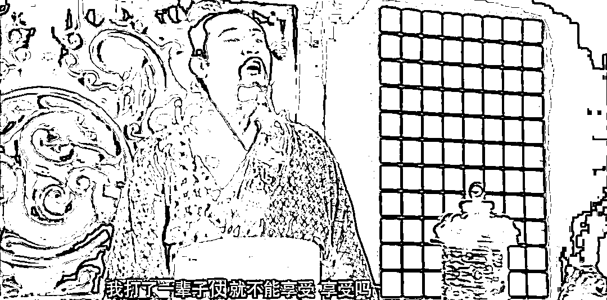

# 人这辈子，最难受的就是对不起

> 原文：[`mp.weixin.qq.com/s?__biz=MzU3NDc5Nzc0NQ==&mid=2247524742&idx=1&sn=fed935d000e8bb44d449f3a1092664db&chksm=fd2ec358ca594a4e344deaeba5d83215e6a57f342efee756c8f994736e25334cf991ad7e7ee8#rd`](http://mp.weixin.qq.com/s?__biz=MzU3NDc5Nzc0NQ==&mid=2247524742&idx=1&sn=fed935d000e8bb44d449f3a1092664db&chksm=fd2ec358ca594a4e344deaeba5d83215e6a57f342efee756c8f994736e25334cf991ad7e7ee8#rd)

[上午我们回答了一个高中的小读者，有人说我的真话，刻薄了点。](http://mp.weixin.qq.com/s?__biz=MzU0MjYwNDU2Mw==&mid=2247511437&idx=1&sn=fad5b970c2ebcd7f384ef846d85ec3f6&chksm=fb1ac1f1cc6d48e7ce6617217ccfb74b044775935190d3f6b419cc51549b9b7635a9ff0f55ce&scene=21#wechat_redirect) 

是的，不是刻薄了点，是很刻薄。

其实我完全能体会这孩子的状态，他没有找到自己真正想做的，他并不喜欢学习，但又觉得彻底放弃，哪里不对。 

说不上来的一种不对。

我非常理解他到底在纠结什么，所以写篇影评。发哥的电影《别叫我赌神》。 

发哥这次不演赌神，他演一个烂赌鬼。因为烂赌无度，负债累累，他老婆离他而去，一个人带大自闭症的儿子。 

忽然有一天，发哥的老婆回来找他，把儿子寄养在他这里，说养一个月，给他 5 万块，然后烂赌鬼发哥和自闭症儿子就开始了父子旅程。 

剧情我们都猜得到，他老婆肯定是不久于人世，这是托孤来了，而父子俩最后一定会和解，治好发哥烂赌毛病的，是儿子唤醒他做父亲的责任。 

但是我聊的不是这个，而是悔恨的发哥对着死去的老婆，说的那声对不起。

这声对不起实际上说给很多人，说给他老婆，他辜负了对方一生；说给他儿子，他那个自闭症的儿子是他老婆一个人带大；也是说给自己，说给自己荒废的岁月与逃避的责任。

发哥值不值得原谅？ 

答案是回答值得与不值得都不对，因为**人世间从来不存在原谅**。 

你今年 18 岁了，你想回到 18 个月，可以么？ 

如果不可以，你就能明白那句话，苍天饶过谁。 

苍天谁也没有绕过，时间过去就过去了。发哥辜负的不只有他老婆的一生，他儿子的前半生，更有他自己的一生。 

**时光是不会倒流的，人生是没法重来的，所以我说这世界从来不存在原谅。** 

对不起是什么意思？ 

说穿了就是后悔。

人生最难受的就是后悔，因为没有后悔药。 

很显然，上午这个小读者，他最大的问题在于后悔，他后悔了，但是没有后悔药。 

这是生命当中最最残酷的事，只可惜大多数人都意识不到。 

人们总是觉得我可以随便选择，错了没关系，将来可以重来，但没有人能够意识到，其实没有办法重来，任何一件事，都没有办法重来。 

哪怕是一顿饭，你今晚吃了牛肉面，都没法重来改成炸酱面，因为今晚已经过去了。 

能意识到这一点的人很少，或者说大部分人意识到这一点，都已经很晚了，一般要到 60 岁以后才能感知。 

我上午讲了一个故事，说我大学里成天翘课打游戏，打废了，最后没法毕业，忽发奇想通过考研的方式来过关。 

有人问我，转折点是什么，人怎么就能从一节课都不上，每天泡在网吧里，忽然忽发奇想，毕竟考研还是要准备的，这意味着生活节奏和之前大不同。 

转折点很简单，就是对不起。 

我大三的时候，和我奶奶还聊过这个话题。她没有试图劝我不要沉迷于游戏，她只是提醒我，你不要后悔。

这里的不后悔并不是指前途，而是指时光。 

老太太很开明，她看重的并不是学业，或者潜在的事业，她只是提醒我，不要有一天后悔自己花了那么多时间在游戏上，不要后悔这段生命旅途的选择。

我跟她讲，我不后悔，我的人生我做主，类似于多年后那句台词，我命由我不由天。 

她看着天真的我，笑了。 

大概的意思是说，你孩子把后悔这件事，还是想的太简单了。 

人想做自己没有错，问题是，没那么简单，这事儿不是你想就可以。 

那次谈话半年后我就后悔了，玩游戏都玩不进去，一个人走在秋后的校园里，金色的阳光透过斑驳的树叶照在地上，阳光与阴暗错落的影子，就像我心中的恍惚。 

我总能想起很多人，很多事，以至于我玩不进去，我开始有心事了。 

我想起自己小时候的英语家教，他精通四国外语，有个精通八国外语的女友，那个年代单休，他上午给我教课，只有下午能陪女友。 

后来他和多年的女友分了，娶了另一个师娘，虽然我清楚，这是大人们的事儿，和当年浪费太多时间在我这个学生身上无关。

但，清楚归清楚，放下归放下。

王阳明有一次抓了一个山贼，跟对方讲致良知，山贼觉得王阳明迂腐，自信自己没有良知，于是两人打赌。 

王阳明让山贼脱了衣服，山贼就脱了，王阳明让山贼脱了裤子，山贼也脱了，王阳明让山贼继续脱内裤，山贼犹豫了。

王阳明指着他的内裤笑着对他说，看到了么？这就是你的良知。 

很有意思对吧？不就是一条内裤么？砍头碗大个疤，一条内裤怎么就脱不掉呢？ 

大四的时候，忽然间我就玩不进去游戏了，说不出来哪儿不对。 

我没有不对，这是我自己的事情，这是我自己的时间，我有权自由支配，我有权决定自己的命运。 

但是我不停的想起一个个具体的人，就比如前文我打比方的那个老师。 

这些人有个最大的问题就在于他们都没有收我们家人钱。 

我们之间不是交易关系，不是说我付钱买了他们的服务，不是。 

另一个问题则在于，他们没有一个人希望看到我每天沉迷于游戏，尽管，生命属于我自己。 

尴尬就尴尬在这里。 

我想拿回自己生命的全部支配权，我想脱掉那条内裤，可我就是脱不掉。 

后来我想通了，脱不掉，就干脆不要脱，**脱不掉的自我，才是真的自我**。

人要顺从本心，才能找到真我。

其实那条内裤就是责任，没啥神奇的。 

我当时已经快 22 了，早已成年，别人对我有期待很正常，我负有一定的社会责任，也很正常。 

做街溜子的确是我的自由，但是，如果做街溜子并不快乐，那为什么要执意做个街溜子呢？

既然良知浮现了，那就遵从它，既然责任浮现了，那就扛起它。

时至今日，我依然沉迷于游戏，炒买炒卖的过程比发哥演的那个烂赌鬼强不到哪儿去。

问题是，我并没有荒废时间。 

大学里我是只打游戏，今天我可不是只赌钱。

我后来发现人生这个游戏很简单，你可以多线程的。 

你可以搭建一个系统，就好比原来你是个挑水的和尚，玩牌影响了打水，你觉得自己不负责。 

你又不想打水又想玩牌又不愿意背负不负责的心理压力，那就打造一套自来水系统，从此你不用打水，工作也能完成，你就可以安心打牌。

大四那年我想通的就这点事儿。我要组建一个系统，以后我的员工负责充实努力的替我工作，像许三多一样好好活，做很多很多有意义的事情，然后我就可以每天炒买炒卖，赌钱，专门做无意义的事情去。 

这样就没有心理压力了，正经事有下属去做，我只用做不正经的就可以了。

你想不负如来不负卿，你就必须有自己的诸葛亮赵云，有一套系统，他们负责正经，你负责接着奏乐接着舞......

你想要做自己喜欢的事，碰巧你喜欢的事类似于躺平，刷抖音小姐姐，那就没办法了。这种事情是很难建立责任的。

而正常人都很难逃过责任心的谴责，俗称致良知。

要么放弃低级趣味，承担起自己的责任。要么创业成功，而且还得让系统成熟化，让你这个创始人能够脱身而出，这样你才能既承担起责任，又做一个纯粹的自己。