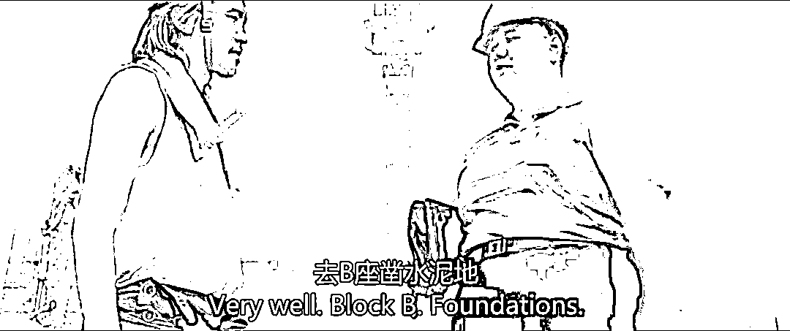

# 满嘴钱的未必不伟大，满嘴真爱的未必不自私

> 原文：[`mp.weixin.qq.com/s?__biz=MzU3NDc5Nzc0NQ==&mid=2247523633&idx=1&sn=bcee4037b54c348778b016cc15f32b09&chksm=fd2e3fefca59b6f94715673bc0c2ea50617c04cc8a095612fc87523559d86f040a44b5436b2c#rd`](http://mp.weixin.qq.com/s?__biz=MzU3NDc5Nzc0NQ==&mid=2247523633&idx=1&sn=bcee4037b54c348778b016cc15f32b09&chksm=fd2e3fefca59b6f94715673bc0c2ea50617c04cc8a095612fc87523559d86f040a44b5436b2c#rd)

[我那天预测到了，说真话注定要挨骂。](http://mp.weixin.qq.com/s?__biz=MzkwMzQ1MzczOQ==&mid=2247483763&idx=1&sn=8a0e59de7989dd8f2684320ddd190c57&chksm=c0974c37f7e0c5214ec9002b5e54af9b6019e14a0417a2e0e194d459073230b9aac4b1308691&scene=21#wechat_redirect) 

有的人很有意思，告诉他不要点进去，他一定要点进去，看完了再来骂我一遍。

呵呵。

而且骂我的理由很奇特。

骂我的理由是说，我为什么要教一个虫子怎么通过动手术变成鸟，而不是教一只虫子变成救苦救难大慈大悲的菩萨？

这个就叫理解力负一级，我实在不知道对方的大脑结构。

那篇文章开头就说得很清楚，它旨在回答一个问题。

有读者问我，早起的鸟儿有虫子吃，早起的虫子被鸟吃，我不想被鸟吃，又不愿意接受阿 Q 作茧自缚的方式，我就是想要早起，还不想被鸟吃，你必须给我一个解决方案。

问题就是这么一个限定性的问题，如何动手术。[所以我丢下一本《僻邪剑谱》。](http://mp.weixin.qq.com/s?__biz=MzkwMzQ1MzczOQ==&mid=2247483763&idx=1&sn=8a0e59de7989dd8f2684320ddd190c57&chksm=c0974c37f7e0c5214ec9002b5e54af9b6019e14a0417a2e0e194d459073230b9aac4b1308691&scene=21#wechat_redirect)

问题很清楚，书的序也很清楚，你到底在哪一行里看到那是教你成菩萨救苦救难的？没有吧？

那你反过来要求说，《僻邪剑谱》很自私，一点都不高大上，这不废话么？

提问者他们要的就是一个自私的手术，他们要的就不是救苦救难。

你跑来医院切阑尾，我跟你说，我这里需要器官，你捐个肾给我吧，我别的病人要用。

你不答应，然后我难道可以在未经你许可的情况下，偷偷割掉你一个肾，可以吗？

当然不可以。

你要啥就是啥，这么简单的事情不值得讨论。

值得讨论的是下一句，变成鸟，一定不快乐么？

来骂我的这个读者很有意思，他在留言的最后，还发了诅咒。

他表示说，所有看了[那篇《僻邪剑谱》又从虫子变成鸟的](http://mp.weixin.qq.com/s?__biz=MzkwMzQ1MzczOQ==&mid=2247483763&idx=1&sn=8a0e59de7989dd8f2684320ddd190c57&chksm=c0974c37f7e0c5214ec9002b5e54af9b6019e14a0417a2e0e194d459073230b9aac4b1308691&scene=21#wechat_redirect)，一定都不幸福，一定都不快乐。一定。

因为他们从此再也不懂什么是真正的爱，什么是真正的快乐。

这是我今天要回答的，前面只是引子。

我的回复很简单，**你根本就没明白，那些人他们到底在要什么****！**

这位骂我的读者，他跟我叙述过他理解中的真爱。

他说，他理解的真爱，是纯粹的，不掺杂金钱的。

你比如他说他很爱自己的父母，很爱自己的妻子，很爱自己的孩子。

他已经失业三四年了，家里也没有什么钱，他也不出去赚钱，也不想这事儿，他甚至很反感别人提这事儿。

他觉得钱是很肮脏的，钱怎么能够跟真爱比呢。 

**我理解你的观点，但恐怕你自己未必理解你为什么会有这个观点。** 

在我看来，你之所以把真爱看得这么重，**不是你有真爱，而是你需要真爱。** 

你也说了，你没有钱，你不赚钱，你无法给家人亲人提供任何帮助。 

你父母老了，也没啥钱，你妻子很累在外很忙碌，你知道你的孩子读书要钱，你都清楚。

但是你什么都给不了，你也不愿意给。于是你强调真爱。 

**这到底是你有真爱，还是你自己需要真爱呢？你想过没有？**

**爱是一种付出，不是一种强调。**你付出了什么？你甚至连家务也不做，你自己说的。 

你之所以觉得爱情，亲情比钱更重要，那是因为你需要。

你有没有想过，你妻子需要什么？ 

她打两份工，她时刻面临裁员，她此时此刻焦头烂额。

你有没有想过，你父母需要什么？

你父母的退休工资很微薄，他们出去找工作找不到。

你有没有想过，你的孩子需要什么？

为什么别的同学能报补习班，我不能？

你觉得你的父母，妻子，孩子需要真爱，**事实上，他们需要的是你的钱，**而不是你满口的真爱。 

所以我说，你觉得真爱很重要，是一种索求，你只是个自私的寄生虫，你在向外界索求真爱，仅此而已。 

真爱对你很重要，不是对你的家人。**他们不需要你这种廉价的真爱，他们需要你掏钱。**

你自己想一想，一个女人走投无路的时候，她会怎么做？ 

通常她都会去选择一个有经济实力的男人，嫁给他。

那么同样，当一个男人走投无路的时候，会怎样？

通常他都会收到一份离婚协议书。

你只是在恐惧这份离婚协议书，所以你跟我这里不停地强调真爱无敌。

**你这种人，既拿不起，又放不下。那你当初就不要结婚，不要生孩子，不要坑别人。**

你看人家计春生同志，虽然逮哪儿往哪儿躺。但人家连六指的姑娘也不祸害，人家就独自一个人睡水泥管道。

而你呢？又祸害老婆，又祸害孩子，还死要面子。

一个人，尤其是男人，当他可以放下面子想要改变自己的时候，他已经长大了。当他不顾面子也要照顾妻儿的时候，说明他是个男人了。

而你，肉烂了嘴都不烂，不知道自我反省还去诅咒那些有担当的人，只能说，你不仅自私而且荒诞，不仅荒诞，甚至可笑。

你诅咒那些企图变成鸟的虫子不快乐？

**对不起，你根本看不懂他们，他们要的，就不是自己快乐不快乐这么自私的一个问题。**

**不是每一只虫子都在意自己快不快乐。** 

**这世上往往只有最自私的人，才整天强调自己快不快乐。** 

有的虫子非要变成鸟，哪怕动手术都要变成鸟，不见得是他们贪婪。

**也许只是因为爱，他们才真的有爱。** 

他们也许只是想保护自己爱的人，也许是他们的妻子，孩子，父母，所以他们才非要改变自己。

**他们努力想要改变自己的样子确实很卑微，可他们想要照顾亲人想要养育子女的样子，只会令我肃然起敬！**

星爷在《长江七号》里面问胖子主管要一份更辛苦的差事，因为他儿子读书需要更多的钱，胖子主管跟他说，你撑不了。

这话我说过两遍，无论是阿 Q 还是方鸿渐。

你撑不了，就像胖子主管，我也对读者们说过两遍了。

可是当我说了两遍，还有人依然苦笑着跟我讲，.......，他撑得了。

那我就明白了，就像电影里胖子主管反复劝说无效后，告诉星爷，去 B 座凿水泥地。

**人这东西，强调真爱的人，不一定有爱。** 

**连妖术都学的人，未必没有真爱。** 

你问我，有钱就一定会快乐么？

不一定。

**但是，有钱，会有无数人想尽办法让你快乐。因为他们想赚钱。**

一个孩子之所以在迪斯尼里很快乐，你觉得是什么原因？快乐是天降的？

不，快乐是别人想方设法给你的孩子制造的。

一个孩子大热天看到唐老鸭在自己面前跑来跑去，她不知，唐老鸭的身体里面藏着的是一个满头大汗的工作人员。

那个满头大汗的工作人员大热天跑来跑去不去吹空调，**不是他不知道如何让自己快乐，而是他知道，只有让别人快乐，挣了钱买了票，自己的孩子，才会有别人，去努力让他快乐！**