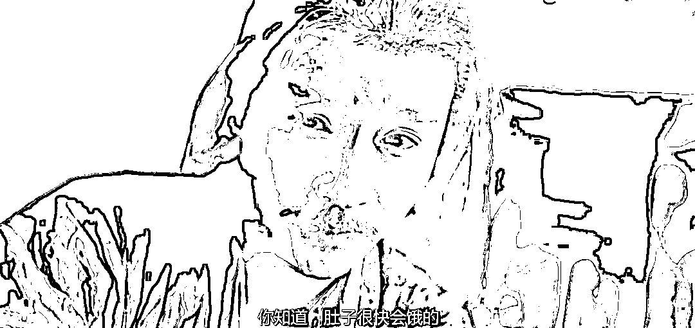

# 给林场要水的网红的确是商人，但商人也分很多种

> 原文：[`mp.weixin.qq.com/s?__biz=MzU3NDc5Nzc0NQ==&mid=2247523387&idx=2&sn=4005c1193eb0e11c18cca55eeebc50d4&chksm=fd2e3ee5ca59b7f3a7cc278e2b325682c4bc172c6027d4a88613e21810a06107c3bd2d16e0a7#rd`](http://mp.weixin.qq.com/s?__biz=MzU3NDc5Nzc0NQ==&mid=2247523387&idx=2&sn=4005c1193eb0e11c18cca55eeebc50d4&chksm=fd2e3ee5ca59b7f3a7cc278e2b325682c4bc172c6027d4a88613e21810a06107c3bd2d16e0a7#rd)

[昨天我们聊该救的不是树，是当地的孩子。没看过的可以先看看。](http://mp.weixin.qq.com/s?__biz=MzU3NDc5Nzc0NQ==&mid=2247523371&idx=2&sn=7d30883dbe4e2e3a92e22b43a4956eac&chksm=fd2e3ef5ca59b7e3030d4e03e9e3fbbd6652b5375a68c5cc7eece1ef2975a4b6beae74d8fbb5&scene=21#wechat_redirect) 

我认为的问题关键在于当地的营商环境是个硬伤，但是网友们都偏了。反复强调那个林场主到底是全心全意烧钱植树治沙，还是一个商人，并且是个网红。 

我们今天来聊一个话题，什么是商人。 

林场主这种，20 年前花了上千万跑到宁夏这么个地方种树养牛的，是个商人。 

种树养牛是个劳动密集型行业，实际上要雇很多人的。几万亩，不是你一个人就能种得了。 

20 年前的他也可以跑去北上深买房，坐等升值，这也是商人大类里的一种。 

当然，这样收入太慢了，最好的方法是加杠杆做波段，买一批，主升浪过后卖掉，然后圈下一批。 

后来限购了他依然可以做的，和一些社保顶格又没有资金的人签代持协议，打新，去抢占那些自住者的名额，摇到了之后，转手就是几百万，上千万一套的差价。 

这些都是商人。 

而且这个过程都是合法的，法无禁止即可为。不合理的事情不一定等于不合法。 

关键的问题在什么地方？在于后面这些事儿其实风险远比他跑去沙漠里种树小得多，而且利益大得多。 

用于投资里面的术语讲，风险盈亏比。 

所以你站在商人的视角下讲，他是个傻商人，你甭管他能不能赚钱，他这种赚钱的法子都太笨了。 

跑到一个鸟都不拉屎的地方，把自己晒得跟非洲黑人一样，又是种树，又是养牛，牛屎臭不臭？弄那么大个摊子，每年要开多少工资，流水，结果，就为这？ 

我知道，只要他能盈利，就不符合网民的审美。 

网民的审美观要求一个人纯粹，他既然要治沙，就得纯粹地治，花光 20 年前的上千万，最后身无分文，三餐只能喝粥，儿女考不上大学进富士康，这样的形象，网友才会满意，觉得这是应该的。 

**但是你想一想，这样的形象出来之后，还会不会有下一个？** 

我们想象一下，两个人，一个林场主，20 年前带着上千万傻了吧唧跑到沙漠里去所谓的等着骗拆迁。

另一个人也是 20 年前带着上千万按照我说的路数，就单纯的，随便的炒炒房。

前者后来在求水，后者的孩子在万柳豪宅里面，在齐白石的名画下面拍拍篮球，发个视频，然后一群网民自称老奴。 

回头后者的孩子再花 400 万去读个哈佛，回来投身演艺圈做个明星，每一次招手下面都是一片少女在喊老公。 

我就问你，还会不会有人肯做前者？ 

回答我，会还是不会？ 

不会对吧？ 

不仅没有人这么傻跑去沙漠里骗拆迁，而且也不会有人去开工厂。

为啥要开工厂？

你开个工厂，招工几百人的那种，一年净利润连一百万都不到。你知道你要铺多大的摊子，多少启动资金买设备？多少钱压在了原料上？问银行借多少钱？像去年今年这样遇到外贸寒冬卖不出去，咋整？拿啥还银行的钱？去年的尾款收不回来了怎么办？跑到纽约大街上学秋菊打官司么？ 

....... 

这些都是问题，关键是，冒这么多险，利润不如定期存款，还要被网民骂。

因为你剥削工人了呀。你雇人就等于剥削人，你让人家加班了，工人凭什么一个月才几千块？你这老板真黑心。

对不对？也对。 

所以他们都把厂关了，纷纷像我前面说的那样，加入核心城市核心地段倒挂打新的队伍。

这个钱比以前开厂子容易多了呀，是不是？

于是你发现，985，硕博士都去送外卖，人家外卖还告诉你，对不起，招满了。 

一瞬间外卖行业成了知识密集型行业，硕博士都有数万人，产业升级了，只是升级的方式有点出乎你的预料。 

这是不是绝大多数网民想要的？我昨天就在问这个。 

[我今天上午聊了一个很重要的观点，我说人世间不是只有妈妈和走狗。](http://mp.weixin.qq.com/s?__biz=MzU0MjYwNDU2Mw==&mid=2247510268&idx=1&sn=632b4013eaa4bbb3fb1f79dd12f31005&chksm=fb1ac480cc6d4d961995657195bdbb8bb4893e398f60612b290b2a88756082f5bd9f53888181&scene=21#wechat_redirect) 

**一个人产生智慧的标志就是他开始理解生态链，他开始理解只有彼此需要，才是靠得住的关系。** 

**一个不需要你的人，再优秀，再完美，只怕你都靠不住的。** 

我上午举的例子是 AI，你联系到人类身上也一样。 

你说富士康这家企业的工作环境差不差？ 

确实很差，赚钱全靠加班费，也不能远程办公，普通员工就几千块一个月，能买房么？

你说高盛这家企业的工作环境好不好？

确实很好，刚进来给你年薪 15 万美金，做两年就是 40 万，50 万美金，再做几年上百万美金了，上不封顶。

但是我问你个问题，高盛要不要你？ 

你就回答我这句话，高盛要不要你？

高盛究竟要什么样的人？

三种人，第一种，他爸爸是巴菲特的合伙人，带资入场；第二种，他爸爸是美联储现任，带背景入场；第三种，他超牛，从小就是全美前三，这那那这，天赋开了一大堆，几乎拥有超能力。 

对了，高盛只要一种人，就是拥有超能力。 

闪电侠问蝙蝠侠的超能力是什么，蝙蝠侠回答：我很有钱。

有钱是超能力，有背景是超能力 ，有天赋也是超能力。

我现在问你，你究竟有什么超能力？

你没有超能力，高盛不要你的，能接受么？ 

能不能接受都得接受，用懂王的话讲，这就是人生啊。 

你现在回过头去看富士康，还觉得它有那么糟糕么？ 

它有一千个不好，一万个不好，它给你 offer 了。 

高盛有一千个好，一万个好，它不给你 offer。

当你漫无目的地走在街头，发现外卖员招满了的时候，发现排在自己前面的那个抢着应聘外卖的居然是个博士的时候。

**你对世界的看法有没有一丝一毫的松动呢？** 

世界不是只有妈妈和走狗，一个给你饭吃，一个咬你一口。

世界上还有高盛这种，它不给饭吃，它不需要你，它一样可以赚你的钱，你拦不住的。 

因为我讲过，财富是一种定义。你家的房子没有涨，人家的涨了，就等于拿走你的钱。你没办法阻止的。

富士康这种是让你不爽了，可是它好歹管吃管住，还给了那么一丁点儿散碎银两。 

我知道，富士康不如妈妈，妈妈又不让你做事，还给钱，给你做饭还帮你洗碗洗袜子。

问题是，妈妈老了呀。**你为什么不回家看看妈妈头上的白发？** 

你以为你父母养你的钱哪儿来的？都是他们一辈子辛辛苦苦赚来的，而且其实绝大部分都会因为国际市场上这种生态链上下游的不对等，被高盛稀释掉。 

没法子的，美国目前仍然处在金融霸权的最上游。所谓昂撒匪帮，会抢走全世界的大部分劳动果实。 

那个林场主，那个提供就业的林场主，他其实只是商人里面最老实巴交的，生态链最下游的那种。 

包括我前面给你讲的那些游资打新的所谓工厂主不干了的，他们也不是坏人，他们只是一群可怜的想要保值的前商人。 

这个世界大块吃肉的基本上都在华尔街。钱赚得比小李子在《华尔街之狼》里演得还容易。

你不去骂华尔街，骂美国的金融霸权，骂一个种树的又能改变什么呢？你骂得越凶，自己的工作就越难找。 

《东邪西毒》里面欧阳锋对洪七公说过一句台词，你想想清楚，肚子很快又饿了.......

