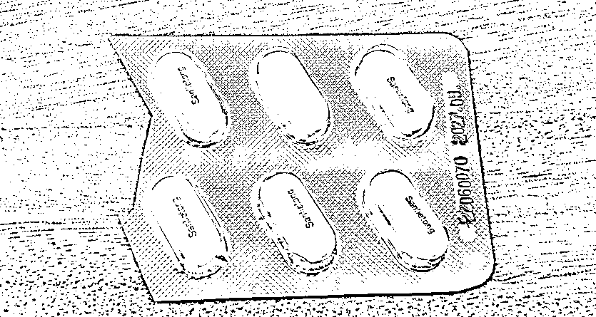

# 一板发烧药剪断，老胡这是勇敢还是作秀？

> 原文：[`mp.weixin.qq.com/s?__biz=MzU3NDc5Nzc0NQ==&mid=2247521439&idx=2&sn=eeae3ad8920b4f1e75e322e4f7b25cfd&chksm=fd2e3641ca59bf57c00b374f6ac138a84bc1779fd6b86dca44e68acc7437433335fdf9f87bc2#rd`](http://mp.weixin.qq.com/s?__biz=MzU3NDc5Nzc0NQ==&mid=2247521439&idx=2&sn=eeae3ad8920b4f1e75e322e4f7b25cfd&chksm=fd2e3641ca59bf57c00b374f6ac138a84bc1779fd6b86dca44e68acc7437433335fdf9f87bc2#rd)

[那天我夸了老胡两句](http://mp.weixin.qq.com/s?__biz=MzU0MjYwNDU2Mw==&mid=2247509118&idx=1&sn=aca77ecf564bf034f308e7e962c066e1&chksm=fb1ac802cc6d411439307b61d06a9e1b4a0fc3572d45bf2e962011870cc92d5d3192ef76e9ba&scene=21#wechat_redirect)，很快就有人来问我老胡的另一件事。 

他发了个帖子，把发烧药剪断，如下图。 

只给自己留了六颗，其余四颗送给了需要的朋友。按照他的说法，如果他感染了，就准备用这仅有的六颗药熬过去。 

除了这六颗退烧药，他什么都没有，亦不会搞特殊化，甚至都不会去医院。 

他的说法我信不信？我信。但是读者问我认不认同这个行为？我不认同。 

我上次替他说话，这次站在他的对立面，因为我对事不对人。

老胡作这个秀什么意思，大家心里明镜似的。他无非是想说，你看，他一个退休人员，也不过只有一版药。还分了四颗给需要的人。

意思是说，这觉悟没问题吧？你们这么年轻好意思抢药么？ 

另一方面，说明自己绝无特殊的就医途径，是希望安抚大家。让更多的人觉得在就医这件事上，钱权不会起作用，大家是平等的。 

意思谁都懂，但这个形式，没意义，搞不好，还有副作用。 

一个人吃不吃退烧药，就不就医，因人而异，不是靠逞能来解决问题的。 

他自己私底下到底吃几颗药，是他的私事，你摆在公众面前，搞不好，会引起错误的效仿。 

他有几千万粉丝的，这个群体太大了。搞不好有些人就会学他，他老胡都敢，我有啥不敢。 

我告诉你说，不是这样简单的。 

我这个人，18 岁以后，几乎没有吃过退烧药。这不是因为我像巨石强森一样强壮，只不过运气好而已。 

18 岁之后我第一次烧糊涂是大学里，军训的时候，高烧快 40 度，烧到半夜起来梦游，一个人在寝室里唱戏。 

没有吃退烧药，当然后来有被送去挂了类似阿莫西林之类的抗菌药。 

我读研的时候也有过高烧，烧了三天，因为参加数学竞赛，时间正好是 72 小时，高烧加高强度的脑力劳动，最后实际上是烧昏了，被送去医院的。 

我工作的时候也有烧昏过去，有一次是在英特尔总部的办公室里，和人家谈合作，我直接烧迷糊了，幸好还有另外两个同事顶了几小时。 

还有一次是在飞机上，烧到空姐都紧张了，飞机上提供了退烧药，我没有吃。 

不止我描述的这些次，前段时间还有过，感染了伤寒病菌，烧短片了，一度跌倒了有 10 分钟都没爬起来，后来我太太回家，带我去医院。医生说幸好来得及时，人都脱水了。 

我写过。 

当然，不止上面这些次。

我没有出事并非因为这么做是对的，那仅仅是运气明白么？ 

持续的高热是有风险的，很可能把你脑子烧坏了。我之所以胆子那么大，是因为小时候经常发高烧，年均四次，人的胆子是越来越大的明白么？ 

这不是什么正确的处理方式，这只是一个人胆大妄为的体现。 

你注意，妄为，不正确的做法。

老胡爱吃几颗药，甚至吃不吃退烧药，那是他的事，可是你如果一味的效仿，甚至和他 PK，看谁更狠，那就是你的错。 

我自己的孩子发烧的时候，我可从来没鼓励他硬抗，我从来都是遵医嘱，遵药嘱。 

我带队伍的时候，我手下病了被我发现也是第一时间处理，遵医嘱，遵药嘱的。

**你一个人耍二球那是你的事儿，你带着一群人耍二球，那是你的错。** 

老胡岁数这么大了，这点道理不该不懂吧？ 

懂了还做那不是作秀是什么？ 

我清楚他的出发点，我清楚。但这个问题不是用这种方法来解决的。 

我们的问题是缺药，是缺退烧药吗？是吗？ 

不是。

我们的问题是短时间内，有很多无知群众把特定的几种药当作储备物资备太多了。 

所以你投放多少药，都是不够的呀。 

**有两件事，没有做好，才导致了今天的局面。**

第一件事是防疫改变之前就该想到接下来哪些物资会发生短缺，就该做好储备。

这些储备的投放，是应该记名的，按照身份证购买的。

一个身份证号，多少时间内，能买多少相关药，是固定的。这个购买包括了本地的采购，也包括了你通过互联网电商平台从外地的采购。 

这个事情没有做。导致了某些药贩子，惜售。某些无知的群众，像过去囤大米，囤盐一样，囤了十辈子都吃不光的感冒药。 

这个事情要尽快处理，要像三年前疫情初期对于口罩的方式一样按人头限量采购。老胡该呼吁的是这个。 

是各大电商平台，药店线上线下迅速整合，统计，联网。

而不是一把年纪，退休的人了，去做这个秀。 

第二件事是知识的普及。 

首先感冒分两种，细菌型和病毒型。后者是没有药的。 

很多打着抗病毒旗号的，都是安慰你。你去找医生，医生就会告诉你，只有极少数病毒确认是什么型，而且恰好研发出相对应的药物的，才有效。 

别问我为什么知道，在发烧这个领域，我也是专业的。40 多年以来，尤其小时候，细菌型，病毒型，什么都有过。

病和症，是两回事。

病，是根源，你细菌感染引起的发烧，挂头孢是针对病的，吃两颗泰诺只是针对症。

针对症的意思就是让你好受一点，鼻子不要那么堵。

我那么多年以来为什么不吃那些针对症的药呢？因为没有意义。 

任何药都有副作用，它也许可以缓和你的症状，但是会让你昏睡。而我可能没时间昏睡，所以就拒绝了那些对症的药。 

严格意义上讲，只要你意志足够坚定，你是不需要任何对症不对病的药的。 

就比如关二爷为什么选择不用麻沸散，那是因为他清楚麻沸散不是消炎的，他既然吃得消痛，就不需要那些辅助的。

可是某些东西，例如退烧药，是必需品。 

发烧本身是好事，可以杀菌。可是烧过了，是会引起危险的。这就是退烧药的特殊性，它不仅仅是一种对症不对病的药。

除此之外，还有很多药，例如大家都抢的中成药。 

这些药各有作用的。你要看清楚说明书。 

有些细菌性感冒，中成药是起到消炎作用的，而有些病毒性感冒，中成药的作用仅仅是缓和你的症状，类似泰诺，对症不对病的。

在缓和症状上面，中成药的用法比西药复杂。你要弄清楚你是寒性的，还是热性的。 

热性的你服用某些大寒的中成药有奇效，可如果是寒性的，那会让你更难受。 

到底是寒性还是热性根本不是三句话能说清，很多职业医生给你诊断的时候都会判断失误的。 

而你自己不感冒个十次八次以上，你也弄不清自己的身体这次是寒性还是热性。 

我们有些网友，不仅瞎买药，而且瞎吃药。还没阳，自己就把自己吃进 ICU 了。 

所以我说需要科普，某些人乱囤药，乱吃药，你光囤药不囤智商有什么用？ 

老胡作为那么大的 V，我上面说的这些，才是他应该利用自己的影响力，对自己的粉丝群体进行的科普。