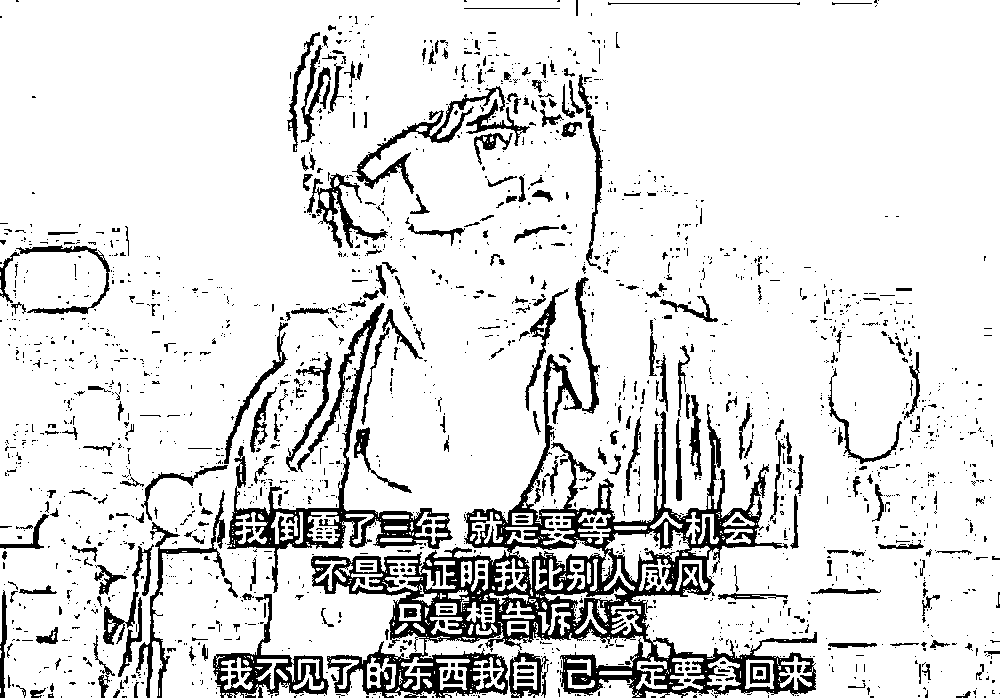

# 我个人很认同放烟花，因为这个年不好过

> 原文：[`mp.weixin.qq.com/s?__biz=MzU3NDc5Nzc0NQ==&mid=2247521416&idx=1&sn=e46f16b871b81bd6d2c2529ea56175c6&chksm=fd2e3656ca59bf4082cf0eba247dc6e171e02e9892d393fe50d2965bcb5b39e620375dae3b28#rd`](http://mp.weixin.qq.com/s?__biz=MzU3NDc5Nzc0NQ==&mid=2247521416&idx=1&sn=e46f16b871b81bd6d2c2529ea56175c6&chksm=fd2e3656ca59bf4082cf0eba247dc6e171e02e9892d393fe50d2965bcb5b39e620375dae3b28#rd)

很多人让我评论放烟花这件事，据说第一媒体站出来说话了，说地方上不许放烟花，是一种懒得作为的表现......

其实这话怎么说呢，站在地方城市的视角下，不让放烟花，完全能理解。其实严格意义上不是不让放烟花，是划定区域内不让私自放，你集中放，比如单位组织放，还是允许的。

主要还是因为往年炸伤人，或者引起火灾，得不偿失。这种事情，如果不一刀切的去管，说实话也很难管。

但是今年这个情况特殊，我个人觉得如果能够放开烟花，是好事。

[我打了好几天的鸡血，](http://mp.weixin.qq.com/s?__biz=MzU3NDc5Nzc0NQ==&mid=2247521408&idx=1&sn=c47f6bb27ce924f4788500b675fee99e&chksm=fd2e365eca59bf48c20008020efc844db4d41453bd815399074615795c2aee4d54e903fcb52c&scene=21#wechat_redirect)结论很简单，困难是暂时的，前途是光明的，为此还不惜踩了日本一脚。

但是怎么说呢，困难是暂时的，那也是存在的。很多读者欣赏我的就是这一点，虽然整体上是积极乐观的，但是具体问题上肯定是实事求是的。

我从来也不刻意回避什么。

无论明年会有多么好，接下来的两三个月，困难都是明摆着的。昨天还有读者问我，放开后对学医是不是利好？

这事儿怎么说呢，你站在短中长期分别想想就明白了。

首先看几个月，医生肯定是所有群体里最容易阳的一群人。别问我为什么，你观察下最近新增本土阳的规律就清楚了。

从原来的大部分来自于隔离，变成了绝大部分都来自于主动就医。这说明什么？

说明医院就是阳性占比最高的区域了。

你说你是骨科医生，没用的。就那么大的医院，难道不共用食堂，不共用通风系统，不共用卫生间么？

不可能所有医院都像传染病医院一样从设计之初就考虑过的，所以站在医护人员的视角下。他们注定是第一批感染的，这是站在短期看。

他们要迎接第一波感染，而且要尽快恢复尽快回到岗位。因为接诊的人本来就增加，你再请假，你的同事更扛不住。咱们不说医疗挤兑，至少第一波几个月内的医疗压力是必然有的。

这种情况下，即便 800 万在职的医护人员全是天使，全都没有任何情绪的加班加点，阳了赶紧恢复赶紧工作，但是，对于社会层面，这些人的家属，会怎么想？

大家会不会觉得这个职业很有吸引力呢？你注意，我是指更大层面的人性。

那么接下来，中期，比如一年。

我前面也说过，这东西又不是天花，感染一次终身不得。那么医护人员在后面的一年中，可能就是感染次数最高的群体。

别的群体平均一年感染一两次 ，可能你要感染三四次。

你感染三四次，你还要面对增加的压力，要尽快恢复健康尽快投入工作。我相信这 800 万人都没问题，心理素质绝对过硬，但是他们的家人是否理解她们呢？

比如你太太是个护士，你是个老师，她阳了几次，她回不回来住？是否会传染给你或者孩子？你作为老师，一旦阳了，对你的工作的影响是什么？你是否始终能够理解并支持你太太的工作？

我相信 800 万医护人员全部都是天使，全部都能克服人性的一切弱点，但是她们的家属，是否也能做到？

这会是个问题。

那么再站在长期来看，比如说几年后疫情没了。那么就诊者数目下降，站在医学从业者的视角下看，那就意味着潜在的客户变少，......

所以短中长期看，对于从业者，好像都看不出啥利好。

当然了，只要疫情不消失，对于感冒药之类的药商，对于防护类产品的供应商，都是市场需求。但是对于从业人员，恐怕未必。过去的三年，穿着白大褂的人压力最大，放开了，穿着白大褂的人的压力只会更大。

即便对你来说是剧终，对她们而言，挑战刚开始。

你注意，我只是给你切了一个很小的口子，让你看看接下来几个月内，社会层面某个职业群体的压力。

实际上这个压力方方面面，大部分群体都会有。

咱们出去抢订单，并不是因为生意整体上好做，实际上是因为不好做。

并不是说外部需求很大，采购商排队等着买，只是因为封控，他们进不来，现在只要放开了，我们一出门就是大笔金子等着捡。

不是这样的。

你去看下欧洲美国日本，就会发现外部世界其实受到疫情的影响还是蛮重的，他们的采购欲望是蛮低的。主要原因是兜里没钱。

所以我才说抢订单。

作为一个商人，你就是要想办法把梳子卖给和尚，而且是没钱的和尚。洋和尚们不过年，你自己得过年，你得发年终奖啊。

尤其这个年是很多事情叠加在一起的。

医院，你知道了，企业，过去一年连互联网大厂都裁员减薪，你很难指望那些普通行业的中小企业最后一个月能怎么弄出一笔年终奖，而且过年期间正值感染的高峰期，再配上春运回家，再配上走亲戚.......

对于最普通的人来说，很可能要面对的就是兜里也没啥钱，几年没回家了，总得回一次，回去一走亲戚，一聚餐，老人孩子凑一起，大家都发点烧，回头去医院排队，道一声新年好，又见面了.......

我知道明年肯定会很好，但是压力在这俩月里集中出现了。

这个时候我个人真的很希望允许放放烟花爆竹。这话怎么讲呢？我肯定不是迷信，烟花爆竹也不可能驱邪祟，但是能够驱除人内心深处的压力。

随着烟花那砰的一声响，把所有的烦恼都留在过去的一年。希望来年，大家抓住机会加油干，像我们打过的鸡血那样，把失去的，拿回来。

