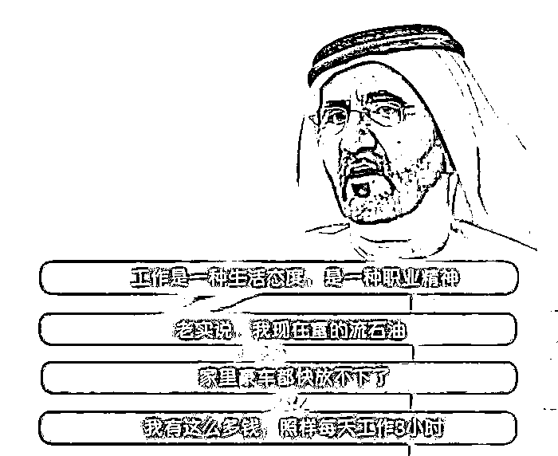

# 年轻人把成都卷成了另一个后厂村？

> 原文：[`mp.weixin.qq.com/s?__biz=MzU3NDc5Nzc0NQ==&mid=2247521253&idx=2&sn=d0c3ceeb4e274dc3ef8582f0856f013b&chksm=fd2e313bca59b82d5438a353f005f541ab889a6e4e80bfa6af394fbda22d6ecebc7273376ac1#rd`](http://mp.weixin.qq.com/s?__biz=MzU3NDc5Nzc0NQ==&mid=2247521253&idx=2&sn=d0c3ceeb4e274dc3ef8582f0856f013b&chksm=fd2e313bca59b82d5438a353f005f541ab889a6e4e80bfa6af394fbda22d6ecebc7273376ac1#rd)

这些天，某些逃离北上广的年轻读者和我讲，原本休闲的成都，也已经被这些来自北上广的人们卷成了又一个后场村。

这究竟是为什么？为什么北上广的魔咒就逃离不了？ 

咱们数年前，聊过逃离北上广这个话题。 

我当时说，这是个伪命题，就像李连杰要退出江湖归隐牛背山，任我行笑他，世上哪有牛背山？什么是江湖？有人的地方就有江湖，你怎么退出？

如果你起初看上成都的是房价低，可以有效的降低你的生活成本，因此从北上广迁居成都，这是可以的。 

你想要的东西是可以通过你的行为来满足的。 

可是如果你喜欢上成都，是因为你去旅游了两次，感受了一下宽窄巷子里的烟火气就以为自己只要搬个家就能享受同样的悠闲，那你想多了。

这种错觉在很多人身上都犯过。 

我曾经说过，之所以很多人觉得国外的生活好，很大程度上都与游客心态有关。

游客的特点是什么？有钱有闲，你是来度假的，俗称你以一个有时间可供打发的消费者心态去体验，其实哪都挺好。 

不信过年的时候你试试，你就在春节长假期间去北上广深玩七天，你的感觉同样很好。你会发现，我靠，人这么少，这么空，路上一点都不堵，还有那么多好吃好玩的。 

不是北上广深发生了改变，是你发生了改变，你在有钱有闲的状态下去体验当然比去挣钱的时候要舒服。 

这就是我常说的那句话，挣钱在哪儿都不舒服，花钱在哪儿都舒服。

你看着国外的 UP 主每天给你拍吃吃喝喝到哪儿旅游，你发现他们的生活很美好，那是因为他们是去花钱的。 

你发现很多当地人的生活很美好，那是因为人家有世世代代的积累。 

那个景区里面的很多本地人家，之所以喝茶打牌，是因为他们至少有一套无贷款的房子，有些人甚至有一栋楼。他们的生活方式是他们的经济结构影响下的，不仅仅是这个地方带来的。

这两天世界杯在卡塔尔举行，卡塔尔本地人的生活也很悠闲。所谓工作到下午两点，这就算卡塔尔本地人里的奋斗 B 了。

为什么？因为他们是全世界最有钱的国家，人家产石油。本地人均收入 90 万还不交税，医疗教育全免费，还发房子。 

现在的问题来了，你是卡塔尔人吗？你不是，那么对不起，上述这一切都与你无关。 

你真的跑去卡塔尔，也是 996，一个月赚一两万块钱。

所以不同人眼里的卡塔尔，并不是同一个卡塔尔，明白么？ 

就像我以前举过一个例子，你可以享受澳洲的福利，代价是什么？是你要先掏出几千万给他们，提供就业岗位，连续多少年你这钱都很难盈利。相当于你让渡了几千万的使用成本。 

几千万好些年都不挣钱，你就等于掏出了几千万，这是钱的时间成本。如果你都愿意花这么多钱，你还需要福利么？

或者说，你难道没有想通，羊毛出在谁身上？

很多事情说复杂很复杂，说简单很简单。如果你想要享受老成都人的那种悠闲生活，除非你的工作，生活的方方面面都融入他们的圈子。 

能融入吗？ 

人家也许是当地体制内的退休人员，你贵庚？年方 28？咋退？谁给你发退休金？

看到了，这不是你搬个家可以解决的问题。 

成都的软件公司难道和北京的软件公司接入的不是同一个互联网吗？

如果是同一个互联网，大家的节奏怎么可能不接近？ 

假如彼此的节奏差异巨大，那么节奏慢的地区的这个行业，就不可能处于整个行业的中上游。

你自己想嘛，人家在快速迭代，你在慢速迭代，人家在打 NBA，你在玩家家酒，消费者会等你吗？ 

难道消费者会因为你身处成都，就对你要求降低？

所以一群逃离北上广的年轻人把成都又卷成了下一个后厂村，这不是悲哀，这恰恰是好事，这恰恰说明成都还是有点潜力的。 

成都要是卷不成后厂村，那么这个城市的软件，电子信息，互联网相关行业是起不来的，你根本就无法和北上广深具备同频的竞争力。 

那到底怎么才能逃离北上广深，真正去过田园牧歌的生活呢？ 

很简单，你的年龄要适合，你的目标要适合，你的经济条件要适合，你的工作生活方式要适合。

你最好不要有住房，医疗，以及子女教育的经济压力，你最好不要太年轻，有太多野心勃勃的目标，你最好有一份压力很低，但是收入在当地相对较高的稳定工作。 

这些是你想要去过那些慢生活的前提。 

令狐冲真的跑去牛背山也会发现牛背山是当地村民的牛背山，别说山，哪怕山上的每一处水源，都是有主的。都是人家爸爸的爸爸起就占据了的。

说不定令狐冲去了之后，发现给当地村民背砖，辛辛苦苦 996，攒下的钱都要花在村民身上，交溢价后的房租，交溢价后的水电。回头一整年，发现牛背山挣钱牛背山花，一分钱也别想带回家。 

干了一年，悟了，还是回华山派或者黑木崖，或者卡塔尔，给人当女婿去吧。