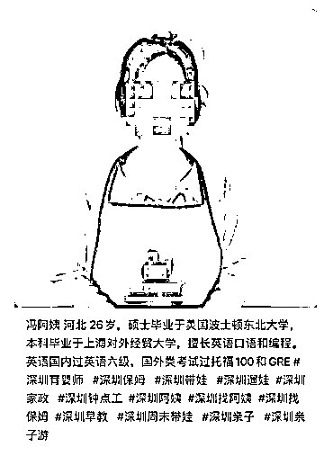
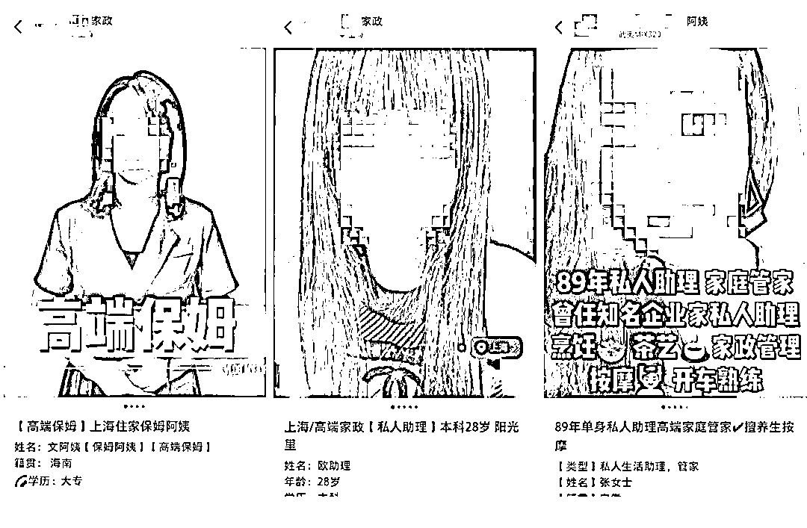

# 这些“美女保姆”们，是活明白了还是没明白？

> 原文：[`mp.weixin.qq.com/s?__biz=MzU3NDc5Nzc0NQ==&mid=2247520774&idx=2&sn=b4d42905b4ad132d2a749ddd91206b8f&chksm=fd2e30d8ca59b9ce13c83039b36dc2b7e981ccd4a9fc96936e21abfaa52536219e35706cb569#rd`](http://mp.weixin.qq.com/s?__biz=MzU3NDc5Nzc0NQ==&mid=2247520774&idx=2&sn=b4d42905b4ad132d2a749ddd91206b8f&chksm=fd2e30d8ca59b9ce13c83039b36dc2b7e981ccd4a9fc96936e21abfaa52536219e35706cb569#rd)

网上流传一些年轻高端美女保姆的求职简历，比如下面这张。

冯阿姨，才 26 岁。

再比如这些：

还有很多，就不引用了。

你就比如第一个，冯阿姨，有人表示要聘请，对方反问雇主，身高，年龄，学历，以及，是否有 5000 万的流动资金。 

于是网络上炸了，表示这年头太卷了，作为雇主也太卷了。 

你应聘保姆的，你对薪水有要求，工作环境有要求都不稀奇，你管人家雇主身高，年龄做什么？ 

为什么对方要 5000 万的流动资金？怕发不起工资赖账也不需要这么多流动资金做抵押吧？ 

有人说，这就不是冲着工作去的，这是冲着老板去的。 

销售常说一句话，要么搞定事儿，要么搞定人，如果我们不能在关键位置有核心产品，我们就要在关键岗位，有自己的人。 

没有人可以造一个人嘛...... 

我可什么都没说。 

有人讲，这是因为如今的 95 后，都活明白了。就像张朝阳说的，有些东西通过努力也是得不到的，生来有就有，没有就拉倒了。

没必要过度努力，以免徒增伤悲。 

大佬都这么说，可想而知，冲击着年轻人的心灵。 

所以 95 后很幸运，能够通过互联网提前知道很多结果，提早活明白，是这样吗？ 

我觉得不是。 

如果你穿越到王阳明小时候，把心学拿给他看，他能提前活明白吗？能吗？ 

我告诉你，大概率他这辈子是悟不了道了。 

龙场悟道，龙场悟道，不是龙场这个地方有什么稀奇，是他前半生走过的路，酝酿到了这时候，有所领悟。 

没有求学，没有碰壁，没有科场得意，没有官场失意，没有被追杀，没有求僧问道，没有各种九死一生，他就不会是后来的王阳明。 

经历在塑造人，不是结论在塑造人。

我从来没有见过一个人是靠看电视转播奥运比赛成为冠军的，从来没有。 

没有无数的训练，选拔，打比赛，他是不会走到最后一步的。

一万个人里面可能最后只有一个人能够站到领奖台上，如果你按照结论来说，失败率始终是 99.99%。 

问题是，做了，做过，才会诞生那一个。

今天的 95 后，相比于 85 前，不是太幸运了，而是太不幸了。 

你确实有了更多的信息，问题是，信息代替不了经历。 

你看一万遍奥运冠军赛事，只要不下水，你就不可能学会游泳。 

当你把所有时间都耗费在看比赛上，你游泳的时间，注定变少。 

你知道了很多，可是此知道非彼知道，知道不一定管用，做不到，你的知行就没法合一。

我一直觉得 85 前真正的幸运在于给你机会，让你试错。 

你想创业，融资很容易，拿张 PPT 就能忽悠投资人，其实最后大部分也没挣下钱，easy come，easy go，忽悠来的投资最后都烧光了。 

问题是，烧的过程是一种经历。

你亲自烧钱，和别人给你讲烧钱的体会，是两码事。 

哪个名医手底下没有几条人命？哪个成功的创业者没有干死过几家企业？

你不想要这些过程，你只想要那个结果 ，对不起，你得不到的。 

钓凯子这种事儿，说到底是降维打击，明白吗？ 

不是阶层越迁，是降维打击。你指望维度低反钓维度高？不可能的。 

一个社会，想要通过钓凯子来改变自己的命运，只有两个时间点。 

第一个时间点是富人阶层初步形成的时候，你比如 90 年代。 

他是有钱，问题是，他的钱真的是纯粹凭运气挣来的，也许就是个煤老板，也许就是个烧砖的，他仅仅是赶上了风口，此前一无所知，对此后也一无所知。 

他没有文化，他不知道财富怎么运作，他就是个土包子，刚进城，兜里有俩钱而已。

这时候如果你是个受过教育的，年轻貌美的，你想要钓凯子，是有成功率的。

你可能用一些他没有经历过的东西就能吸引对方，比如品品红酒，比如听听歌剧。 

他会很惊奇，他会愿意为这份惊奇提供一个非常高的溢价。说到底，是因为他没有眼光，没见过世面。

第二个时间点，是富三代以后。别说他不知道钱是怎么赚的，他爹也只是听爷爷说过钱是怎么赚的。

听说的，没有实操过。这叫做绣花枕头，理论很丰富，实操靠不住。 

如果你特别有心眼，特别有脑子，所谓心机 boy，心机 girl，或许你能够靠某些不道德的方式上位，在通过你的能力降维打击，把人家吃干抹净。

介于这两者之间，没有成功率的。 

因为这个时期的富人，你都不想想他们是怎么诞生的？

首先组成上就几乎清一色的富一代，财富聚敛的过程还需要我讲么？ 

对方骨子里是个什么样的人，你猜也猜得到呀。 

而且他们是那些凭运气挣到的钱，又没有凭实力输回去的，所谓剩下的那帮人。 

这不就是蛊吗？ 

一群毒蛇，蝎子，蜈蚣，关在一个盒子里，最后看谁走出来，而且是反复几轮后，凭运气走出来的都被干掉了，剩下的，你去玩它？ 

你玩得过一只蛊？ 

打牌有一个原则，叫做永远去看得懂的那张桌子上玩，永远和比自己弱的人打。 

巴菲特不就这么说的么？所谓永远做自己懂的投资，就是永远不和比自己更懂的人坐一张牌桌。

一张桌子上坐满了周润发，刘德华，周星驰，赌神，赌侠，赌圣，三缺一，就差你了，你上不上？ 

你自己判断你上不上嘛。