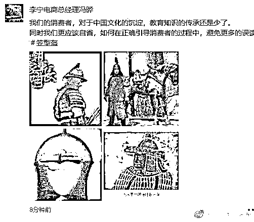
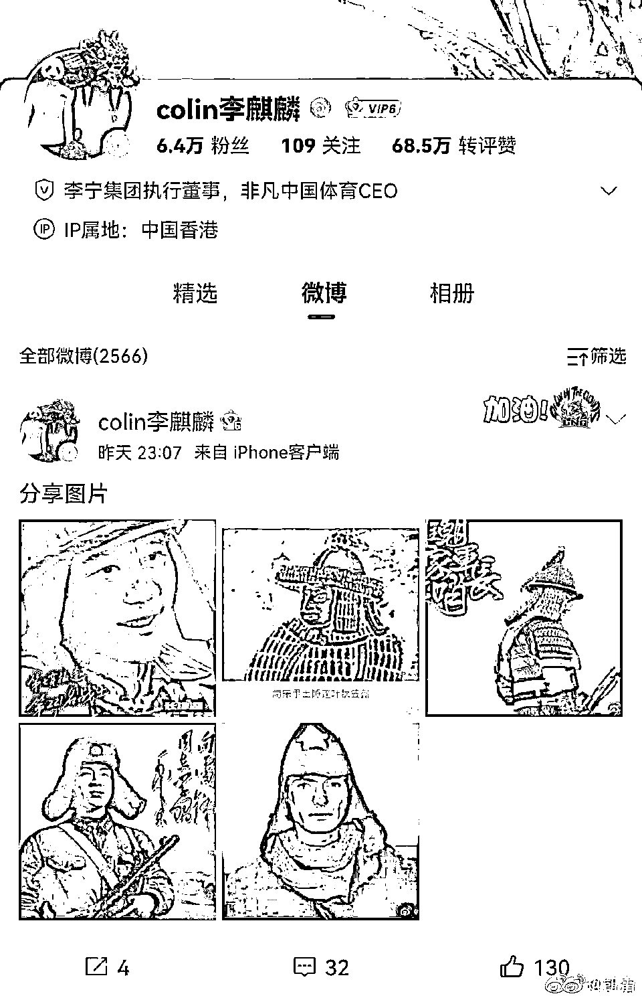

# 我来告诉你李宁错哪儿了

> 原文：[`mp.weixin.qq.com/s?__biz=MzU3NDc5Nzc0NQ==&mid=2247520735&idx=2&sn=d4370f6c6806928529751aa343bf0d26&chksm=fd2e3301ca59ba172e0b69db5179683d5d879d9c150c0854d7419040a121b9be9683f8a38d04#rd`](http://mp.weixin.qq.com/s?__biz=MzU3NDc5Nzc0NQ==&mid=2247520735&idx=2&sn=d4370f6c6806928529751aa343bf0d26&chksm=fd2e3301ca59ba172e0b69db5179683d5d879d9c150c0854d7419040a121b9be9683f8a38d04#rd)

李宁摊上事儿了，就因为这张图。 

这是李宁设计的衣服，被网友们认定参考了二战时日军的军服。 

那么李宁不服气，高管们纷纷出来怼网友，例如这样。 

或者这样： 

简单地说，他们认为绿色+大护耳并不是二战日军军服的注册商标。网友们强行把二者联系在一起，对李宁不公平。

读者问我这事儿怎么看？ 

答案很简单，李宁错了。

为什么李宁错了？ 

**因为李宁根本没有弄清楚消费者购买你的原因都包含哪些部分。** 

我相信消费者购买李宁，有产品质量好，性价比高诸多因素，但是不可否认的是，这里面一定有品牌因素。 

什么叫品牌因素？就是情感因素。 

有人非要说，他就是只喝可口可乐，从来不喝百事可乐。 

其实你把百事可乐灌入可口可乐的瓶子里，他肯定喝不出来，别听他们瞎掰自己是什么什么的骨灰粉。

既然喝不出来他还强调自己只喝可口可乐，这叫什么？这就叫情感因素。

人家就是来给你送钱花的。 

如果消费者真的只认性价比，那就没有品牌的概念了。 

很多国际大牌的球鞋，莆田设计，莆田制造，莆田采购原料，无非不贴莆田的 LOGO 罢了。 

如果从设计到制造，从原料到成品都来自莆田的生产线，那么消费者究竟为什么要为了一个 LOGO 多付出很多钱呢？ 

为了情感呀。 

那个要喝可口的人，他就是只认可口呀。哪怕从饮料到罐子甚至罐子上的字都来自百事，他也要喝可口。 

那俩字印可口他就喝，印百事他就不喝。这就叫情感。 

李宁敢说自己的客户不冲李宁二字吗？ 

不可能的，任何名牌商品，任何构成品牌的商品，都有消费者的情感注入。

说穿了，你挣的就是这份感情钱。 

你不要以为你是在挣设计的钱，制造的钱，未必，很多时候，你挣的就是一份提供情绪价值的钱。 

**你明明是卖情绪价值的，怼自己的客户，有劲么？** 

我想起曾经的一个经历，很有意思。我家附近有个足浴店，开了十年了，我洗了七八年了。 

次数多了就有熟悉的技师，点钟后预约了时间才过去。 

有一次预约好了之后，去店里，新来的经理跟我说，不好意思，没有登记上，排给另一个预约的客人了。 

我让他们调出记录，记录显示是我先预约的。经理跟我说不好意思，这次只能算了，要么给你换个人。

几天后，这样的事故又重复了一次。还是我先预约的，但是排给了别人，我说这次不能算了。 

这个新来的经理就给我讲了一大通他们的点钟软件的 BUG，总而言之，言而总之，系统排好的，只能这样了。 

也就是说，以系统为准，即便系统有 BUG，一切解释权在店方，不在客户。

我笑笑，也没说什么，这个经理新来的，我和他也不熟。 

过了几天，他们老板从分店回来，在店里遇上我，和我打招呼，我是多年的老客户了，就把两次预约失败的系统问题告诉他。

他当时也没说啥，笑笑。 

一星期后，我发现他们店那个新经理，被开了。问技师怎么回事，技师说老板开掉的。

我打给他们老板，说，我那天好像也没说人家的坏话，也没告状，你怎么就把人给开了。 

他们老板跟我说，并不是因为我身上发生的这件事，而是因为通过这件事，他发现那个人，并不适合做他们这一行。 

说到底，足浴行业并不是医疗机构，你卖的并不是刚需品。 

虽然他们是非常正规的一家店，没有任何擦边球，完全是绿色健康的保健行业，但是，这终归不是医院。 

人生病了要去医院，那是没办法。人不舒服，可以用按摩椅，按摩器，不一定非得人工按。他们卖的并不是刚需品。 

更重要的是，他们并非价格最低的选择呀。

价格最低的实际上就是按摩器，按摩椅，你买一台能用很多很多次，平均一次可能只有几块钱，甚至几毛钱。 

**既不是刚需也不是价格最低的选择，那你和客户顶什么牛呢？**

我作为客户，我的视角还是对不对的问题，我觉得我先预约的，我排队排在前面，就该是我。 

而他作为老板，他早就意识到自己店存在的价值是什么，根本就不是对不对的问题。 

而是客户满不满意的问题。

别说我对了，哪怕我是错的，那个经理的第一反应也不是来我争辩什么软件系统 BUG，更不是想办法说服我妥协。 

他这个思路就说明他根本不适合这个行业。他根本就没有理解他们的产品包含了什么。

他们的产品里面本来就包含着大量的服务意识，你要有维系客户的意识，要照顾客户的情绪，而不是死板的去给客户讲什么大道理。 

他遇到我这样的，从开店就在的老客户，这么通情达理的人，都过不去，那如果遇到不讲理的呢？岂不是都被他得罪光了？ 

老板只是见微知著，所以把这人开了，觉得他就不适合干这份伺候人的差事。

他们店附近就是一家精品超市，比楼上的普通超市里的东西贵很多，贵 5 成以上。 

同样的品牌，同样的包装，同样的分量，都要贵五成以上。依然有客户，为什么？

卖服务的。 

这家精品超市你一进去，走到任何一处，都有服务员给你鞠躬，你示意任何东西都有人给你拿，水果都给你切好，包装好，海鲜都给你处理好，你选好东西，后续的服务很完善。 

之所以他们店能够存在下去就靠这个，人家不愿意上楼便宜 50%，就是买你们家的服务意识来的。

如果把这玩意儿丢了，怎么活？那你只能拼价格了呀，人家楼上的大型超市成天打折，打骨折。你愿意吗？ 

李宁到最后都没有理解，自己赚取的利润里面，有非常大一部分是来自于情感认同。 

你是做衣服鞋子的，又没有啥技术含量，你是品牌货，又不是小商品市场里的贴牌货。 

那你和客人拌什么嘴呢？

客人说什么就是什么，哪怕你觉得客人误解了你，那也是你的错。你为什么让客人误解呢？你怎么伺候的客人？ 

一个足浴店老板都能想通的问题，李宁是该好好想想了。