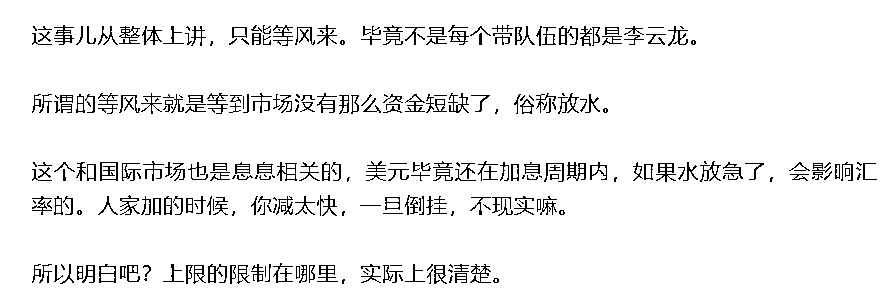

# 风还会不会来？试看美国的通胀数据

> 原文：[`mp.weixin.qq.com/s?__biz=MzU3NDc5Nzc0NQ==&mid=2247520213&idx=1&sn=823c2a2f0dde32377d8dcbe529d6df24&chksm=fd2e2d0bca59a41dc1a4c421323363d4f8832b296feb49fccde3efd4911989976964548d73dd#rd`](http://mp.weixin.qq.com/s?__biz=MzU3NDc5Nzc0NQ==&mid=2247520213&idx=1&sn=823c2a2f0dde32377d8dcbe529d6df24&chksm=fd2e2d0bca59a41dc1a4c421323363d4f8832b296feb49fccde3efd4911989976964548d73dd#rd)

临时插播一期，本来是要推送别的。放放，回答读者的问题先。

读者的问题很简单，就是标题的前半句。 

[我们大号记忆承载 9 月 3 号聊 5 斤芹菜的时候](https://mp.weixin.qq.com/s?__biz=MzU0MjYwNDU2Mw==&mid=2247507476&idx=1&sn=dfa2f38943cdb66f419094944fbce31f&chksm=fb1ab268cc6d3b7ea5f020eff31ad82d91f71a5e7dec26965091a331d956ce16b89cb0d47e35&token=209458571&lang=zh_CN&scene=21#wechat_redirect)，其实把这个话题说得很清楚，只是我发现，很多人他是没有解读能力的。

你跟他讲 1+1=2，2+1=3，那么有推理能力的人，自然就不会来问 2+2=几。

遗憾的是，这样的人并不多。 

那天聊芹菜的时候，我说了这样一段话。 

我们来看美国的通胀数据，美国 8 月 CPI 同比上涨 8.3%，环比上涨 0.1%。这个咱们说了大半年了，从 1 月份说到 9 月份，从美联储并不认为通胀会持续的时候一直说到连美联储也不相信通胀能解决的时候。

并非我们未卜先知，也非我们乌鸦嘴。有时候，人家不是不知道，人家只是不能那么讲。

你看美联储现任的和离任的，往往讲话就不同。离任的与无关的，讲话又不同。 

再正常不过了，并非谁无能，只不过每个人能够表现出来的能力，是个定数。 

你看西游记前五集，猴子拉风得不得了，感觉都没对手似的。到了后期，好像谁都打不过。 

这里面有些场面是猴子在摸鱼，而有些场面，是猴子真的打不过。那猴子为什么真的打不过？当初怎么回事？ 

很显然，当初那群围剿猴子的，也在摸鱼......

我不是调侃美联储，其实职场一直是这样。公司里也是这样，有时候那些年轻的员工，很急，他觉得明明可以，但是。 

你想不通就去看西游记，猴子打怪升级的过程就是一个初入职场的年轻人，历练的心路历程。 

而美联储这帮人，都是西天称佛级别的，老江湖了。人家到底为什么，各有各的小九九。 

甭管怎么说，通胀数据居高不下，没有向下的迹象，这意味着接下来 75 个点的加息是跑不了的。 

我那天跟你讲的就是这点事儿，我告诉你全球是连通的，至少渠道是连通的。 

有一家放水的时候，为什么很多家会跟放？因为你不放，人家的水就淹过来了。

同样，别人抽水的时候，你很难放，你一放，兑换的比例就不容易守了。

所以美联储经常干这种事儿，洗劫欧洲和日本。因为那俩就是他们的小弟。 

每当美联储放水的时候，低价美元就会涌入欧洲日本，抬高资产价格，等于用一张纸，换取当地的实物。 

等到美联储抽水的时候，资金就会回流美元，因为利息高嘛，于是就是你看到的，日元汇率贬值，欧元汇率贬值。都奔着利息高的地方去了。

我们如果想要破除这种影响，从根本上讲，除非去美元化。但这是一个过程，你比如我们与俄罗斯之间开启能源贸易用卢布和人民币结算，就是去美元化的一种形式。 

但这是一个过程，过程的意思是说，它不可能是一天就完成的。罗马也不是一天就建成的。 

那么在这个过程中，你势必还是要受到美元潮汐影响的。只是远比欧洲，日本要小得多而已。 

那么如果美国在抽水，你放水的空间有多大？很小很小。 

所以关注市场变化的读者，你关注美国的货币政策，其实就能连带的猜测出，我们的空间。 

当然，反过来讲，过度的紧张也是没有必要的。 

我们同样聊了大半年了，就是美元最后怎么收场？ 

这个问题我们分析过很多次，美元加息并不是因为市场太繁荣，实际上是虚火高涨的通胀严重，大概率明后年美国会步入衰退，到时候他们又得放水了。

那么到那个时候，我们的可操作范围就大很多了。换句话说，如果我们要释放流动性，也就有了空间。

当然，这是短期来看，一两年其实就是短期。 

那么从长期的视角来看，[咱们 5 月份就聊过，聊过黄奇帆的讲话。](https://mp.weixin.qq.com/s?__biz=MzU3NDc5Nzc0NQ==&mid=2247516711&idx=1&sn=632089c358e71c2d3f6b7f92aead8c2d&chksm=fd2e20f9ca59a9ef86db5e236e29520e208aaadb3cb9ffb4cca58cbbd7fb2e07800d0fdacc3b&token=699596968&lang=zh_CN&scene=21#wechat_redirect)

其实你隔几个月再去回顾，发现很多事儿是应验了的。

所以有时候你说信息不对称，人家没有很早的就告诉你，也不对。其实很早就告诉你了。 

只是，你自己到底能不能在当时，就解读出来。

人与人之间，不对称的，不只有信息啊。