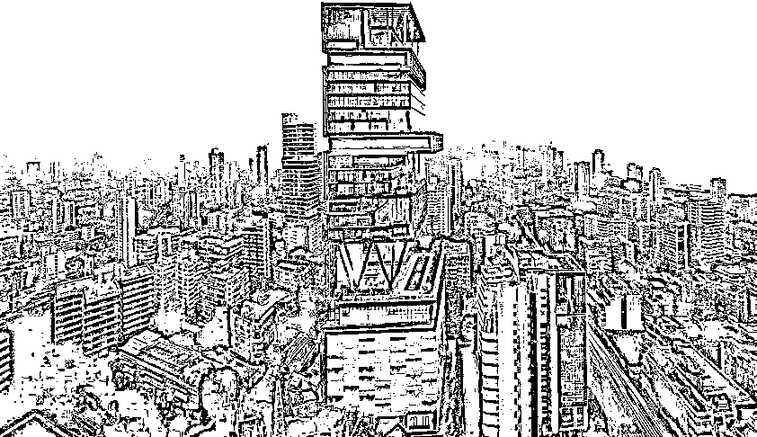
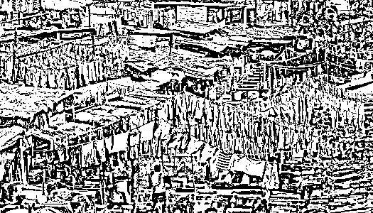
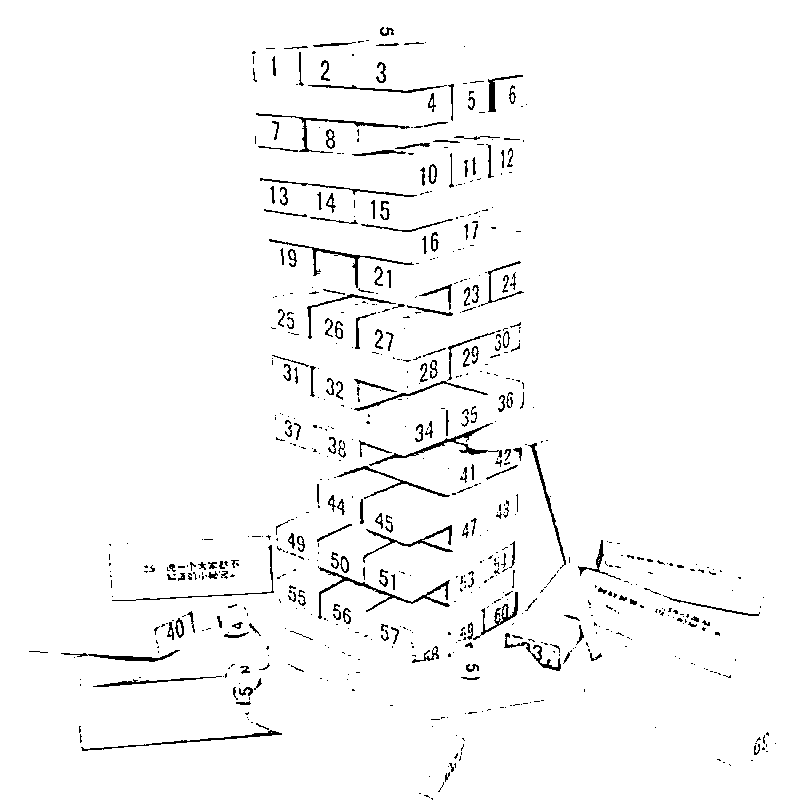

# 人口的负增长快来了

> 原文：[`mp.weixin.qq.com/s?__biz=MzU3NDc5Nzc0NQ==&mid=2247519579&idx=1&sn=cd212b388bc9d54e508c52d038155c02&chksm=fd2e2f85ca59a693a69e9abe8f7899bcc71bebb6b36f8916e77899c2cf7acfc917a3cc8dc853#rd`](http://mp.weixin.qq.com/s?__biz=MzU3NDc5Nzc0NQ==&mid=2247519579&idx=1&sn=cd212b388bc9d54e508c52d038155c02&chksm=fd2e2f85ca59a693a69e9abe8f7899bcc71bebb6b36f8916e77899c2cf7acfc917a3cc8dc853#rd)

有人问我 ，怎么看两条消息，被某个老女人在哪儿过夜淹没掉的两条有关人口的重要消息。

一条是已公布的数据，去年一胎出生数目跌破 500 万。

另一条是预计，很快我们的人口就将进入负增长阶段。

问我怎么看之前，咱们要先看看大家怎么看，虽然大多数人都被某个岛吸引了目光，但还是有相当一部分网友在人口问题上表达着自己的看法。 

这些看法不重要，重要的是我从中看到很多人的思维方式，这个很有意思。

我觉得我们在思考一件事，或者说观察一个现象之前，你最好先学会反过来想想。 

比如网络上有人跟你说，人口问题这了那了，你反过来想一想。 

就比如印度。印度的出生率是我国的三倍，但是我问你，这么高的出生率差距对比下，你怎么看印度与中国的未来。 

就比如现在股票市场上有两支股票，给你一笔钱，必须全仓买其中一个，印度，或者中国。你选哪个？

我再给你换个例子。 

你比如流行的佛系，网络上很多人说，只要年轻人都躺平，资本家就怕了。你可以认为这是一种非暴力不合作的态度。

那我们也同样反过来想想，相比较而言，谁更佛系？当然是印度。 

我们那种不叫佛系，顶多叫伪佛系。

佛系人家是真的不在乎，印度别说贫富差距大到难以置信，人家连种姓制度都能维持到今天。 

我们那种你心里不平衡的装作不在乎，不是真的不在乎。印度人才是真的不在乎。因为人家心里很平衡。 

比印度人更不在乎的是非洲人，人家真的能够做到一份工作就做一星期，拿到这个星期的工资，明天就不来了。 

反正有饭吃呀，什么时候来上班？那要看兜里的钱花光了再说。什么时候没饭吃了，什么时候才来上班。

巧者劳而智者忧，无能者无所求，饱食而遨游，泛若不系之舟。非洲人真的做到了。

那我现在请你想一个问题，你觉得，或者通过你的观察，印度与非洲有没有把资本家赶跑？有，还是没有消除贫富差距？

当然没有。 

印度首富用 70 亿盖房子，27 层，只住了一家六口。160 辆车，600 个仆人。

房子是这样的：

但是他们家楼下是什么样的呢？或者说他们家邻居什么样？

是这样子的：

非常有趣，就这么奇妙的共存着。 

所以你现在跟我讲，足够佛系，资本家就怕了，资本家就急了，资本家就没辙了，你自己信吗？ 

我们再换一个例子，有人讲，今年大学生毕业的上千万，工作很难找，都怪什么？都怪扩招。 

好，咱们继续参考印度，今天辛苦下阿三，出场三次。 

网络上经常讲印度只有一亿人口，那么剩下的十三亿去哪儿了？很简单，那些人并没有走入现代文明。

所以这个段子是在调侃印度只有一亿进入现代文明的是人口，剩下的都是那什么口。

这是不是你想要的？你不是说你不喜欢扩招么？那你喜欢印度么？

三个例子举完，有些人会问我，怎么听着这么不对劲呢？ 

你发现不对劲了是吧？你觉得我好像有点在抬杠。 

你只是反对某件事，并不表明，你想去印度，我没有道理非要拿印度来挤兑你。

我无意挤兑你，我只是想要引入下面这个思考的模型，叠叠乐。 

这个游戏有些人玩过有些人没有。 

简单地说就是搭一堆的积木，然后逐步抽掉其中一块，尽量让它不要倒。 

思考的本质就是这回事，你要学会跳出眼前那个积木，看到它后面的全貌。 

我经常说，一篇文章里，我只能给你一块积木，顶多三块，为什么有的人拿走了之后喜不自胜？ 

因为他脑子里本来就有 9997 块，加上我的 3 块，他凑够了一个模型。而有些人，脑子里是空的，拿走 3 块也做不了什么。

不是我有没有用，是你我之间的配合，能不能产生作用。

你听八万，我打八万，你才能胡。你不听这个，我打八万是没用的，至少这一局没有用。

我发现很多人的目光都只能聚焦在一块积木上。比如上面那张图，我们把第 38 块积木抽出来。 

有的人眼里只有第 38 块积木，有的人会想，把第 38 块积木抽掉，塔会不会倒，而有的人，则会想，抽掉的过程中，会产生哪些影响。 

上面的三个问题，出生率问题，佛系问题，大学扩招问题，都像第 38 块积木一样。属于特别复杂的问题。

你想提升出生率，特别简单，只要像非洲那么穷，像印度那么穷，只要逆城市化，男耕女织，白天去地里劳动，晚上连个灯都没有只剩下一种游戏，那么出生率很快就会反弹。 

问题是，这是不是你想要的。 

就像大学不扩招，大学生肯定会更好找工作，但是，你，也许就考不上了。

这是不是你想要的？

你想要的到底是把第 38 块积木拿掉，还是在维持积木塔平衡的前提下，把第 38 块积木拿掉。 

你注意，这是两个问题，两个截然不同的问题。 

我不想对人口问题指手画脚，我不是砖家。我今天只想借这个话题，指出我看到的很多人思维上的问题。 

我觉得后者才重要，对我们大家很重要。 

前者和你我关系真没那么大，无论是你，还是我，都不可能靠人口问题混饭吃。

但是纠正自己的思维误区，改变自己的思维模式，会让自己从一众同行者当中脱颖而出。