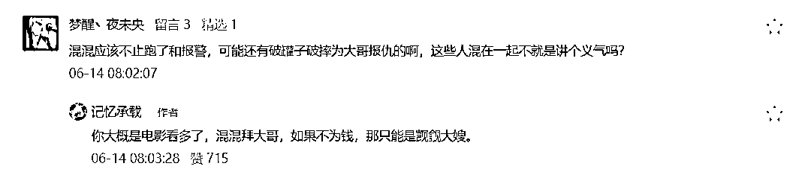
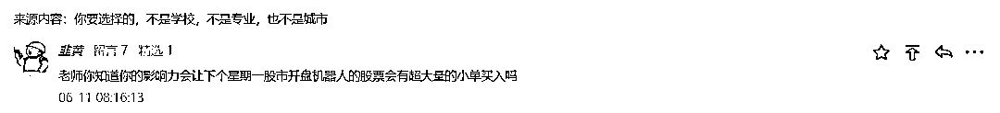
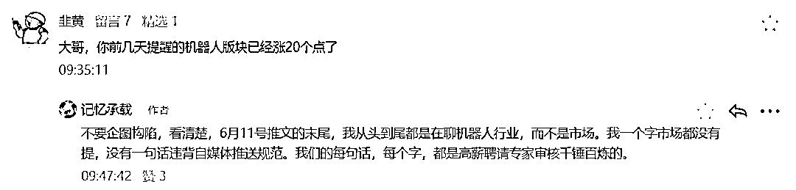

# 谁都不是巫师，没有哪个大国是被人说两句就说没了的

> 原文：[`mp.weixin.qq.com/s?__biz=MzU3NDc5Nzc0NQ==&mid=2247518524&idx=2&sn=64ac0c456e12d6fd1fa894ceeb9f5a87&chksm=fd2e2be2ca59a2f41ac894e64ed137196261f091fc8dc0bef5722d5b6be08b6a38918bc79bbb#rd`](http://mp.weixin.qq.com/s?__biz=MzU3NDc5Nzc0NQ==&mid=2247518524&idx=2&sn=64ac0c456e12d6fd1fa894ceeb9f5a87&chksm=fd2e2be2ca59a2f41ac894e64ed137196261f091fc8dc0bef5722d5b6be08b6a38918bc79bbb#rd)

我发现很多人，是根本看不懂我在说什么的。 

你比如大号记忆承载推送的，[有大麻烦的恐怕不是日本](http://mp.weixin.qq.com/s?__biz=MzU0MjYwNDU2Mw==&mid=2247506608&idx=2&sn=5c3ff3be4026a89b4677d4a91ccd7268&chksm=fb1ab6cccc6d3fda2f001af8846eb17745c0ac0881b78bc8b95e34c5b9b9b2956ecdd088edff&scene=21#wechat_redirect)。 

前半篇写日本，后半篇写美国，所以我的结论是有大麻烦的是美国？ 

这是你的理解？

于是就有一群人，在后台唧唧歪歪，酸溜溜地问我，我是不是在诅咒美国？ 

我这么有种写美国的问题，为什么不写印度的问题？为什么不写越南的问题？为什么不写澳大利亚的问题？

这种读者，大概脑子里有根棍子，俗称脑梗，梗住了。 

我特么的都不理解你的大脑构造咋那么神奇呢？ 

为什么一看到我写美国的麻烦，就认为我是在诅咒美国？ 

美国是我家开的？还是你家开的？

是跟我有亲，还是跟你有仇？你以为我是樱木花道，每天趴在流川枫的背后暗戳戳的说，变只苍蝇诅咒你，变只苍蝇诅咒你？ 

提这种问题，你到底幼儿园毕业了吗？

我们有些人的理解力，还不如小孩。

我曾经讲过，80 年代，院子里有个孩子被他爸揍了，沉默了一会儿跟大家说了一句话：今天我们做自己不想做的事，是为了明天能够做自己想做的事。

他说的不想做的事情就是去上学嘛，他不想上学。 

他想做的是什么我不清楚，那么个小屁孩，但我很清楚，至少这人脑子没问题。 

不像我们的互联网，有些人，想法真的很神奇。 

**我不关心美国，正如我不关心日本，我关心的仅仅是机会。** 

就像西门庆探病花子虚，他关心的是花子虚吗？他关心的是花子虚的老婆李瓶儿！ 

understand？

西门庆想要知道，花子虚到底能不能让自己趁虚而入，这是他操心的话题。 

我觉得日本没到那份上，不是我爱他，只是我觉得日本的老婆和我暂时无缘；我觉得美国到那份上了，不是我跟他有仇，而是我觉得美国的老婆和我似乎有可能发生一点故事。 

成年人不就是这点事儿吗？否则呢？然后呢？还能呢？ 

so tama what？ 

到底是你没长大，还是我没长大？ 

此前大号记忆承载的文案，[打架，要懂法，要懂人体，要懂人性](http://mp.weixin.qq.com/s?__biz=MzU0MjYwNDU2Mw==&mid=2247506184&idx=2&sn=6049b969e2cd0a770203bf3712f6bdb1&chksm=fb1ab574cc6d3c62f1b56a128606d92844cd0f332b6ff49a6a3bdf52979964fa5979d82423d7&scene=21#wechat_redirect)。 

排在第一的留言回复是什么？

讲义气还做什么混混？这么讲义气好去做模范了呀，有必要混吗？有必要吗？

混混为什么要拜关二哥？因为不讲义气呀。 

正因为不讲义气，所以才要拜关二哥，才要赌咒发誓插香头，understand？

混混不为钱，肯定为大嫂，难不成还爱你老，爱你不洗澡？ 

具备正常人的思维，才是沟通的基础。

劝人正常点，肯定又有人不干了，继续抬杠，问我，西风，你怎么不聊国内的问题？

你哪只眼睛看到我没有聊过国内的问题了？

哪只？哪只看到的，就去医院把哪只换掉，因为那只已经瞎了。

你统共看过我一篇文章，得出结论，我从来没有聊过国内的问题，那你好去医院把脑子换掉了。

因为也坏掉了，这种脑子要它干嘛？宕机了明白吗？

我怀疑你出门走路连先迈左腿还是先迈右腿，都拎不清。你应该去买个轮椅，双脚离地了，智商就能重新占领高地了。

没有人能够在一篇文章里把全世界所有的问题都写完。别说臣妾做不到，大英百科全书也做不到。

我写国内问题的次数少，原因很简单，我特么是做国际市场的好不好。 

西门庆为什么光惦记花子虚的老婆，他怎么不去惦记灭绝师太？ 

他惦记得着么？回答我，他惦记得着么？你以为他是光明右使范遥啊？

我写国内问题的次数少，还有一个原因，就是因为要求是不同的。 

国内不是不允许你聊问题，只是不允许你造谣，明白吗？ 

这是规范。

就像你下棋，总得先问问，马能不能走田，象能不能走日，否则你下什么？你下个寂寞？

这个规范，不同国家是不一样的。就像象棋和国际象棋，走法不一样啊。 

你比如美国，他们是允许你在金融话题上胡说八道的。

你注意，我说得很清楚，就是胡说八道，包括造谣。

国际市场就是这样的，你完全可以放假消息，甚至可以引导市场情绪。当然，美国证监会会去查这种虚假报道。

但是，你注意，他们的规定相当绕。这个绕，主要体现在他们查的是资金流向，而不是人。 

你比如在国际市场上，某个网站，A，搞假消息，回头忽悠人家接盘，得利者是 B，他事先埋伏进去了。实际上，A 和 B 都是马仔，C 才是老板。 

在美国市场上，美国证监会主要调查的是 B，A 也会查，但目的是为了证明，B 和 A 之间是否事先认识，或者有通气。

说白了，他们是围绕 B 来调查，这件事是否非法获利，而不是针对 A 本身。

这就是为什么外网常常谣言满天飞，甚至连地球到底是圆的，还是平的，都能引起争论。 

这是他们的规定引起的，说白了，人家就没有规定说，不可以那么做。 

但是反过来，我们不仅会调查 B，C，也会查 A 的。

这就是我说过的，我们不是允不允许你聊问题，而是允不允许你在没有证据的时候，就瞎猜。 

我给你举个例子，大号记忆承载 6 月 11 号的推文，[你要选择的，不是学校，不是专业，也不是城市](http://mp.weixin.qq.com/s?__biz=MzU0MjYwNDU2Mw==&mid=2247506125&idx=1&sn=c3716c513c8e752649b8fa11e99b450a&chksm=fb1ab4b1cc6d3da70522dc054783c33a48f868fc0fd40a3fa28b968e29edf62a83cfd7c28fb1&scene=21#wechat_redirect)。 

文末我大力推荐机器人，你注意，我针对的是学生，推荐的是专业。

当天就有读者留言： 

你注意右边，右边有颗星星，它没有亮起来，就说明没有被加精，大家是看不到这句留言的，只有后台能。 

首先，这句留言是胡说八道。

为什么？因为我们的阅读量才那么一点，别说左右一个板块，哪怕是左右稍微中等一点的股票，都绝无可能。 

可我当天还是没有给他放出来？为什么？ 

因为遵守规定。

规定是什么？是不可以造谣。 

我有没有证据证明机器人板块要涨？有没有？没有。 

或者，我有没有资质，比如说我是某银行，是不是？不是。

所以我就要闭嘴，我不仅应该自己闭嘴，我还应该把那些有可能因为自己说话引起的误解，也间接的帮助他们统统闭嘴。

这是为什么？这是为了遵守规定。

到了 6 月 21 号，[好挣的钱，都被前辈们挣光了](http://mp.weixin.qq.com/s?__biz=MzU0MjYwNDU2Mw==&mid=2247506676&idx=2&sn=e24d8e50b2f986c70316399362c6c247&chksm=fb1ab688cc6d3f9ea54af80fd9bc8ad0bc688b3075a5103bcdc5a51a6b94e97ad246d6b37b88&scene=21#wechat_redirect)。 

这个读者又去留言。

他这回加精了，为什么？因为已经涨过了。

涨过了那就是事实，事实发生完了再说，就不算谣言。所以他允许被加精。

可是我仍然驳斥他了，为什么？因为我说的才是事实。

你去认真读 6 月 11 号的推文，你能找出证据我有暗示吗？

你要是能找出来，咱们这位拿着五倍薪酬的首席安全官，马上就会被开除下岗。

我们大家来想一想，为什么要做这么复杂的规定？

因为两国的市场参与者是不同的呀。

美国的市场里面总共就没有几个散户，都是机构对机构以及一些有着丰富经验的独立投资人，所以他们随便你呀，爱谁给谁戴绿帽子，反正戴来戴去，都在华尔街内部。

但是国内市场，绝大部分都是散户。这是一个由散户构成的市场。如果你不限制消息的来源以及认定规范。这帮散户死定了。 

你想想看，拿掉规定。

我完全可以 9 次正确，让你们信任我，然后 1 次错误，让你们全赔光，输得倾家荡产，欲哭无泪。

懂了吗？

我从来没有见过一个职业投资人，是靠信别人的消息得以在市场里存活的，没有。 

这种人注定死光，没有第二种可能。 

赌场都这么套路赌徒的，让你先赚点甜头，等你觉得每次都对，大举押宝的时候，一把让你输光。

**做决策，依据的是点位，仓位，风险管理三要素，而不是依赖预判市场。**

这句话，翻来覆去解读好多年，一到应用，很多人马上忘光，跟庙里的香客一个德行。

没有哪个职业投资人是靠预测赚钱的，预测仅仅是[三个手段里第三个手段的辅助工具，为它争取时间的。](http://mp.weixin.qq.com/s?__biz=MzU0MjYwNDU2Mw==&mid=2247502667&idx=1&sn=2e41ecbf67f6a389ba23e129cb322ce2&chksm=fb1aa737cc6d2e21a778279184bac9ada47215c2dcb87628a52db33ff691d7d1f4350dcb5e87&scene=21#wechat_redirect)

对于职业选手来说，预测对了不能直接赚钱，预测错了也不会导致你直接赔钱，不会的。

花那么多时间精力资源去预测的目的，仅仅是为了给第三个手段争取一点时间。仅此而已。

说了很多次，时间比价格重要一万倍，这么简单的原理，没有几个人想明白。

想不明白就算了，反正有人保护你。

是谁在保护你们？ 

恰恰是我们的机制，我们这种对媒体审核的机制，在保护大多数人，在保护这些连脑子都没有的人。

你看到了，任何事都有两面。 

一个人最大的优点往往就是他最大的缺点。反过来，一个规定最大的缺点，恰恰是它最大的优点。 

看你到底要保护谁。

国际市场上你是可以提前知道消息，因为大家都在说，随便说，没有限制的。 

问题是，消息真真假假，九真一假，里面充满了陷阱。 

国内市场是不允许你乱讲，甚至可以说不允许你提前讲，因为提前就等于没有证据，没有证据就等于谣言。 

但是反过来想，那些企图害人的，也就不容易了。 

要看你的定位是什么，你到底是那棵被人保护的韭菜，还是一个总企图割人韭菜的。 

人贵在自知。 

有的人，明明是韭菜，明明被保护着，不甘心，总以为自己能，自己十二能。跑去国际市场上，想要给花子虚戴绿帽子，结果自己头上跑草原。 

有的人，明明知道国内规定，这个不允许，那个不允许，非要铤而走险，非要无视规定，结果被处罚，活该。 

很多事很复杂吗？ 

不，很简单，你只要问清楚就可以了。

去一个地方，先问下，当地允不允许赌钱？赌钱的时候允不允许出千？ 

全世界很多地区的，每个地区不一样的。你看周星驰的赌片，人家想要报仇，也要看看，船是否开到公海上了。

这就叫熟读规则。 

不懂规则的人，是走不远的。