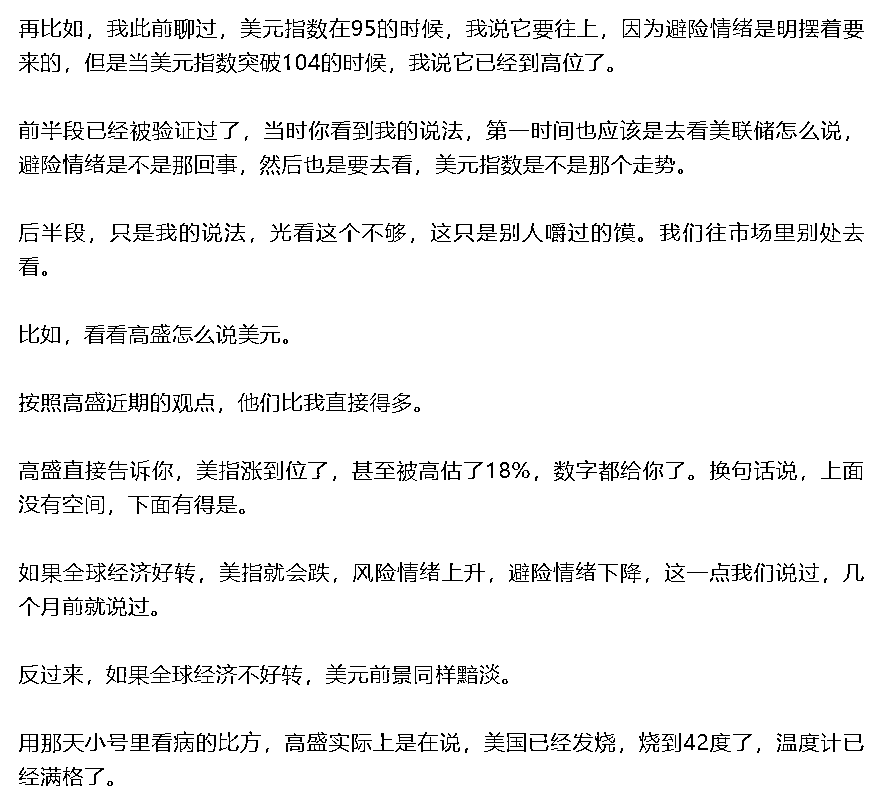

# 聊聊航母？

> 原文：[`mp.weixin.qq.com/s?__biz=MzU3NDc5Nzc0NQ==&mid=2247518160&idx=1&sn=0dd80b4bc84bfc4ec435ae180b9e1213&chksm=fd2e250eca59ac18d10fa6e7716871cb1495284b13e495e48c7c195feaf691a270aed16783b5#rd`](http://mp.weixin.qq.com/s?__biz=MzU3NDc5Nzc0NQ==&mid=2247518160&idx=1&sn=0dd80b4bc84bfc4ec435ae180b9e1213&chksm=fd2e250eca59ac18d10fa6e7716871cb1495284b13e495e48c7c195feaf691a270aed16783b5#rd)

很多读者让我聊 003，航母里的福建号。

话说这艘航母为啥叫个福建号，我是比较奇怪的，我本以为叫江苏号。

有人讲北洋南洋，前面两艘的命名与昔日北洋的驻地有关，第三艘考虑南洋，这或许是个说法，但是我觉得不太对。

因为南洋水师提督，受两江总督节制，基地在上海吴淞。负责的水域也是江浙一带。

那么还有两支水师，福建水师和广东水师，驻地分别是马尾与虎门。

所以按照命名顺序，003 我以为是江苏，但现在是福建。

所以可能跟什么北洋南洋的历史典故也没啥关系，具体为啥我也不清楚。

有人还说，应该叫长安号。来自网络段子，百年福特，毁于长安。

因为一汽带火了大众，广汽带火了本田，东风带火了日产，上汽带火了通用，只有福特到了长安这里，......

我知道这个段子的意思，就是冲着美国最先进的航母，福特号去的，你们在编排它。

意思是我压你，是吧。呵呵。

关于航母这东西，我不是舰船迷，没有什么发言权。但是关于读者想让我议论的那几个方向，我还是有最基本的判断力的。

这个判断，来自[昨天大号聊的那个话题，常识](http://mp.weixin.qq.com/s?__biz=MzU0MjYwNDU2Mw==&mid=2247506593&idx=1&sn=ea2af3e0634fab2c0759e54695af3bb7&chksm=fb1ab6ddcc6d3fcbd81a67ebf5bb2cc60ff56289863d03558078db63ad2586bc7b398cb8c78b&scene=21#wechat_redirect)。

第一个话题，有人说，福建号是为了那啥。

这个想法，我不认同，原因很简单，犯不着。

航母这种东西，作用是远洋作战，它实际上就是个平台，相当于移动的岛屿，或者移动的加油站，移动的补给站。

你放眼全球，那么远，远到需要中途补给的目标，能是啥。你自己琢磨。

第二个话题，很多军迷在比较福建号与福特号，在对比双方的航母编队的力量。

这种话题，我觉得没营养。

这俩国家，都属于能让地球不长草的那种。铆足了劲折腾，是不可能的，或者说，即便可能，也是与我们无关的。

反正地球都不长草了，你管谁更牛 B 呢。

那么更多的时候，在这个核平衡的大的态势下，航母是一种综合国力的体现，更多的时候，是为经济活动，撑场子的。

记得苏察哈尔灿在青楼与铁帽子王僧格林沁争女人的场景吧？他爸爸广州将军，为啥要带着一队兵冲进去？

就是给儿子撑场子去了。

第三个话题，长期来看，只要最终扎根于制造业的范畴内，我们都是有优势的。

你看，我都懒得争论了，我直接一棍子敲死所有的反对派，给你下结论了。

为什么懒得讨论？因为讨论那些细枝末节没意义，你把时间轴拉长了看，最后就这回事儿。

美国最大的问题在于它实际上已经金融空心化了。

你要是到今天还意识不到这就是未来几十年最重要的，世界经济的核心话题，你好洗洗睡了。

国际市场未来几十年所有的金融领域的机会，都是围绕美国在事实上已经金融空心化的大前提下反复折腾引起的。

如果这个大方向你都理解不了，想要赚大钱是不可能的。

尤其对于年轻人，本来时间窗口就十分不利，连大格局都理解不了，那还是打游戏吧。

我始终这么建议。游戏是个好东西，买不了吃亏，买不了上当。

不过话说回来，很多时候，人们缺乏常识，是一种常态。

昨天聊[美国的股市，日本的债市，中国的楼市](http://mp.weixin.qq.com/s?__biz=MzU3NDc5Nzc0NQ==&mid=2247518154&idx=1&sn=d0f3ff5d3d8f297d50e4490464c8c76a&chksm=fd2e2514ca59ac02f59d08665f2d675b3d0fb5b7bb809026f1354e0282e77f400d485ffbafa5&scene=21#wechat_redirect)。

又有很多留言，让我再聊聊这些天的国际市场。

这几天的国际市场上没有什么新的动向，一句我事先没聊过的新东西都没有。

你比如主要的对冲基金都已经陆续公布了他们的美元净持仓变化。

披露出来的数据显示，从去年 12 月开始，他们再也没有增加持仓，反而始终在减仓美元多头。

很有趣对吧，美元加息周期，不断加息，大资金减仓美元多头。

这一点我们在大号记忆承载里聊过，聊过很多次。两拨我都聊过。我给你截图。

作为大资金，他们很难去捕捉那种短期的波动，换句话说，他们之所以从去年年底开始就已经没有兴趣加仓美元，说明他们认为虽然美国在加息周期内，可是仍然没有战略做多价值。

这句话非常容易理解，就像一艘航母，看到浅水区有条小鱼，没有去捞，为什么？

因为吃水浅，它担心自己身躯太大，会搁浅。

你看，这就叫常识。

这样的常识，很多人常常都不认识。

记得之前，我说过一句话，我说，高盛表示，目前的通胀还不足以抑制需求。

有人不理解，问我啥意思。

这意思很好理解，就是说，牛肉虽然贵，可还没有贵到让你不吃晚餐的地步。

那么换句话说，高盛是在暗示，想要让牛肉不那么贵，唯一行得通的办法，就是让大家别吃晚餐了。

你现在回忆[罗老师别退网，罗老师别这样](http://mp.weixin.qq.com/s?__biz=MzU3NDc5Nzc0NQ==&mid=2247518135&idx=1&sn=13b28deac8b56040009889bd2c5ac82e&chksm=fd2e2569ca59ac7fef47a17eecbc9811b57647d785e43b1152ca896df86a9ded2247774ee7dc&scene=21#wechat_redirect)，那一期。

你想想，高盛说话的口吻，和那一期里面写的，职场高管之间的台词，是不是很像？

都是这样的，成熟的职场人士，说话都是曲里拐弯的。

你听不懂是你的问题，你一定要这么认为，只能是你的问题。你不能指望人家倒过来迎合你，没这事儿。

如果你不愿意了解这种表达术，那你只能被忽悠，被反复忽悠。

你像一周前，高盛表示，只有就业市场放缓，才能抑制通胀继续飙升。

这话啥意思？

翻译过来，高盛就是说，如果美国人都失业了，弹尽粮绝，通胀自然就没了。这不就是暗戳戳的讽谏么？

你以为美国人说话直接？高盛面对美联储，说话的口气跟孟子见齐宣王没啥区别的。

这种暗戳戳的小心思，你每天都能在国际市场上看到很多，什么高盛，惠誉，花旗，安联。

他们过去的一周讲了什么，你自己上网看，太多了，我不想把这里变成一个复制黏贴的地方。当然，你也可以不看，我前面说了，没有什么我此前没有聊过的新内容。

如果你想要看到直白点的一手资料，也有很多。比如**前**财长，**前**美联储官员。

你注意加粗的字，就是说已经卸任了。这些人有时候为了显示自己公正，往往会说话直一点。

当然，其实当初他们在的时候，也一样。

所以我常说，你要了解美国，最好的途径是国际市场，那不是你去美国自驾几次，去几次餐馆，拍俩视频能比拟的。

这个道理在中国也是一样的。

你觉得是一个在国内市场创业成功，上市的商人更了解国内，还是一个天天拍美食的 UP 主更了解国内？

任何时候，做事的人，总是比吃饭的人，更清楚一些。

问题是，大家就信吃饭的人，呵呵。

你有时候也搞不清，那些操着浓重的地方口音的电话诈骗的人员为什么就能得手。

问题是，人家就是得手了嘛。

说明受众的水平就这样，你替他们着急，也白搭。

我曾经聊过，我是周慧敏的粉丝，我十几岁中学生的时候，她二十几岁正当花季。

我是想不通，她为啥看上了倪震。

倪震这人，除了出身，一无是处。

他爹是倪匡，他姑是亦舒，他师父是黄霑。但他本人，真的是除了善于给周慧敏戴绿帽子，一无是处。没有任何成就的一个人。

当然，把妹是很牛的。在周慧敏之前，把过李嘉欣，然后就看上了周慧敏。

与周慧敏交往期间，把了蓝洁瑛，就是春三十娘。然后是出轨港姐陈法蓉，之后又是什么嫩模始祖，TVB 小花，什么模特，什么大学生。

周慧敏嫁给倪震的时候，婚礼的钱都是女方出的，周慧敏公司的一半股份，还落在倪震手里。

倪震买了什么呢？买了一个戒指，纯银的，没有钻石，4000 块......

呵呵。

金融，是个纯理性的话题。问题是，讨论其中的人，本身并不理性。

尤其是互联网上，很多人对自己持有观点的态度，就像周慧敏对倪震一样，有一种，你也无法理解的爱在里面。

我跟你讨论的是 1+1=2，你跟我讨论的是你不爱 2，你爱 3。

这就是为什么，每天后台都有很多人来给我下战书，还总是留言，西风，你必须和我杠，不服来战。

也有些人，在和别人争论的过程中输了，来找我，希望我帮他打回去。

你觉得我会不会搅合进去？

呵呵。