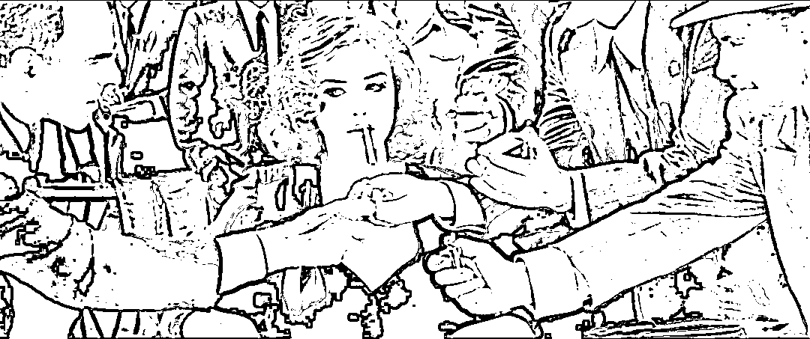

# 人教版插图的美丑，不是艺术话题，而是卖艺的话题

> 原文：[`mp.weixin.qq.com/s?__biz=MzU3NDc5Nzc0NQ==&mid=2247517295&idx=2&sn=b46b11b225b5793e8986b293bcd0ad98&chksm=fd2e26b1ca59afa7b47b545fb11eca1dd14edf5d5cafe649ce06f170623fc3054b3cc955c82e#rd`](http://mp.weixin.qq.com/s?__biz=MzU3NDc5Nzc0NQ==&mid=2247517295&idx=2&sn=b46b11b225b5793e8986b293bcd0ad98&chksm=fd2e26b1ca59afa7b47b545fb11eca1dd14edf5d5cafe649ce06f170623fc3054b3cc955c82e#rd)

因为此前两次聊到吴勇这个话题： 

[画插图的吴勇这个话题的背后，究竟是什么？](http://mp.weixin.qq.com/s?__biz=MzU3NDc5Nzc0NQ==&mid=2247517236&idx=2&sn=4ca07b0e0049dedfe16dacc339a2fb3e&chksm=fd2e26eaca59affce4f2627e4569fbc1edbd4facf275538a547f112be690412082dcfe2f81a5&scene=21#wechat_redirect)

[究竟是谁在替吴勇们洗白？](http://mp.weixin.qq.com/s?__biz=MzU3NDc5Nzc0NQ==&mid=2247517254&idx=1&sn=4b83e86e69a56bd67e2375a6820b4d27&chksm=fd2e2698ca59af8e932a9a411879b727971c87f200b561c3e9435cce39ecae3e712f1780cb12&scene=21#wechat_redirect)

有读者跟我讲，这不是一个共识类话题，也不是一个经济类话题，这是一个艺术类话题。

西风，你俗了，你不懂艺术。

然后援引了很多艺术家，或者教授们的说法，你看，他们都为吴勇站台了，表示，那只是审美的不同。

或者说，有些人，人家审丑是人家愿意，总而言之，把这个话题定性为，西风，你不懂。

那我的回答很简单，不懂的是你。 

**你没有理解什么是艺术，什么是卖艺。** 

没有客户的创作那才叫艺术，有客户的创作，通通是卖艺，理解？ 

所以从这个角度讲，你所谓的那些艺术家，只是画画的，你所谓的那些教授，只是教书的。 

你注意，我没有看不起谁，我只是阐述事实。 

我记得我聊过，几年前吧，我聊我奶奶的亲戚们，他们也是某 C9 很早期的教授，民国时期的。 

我说那里面有很多人是教授，他们不是教书的。为什么？因为他们的客户是自己，他们既不需要考虑校方，也不需要考虑科研经费。

他们不是在给谁做事，他们就是在给自己做事，很可能学校维系不下去的时候，他们就会掏钱来维持大学的运转。

他们的祖上也许是清廷官员，也许是大地主，也许是大资本家，民国就是那么一个时代，教育不普及，念过小学的都很少，读书能读到知名大学里去当教授的，去教大学生，没有财力是很难做到的。

这里面有些人是有目的的，比如蔡元培说，当时北大很多学生就是为了在北洋政府里谋个差。

也有些人，是家道中落，毕竟当教授一个月几百块大洋，相当于今天月薪几十万，还是能够过得体面的。

这种有无目的做事的区别，南怀瑾曾经讲过。 

他说，自己写了很多书，号称全集十二卷，里面绝大部分都是混饭吃的。

为什么写书呢？家道中落，他曾经很有钱，大地主，还是独子，唯一的财产继承人。 

后来，各种折腾，加上战乱，最后跑到小岛上去的时候，吃饭已经成问题了。 

无可奈何之下，卖弄学问，写了几本书，成为名流，从此改善生活。

南师会这样讲，是因为这种事只有在他们那代人的时候常见，搁在今天是很罕见的。 

罕见到什么程度？**我们今天默认，你就是来赚钱的。**就像我们默认，你就是个画画的。

你画画要么为了卖钱，要么为了攒名气，名气攒足了，还是为了变现。

说得更直接点，你就是个卖艺的，没艺术什么事儿。

之所以彼此称老师，称艺术家，本质上是花花轿子众人抬。再说穿了，就是为了要加钱。

这一点我很欣赏赵本山老师的坦诚。

赵本山老师说得很清楚，我们就是唱二人转的，二人转到底怎么回事，大家心里明镜儿似的。

为什么要称老师，甚至称大师，没啥，为了加钱呀，艺术嘛，可不得加钱。

这种话，只有赵本山老师这种真正不差钱，也不差客户的才会讲出来，因为人家已经不需要被抬轿子了。

越是刚出道的，越是喜欢绷着，言必称艺术，其实就是因为穷嘛，处处要加钱嘛。 

你去看那些有钱的城市，旅游景点免费的，越穷的城市门票越贵。 

有钱，有流量，人家门票就免了，反正来的人多，消费也多，越是穷，越是没人，只能收门票，不就这么个理儿？ 

所以啥叫艺术？ 

如果你不需要钱，也不需要被认同，这才叫艺术。

这不是我说的，冯小刚说的。

冯小刚说，自己年轻的时候就是穷，为了迎合观众而去拍电影，俗称商业片。

自己有审美么，也许有，但是不重要，重要的是观众朋友们喜欢什么。

后来，稍微有一点想法，也仅仅是一点。为什么？因为还是要有基本票房呀。

你毕竟没有有有钱到拍了电影不上映，自己拍自己看的地步。

或者，即便你不在乎票房，你想要拿奖，那就不可避免地迎合评委的审美。

那就谈不上艺术。

今天有哪个所谓的艺术家，是完全顺着自己的心意在画画？

没有的。 

梵高顺着自己的心意画画，结局就是在世的时候卖不出去。要是没有弟弟接济，他早就饿死了。

他的画后来卖天价，需要很多很多的商业包装，操盘，很多很多违背他心意的事情发生，所以他活着的时候，当然无法实现。

所以说，你一定有客户。无非这个客户是谁，理解？

你去看开发商的楼盘里面的园林为什么千篇一律？

因为经过调查，只有按照这样的模板，才能吸引客户。 

那你既然是出来卖的，你当然要迎合客户，否则凭啥买你家呢？

你去看古代的园林，就很有趣，不同的园林主人，有不同的性格，你能看出性格，而不是模板了。 

这充分说明欣赏只存在于买单者之间，作为供应商，你就是伺候人的，整再多艺术家的头衔，也无非是想说明自己是个英国管家，专业伺候人的，仅此而已。

听懂了就这点事儿，这就是艺术，谁买单谁艺术，谁买单谁说了算。 

我记得叶子楣拍过一部电影，某个选美大赛。起初内定的冠军，是 5 号，后来叶子楣登场了，她是 8 号。 

结果赞助商眼睛一亮，马上暗示评委，选美大赛的冠军，改成 8 号。

你现在懂什么是艺术了？

其实这个赞助商才是全场唯一懂艺术的人。 

什么是艺术？他高兴才是艺术。他知道自己想要什么，他想要艺术嘛。

每个人都有自己的艺术，等你能买单的时候，你就艺术了。

我们来看看，吴勇，和他们的朋友们，是这样的处境吗？他们能够为自己买单吗？ 

当然不是。他们就是出来卖的，给自己加一堆头衔无非要加钱。

你买了书，按说你就是甲方了，问题是，画画的人，不 care 你的感受，不关注你的审美。 

那只能说明什么？

那只能说明这个商业模式下，你其实不是他的客户，理解了么？

你以为你是金主爸爸，其实你不是，所以他才会不鸟你。

就像你好奇，为什么有些拿大奖的作品很奇怪，不奇怪，因为你不是评委，你也不是赞助商。 

懂了吧？

人家画丑了，才能拿奖，才能卖掉，画美了，就拿不了奖，就卖不掉，这才是问题的根源。

郑渊洁的点评很透彻。

为什么你掏了钱，却没有享受到甲方爸爸的权益，这是你要质问吴勇的，而不是听他辩解所谓的艺术。

就像黄晓明说的那句话，我不要你认为，我要我认为。我不要你喜欢，我要我喜欢。 

你掏钱了你就艺术，你想咋艺术咋艺术，他就是伺候人的，他压根儿没资格艺术。

所以人家郑渊洁比咱们很多网友老道多了，他上来一针见血，就问了俩问题。 

谁是吴勇的客户？谁在给吴勇买单？

