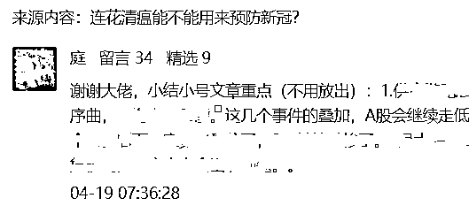
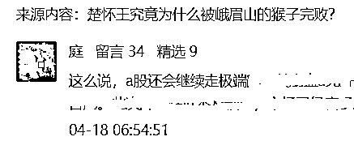
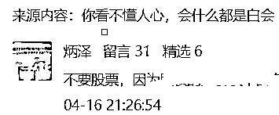

# 韭菜是用来割的，不是用来养的

> 原文：[`mp.weixin.qq.com/s?__biz=MzU3NDc5Nzc0NQ==&mid=2247516060&idx=2&sn=d66711b8b7d1b4a35028eb15b878fbbc&chksm=fd2e1d42ca599454ceb8747938b7e718bdeeca1854a258e3339d44a3bc54af24268d5760ae6c#rd`](http://mp.weixin.qq.com/s?__biz=MzU3NDc5Nzc0NQ==&mid=2247516060&idx=2&sn=d66711b8b7d1b4a35028eb15b878fbbc&chksm=fd2e1d42ca599454ceb8747938b7e718bdeeca1854a258e3339d44a3bc54af24268d5760ae6c#rd)

昨天大号的文章，[怎么看上海确诊人数的反反复复](http://mp.weixin.qq.com/s?__biz=MzU0MjYwNDU2Mw==&mid=2247505198&idx=1&sn=398823b06e472d74ca34d4c0356d09e8&chksm=fb1ab952cc6d3044761ae6b9585f2a05555ed65df2a56d3a361d87d20498255b41f0ff41934f&scene=21#wechat_redirect)。

有个老读者问了一个问题，很有趣的。

他说，像这种很不得人心，或者讲，很刺痛人心的话题，你何必一而再，再而三的戳破。 

这完全不符合自媒体运营的套路嘛。 

说到底，读者是客户，读者是衣食父母，你经常教我们要有客户意识，但是你自己却从来都不是这样。 

问得很好，所以我才反复告诫你们，不要学我。如果你的情况和我不一样，就不要学我。 

我不是没有客户意识，确切地说，我是不需要有客户意识。 

你翻遍互联网，没有哪个博主的态度比我更恶劣了。 

我不是说没有客户意识，我是根本就无视读者。我这里的服务体验估计是全网最糟。 

但是反过来，我这里的付费阅读率，也是全网最高。 

**这是大号所有的付费文章：**

[我建议你不要看完](http://mp.weixin.qq.com/s?__biz=MzU0MjYwNDU2Mw==&mid=2247502667&idx=1&sn=2e41ecbf67f6a389ba23e129cb322ce2&chksm=fb1aa737cc6d2e21a778279184bac9ada47215c2dcb87628a52db33ff691d7d1f4350dcb5e87&scene=21#wechat_redirect)

[聊点没温度的实话，篇幅太长，无耐心勿入](http://mp.weixin.qq.com/s?__biz=MzU0MjYwNDU2Mw==&mid=2247502967&idx=2&sn=80503cafb3e736c76caace8ff2f26117&chksm=fb1aa00bcc6d291d586c19783b1a2482c427ba6127d55357750250ff48990aa73046ff65f5ef&scene=21#wechat_redirect)

[普信男尝试做家务，温柔体贴男内助，为啥不是一条路？](http://mp.weixin.qq.com/s?__biz=MzU0MjYwNDU2Mw==&mid=2247503604&idx=1&sn=aa8a5cb4045943468edd95dabbbec1b2&chksm=fb1aa288cc6d2b9eead1250203b2b6b07752f33d22fddf5b4fde6150118e4a6009013e7725a2&scene=21#wechat_redirect)

[初五才迎财神，初四我就来讲一个发财的故事](http://mp.weixin.qq.com/s?__biz=MzU0MjYwNDU2Mw==&mid=2247503753&idx=1&sn=97856a9f71402bdc33f0e3f6ed2879c9&chksm=fb1aa3f5cc6d2ae30bbb9a09b1e56660b1963bfe2a70eb9e99064723cd260ea9ffecde97dcfc&scene=21#wechat_redirect)

[普通人改变命运，要靠神秘的康波周期么？](http://mp.weixin.qq.com/s?__biz=MzU0MjYwNDU2Mw==&mid=2247503915&idx=1&sn=ed885c4a8efd7c8f778309ed257ad924&chksm=fb1abc57cc6d3541a5379a02d8210d96b7c79c1334f9ab26b437476308d0e756e10220479e38&scene=21#wechat_redirect)

[字越少，事越大](http://mp.weixin.qq.com/s?__biz=MzU0MjYwNDU2Mw==&mid=2247504457&idx=1&sn=b0b3257cfcfbb2ef1c48c3693dfcb92e&chksm=fb1abe35cc6d3723f968a998345bd229c4ef54cb2dcc560d54c2415e267e570b9e9d36e6a3b5&scene=21#wechat_redirect)

[你看不懂人心，会什么都是白会](http://mp.weixin.qq.com/s?__biz=MzU0MjYwNDU2Mw==&mid=2247504731&idx=1&sn=d723768de91f3141afc58fec60b8dd3e&chksm=fb1abf27cc6d363134fcb14b03bd41de2be9a58e755ced44770641aedeaa1cbce2dab800db79&scene=21#wechat_redirect)

**这是小号的所有付费文章：** 

[疫情后全球货币大宽松真的要结束了吗？真的吗？](http://mp.weixin.qq.com/s?__biz=MzU3NDc5Nzc0NQ==&mid=2247512309&idx=1&sn=88829a9dc9da8cca934bf3be7ab6dc76&chksm=fd2e122bca599b3d994703f52139c2d05c7939585731e8e19b93ddfe1026d3780f980b4acf59&scene=21#wechat_redirect)

[趁风控不在，在结婚这个话题上，跟女读者们说两句掏心窝子的话](http://mp.weixin.qq.com/s?__biz=MzU3NDc5Nzc0NQ==&mid=2247512349&idx=1&sn=14ffc5b09e0fbe39c707073bc73ef99f&chksm=fd2e13c3ca599ad5007a01bcdfdb117386f46ca0b69f934f5e7c3e53cf5ccc321ae1921e4cf9&scene=21#wechat_redirect)

[中概互联网，财富本质，时间奥秘，风险感知，次数理论，热战能源战金融战](http://mp.weixin.qq.com/s?__biz=MzU3NDc5Nzc0NQ==&mid=2247514520&idx=1&sn=fae620c5593fbec3d252ac907ab4daf7&chksm=fd2e1b46ca5992506c01de0cecc3d75d5d748cf3ca9103bc222ed020af43bade65d88947222c&scene=21#wechat_redirect)

[与其每天聊上海，还不如让一部分读者先成就自己](http://mp.weixin.qq.com/s?__biz=MzU3NDc5Nzc0NQ==&mid=2247515069&idx=1&sn=6306550c82af8fdfce866bc327d3b4af&chksm=fd2e1963ca59907554cfd2422862abdd496e534975abc0f6f614a6dab41f83b2927e1b06f3bf&scene=21#wechat_redirect)

你不用付费看完的，你点进去看看阅读量，看看是不是几乎每篇都是 1 万+。 

要知道我们平日里阅读均数也就 2 万附近，这个付费比例是全网最高，没有之一，甚至都没有同列。

就是说如果你按照付费阅读的比例划分档次，我们一个人一档，独孤求败，高高地站在山岗上。蔑视其他所有公众号。 

服务态度烂成这个样子，付费阅读比例高到这个地步，为什么？ 

因为我们提供的是价值，不是情绪。

桃李不言下自成蹊，我提供的内容没有价值，那我就只能换着花样讨好你，反过来，我提供的内容有价值，人们趋之若鹜，我赶都赶不走，为啥要提供良好的服务呢？ 

你挂过协和医院专家号吧？有服务么？ 

没有，最差的服务，最差的感受，托关系能托八层，排队能排出三十里地去，为什么？

因为站在协和的角度，您可以不来的。 

而站在病患的角度，他之所以愿意忍受这么多，只有一个原因。 

他觉得从协和得到的，远大于他失去的。

他如果想要感受，就不会去协和受罪，他去找个足浴店，马上就能享受宾至如归的感觉。 

这种优质的服务，绝大多数公众号都提供的，你需要来我这里受气么？不需要。 

这世上很多商家并不是卖产品的，他们是卖服务的，俗称让客户感动。

可惜我们不是。 

我让你不要学我的原因就在于这里，你大概率没有能力提供这么霸道的产品。 

协和协和，鞋子与盒。进协和，要么穿上鞋子走出去，要么进骨灰盒。 

协和就这么自负，跑去协和受气的病患，都是走投无路的，他在别的地方已经找不到任何出路了。 

这就是卖产品的思路，如果产品足够硬，服务再恶劣，门口队伍也排长龙，如果产品不够硬，我讨好你也没卵用。 

这是站在我的角度，站在读者的角度，我个人觉得，如果你什么问题都没有，你过的很成功很快乐很自负，你完全没有必要来看我写什么。 

就像一个身体健康的人，你去足浴店里按摩按摩就行了，没事儿去医院挂什么号？ 

没必要的，也没有意义。

如果你遇到了问题，是本着改变自己，本着向上的目标来的，就没必要介意话好不好听。 

**能改变人的话从来不好听，就像能治病的药很少有好吃的。** 

很多时候，市面上打着说真话的那些话，只是些动听的话，讨好你的话。 

你很想骂领导，骂老板，人家知道，替你骂了，而且是打着说真话的旗号替你骂了，你听了很受用。 

然后呢？

其实今天的年轻人，90 后的读者可以参考下前辈们的命运曲线，比如 80 后们。 

那些年轻的时候骂骂咧咧的，比你大 10 岁的，如今的中年人，他们混好了么？他们自己的问题解决了么？

我经常问，你想要辩个输赢还是想赢？你想骂骂咧咧的走向一个下岗的中年，还是想精彩丰富的安度晚年？ 

其实路是你选的。 

**真正的真话不是让你把气给出了，而是把你的气憋回去，记住我的说法，憋回去。**

憋到你痛苦的不能自已，你才能改变，你才能反思，才能学会走出舒适区，才能真的脱胎换骨，最后你才有一个不一样的人生。 

憋回去，不是释放出来。

**愤青愤青，释放出来的愤青，最后都成屌丝了，中年老屌丝。** 

**憋回去的，憋得久了，憋到自己小宇宙爆发了，你才有机会看到人生不同的那一面。**

所以有时候，作为读者，你自己应该想想，是什么在阻碍你。

是你自己。

其实阶层固化就是那么来的，我说过一万次了，信息不对称才是人世间最大的不公平。

我们那一代人相对于今天的年轻人，我觉得更幸福，原因就在于此。 

我们那一代人，当年对着自己的老板，60 后们，他们可以丝毫不顾及我们的感受，直接把那些特别难听的话讲给我听，不经过任何拐弯抹角的加工。

我年轻的时候也生气，但是我都憋回去了。我很想怒怼老板，但每次话到嘴边，我都憋回去了。

因为我看了看银行卡余额，就憋回去了。

我不想辩赢，我说过很多遍了，我只想赢，年轻时就这样。我怒怼老板怼赢了有什么意思呢？结果还不是要回到 6 平米的出租屋里，下个月不还是要交房租么？ 

我讲过这段经历，16 年前，每天气鼓鼓地躺在出租屋里望着天花板，反思。 

你注意，是反思。我只反思一个话题，我为什么要用六位数的密码去保护三位数的存款，还总认为自己是对的？

**我特么真要是对的，我就不会去给人打工，我特么真要是对的，我就不会给人交房租。**

天天憋气，所以我 20 岁到 30 岁之间，感觉是天天都重新做人的，好像每天都被刷新了一遍，不断地重新认识这个世界的那种感觉。

于是我八年前才有机会从劳方转型资方，于是我才有机会不到 35 岁就退休。我觉得自己蛮幸运。

这份蛮幸运在于我们那一代人年轻的时候，似乎都不喜欢先骂人，而是先听，先想，先琢磨。 

所以我们有机会，有机会改变自己的命运，有机会不需要一辈子都辛辛苦苦的去上班，而且担心被裁员。 

今天的舆论环境似乎不是这样，很少有人有耐心听完刻薄的话。 

**有时候人生就是这样，听着最温柔的话，就得忍受最残酷的命运。**

**最残酷的命运是什么？就是无法改变自己的命运。** 

听得懂这句话吗？你真的能听懂吗？[昨天大号的留言](http://mp.weixin.qq.com/s?__biz=MzU0MjYwNDU2Mw==&mid=2247505198&idx=1&sn=398823b06e472d74ca34d4c0356d09e8&chksm=fb1ab952cc6d3044761ae6b9585f2a05555ed65df2a56d3a361d87d20498255b41f0ff41934f&scene=21#wechat_redirect)，至少有三成的人还是沉溺在情绪中，封不满，不封也不满，只有情绪，没有思考。

**更加思考不清楚预期！！！**

预期，预期，预期，这个世界围绕什么？围绕预期。 

你之所以肯听老板的，为什么？是现状么？不，是预期。

有了预期队伍才能带，没有预期队伍就带不了。牛鼻子跟前挂根草才能犁地，拿掉那根草，牛就不动了。

**牛吃不吃得饱根本不重要，重要的是鼻子跟前一定要有一根草。**

牛是这样，人是这样，资本是这样，市场是这样，天下的一切都是这样，所以一切围绕预期。

**人就是靠一口气儿吊着呢，团队就是靠念想吊着呢，看得懂吗？**

这就是带团队的奥秘，这也是操控市场的奥秘，想不通，你就一辈子被管理。

话说到这份上，要还看不懂预期，那只好算了，我也没辙了，我帮你帮到尽头了，你的天资之低，悟性之低，怎么敲都学不会预期的妙用，我能怎么地呢？ 

你还是去犁地吧。

一边犁地一边抱怨，世界错了，领导错了，老板错了，反正谁都错了，就自己对，然后呢？

肚子很快又饿了。

当年的舆论环境比今天好，不是因为当年很多人骂领导，而是因为当年有机会真的改变自己。 

我吃饱了撑得非要去改变领导做什么？领导已经活得够好了，活得不好的，是自己。 

当年互联网不挣钱，所以博主不怕怼读者，什么刺痛读者说什么，读者才有改变自己的那么一丝希望。 

今天互联网很挣钱，博主们是傻啊，犯不着刺痛读者，都恨不得把读者当祖宗供起来。 

供起来干嘛？供起来割嘛，所以韭菜是用来割的，不是用来养的。 

你情绪上得到了满足，你内心得到认同，博主们赚得盆满钵满，阶层又固化了。 

ID 永远是 ID，IP 永远是 IP。你开心吗？开心就好。

几年前我最后一次上思过崖那次，就跟大家讲过，现在的聊天环境和我年轻时大不同了。

我年轻时最起码聊投资，是步兵，今天是骑兵。

骑兵什么意思？骑兵有马（码）嘛。 

自那之后我再也没有上思过崖哪怕一天，没有。这对我来说是幸事，对于年轻的读者，尚且一无所有的读者，未必。 

因为你成长的环境，和我们当年比，有效信息更少了。 

为什么我们的付费读者比例奇高无比？ 

因为有很多那时候跟到今天的老读者，我哪怕写成摩斯密码，他们依然能够解读出有效信息。

有些人昨晚跟我哭诉。

跌惨了对吧？一下子去 2900 多了，是吧？ 

给你看看某些老读者在大号的留言。 

你看时间，读者在 4 月 19 的理解。 

这个读者在 4 月 18 号，就留下了同样的解读。 

再给你换个读者，也是老读者，他在 16 号的留言。 

这些人都是每篇付费文章挨个看过去的那种铁粉，他们的留言我看到了，没有放出来，包括我引用截图也都给他们打码了。 

这是不是我提前一周告诉他们空仓的？不，这是他们自己写的。

我可什么都没说过，你去翻看大号 16，18，19 号的文章，我一个字都没有提股票。 

但是这些老读者，他们如果言行一致，就提前规避了昨天大跌的风险。

为什么？因为上周读文章读出了暗示？

NO，跟我半毛钱关系都没有，读者爱怎么理解怎么理解。

你卖也好，买也罢，什么时候做什么方向，都跟我没有任何关系。

因为我什么都没有说过。我只承认我写过字，但我不承认任何含义。为什么上万铁粉每天跟着我后面第一时间解读，那我就不清楚了。

反正我一问三不知。 

这就是你今天面临的信息市场，今天的年轻人面临的信息面。

投资人都跟搞地下工作一样，聊天都用摩斯密码的。

所以在这种情况下，你还要兼顾自己的情绪，让自己听了舒服，爽，被认同。那得了，真如某人说的，90 后还是洗洗睡吧。

真是这话。 

我年轻那会儿，没有泥石流，只有流星雨。前辈们几乎是把有效信息扇我脸上，完全都是步兵，无码的。

今天的年轻人，真的是分两种。 

一种就是彻底放弃了，干脆听点好听的，让自己精神上愉悦下得了，这辈子就这样了。

另一种真是牛人，硬是拿着被我稀释了无数倍的矿泉水，提炼出一点点的石粉，就硬靠着这一点点的信息，艰难的成长。

好吧，怎么做都是每个人自己选的，与我无关。自己开心就好。

我始终是那个态度，我可不是协和医院，我是德云社，我的态度就是渣男。

不拒绝，不承认，不负责。