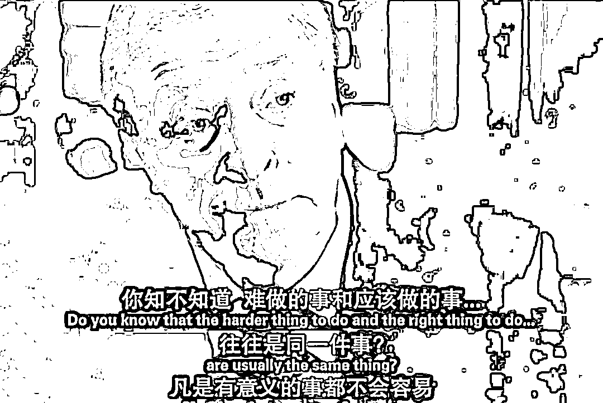

# 可不可以考虑一下躺平这个选项？

> 原文：[`mp.weixin.qq.com/s?__biz=MzU3NDc5Nzc0NQ==&mid=2247515433&idx=2&sn=c2ebb2d58bb8ead50f79d10d2a80c0e2&chksm=fd2e1ff7ca5996e1f5cdf2bcd61bd9a3bb2288485ecffee1bfc625f0fe77a31083e6f51643c7#rd`](http://mp.weixin.qq.com/s?__biz=MzU3NDc5Nzc0NQ==&mid=2247515433&idx=2&sn=c2ebb2d58bb8ead50f79d10d2a80c0e2&chksm=fd2e1ff7ca5996e1f5cdf2bcd61bd9a3bb2288485ecffee1bfc625f0fe77a31083e6f51643c7#rd)

咱们有些读者，已经受不了了，因为种种经济压力，种种对生活的影响，信心不那么坚定了，所以就提了这么一个问题，如标题。

在回答读者之前，我们先回顾一下，回顾一下我去年的 8 月份在大号里写过的那篇：[清零与共存](http://mp.weixin.qq.com/s?__biz=MzU0MjYwNDU2Mw==&mid=2247500430&idx=2&sn=3f0f700d059843c14004d0571072373a&chksm=fb1aaef2cc6d27e4e6a703966239eaf8338642feaf69d21d91c85ff8cb3b056f81bdba5cc683&scene=21#wechat_redirect)。

当时也有很多人纠结抗疫的花费，觉得这么多钱花出去，是不是值得。 

我当时没有算生命账，我算了一本经济账。 

我是这么说的：任何事都应该算一笔账，如果成本过高，冒险，冒生命之险也不是不可承受的。但是，我们首先要清楚，花掉的钱是哪儿来的。

搁在过去，美联储放水，全球大宗商品价格上涨，我们会是受益者么？当然不会，我们一定是受害者。

因为我们是最大的原材料采购方，我们是最大的生产商，如果成本上升，就意味着我们的利润变得稀薄，甚至亏损。

我们没法涨价的，涨价，意味着卖不出去，也意味着工厂迁移，别人取代我们生产商的地位。

但是这种情况在 2020 年和 2021 年发生了神奇的转变。

随着成本上升，我们的商品售价也上升，我们非但不亏，而且大赚。这是为什么？因为别的国家开工率不足。

说穿了，他们被疫情打爆了，处于紊乱状态。去年和前年我们成了张屠户，离了我们，就只能吃带毛的猪。

这就是去年我说抗疫十分划算，即便单纯的算经济账，也特别划算的原因。 

而且去年主要是德尔塔，传播速率没有这么高，上海的 3000 人流调队伍几乎是完爆病毒。 

许多人几乎感觉不到对自己工作生活的影响。 

今年开年就不顺利，许多做外贸的朋友已经感受到了，随着其他国家的陆续开工，我们年初就丢了很多单子，你发现生意不好做了。 

然后又遇到了奥密克戎这种传播力很强的病毒的冲击。

应该说深圳超能打，极其果断，也就停了一周不到就满血复活了。 

我说过很多次，年轻真的很有优势。一群 30 岁的人，可以带着行军床去公司，可以背着主机箱回家，有这样的人，有什么是做不到的呢？ 

遗憾的是，上海没扛住。没扛住也不出乎预料，上海和深圳真的不一样。上海每三个人就有一个是退休人员。 

但是上海这件事，带来了第二个问题，那就是很多行业上下游的进一步阻断。 

我为什么说深圳七天很了不起？因为企业生产的原材料库存大约就是七天。 

也就是说，如果供应商停止供应原材料超过七天，自己就得跟着停工。哪怕自己这里没有疫情，也会因为原材料短缺导致不得不如此。

我们整体是一条生产线，上海只是生产线上的一个工人，这个工人如果休假的时间太长了，其他工人也会被迫停下来。

这就是我说深圳牛的地方，他们掐着点，又回到了产线上。

这会儿你责怪上海掉链子，是没有意义的。全国除了深圳这个特例，绝大部分城市都有大量的老人。 

有历史的城市都有老人，深圳此前是个渔村，没有历史。 

那么一方面是外部复工了，一方面是我们阻滞，两者叠加，你当然觉得压力山大，日子不好过。 

那么现在问题就剩一个了，躺平能不能解决问题？ 

我唯一好奇的是，你躺平，是不是问题就自动消失了？ 

答案是否定的。因为那是人，不是机器人。 

机器人是很容易控制的，你只要写一行代码，告诉大家，得了奥密克戎也要继续上班，不当回事即可。

人不行。人生病了不去上班，人担心别人给自己传染了不去上班。你去，问题是隔壁老王不去，最后的结果就是混乱。 

欧美经历了漫长的混乱期，说到底，他们是把弱者直接给淘汰了，从报出来的数字上看，死了数百万人。 

我们此前保护得很好，弱者都还在。如果此时此刻躺平，非但不会正常开工，反而会引起混乱。 

这是站在内部的角度，第一个不可取。你这么做，得不到你想要的，反而会进一步损失更多。 

站在外部的角度，我们聊过很多次俄乌战争，[我准确地预测了美国会阻止和谈](http://mp.weixin.qq.com/s?__biz=MzU0MjYwNDU2Mw==&mid=2247504726&idx=1&sn=2b60a288da7a016dfc550b588c0ef4d6&chksm=fb1abf2acc6d363c6684fc99e560ef9f0bb348a71f9f5d041eef325da7f4457ca6f4d4da10c8&scene=21#wechat_redirect)，为什么？ 

因为美国需要避险情绪，他需要让全世界都认为欧洲乱成一团糟，从而增加美国对资金的吸引力。 

这时候，你在自己家里摆烂，那不是正中美国圈套？人家瞌睡，你递个枕头？

这是站在外部的角度，第二个不可取。 

你说的那些困难，都是事实，你在面对，我也在。问题是，躺平解决不了任何问题。 

躺平是个什么选项？

我来告诉你。

二战期间，日本人打过来了，你发现抵抗很艰苦，然后说，你选择躺平。

你以为你躺平了，小日本会让你当天皇，好吃好喝供着你？

事实是，如果你选择躺平，你会被抓去挖矿，最后被干掉。 

我早就说过一万次了，如果能够被包养，没有一个男人拒绝吃软饭。 

八戒路过女儿国的时候说的很清楚，放开我师父，让我来。所谓我不入地狱谁入地狱。

结果呢？结果是女儿国国主宁愿不要人种，也不要八戒。 

你以为你是唐御弟？拜托，你是八戒。 

我一直在给你传递一个非常朴素的概念，那就是你有没有更好的选择？ 

回答我，有，还是没有？

你不想加班我也不想的，我毕业头一年刚步入职场就是 996，我也很反感的。 

我经常跟男同事讲，如果你家里有十套房收租，千万不要来上班；我也经常跟女同事讲，如果能嫁给富翁，一定要把握住，千万不要在职场打拼。

后来我大部分男同事都成了强人，女同事都成了女强人，是因为他们不听劝告吗？

不，是因为他们根本没有第二个选项。

我们和美国不一样，牌面不一样。他们是富五代，我们是准备成为富一代的泥腿子。 

富五代有很多打法的，比如把别人搞乱，他的名头本身就可以让他吸收资金。 

而我们没有办法，我们唯一的办法就是别人一千次把你搞乱，你一千零一次站起来。

穷人逆袭就这条路，通往富一代的路上就是这么艰辛，这么委屈。 

我从来没有觉得我们能够打败病毒，病毒是头熊，这是一个 survive 类型的游戏。

survive 游戏是没有通关的，你要做的就是明知不可为而为之，你要做的就是尽可能地创造奇迹。

就像我们大学里都玩过的那个游戏，是男人就下一百层。

在这个过程中，本来就是动态调整的，引起医疗挤兑就严防死守，引起产业链停滞，就疏通环节，抓生产。 

