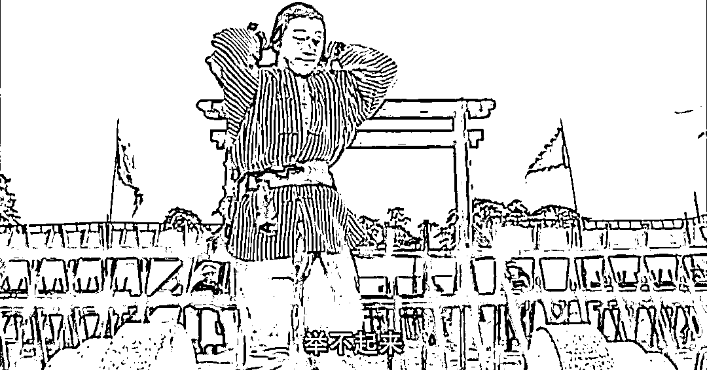

# 就业是必须的，买房可不是

> 原文：[`mp.weixin.qq.com/s?__biz=MzU3NDc5Nzc0NQ==&mid=2247514676&idx=2&sn=4d2b1fee60b3eca6a44ce08a660daecd&chksm=fd2e18eaca5991fcad2560ad8a3f1a6e2de968b3dac6af525e7623e4282f2ad3da76777f7ec2#rd`](http://mp.weixin.qq.com/s?__biz=MzU3NDc5Nzc0NQ==&mid=2247514676&idx=2&sn=4d2b1fee60b3eca6a44ce08a660daecd&chksm=fd2e18eaca5991fcad2560ad8a3f1a6e2de968b3dac6af525e7623e4282f2ad3da76777f7ec2#rd)

昨天的文章，[美联储四年来首次加息与房地产税延期话题](http://mp.weixin.qq.com/s?__biz=MzU3NDc5Nzc0NQ==&mid=2247514586&idx=1&sn=8c9f004440f56b7e2ee2d7aadac24622&chksm=fd2e1b04ca599212dd3e49c4a1da1bb427015eb45ed4b90a647010ac41b12506d9285be8458a&scene=21#wechat_redirect)，有些年轻读者看了文末之后不太舒服，在后台跟我发消息。 

你在想啥，作为过来人，我有啥不明白的。问题是，很多事儿，你想不通也得学着想通。 

曾经有个爱爬山的企业主，说，山跟那儿杵着，就是让人爬的。 

我觉得不一定，这事儿因人而异。山跟那儿杵着，也许是让你望山兴叹，决定不爬的。 

不爬也是一种选择，能理解么？

我真不觉着市面上对于房子本身有什么需求，我倒觉得市面上对于财富，或者说对于欲望，充满了需求。 

同一个小区，两本证的房子要比一本证的便宜很多，不限购的商住房要比常规住宅里两本证的还要便宜很多很多。

这是为什么？

因为不容易出售，因为买家少，因为涨得慢。 

你看到了吧？大家只是在拿房子说事儿，其实想要的都是钱。

丈母娘说要房子才嫁女儿，你拍一套商住房的房本在桌上人家还是不嫁，你一套房子都没有，拍一箱子现金人家还是嫁了。

跟房子又有什么关系呢？

那最后问题就变成为啥有的人有一箱子现金，而你拿不出来。 

这种事就跟明明有一座山在那里，为啥有的人爬上去了，有的人没有一样。较这种劲没意义的。 

你看我这人就不喜欢爬山，每到什么地方旅游，有座山我先问有缆车没有？没有缆车坐就不爬呗。 

山就在那里，我就在这里。你都不来爬我，我为啥要爬你？ 

看到了吧？很多事情早就告诉过你们，你要学会脑子拐弯，脑子不会拐弯，那不是轴的么？ 

你看别人举重都吐血，星爷怎么做的？

人这辈子除了活着，没有什么事情是非要不可的。起码我的价值观如此。

我没有强求过生存权之外的任何东西，任何都没有过。 

我从来没有追过女孩子，我从来没想过非要结婚。我从来没有非要考上哪个大学，我从来没有非要升迁，甚至我每一次升迁都是扭扭捏捏，因为我觉得性价比不高，头衔远多于实惠。 

我从来没有非要盈利，有的赚当然好，没得赚就拉到。甚至连看本书，看得懂最好，看不懂我经常拉倒。

我经常聊起时间的奥义，有读者问我霍金的时间简史。

这本书我大学里就读过，看不懂，后来又读了几次，始终看不懂。再后来就没读过。

看不懂就看不懂，看不懂拉倒呗。

就这点事儿，有什么事情是一次拉倒解决不了的？一次解决不了就再来一次。 

昨天大号的留言里我发现一个关注时间不算短的读者，连低点与最低点，时间低点与空间低点都拎不清。

[他显然是看过大号那篇投资三要素里的第一点的。](https://mp.weixin.qq.com/s?__biz=MzU0MjYwNDU2Mw==&mid=2247502667&idx=1&sn=2e41ecbf67f6a389ba23e129cb322ce2&chksm=fb1aa737cc6d2e21a778279184bac9ada47215c2dcb87628a52db33ff691d7d1f4350dcb5e87&scene=21#wechat_redirect)但是很显然，他掉坑里去了，因为他弄不清基本概念。

我们来复习一下，看看到底有多少老读者对于这个基础概念弄不清。 

空间最低点很好理解，日本的房价跌了几十年，中国的房价涨了几十年。那么这几十年里，日本房价的空间最低点就是现在，中国房价的空间最低点就是几十年前。 

很多人理解的低点都是指这个，空间低点。

我曾经好奇的问过，这种低点，你抄来有什么用呢？

你能不能告诉我日本的房价未来是涨还是跌？ 

如果你不知道，那么你抄到了空间最低点又能如何？so tama what？ 

你要用来做个纪念品么？

时间低点是什么？ 

昨天有个读者可能是看了前面人的留言，跟我说，他是这么理解时间低点的。

就是说你知道未来十年日本的房价要涨，那么现在就是日本房价的时间低点。 

我彻底懵了。

懵了是因为我觉得你屈才，你应该去赌球。

言归正传，我理解的时间低点的定义很简单，就是一个交易周期内即时转手也不亏的点。 

举一个曾经举过的例子。 

《大染坊》里那个日本商人没有办法出售自己的布，也没有办法卸货仓储，他只能低价甩卖，时间紧迫，三天之内能够拿出一大笔银子吃掉全部货物的，只有陈六子。

于是陈六子逼着他亏本卖。你可以不卖，不卖的结果是血本无归，卖，你还能得点路费。

你选。

最后陈六子的成交价就是时间低点，因为他转手，一个月内就可以平价卖出，如果染了之后再卖，利润更高。 

布匹的买卖周期本来就是几个月，所以吃下来之后，几个月内能够卖掉，这就算即时买卖了。 

我们来看房地产，房地产与大宗布匹的交易周期差不多，都是 3~6 个月。 

如果一套房子你能够以远低于正常成交价吃下，你就是时间低点。只要你大幅降价月内出售，算上手续费，税费，自己仍然有得赚即可。 

而对方连大幅降价一两个月都等不起，一定是遇到了巨大的难关，甚至借高利贷，甚至抵押拆解都无法解决的难关，就像那个日本商人。 

这就叫时间低点。 

那你回头看股票市场，什么叫时间低点？ 

股票市场的交易周期是以秒计的，不是以月计。

外盘，允许 T+0 的情况下，你作为买 1 成交后，立刻作为卖 1 就能卖掉，而且算上手续费你仍然是赚的，这才叫时间低点。 

你注意，都得是落在本品种的交易周期内。

布匹有布匹的周期，房产有房产的周期，股票有股票的周期。 

本品种交易周期内的时间低点当然没风险，哪来的风险？ 

陈六子从日本商人手里拿到布，当场转手沿着火车线低价甩卖，仍然是赚的。 

所以时间低点的本质就四个字：趁火打劫。 

近代最著名的案例就是 08 年美国金融危机期间，巴菲特出手。 

这件事在对外的描述中，巴菲特老爷子被称作大善人，救了美国。实际上，你去看人家详细的成交说明，就是趁火打劫。 

高盛当时要完了，巴菲特出手救援，代价就是高盛改姓，从此姓巴。大佬们能玩的不只是二级市场。你要认真去阅读对方签的所有协议，包括补充协议的详细内容。

那种城下之盟，巴菲特根本就没法亏钱。他救高盛并不是抄底那么简单，而是要求对方卖身，从此为奴十二年。2020 年之后，巴菲特不看好了，又开始抛售高盛。

高盛当年可以拒绝，拒绝的结果就是老巴会到处放话，他不要的东西看谁敢要，然后逼死对方，他再去收尸。 

老巴的形象为啥那么好？很正常，赢了嘛。形象都是赢家自己书写的。赢家是不会刻意传播自己当年签的各种补充协议的，就像李世民不想让你知道玄武门之前的事情。

我们当年第一次创业的时候，占比 49%的二股东也是这么玩我们创业团队的。信誓旦旦你们放心大胆的干，市场全面铺开，不要担心钱，钱不够我们马上注资就到。 

一边忽悠我们赶紧花钱，一边坐等我们资金断链，然后马上翻脸，给钱可以，拿出 2%的股权来。 

那性质就变了，他们从 49%就变成 51%了。从此就可以任命高管，把估值做高做低，踢你们出局，或者核心技术转让，市场转让，玩法太多了。就是阴你，趁你病要你命，你不服还怎的？

我们怎么办？只能借钱，融资，以及问甲方提前收货款，各种方式抵抗，他们也发疯一样的打压，到处做局，阻碍我们借钱，迫使我们快点断链。 

这就是做生意的过程，游戏就是这样玩的，一直都是。

你以为华尔街的金融游戏怎么玩的？比这狠多了。 

时间低点怎么寻找的？两点，勤奋与做局。 

勤奋不是老巴每天坐在家里勤奋的看财报，那是老板。老板下面有一群像高盛一样的狗崽队，天天蹲人家墙根，盯着看，怎么还没着火？ 

这才叫勤奋。 

什么叫做局？ 

蹲了这么多天了，怎么还没有着火，干脆趁着夜黑风高，放一把吧。

这才叫做局。 

底下人勤奋的做完局，适当的时候（奄奄一息的时候），老巴就出来做善人，迎娶喜儿了。

然后对外讲，这都是真爱啊。

...... 

[大号那篇投资三要素](https://mp.weixin.qq.com/s?__biz=MzU0MjYwNDU2Mw==&mid=2247502667&idx=1&sn=2e41ecbf67f6a389ba23e129cb322ce2&chksm=fb1aa737cc6d2e21a778279184bac9ada47215c2dcb87628a52db33ff691d7d1f4350dcb5e87&scene=21#wechat_redirect)里每一个大点，每一个小点，每一句话都是在教你玩阴的，每一句都是在教你如何死道友不死贫僧。

而你之所以连第一小点的基本概念都拎不清，只有一个原因。那就是你太善良了，你的内心深处根本没有流氓，怎么耍流氓呢？

看不懂未必是坏事，看不懂说明你是个好人，你应该为自己感到骄傲。

条条大路通罗马，人世间没有那么多非要，只有适不适合自己。

做适合自己的，就是最好的。想要知道适不适合自己，一眼就看清楚了。 

因为你一眼看不明白的，再看三眼也不会明白。不如去做自己一眼就能看明白的那些事。

这句话是巴菲特说的，他这次真没骗你。