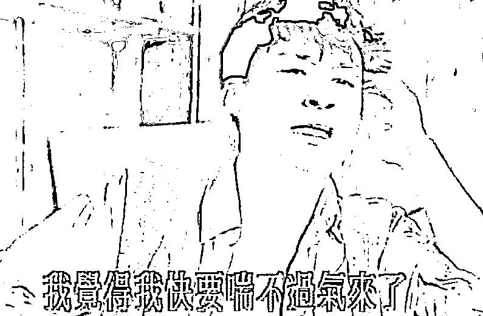

# 感情太丰富，容易多情却被无情恼

> 原文：[`mp.weixin.qq.com/s?__biz=MzU3NDc5Nzc0NQ==&mid=2247514124&idx=1&sn=24d7b9d03add9cfd90853911c5b37a0b&chksm=fd2e1ad2ca5993c48fb2e4952fa99438bae1f63697ebda52c566b42cb2ad4d58dd8cc363aa23#rd`](http://mp.weixin.qq.com/s?__biz=MzU3NDc5Nzc0NQ==&mid=2247514124&idx=1&sn=24d7b9d03add9cfd90853911c5b37a0b&chksm=fd2e1ad2ca5993c48fb2e4952fa99438bae1f63697ebda52c566b42cb2ad4d58dd8cc363aa23#rd)

今天是来回答读者问题的，一部分读者。 

我们大号每天的留言有几百条，后台发的消息也有上百条，留言是有字数限制的。为了绕开限制，后台发长消息的人，不乏那种写万字长文的，就是人家直接发了个链接过来，[比如昨天大号聊的](http://mp.weixin.qq.com/s?__biz=MzU0MjYwNDU2Mw==&mid=2247504444&idx=2&sn=23776119d9161abb2980d17ce56257b3&chksm=fb1abe40cc6d3756d6f3e642a9be446b586241609efcd9facba9f15ae8b68616543a64e11488&scene=21#wechat_redirect)。

我没有能力都去处理。大号每天能够加精的上限只有一百条，别问我，微信规定的。能被加精的一定是情绪平和的表述，那种情绪过于饱满的，即便我给你加精，也会被微信团队去掉的。

所以老有读者问我，那些情绪饱满的读者问题哪儿来的，为啥他们看不到。因为微信团队为了你们的身心健康着想。

说实话，你们看了也没啥意思，因为言语过于激烈了。你比如[那天大号聊加强遏制高彩礼](http://mp.weixin.qq.com/s?__biz=MzU0MjYwNDU2Mw==&mid=2247504396&idx=1&sn=6e8529e9e2976a4fbbe7127066566d79&chksm=fb1abe70cc6d3766bef78d0ff8459fe8d624c47e318c0100b8565c0f49c6e1870f81267d291c&scene=21#wechat_redirect)，后台发消息发出千字长文的，就有两位数。 

这里面不乏非常离奇的婚恋过程中的各种现实的矛盾，男的女的，都有。

但是如果你要一言以蔽之，也非常简单，无非遇到了渣男，或者渣女。有一段不幸的感情，或者婚姻。

对于这种问题我的看法其实非常简单，那就是你有拒绝权。婚后你有离婚这个选项，婚前你有分手这个选项，哪怕是谈恋爱之前，你都有拒绝异性的权力。

你有的，始终有。

就像我每次对于投资亏钱的人，或者被骗的人，我的看法只有一点，你明明可以选择不。

如果你不投资，你就不会亏钱对吗？ 

如果你只进最大的，排名前几的，国家认证的法定的金融机构，且你能够完全读得懂法律条款的情况下，你就不会被骗，对吗？

我这话说出来很多人不舒服。 

他们可能会跟我说，凭啥不让我投？我投了凭啥让我亏？或者说，凭啥我只能进国家认定的最大的几个银行？而且就算是，就一定不会被骗吗？也不一定呀。有时候我看不懂条款，人家员工为了拿佣金，把 R5 风险的产品卖给了风险评估只有 A3 等级的我，那不还是骗了我么？

你说得都对。 

但是跟我这个人从小到大的思维模式，不太吻合。 

我这个人很少去思考谁骗了我，我更多的时候习惯于思考，我自己还可以做什么。 

你比如我亏钱，我首先会想，这是我要反省的，因为是我决策要投资的，密码我不输入，钱是不会离开我账户的。 

你再比如，如果我被骗，我还是会自我反省。因为多半是我选择了不够安全的平台，比如非国家认定的，又或者，是我没有熟读法律条款，人家故意把 R5 等级的产品卖给风险承受能力不足 A5 的我，而我未能识别。 

这是我一贯的思维模式，这个模式饱受抨击，很多人读者都很反感，觉得我这是受害者有罪论。 

我没有推广的意思，我仅仅是在说我，我就是这么一个性格。 

我的性格底色的思维方式就是这样，以至于我很难与你发生共情，虽然我很想安慰你点什么。 

大号那天写的，[乌克兰不需要同情，这个世界也不相信眼泪](http://mp.weixin.qq.com/s?__biz=MzU0MjYwNDU2Mw==&mid=2247504286&idx=1&sn=3bc0b22c9fa865d5ab2e317c57144f47&chksm=fb1abde2cc6d34f41ff75ad67c1cfc4dcb5e07b48e7da8cf5cf8f25bfaacd3710d2e8040f6a3&scene=21#wechat_redirect)。 

我在里面披露了一段童年的往事，我打小就不是一个很喜欢与他人共情的人，或者说，我本人也不太需要别人与我共情。

你看我小时候即便遭遇校园暴力，也不会对家人讲。那不是我隐忍或者克制，而是我其实别的也不会讲呀。 

我考了全年级第一，也不会跟家人讲的，我拿了什么大奖，也不会与家人讲的。

你以为我是个博主，就是个感情丰富，很理解他人，或者很需要他人的认可的人？

实际上，这是互联网技术带给你的一种错觉，互联网的这种一对多的分发模式，让你产生了一种对面坐着一位知心大叔的感觉。

但实际上我小时候外号机器人，成年后外号人工智能。 

我有些朋友，认识我十几年了，都没有和我一起喝过茶，聊过天。我是指聊工作之外的事情。

我举过这个例子，曾经有个合作伙伴来拜访，还是我师兄。他掐着饭点来的，想着聊一会儿，一起吃午饭。结果半个小时我们就把战略合作协议签了，以至于时间距离饭点不尴不尬，他只好告辞，我后面排着的还有会议。 

现实中我说话语速很快的，如果刚做同事，基本上都听不清我在说什么。而且我还有一个习惯是跳跃。跳跃就是此处省略一万字，我假设你都明白了，直接往下进行。 

所以，你们平日里看到的文章是需要整理的。这就是平日里我常说的，讲话是要看对象的，有的人可以五倍速快进给他听，可以越过各种案例，比喻，因为默认对方全懂。

但是对于更多的人讲话，你就要就着大家的实际理解能力，一点一点，耐心的，慢慢的铺垫过去。 

回到正题，我举这个例子，是告诉你，咱们性格不同，而很多时候，**正是因为这种性格上的不同，使得我不需要遇到你遇到的那些困境。** 

我不管你是做什么的，你假想一个场景。 

假如你的收入，在现在的基础上乘以十，很多曾经是问题的问题，是不是就消失了？

其实是会消失的，因为如果你的收入乘以十，你遇到的所有人，都会变，整个朋友圈都会变，你遇到的所有事儿，也都会变。 

我不是说世界会变美好，不是的，世界该咋样还咋样。但是你曾经遇到的那些问题，就不会再遇到，你曾经需要处理的那些事儿，就不需要你再去处理。

这是你收入乘以 10 之后显而易见的好处。 

还有另一个好处。 

你觉得凭什么乘以 10 呢？一个健身的人，他一定是整个生活方式都发生了改变。所以一个收入乘以 10 的人，他一定是整个工作方式都发生了改变，否则凭啥给你呢？

当你整个工作，生活的方式都发生了改变，你就会变得很充实。每天有很多事情等你做，你就没有时间陷入那些复杂的情绪。 

比如琢磨，他是怎么看我的呀，你不会琢磨这些，因为你没空了。 

我有没有投资亏损？当然有过，有没有时间悲伤？当然没有。 

因为太忙了，我又不是只有一笔单子要处理，我每天有很多事情要处理，这里亏损那里赚，如果我选择为失去月亮哭泣，那我还会错失太阳。 

我有没有被骗？当然有过，有没有时间愤怒？当然没有。 

如果你每年只需要处理一个决策，被骗了一整年都情绪低落，那这当然是你生命中重要的组成部分之一。 

如果你每年要处理上千个决策，你唯一关心的话题只有一个，那就是自我检讨，提高整体决策效率和成功率。

我基本上没有感情经历，我第一次也是唯一谈恋爱是 20 几年前，然后就结婚了，是我太太主动的，我是被倒追的，还是本科生的时候。 

站在我的角度上看，如果你觉得女生不好，那终身不娶就是了，如果你觉得男生不好，那终身不嫁就是了。 

事实上我今天回想起来，如果我大学里没有谈恋爱，读研的时候没有结婚，那么恐怕我到今天都未婚，因为此后的岁月里，我几乎没有和谁谈过工作之外的事情。 

写这篇文章之前，我稍微回忆了下，如果把我工作之外的闲暇时间做个统计，似乎 99%都分配在我儿子一个人身上。

你看到了，如果你来问我育儿的烦恼，或许我还有些想法。如果你来问我，他为什么不爱你，她为什么要骗你，这个世界为什么不美好，我很难回答。

因为我的性格让我错失了这些经历，我过于全神贯注了。

回到我打过多次比方的那个理论，白炽灯的问题不仅仅是发光效率低，它还有一个问题是损耗率高。

发热本身就会损坏灯泡，热量非但无用，而且会导致灯泡易坏。LED 的优点不仅仅是发光效能高，而且低热量本身就可以延长使用寿命。 

当然，这仅仅是一种建议。有很多人是不认同的，比如我就收到过某些读者跟我讲：

西风，都做有用功，谁去做无用功呢？都去做事半功倍的事情，谁去做不打粮食的事情呢？都杀伐果断了，谁去犹豫哀怨呢？

我就要事倍功半，我就要劳而无功，我就要陷入情绪，我就要做没有结果的事，我就....... 

打断一下，我理解你，你去找你舅吧，只要你舅妈没意见。其实我很能够理解，有些人一定要活在琼瑶式的情绪下。

但是很遗憾，我真的帮不到什么，因为你是马景涛的粉丝，我不是嘛。

