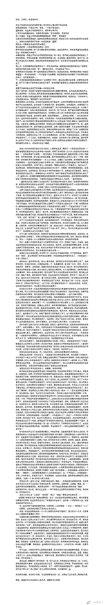
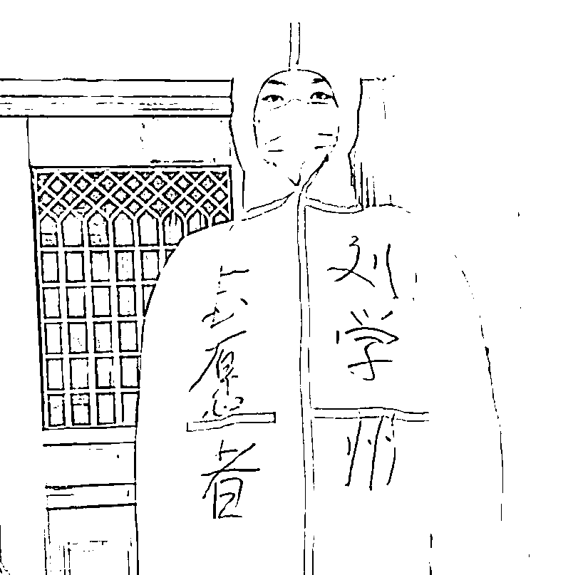

# 刘学州想要的那东西叫做家，而不是房子

> 原文：[`mp.weixin.qq.com/s?__biz=MzU3NDc5Nzc0NQ==&mid=2247512273&idx=1&sn=90128b33ba945de9fcb622de2d9e9144&chksm=fd2e120fca599b19812ca674bc06dc004050bf2e0348d5ab46273547e6f3379ec50ddc73f1f5#rd`](http://mp.weixin.qq.com/s?__biz=MzU3NDc5Nzc0NQ==&mid=2247512273&idx=1&sn=90128b33ba945de9fcb622de2d9e9144&chksm=fd2e120fca599b19812ca674bc06dc004050bf2e0348d5ab46273547e6f3379ec50ddc73f1f5#rd)

昨天，那个河北寻亲的男孩，留下一篇标题为“生来即轻，还时亦净”的长文，结束了自己 15 岁的一生。

出生就被父母卖掉，四岁失去养父母，备受校园欺凌，而后被网暴，而网络暴力的原因，始于他的寻亲。 

他想要找到的那东西，叫做家，但是在他刚出生就卖掉他的所谓父母眼里，又怎会给他？ 

他的生母，成功的引导了舆论，让大家觉得他想要的是房子，一个 15 岁的孩子，每天在网络上被人骂，骂的理由是：

他竟然想要一套房子.......

说实话我觉得没必要回应，这世上不是所有人的声音都值得回应，何况只是些网络上的喷子。 

但是有句话我还是想说，我想替这个孩子说出来 ，那就是我们的标题。 

这孩子想要的，是一个家，不是一套房子。 

我知道他不死，网络上那些人不会信，也不会理解，但那些不重要，不重要的是人，不是事儿。

那些人，不重要。

说句大言不惭的话，你把全中国的喷子加一块，还没你风叔脚面高呢。 

我这不是侮辱他们，我这是抬举他们。 

换言之，这孩子太傻，竟然为了这么群玩意儿，草草地结束自己尚未开始的生命。 

一个孩子，想回家，是本能，天底下所有生物的本能。 

河南省那个县长，为什么一句“恶意返乡”上了热搜？就因为他违背了生物的本能。 

你说《笑傲江湖》里岳不群是个什么玩意儿？小人都不算的玩意儿，可即便如此，令狐冲也不愿意叛出华山，为什么？ 

金庸先生告诉过你，令狐冲是在华山长大的，他视岳不群为父，视宁中则为母，视华山为家。

令狐冲不知道自己仰仗独孤九剑早已横扫天下吗？他知道。 

可是岳不群打他，他依然不愿意还手。 

你知道人类是怎么驯服大象的么？是在它幼年的时候。 

驯象人幼年的时候驯服了那头小象，它成年后，无论你怎么伤害它，打它，奴役它，让它遍体鳞伤，它都不忍心反击。 

你注意，是不忍心，而非不能。 

你以为大象傻的么？它不知道一脚就可以把这个人类踩成肉泥？ 

它知道，它不忍心，因为它视你为家。

知道《勇敢的心》里面身经百战的威廉·华莱士为什么那么伤心，伤心的跌下马来，难以置信？

因为他不理解。

他理解英格兰人恨不得剥他的皮，可是他不理解为什么连苏格兰的王也会出卖他，向英格兰人出卖他。 

他视苏格兰为自己的祖国，视苏格兰的王为自己的家，他不明白为了自己的家浴血奋战，却被至亲出卖。 

这样的出卖，这个年幼的孩子，这个比我的孩子大不了一两岁的孩子，经历了很多次。 

他出生就被父母出卖，长到十几岁，再次被出卖。前者是身体，后者，是身心。

他以为那些网民是他的族人，很遗憾，那些喷子只是些垃圾。 

即便如此，他依然去做志愿者，去抗疫的前线，与其说他想得到认可，不如说，他想要有一个家，一个鼓励他，承认他，信任他的地方。 

但是得到的，只有谩骂。 

他的生父骂他是网络乞丐，他的生母拉黑他，说如果早知他今日会冒出来干扰她现在的生活，还不如当初就让他死，而不是卖掉他......

他一个 15 岁的孩子，令狐冲经历过的他经历过，华莱士经历过的，他也经历过。

他最终如愿，如这群人的意愿，选择去死，临终前，把自己辛辛苦苦打工攒的钱还写了一份遗嘱，留给自己养父母那边的姥姥姥爷，叮嘱舅舅舅妈照顾好他们。

这是他留给这个世界最后的样子。

人已经走了，我不想说什么，因为说什么，都无济于事。 

但是希望年轻人，遇到各种痛苦遭遇的年轻人，不要学他。 

大仲马借基督山伯爵的口说过，人生的秘密，只在于五个字：等待与希望。 

你再等一等，怎么就知道不会遇到风清扬，怎么就知道不会遇到任盈盈呢？ 

人间不值得，但等待很值得，因为等待当中，才会有希望。