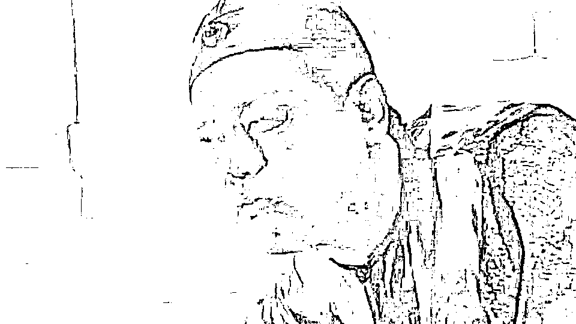

# 如果秦始皇的坟修的跟霸陵一样简朴，那当地农民哭晕过去了

> 原文：[`mp.weixin.qq.com/s?__biz=MzU3NDc5Nzc0NQ==&mid=2247510587&idx=1&sn=8e630f71b86fb806a2c53dc0b0a1ea68&chksm=fd2e08e5ca5981f381a18e5f62d4840f2af517d823d1b80c9930c5e17116c2f3b25c2b8acb2a#rd`](http://mp.weixin.qq.com/s?__biz=MzU3NDc5Nzc0NQ==&mid=2247510587&idx=1&sn=8e630f71b86fb806a2c53dc0b0a1ea68&chksm=fd2e08e5ca5981f381a18e5f62d4840f2af517d823d1b80c9930c5e17116c2f3b25c2b8acb2a#rd)

近日，位于陕西省西安市白鹿原上的江村大墓被确认是汉文帝的霸陵，这是考古界的重大发现，刷了屏。 

有读者转给我一篇文章，某个文人写的，对汉文帝极尽吹捧，说他是古往今来唯一的圣君，其他都是.......，反正各种脏话吧。

尤其点名了秦始皇，这那那这，都是脏话，我不提了。 

读者问我怎么看？ 

这个问题很容易解读，咱们来假想一个场景。就比如你们家好了。 

你爸爸是个很 NICE 的爸爸，每天早上起来给你做早饭，送你去上学，晚上接你回家，督促你做作业。 

这是不是好爸爸？当然是。

咱们再换一种，你爸爸打小就没有陪在你身边，而是只身前往深圳，打工去了，十几年都让你独自在老家成长，你十分缺失父爱。 

但是长大了之后，你去深圳读了大学。你发现爸爸通过十几年的努力，让你们家在深圳定居了，你住在一套 2000 万的房产中。与同学的相处中，你得知大部分人终其一生，也无法在这座城市里定居，而你，却可以通过继承。

这是不是好爸爸？当然也是。

你把这个故事，从一个家，扩大到一个村。 

有的村长比较安耽，大家想干嘛干嘛，从来不折腾。有的村长很爱折腾，非要修条路，非要去种树。

在当时看，肯定是跟着安耽的村长更舒服，但是从长远的角度看，前人种树后人乘凉，种树的村长同样是有价值的，只不过价值是持续释放出来的，释放给了后人。

你把这个话题，搁在汉文帝，秦始皇身上，仍然是一样的。 

汉文帝休养生息很伟大，秦始皇一统六合八荒同样伟大。

如果没有秦始皇车同轨，书同文，我们今天跟印度一样，大家说着不一样的语言，彼此不认同，根本无法形成一个统一的大市场。 

你想去印度么？去生活一段时间，你就会理解秦始皇的价值。

你在当时看，当然怨气大于佩服，那是必然的。 

作为秦人，秦始皇修长城，他能感受到好处么？感受不到的，长城的军事作用是后期才能发挥的，但是当时去做劳役的，是他本人。

你就包括秦始皇修帝陵，始皇帝陵，当时的人自然觉得这就是给他一个人享受用的，那当然怨声载道。 

问题是，**任何东西，无论修建者是为了自己还是为了子孙，要不了几百年，都会归于大众。** 

你问问今天陕西省西安市临潼区的那些人，你问问他们感谢不感谢秦始皇修坟？

太感谢了。

如果秦始皇的坟修的跟汉文帝的霸陵一样简朴，那当地的农民哭晕过去了。 

你知不知道，骊山脚下有多少餐饮，酒店，娱乐行业的人，成天就吃秦始皇这碗饭？

就一个土堆，就一个坟包包，没有打开的，全凭想象，每年创造很多亿的收入，全世界的人都去看。 

农民在家里随便拿土照着兵马俑的样子烧个小泥人，就可以卖钱，卖 IP 的钱，让一家人过的很滋润。 

哪怕啥都不干，收收游客们的停车费都能买房买车了。

看懂了吧？这就是我说的，价值是持续释放的。这些农民没有谁姓嬴。没有谁是秦始皇的子孙，但是充分的享受了红利。

回到前面那个家庭里的故事。 

如果你是这个爸爸身上的比如胳膊，比如手，比如腿，比如脚，你会发现跟着他很累很苦，十几年如一日在深圳创业，睡地板，你恨不恨他？恨他。

可是他的儿子，一长大，就有婚房了，深圳的大平层。即便不住，也可以出租，租金比自己上班的月薪还多，开不开心？

当然开心。

看到了吧，站的角度不同而已。

我并没有给你举秦始皇那些大一统领域里的历史财富，我仅仅随便举个修陵墓，类似法老王修金字塔式的举动，一样能让你看到秦始皇的价值。

就包括隋炀帝，隋炀帝是不是昏君？当然是。问题是，仅仅看开凿大运河这件事，有没有功？当然有。 

他开凿大运河这件事的红利，持续释放了上千年。虽然对于当时的人，确实很苦。

所以不要去听信文人胡诌，你应该问问他，他自己到底做过些什么？做成过些什么？ 

他是一无所有跑去深圳，创业定居？还是每天早上起来给孩子烧早餐？

我只怕这帮文人啥也没做过。

文人嘛，晚上喝酒喝的酩酊大醉，早上不起睡到日上三竿，美名其曰：寻找灵感。

这种人的话，值不值得信，你品，你自己品。

或者，你反问他一句，你这些评价秦始皇应该把坟修小一点的话，敢不敢去骊山脚下对着当地世世代代吃秦始皇旅游饭的农民们说？

你看当地的村民们不把他打成多隆才怪。

