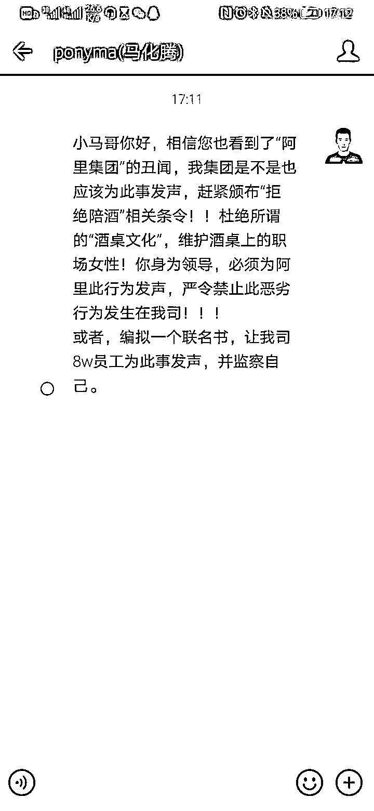
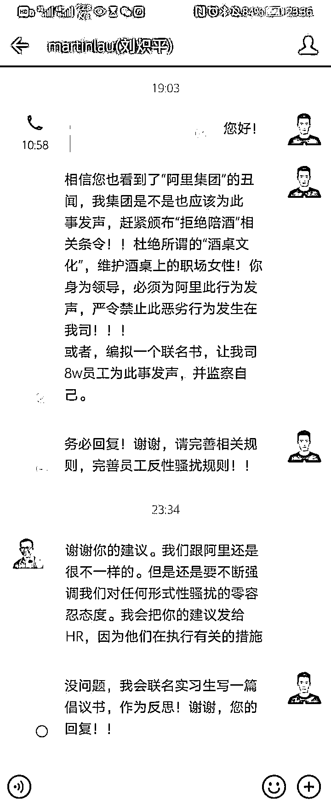

# 腾讯实习生的重点在“务必回复”上吗？

> 原文：[`mp.weixin.qq.com/s?__biz=MzU3NDc5Nzc0NQ==&mid=2247505930&idx=1&sn=44dd6e0f1604bedb3e9870764d543cbb&chksm=fd2e7ad4ca59f3c230bdb37015b054ede208230a935d542eb93a2531160d627097ee884f617b#rd`](http://mp.weixin.qq.com/s?__biz=MzU3NDc5Nzc0NQ==&mid=2247505930&idx=1&sn=44dd6e0f1604bedb3e9870764d543cbb&chksm=fd2e7ad4ca59f3c230bdb37015b054ede208230a935d542eb93a2531160d627097ee884f617b#rd)

有些读者问我怎么看腾讯实习生晒出来的这张图。 

图中显示，这个实习生，直接发给了 pony 一条信息，但是对方未读。

未等来回复后，心急的他又继续向总裁刘炽平继续提议，结果得到了回复。

有意思的并不是回复的内容，吸引网友注意力的是这个实习生措辞的语气。

他在发消息的时候，以命令的语气备注：务必回复。 

我觉得这事儿吧，挺悬的，幸好刘炽平回复了，否则不知道网络上会怎么传。

站在客观的角度，我相信这个实习生是出于自我炒作的目的。 

如果你说他发给小马哥的那条消息还带有一定的投石问路，或者说试探性的意味，那么他发给总裁的这条消息明显就是个坑。

小马哥毕竟是老板，理论上讲，人家没有处理常务的义务，或者说，不读消息很正常。

但作为总裁，实际上要时时刻刻对公司在媒体，在网络上的风评负责。

如果，我们说如果总裁已读未回。

我相信这个实习生一样会火，他接下来的炒作方向很可能是用极端行为表达自己的失望。

他会因公司未能尊重自己的意见，公开表示失望，接着辞职，反正是个实习生嘛，他在公司内的沉没成本很低。

但是这个举动，很符合炒作方向。

你仔细想一想，一个男生，为女生发声的男生，直接向总裁下命令，没有得到回复，愤而辞职。

这一套组合拳打下来，即便第一步不火，接下来辞职的那一步也很大概率会被媒体注意到。 

于是，他就可以踩着公司上位了。

当然，现实中是另一种演变，那就是总裁刘炽平回复了，表示尊重你的意见，并且接下来要有所行动。

那这个实习生，火是必然的了，你看到他在回复总裁的回复中已经意识到后面要做什么了。

他表示，自己要联合实习生，一起写一篇倡议书，如何如何。

这一点反映出该人早就意识到自己的目的达到了，自己要火了，所以在留言的时候就做好了下一步的准备，要出圈，让自己火的更大。

接着，他把这个以第一人称的聊天记录截图，发送出去。

到此时，他的目的已经达到了，就是身为一个实习生，指挥过小马哥，指挥过腾讯总裁，并且真的有推动腾讯文化建设。 

你注意，虽然听起来有点扯淡，但这真成了人家的履历之一。

如果你要问这对一个人有什么用？那要看他从事哪方面的工作，如果他从事营销或者媒体方面的工作，这段经历的确是亮点。

在任何老板看起来，这套组合拳打下来，都说明这孩子很懂营销，很懂传媒，很懂得如何操控大众的预期。

当然了，从互联网的角度看，他目前得到的批评远大于表扬。 

这很正常，博出位的迹象太浓了，或者说，他的这个手法就像脑白金的台词，送礼就送脑白金。

效果是非常好的，确实是四两拨千斤，以极小的代价一下子完成了传播的目的，当然，通常这种手法也都是挨骂的。

不过，我相信，人家已经想到了，这也是他打算付出的成本，他觉得得到大于失去。

因为我看到了随后又传出来的一张图，这张图也是他自己贴出来的，看来他嫌传播力度不够，还要在自我炒作的途中加一把火。

这张图，是他和他爸爸的对话。

这名实习生的父亲，是上市公司天士力的营销副总。

他跟他爸的对话与之前给小马哥，给公司总裁的对话如出一辙，也是以命令的语气告诉对方，你身为你们公司的领导，要对这种陪酒文化零容忍，要管理好你的下属，要杜绝破冰，酒桌等等不良习气。

他爸爸的回复也很有意思，表示很赞同，要落实，等等等等。

这段父子的对话，我个人倾向于是事先商议好的。换句话说，这是一次冠冕堂皇的为了截图而生成的父子间的对话。

作为上市公司营销副总，他的父亲显然看得懂儿子需要什么，你需要老爸扶上马送一程，那就送你一程，给你当一回台阶。

网络上大部分人对此事的重点都落在了这名实习生的语气和他的出身上了。大家都在说，以一个实习生的身份对总裁，对董事长下命令的语气，还要求对方务必回复，是一种职场上的僭越。 

也有人说，难怪会得到回复，原来爸爸是另一家上市公司高管......

这些评论，没有抓住重点。 

天士力是一家小公司，市值只有 200 亿左右，这种公司的副总，站在腾讯的面前，其实跟下面的小部门经理没有区别的。 

十年前，我在甲方做架构师的时候，我们集团下属的子公司上市后，市值也在千亿以上。 

下属子公司的副总，回到集团总部，大约也就相当于二级部门经理。

那么在商务谈判的时候，我们当时没有与腾讯合作过，不清楚，找个对等的，比如阿里，阿里的体量和腾讯差不多。 

我们出去谈，阿里一般来讲，派出的最高职级的就是 P11，如果我们派二级部门经理这种人去谈，阿里顶多派 P10，或者 P9 就把你打发了。 

理解这意思了吧。

P11 大约就是蒋凡降职后的位置，我这是为了便于读者理解，实际上阿里是两条线，P 和 M，M 可以与 P 之间有个等同关系，我一直说 P，读者容易理解。 

那么蒋凡没有降职之前，可是相当于 P12 的，即便那时候，他上面还有老大，他的老大，才是向马老师汇报的。 

所以你大概能够理解这种地位差。我们集团当时下属的千亿市值以上的子公司的副总，如果跑去直接找马老师，或者总裁，肯定是见不到人。

再往下，P12 也见不到，P11 也见不到，他直接去拜访，顶多见到个 P10。而 P10 与马老师，那太遥远了。

所以网络上盛传他是什么高管之子，所以被总裁高看一眼，这是不了解行情的 YY。 

别说他，他老爹亲自拜访，腾讯也不可能由总裁接待。 

所以这一点不重要。 

那么重点就剩下语气了，这孩子语气显得有点无礼。但我觉得，这其实也不重要，这恰恰是人家策划好的。

一个实习生，你想红，就得带给互联网不一样的点，如果每个点都循规蹈矩，那就无法引起争论，没人议论，你就红不了。 

所以他这种无礼的语气，恰恰是他激发互联网爆点的关键。而得到了鹅厂回复，又使得这个爆点被引燃了。 

那么你说，整件事是他一个人把大家都耍弄了，最终达成了目标，是这样么？ 

其实我个人觉得，整件事是双赢的，另一个赢家就是鹅厂本身。

一个实习生，以这么无礼的口气质询总裁，总裁及时回复，如果联系到前段时间阿里的表现，那简直是把阿里按在地上摩擦。

阿里的一个员工，那么严重的案子，十天了，遇到 P9，P10，都是已读未回。阿里的总裁更是被瞒了十天后表示愤怒，震惊，羞愧。 

这边鹅厂，人家一个小小的实习生，正式员工都不是，自己想了一个话题，就直接找大 BOSS，还要求务必回复，马上就得到了回复。 

这个对比，真的太鲜明了。

当然，我不太相信那是总裁亲自回复的。

因为根本做不到，人家管那么多人，每天那么多事儿，来自商界的，政界的，客户的，员工的，太多了。别说实习生，哪怕自己直管下属的消息都未必能逐条看过去。 

所以这种回复，想必是总裁办代办的，也就是有专门的秘办来处理。

但是，有人处理就说明腾讯内部真的好强大，人家的内部管理真的很畅通，起码消息渠道建立了，从最底层到最高层，消息是畅通的，这一点，阿里真该好好学学。

跟腾讯学一学，企业的管理。