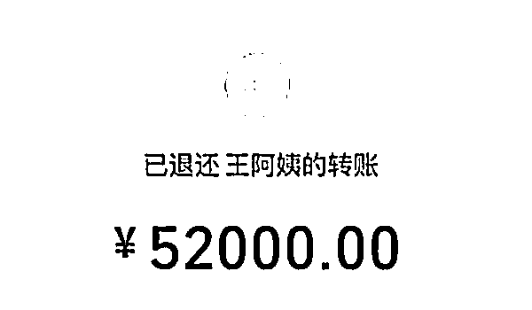

# 没有什么哪条路是容易的，包括“阿姨我不想努力了”

> 原文：[`mp.weixin.qq.com/s?__biz=MzU3NDc5Nzc0NQ==&mid=2247503370&idx=1&sn=b5968719ed284c29effccefe1a98f283&chksm=fd2e6cd4ca59e5c28cdd6ffdbf59c34d9940a7652d78fc22901766f7824fb389c3bfdfa9ba74#rd`](http://mp.weixin.qq.com/s?__biz=MzU3NDc5Nzc0NQ==&mid=2247503370&idx=1&sn=b5968719ed284c29effccefe1a98f283&chksm=fd2e6cd4ca59e5c28cdd6ffdbf59c34d9940a7652d78fc22901766f7824fb389c3bfdfa9ba74#rd)

读者发给我一张很有意思的图片，是来自 520，传说中撒狗粮的节日。 

图片是这样的： 

呵呵。

评论也非常有意思，马上有很多人问，阿姨还需要别的朋友么？ 

或者说把微信推给他，他来把握...... 

这是一个很有意思的话题，如果你配合前几天的文章《[一本正经的胡侃男女比例失衡问题的解法](http://mp.weixin.qq.com/s?__biz=MzU3NDc5Nzc0NQ==&mid=2247502982&idx=1&sn=ca033cc04b2b38681c2ad53325c19671&chksm=fd2e6e58ca59e74e18d051be291f958d337d5491280d6f90af41d0142f6a005746a55d1f2947&scene=21#wechat_redirect)》。 

前几天我算过一笔账，我说男女失衡的问题，是与年龄紧密相关的。

过了 30 岁，女性的比例就几乎恢复到和男性差不多了，此后，女的活得久，所以越来越多，到了 95 岁，老太太更是老头子的三倍还要多。

所以找不到女朋友的小鲜肉不要急，还有王阿姨在等你。 

这不失为有志青年少奋斗十年的捷径之一。 

当然，从回复者留言就能看出来，这年头啥都卷，各行各业竞争都很激烈，连吃软饭也很卷。

说到底，王阿姨少而小鲜肉多，软饭也不是那么好吃的。

别说软饭没有那么好吃，哪怕富二代都未必如你想的那么好做。 

我给你打个比方。

曹丕的出身够好了吧，曹操的儿子，长子曹昂死了，他就是长子。妥妥的富二代，而且是二代里面最正的，嫡长子死了，他老娘被扶正了，他就是嫡长子嘛。

曹丕够聪明够勤奋了吧，《典论》就是他写的，他与曹操，曹植在文学上，那是齐名的，一点水分不掺。

可你知道么？曹丕 17 岁就得了肺痨，得了却不敢医治。从这点看，他比[昨天大号写的 2013 年就得了肺癌，只在地产富豪榜首位待了一星期的左晖](https://mp.weixin.qq.com/s?__biz=MzU0MjYwNDU2Mw==&mid=2247498914&idx=1&sn=de8c3fbff32839d51965eb29d39e72b8&chksm=fb1a90decc6d19c84aab7656c2acf8823d5c6bc71d93226f996f324c2daa0b551f7a2fed0b7d&token=699748830&lang=zh_CN&scene=21#wechat_redirect)还要惨，起码人家左晖有病去治病。

为什么曹丕生了病都不敢治呢？怕父亲知道，曹操要知道他有这种病，还会传位给他么？

所以曹丕只活了 40 岁，这就是强行争储的代价。

不容易啊，为了从一众富二代之中脱颖而出，真心不容易。

可是他有的选么？他不这么做，他，和他的子孙，终将与大位无缘。虽然这大位也没传几年。

有人可能觉得，曹丕是因为想要的太大了。我不要那么大呀，我只想财务自由，安安分分的过小日子。

但很多人忽视了一个问题。

**你得到的大不大，与你的本金有关，与你付出的代价，未见的有关。**

能听懂么？

你就算有曹丕不要命的狠劲，你不是曹操的儿子，这事也轮不到你想。

我记得有本电视剧《你迟到的许多年》是黄晓明演的，在影射华为早期创业的故事。黄晓明和他带领的那些兵，都是丙等兵。就是工程兵。挖隧道的。

他们病了，拉肚子，不治疗，死撑着继续追进度，为啥？

因为对他们来说，没有别的选择，他们只有进度超越别人，不被部队裁，才不用回到那个贫苦的家乡去。

对他们来说，前途，比命重要。

他们要付出和曹丕一样大的代价，换的，也许只是一个继续当兵的机会而已。

同样的代价，结果不一样，是因为他们的起点太低了，本金太小了。

很多人问，有没有办法可以活的轻松一点，答案是真没有。你要想身体轻松，你脑袋就没法轻松。

这就是我经常讲不可能三角形，不可能三角形的意思就是说，你总得放弃点什么。你不能什么都要。

人想活的自在一点，凡事都任性，方法很简单，你手里拥有太多选择。

那怎么才能让自己处于这种拥有大量的选择，拥有各种彼此对冲的筹码的优势位置呢？

只有学习，只有思考。凡事你都先知道，凡事你都更高明，这就是趋吉避凶唯一的途径。

当然，学习，思考，本就是最累最辛苦的，这仍然是另一种形式上的不可能三角形。