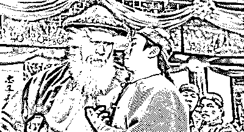

# 与其聊特斯拉维权，不如聊聊你当初为啥要买特斯拉

> 原文：[`mp.weixin.qq.com/s?__biz=MzU3NDc5Nzc0NQ==&mid=2247502074&idx=2&sn=a1288271cdad957e3473f69d8cdf5b94&chksm=fd2e6a24ca59e332f276c16285ae5cc51b869f91f95e3e2947cc39acf51d91ca2c13c7b88235#rd`](http://mp.weixin.qq.com/s?__biz=MzU3NDc5Nzc0NQ==&mid=2247502074&idx=2&sn=a1288271cdad957e3473f69d8cdf5b94&chksm=fd2e6a24ca59e332f276c16285ae5cc51b869f91f95e3e2947cc39acf51d91ca2c13c7b88235#rd)

有读者很想听我聊这个特斯拉女车主，她在上海车展会上被特斯拉的几个工作人员给抬出去了。 

当然了，这件事情上，她的做法有待商榷。维权应该走法律途径，不该在车展上，爬到车顶上，这样容易引起聚众踩踏，对她自己也不安全。 

随后特斯拉的官方回复非常特斯拉，激怒了网民。 

特斯拉的回复很简单，就是一切都和我们无关，反正肯定不是我的错。你说刹车失灵造成了人身伤害，有可能是路不平，有可能是你不行，反正肯定不是我们的问题。 

这件事后续肯定会有各种交涉，甚至扯皮，比如鉴定，也比如诉诸媒体等等。 

但是我并不想聊这个话题，我想聊的是：

**我们为什么要买特斯拉？或者说，当初这个女车主，她是出于什么原因买的特斯拉？我觉得这一点才对更多的读者有参考价值。**

毕竟已经购买特斯拉的读者是少数，买了特斯拉遇到故障的读者是少数里的少数。而尚未购买特斯拉的读者才是绝大多数。 

我觉得服务于绝大多数读者，要比服务于个别读者更重要。 

说到买特斯拉，我们首先要弄清楚人家特斯拉在卖啥。

看过特斯拉的车子，尤其是拿特斯拉和其他品牌的传统汽车做过对比的人应该很清楚。

特斯拉卖的肯定不是品质，也不是性价比。

在同等价位的情况下，特斯拉的内饰简直是粗糙到和比它便宜两个价位的车子有一拼。 

这还仅仅是直观的感受，其他方面就更不必说了。有兴趣的可以去自行对比。 

我觉得特斯拉真正的卖点在于酷。 

提到特斯拉你就想起造火箭的，因为是同一个老板。你当然知道火箭技术不会用在车上面，但是同一个老板，就让特斯拉天然带有酷的因素。

只要酷，就能吸引购买者。你花同样的价钱只能购买 BBA 的入门级，可是你开一个国产的车子，别人不会知道你有钱没钱。要是你开个 BBA 的入门级，别人肯定知道你没钱。

能听懂这个梗吧。

所以特斯拉就成了一个很好的选择，它成功的分流了相当一部分刚刚够得着买 BBA 入门级又不想让人家觉得自己没钱的客户。 

毕竟买特斯拉，是一种酷的表现，是一种个性的表现。 

这才是特斯拉的卖点，理解了么？

你要知道，这一切并不是特斯拉销售之后才知道，对你来说也许是今天看了文章才知道。可是对于特斯拉的产品经理来讲，产品设计阶段就已经想清楚了价格策略，销售群体，以及别人为什么要买我们家的东西。 

他们早就想清楚了自己在卖什么，分流的谁家客户，然后才敢去做这件事。

我曾经多次举过一个例子，昔日我负责产品部的时候，公司做市场推广的策略是秀肌肉。

就是展现自己系统的性能，比如一台设备并发多少路，技术指标多少，或者说呈现出来的虚拟机技术，页面可以有多少特效，翻转，褶皱等等。

从市场的反馈来看，这么做效果很差，因为太技术化了。甲方主导采购的人未必能够一眼透过技术看到你的价值。

很多时候，客户是感性的，你要帮你的客户打动他的客户，他才能想到采购你的理由。

于是我让人做了一套演示系统，我要让客户直观的看到内容，看到我能为他们的客户带来什么感受。

我不再秀肌肉了，虽然我们是卖服务器的，但是我认为这样赚不到钱。

我让 UI 设计师开发页面，在展示系统里挂满了各种奢侈品，全世界各种五星级酒店的宣传页。 

你翻开我们任何一个虚拟机下的任何一张页面，里面挂的都是奢侈品。

布满了保时捷，百达翡丽，穿比基尼的名模，海边的别墅..... 

你仔细想一想，这跟我们的产品有什么关系？ 

实际上没有任何关系。

大哥，我是卖服务器的。我的服务器真正的价值在于能够跑多少路虚拟机，至于虚拟机上安装什么，关我什么事？

就像你买了一台电脑，回家后浏览电商，是看高端奢侈品还是逛拼多多，和这台电脑有什么关系？ 

技术人员当然知道没有任何关系，可是客户，未必那么想。

因为人，天然都是爱联想的。 

当你泡妞的时候，把女生约到一个非常高档奢侈的场所，她天然的就会对你产生好感。

因为她把场所和你联系在一起了。

她开始脑补，出入五星级酒店，就是你的生活。和你在一起，这是她的未来。

同样的道理，我利用了人的这种心理。我为什么特意嘱咐设计师，在演示系统里只挂贵的？就是这个套路。 

观看者不由自主的把演示系统里展示的商品和我们的服务器联系起来了。

他们愿意花更多的钱买我们这个在他潜意识里觉得高大上的玩意儿。

这就叫操控预期。

所以你想一想，你买特斯拉买的是什么？ 

买的就是这种酷酷的感觉呀。一个造火箭的为你造车，感觉很爽吧？

你的钱都拿来买酷了，都拿来买感觉了。酷劲儿过去了，回头你说开着不好使，当然不好使。

钱都给产品经理了，钱都拿去做演示系统了，钱已经落在你想要的酷上面了，你还想咋地？ 

又酷又好用？你咋不上天呢？

你打开方便面的盒子，问我牛肉去哪了？你说牛肉去哪了？

牛肉都拿去做宣传了呀，成本都拿来做宣传了，都拿来印图片了，都印到盒子上了，让你看到盒子上精美的图片了。

那打开后，里面当然没有牛肉了......

当然，我并不是说你不该买特斯拉，我只是请你再一次想清楚，到底什么是你想要的。

你不能说小孩子才做选择题，成年人啥都要。你不可能啥都要的。

你买入门级 BBA 的时候就该知道你买的是车标，同样价位去掉那个标志，你绝对能够在性能或者内饰上往前迈一大步。 

而你买特斯拉的时候就该知道你买的是酷，花 BBA 入门级的钱，却不用被人家嘲笑没钱，这个感受才是你真正买回来的东西。

所以我从来不买特斯拉，因为我没有酷的这个需求，更因为我很清楚，并不是所有车子都是拿来日常开的。