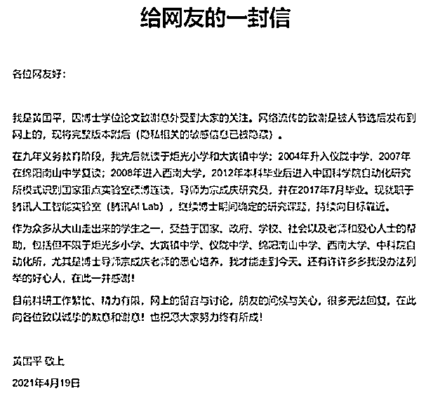
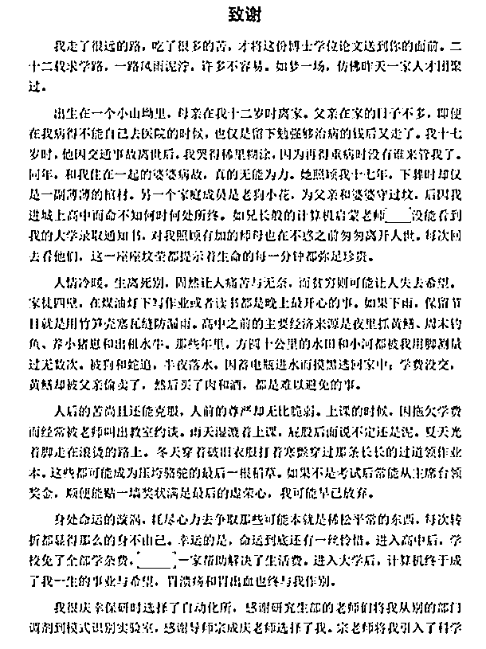
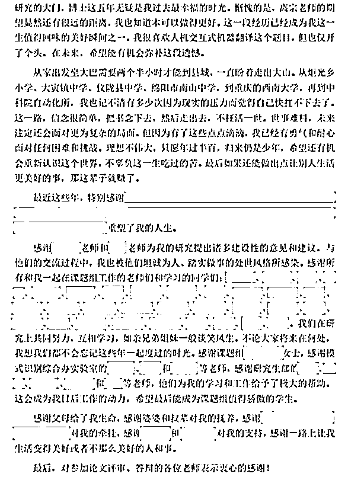

# 这个中科院的博士真的不一般

> 原文：[`mp.weixin.qq.com/s?__biz=MzU3NDc5Nzc0NQ==&mid=2247502046&idx=1&sn=67c0c40cf3af4c136951e0d097d381a0&chksm=fd2e6a00ca59e3167d0fb9c1537dc7371f61629dbf943048bcd4b2cc9da24222a86cdd36ed3f#rd`](http://mp.weixin.qq.com/s?__biz=MzU3NDc5Nzc0NQ==&mid=2247502046&idx=1&sn=67c0c40cf3af4c136951e0d097d381a0&chksm=fd2e6a00ca59e3167d0fb9c1537dc7371f61629dbf943048bcd4b2cc9da24222a86cdd36ed3f#rd)

中国科学院自动化所一个博士论文的致谢部分，在网上引起了大家的关注。因为他回顾了自己一路从山坳中走来的艰难历程。

打动了很多人。

没想到这个博士专门撰文向大家的关注与关心表示谢意，还特意隐去全部隐私，附上了全文。

非常有意思的一个故事，我们原文转载如下： 

这封信措辞很朴实，但非常精彩。读我的文字不如读他的故事。 

精彩的地方有两点，内容与时间。

**内容：**我看了三遍，没有看出哀怨，没有看出抱怨，没有看出消极，没有看出放弃。

我看到的就一个内容：我能做什么，当下的情况，我还能做什么。

能做什么就做什么，去做。

**时间：**从他十二岁到博士念完奔三了，这么多年过去，十二岁的时候没有写，十三岁的时候没有写，二十二岁的时候没有写，二十三岁的时候也没有写。 

那么多困难的时刻，我相信他有无数的话想要说，但是你注意，他都没有说。

一句话都没有说，藏在心里没有说。

他是什么时候写的呢？

是博士念完，拿到年薪百万的 offer 之后写的。

其实就一句话，掷地有声：我走过来了。

人与人之间有什么差别？其实也没有什么差别。 

无非有的人，他做到了。

当然，这并不是说做不到的人都是废物，也不是说没去做的都是懦夫。

不要讲有无数的阻力，即便没有阻力，很多人也是无法念完博士的。君不见多少硕博连读的最后都放弃了。

但是我觉得，撇开他实现的目标，有一件事，是普世性的，这东西是态度。 

所以我没有强调他做出的成绩，而是强调了他写的内容与时间。 

这两个点无一不体现出他的态度，他是乐观的，积极的，向上的。 

这是很好的一种品质，有的人，即便一生都没有走出大山，但依然是个生活的强者。 

因为强者是一种心态。 

胜负或由天注，心态确实可以调整。

十年前，交警看到一辆超载树枝柴禾的三轮车上坐着一个人，还有一条狗，为了安全起见叫停了车子，问明情况。

警官问他，你这样拉货，不怕家人担心你吗？你爸爸不管管你吗？

他说，我爸爸（继父）死了，死了十一年。（他的生父在他几个月大的时候就死了。）

警官：妈妈呢？

他说，妈妈死了二十多年。

警官：你老婆不管你？

他说，老婆也死了，死了十一年。

警官：那你子女呢？

他说，也死了。

警官：真的假的？子女怎么也死了？

他说，生孩子难产死了。老婆孩子一起死的。

警官：那你没有什么哥哥姐姐妹妹弟弟什么的吗？

他说，有，哥哥死了 18 年。在三轮车上的就是我弟弟。

警官：这就是你的家庭吗？父母都死了，老婆孩子也死了，哥哥也死了。

他说，对，就只有我和我弟弟，还有一只狗，也十多年了，快老死了。

而他的这个弟弟，智力有障碍，生活不能自理，据他说，自己也已经 69 岁了。

当时视频播出来，人们不禁感慨，这简直是余华的《活着》现实版本的富贵。

十年后，交警找到了富贵大爷，发现他说谎了。他当年没有 69 岁，他当年只有 50 岁，如今也不过 60 岁。

不过其余的，都是真话，他全部的遭遇都是真的。

在过去的十年里，不幸的是，他的狗被人偷了，幸运的是，他又再婚了，还生了一个女娃娃。 

十年前，交警曾经问他，为什么你经历了这么多痛苦，看起来却如此乐观？

他回答：往前看！

十年后，他依然乐观。

他拒绝吃低保，捡垃圾养活一家人，自食其力。还给弟弟买了保险，希望自己不在人世之后，弟弟依然能够得到照顾。

这是一个很平凡的人，他完全不能和那个博士比人生的终点。

可是相同的是什么？

是生活的态度，是乐观，是积极。

十年前他讲出了那句富含哲理的话：向前看！十年后，当交警再次找到他，他告诉大家，作为父母，要尽力，把自己该承担的责任承担起来，把自己的娃娃抚养长大。

无论是富贵大爷，还是中科院的博士，他们其实是一种人。