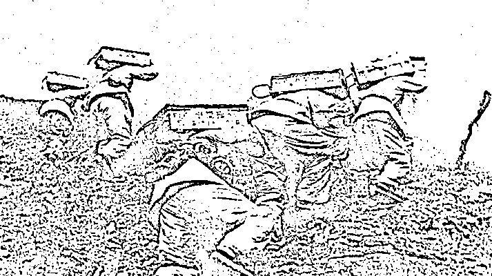
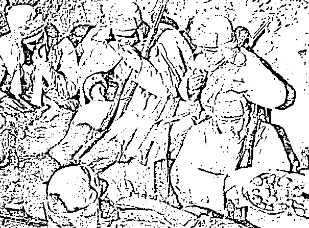
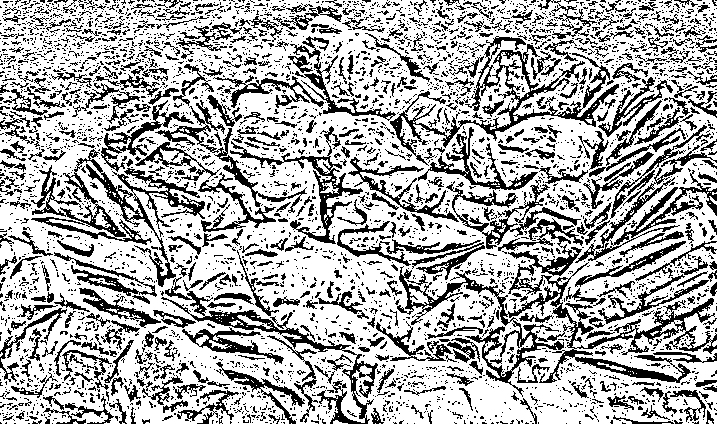

# 为什么江山美如画，英雄的热血染红了它

> 原文：[`mp.weixin.qq.com/s?__biz=MzU3NDc5Nzc0NQ==&mid=2247499517&idx=1&sn=c185d955d403129a3757591291020484&chksm=fd2e5c23ca59d535358856b3aac554b1be7441a6cd794ef408e161bc742ede9b3535f7888263#rd`](http://mp.weixin.qq.com/s?__biz=MzU3NDc5Nzc0NQ==&mid=2247499517&idx=1&sn=c185d955d403129a3757591291020484&chksm=fd2e5c23ca59d535358856b3aac554b1be7441a6cd794ef408e161bc742ede9b3535f7888263#rd)

我曾经写过一篇文章：[基因有什么值得继承的？值得继承的，是道统](http://mp.weixin.qq.com/s?__biz=MzU0MjYwNDU2Mw==&mid=2247496400&idx=1&sn=78e73781ef8a01d1e5110e9c36c417a0&chksm=fb1a9eaccc6d17ba430b44f9dc4fd52df2d73853afbbd7d53b4702712bc9e961db733c9049a9&scene=21#wechat_redirect)

有些人没看懂，在后台跟我扯什么的都有。

那今天给大家看几个按照文中的说法，成为文明魂魄的人。

团长祁发宝被授予英雄团长；营长陈红军被追授戍边英雄；战士陈祥榕、肖思远、王焯冉被追记一等功。

这五人就是前段时间与印军冲突的过程中，为捍卫领土，重伤以及牺牲的五名战斗人员。

用战士们的话讲，团长在最前面，被击伤，营长救团长，战士救营长，班长救战士，战斗就这么引发的。

为什么会出现这种指挥官先受伤的局面？

是因为这个团一直以来有个不成文的规定：**“对峙时干部站前头、战士站后头，吃饭时战士不打满、干部不端碗，野营时战士睡里头、干部睡风口。”**

也正是因为这个传统，出现了指挥官一马当先，战士拼死相救的局面。

这是一场肉搏，双方用的武器也仅限于石头，棍子之类，我方之所以能够在众寡悬殊的局面下，打成 1：5 的战损比，我相信和武器，战斗策略的关系不大。

说的直白点，印军之所以数倍于我军，最后反而他们死了 20 个，是我们的 5 倍。我个人认为根本的原因在于**他们是“给我上”，我们是“跟我上”。**

团长祁发宝最先受伤，因为起初没有想到对方会暴起伤人，中招了，被对方打伤了头部，重型颅脑伤。

营长陈红军冲过去救团长，牺牲了。他没能见到自己身怀六甲的妻子。

年仅 18 岁的战士陈祥榕，死死的挡在营长的前面，牺牲了。

肖思远在营救战友的过程中，牺牲了。

王焯冉营救三名被激流冲散的战友，自己的脚卡在了石头缝里，他临终前把战友从激流中推上了岸，说的最后一句话是：“你先上，如果我死了，照顾好我老娘！”

这里面年纪最小的是陈祥榕，这孩子是 2001 年 6 月份生的，00 后，他是个战士，但也是个孩子。

今天有很多人讲述他们英雄的事迹，我就不重复了，你们在别的地方都能看到。

我引这件事出来，就是为了让读者弄清楚那天说的“后继有人”这个词儿。

我们说这里面年纪最小的陈祥榕，他 18 岁就牺牲了，肯定没有孩子。

所以，他后继有人么？

我的答案是当然有。

就像我之前那篇文章里告诉大家，后继有人这个词儿本来就是为他们量身打造的，本来就与我等普通人无缘。

给你举个例子，比如我知道我爷爷的名字，知道我太爷爷的名字，我知道我太爷爷的爸爸的名字么？

不知道。

不知道很正常，这世上很多人连自己太爷爷的名字也说不上来，更遑论太爷爷的爸爸。

不知道是正常的，你的儿子你养过，你的孙子你抱过，所以他们记得你。你孙子的孙子，你没有见过他，他也没有见过你。

人与人之间的情分说到底就是这回事。

一个人，想要被所有人记住，除非做了什么了不起的事情。

你去翻看史书，一定是捡大事记。

你说一个人，在古代，这辈子就是挣钱盘铺子，盘铺子收租继续挣钱，临了买了 50 个宅子，20 个铺子，他会被记录下来么？

不会的。

就算被记录下来，也多半是因为他和什么大人物发生了关联。比如《三国志》记录，中山的大商人张世平与苏双，资助刘备起兵。

你看到了，无论商人当时过的如何，都只有捐钱的那一刻才存在过。

那么参与了大事件，被记录下来就一定会被传颂么？

那可不一定。

像秦桧，被记录下来，也是被唾骂。

所以说，**只有那些做出了令人称颂的事情的人，才会成为文明的魂魄。**

上面这五个人，都是当代的，咱们没法穿越，你体会不到将来是谁继承了他们，我给你换个视角，讲一个古代的故事。

唐朝的时候，安史之乱。张巡被围困，派手下的南霁云杀出城向贺兰进明求援。

贺兰进明嫉妒张巡的功劳，不肯救。但很喜欢南霁云，举行宴会招待他，想让他留下。

南霁云砍掉自己的手指说：城里的人一个月没吃东西了，我就算再怎么饿，又怎么忍心独自在这里吃饭呢。说罢就回城了，席间贺兰的手下纷纷垂泪。

即便有张巡，南霁云这样的名将，被十几万敌军围困了大半年后，城中的人连老鼠都吃光了，弓都拉不开，最后还是城破了。

城破之后，叛贼想让张巡投降，张巡破口大骂；继而想让南霁云投降，南霁云默不作声。张巡说：南八，大丈夫一死而已，不能屈从不义之人。

南霁云笑了：我本来打算忽悠他们，拉几个垫背的，你这么说，那就现在死吧。

于是两个人慷慨就义。

唐僖宗时，张巡被移入凌烟阁。

我们很多人都去过烈士陵园，里面正中总会立着一个碑，上面写着：人民英雄永垂不朽。

不知道你理不理解永垂不朽的含义？

古人修忠烈祠，春秋两祭，永垂不朽。

什么人才能进忠烈祠？你自己琢磨。

一个人，自己的儿子来上坟，很正常，你养过他；自己的孙子来上坟，是被儿子带来的，到了重孙子，有可能记得你的名字；到了玄孙子，不记得你实属平常。

可你知道，南霁云的故事传承了多久？传承了 1200 多年。

梁羽生写过一本书，《大唐游侠传》，里面有句话：敢笑荆轲非好汉，好呼南八是男儿。

你看到了，1200 多年后，还有人记得他的名字，记得他的故事。

不止于此哦，今天好几个地方都有南霁云和张巡的祠堂，雕像和庙宇；张巡更有名气一些，在这一千多年里，他历朝历代都被祭祀，直到清代还位列太庙。

你想一想，这么长的时间跨度，靠自己孩子的孩子，可不可能记住自己？

当然不可能。

今天一个人再有钱，在私人陵园里买个大点的地儿，服务好点的，可以。甚至雇一群人假扮孝子贤孙，四时去哭丧，祭拜，都可以。

但我问你，这些能持续多久？100 年？还是 200 年？

说实话，能在人死后持续 30 年，已经顶顶了不起了。

这就是钱的力量，钱就这点力量，富都很难过三代，何况祭祀？

你去看全国各地的陵园，唯一四时香火不断的，是烈士陵园。

每个小学，都会有参观烈士陵园的活动组织，有的还会让孩子们亲手制作小白花，献给英雄。

**说到底，这些孩子未必知道自己太爷爷是谁，但知道英雄的姓名，知道英雄的故事。** 

张巡和南八的故事，就是课本上的，考试卷子上的。

没有人考你太爷爷叫什么，所以你很难记住。但有人考张巡和南八的故事。

就像很多年后，也有人考这些当代英雄的故事。

给读者看几张图：

这是历史上的我军。

这是当代的我军。

这是历史上的我军。

这是当代的我军。

是那片江山美如画么？不，是他们的守卫让那片江山美如画；是他们挥洒的青春，让那片江山美如画。

为什么战旗美如画？

英雄的鲜血染红了它。

为什么大地春常在？

英雄的生命开鲜花。

刘炽写下这段话的时候，是 1963 年。

11 年前，浴血奋战 43 天的“上甘岭特功八连”，歼敌 1700 余名，击退敌人数不清的进攻，最终将一面布满 381 个弹孔的战旗插上了上甘岭主峰。这个建制百十来人的连队，先后补充兵员达 800 人之多。最后，连幸存的连长都已认不出谁是自己连队的兵。

你想一想这句话，他认不出来自己的兵，难道就不是他的兵了么？

**人世间从来都有两种人。一种注定随着时间的大浪淘沙被湮没，另一种将会闪耀在历史的天空。**

我并不是在贬低被湮没的，我只是实话实说，因为我自己也是其中之一。

你想一想，我们在干什么？聊房产、聊股票、聊比特币；

你再想一想，他们在干什么？同住地窝子、同爬执勤点、同吃大锅菜、同站深夜哨、同背给养物资，最后一同冲锋，生死与共。

这不是真正的，纯粹的理想主义又是什么呢？

《长安十二时辰》里第八团的将士们有句话：我们守在这里，是为了长安城里的人过着美好的生活。

我不这么看。

我自认为我这样平庸的人，和我见过的那些平庸的大众，**不值得让这样的人去守护。**

如果你换个角度，世上本就有两种人。

**一种人活着只是活着，而另一种人，活出了意义。他们的一生，他们的选择，他们做的那些事儿，才让江山美如画。**

站在历史天空的视角，尔曹身与名俱灭，不废江河万古流。

我们终自己一生，其实不过是身与名俱灭。而他们，才真正得到了继承与永恒。